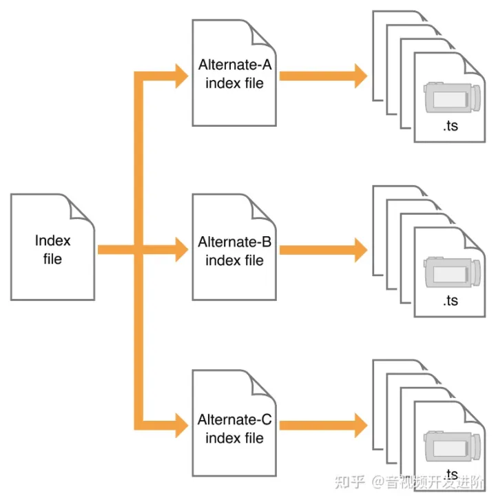

# 跨端开发

## h5 hybrid


## 框架层 + 原生渲染 （自研乐高）


## UI归一化工具包
### 定义及实现

是一种`三端同构`、`支持原生渲染`的UI工具包，通过模拟html元素与css模块化方式，底层通过封装的UI组件实现在`Android`和`IOS`端的UI统一（分别映射`Android View`和`IOS UIView`），默认使用`flex`布局；定义了一系列生命周期相关的事件与bundle加载的事件；

开发完成后构建为bundle，然后上传到LDS（发布系统），客户端加载时通过`数据+模板服务端直出`的方式布局和渲染输出；C端同时下发`bundle`与业务数据，通过`Leo key`配置请求对应的`bundle`，LDS相当于一个node服务，同时会在服务端请求业务后端数据；


# 短视频/直播多媒体技术


## 直播架构


## CDN

即内容分发网络

### 应用
解决因`分布`、`带宽`、`服务器性能`等带来的访问延迟问题，适用于`站点加速`、`点播`、`直播`等场景。使用户`就近获取`所需内容，解决Internet网络拥挤的状况，提高用户访问网站的`响应速度`和`成功率`。

> `CDN是只对网站的某一个具体的域名加速`。如果同一个网站有多个域名，则访客访问加入CDN的域名获得加速效果，访问未加入CDN的域名，或者直接访问IP地址，则无法获得CDN效果。


## 流媒体传输协议


### 实时传输协议RTP与RTCP

RTP(Real-time Transport Protocol)是用于Internet上针对多媒体数据流的一种传输层协议。

RTP由两个紧密链接部分组成：
- `RTP`：传送具有实时属性的数据
- `RTCP`：负责管理传输质量

RTP使用偶数端口号收发数据，相应的RTCP则使用相邻的下一位奇数端口号。当应用程序启动一个RTP会话时，将`同时占用两个端口`，分别供RTP和RTCP使用`。RTP负责数据传输，RTCP负责收集相关连接信息，实时监控数据传输和服务质量`。


`RTP`的典型应用创建在`UDP`上，但也能够在TCP或ATM等其余协议之上工作

> `既然UDP和RTP都是传输层协议，RTP由在UDP之上，那二者有什么关系？`简单来说，`RTP协议和UDP两者共同完成传输层协议传输`。UDP只是负责传输数据包，RTP提供时间标志戳及其他技术来保证流媒体在`实时传输时的时间正确性`。


### 实时流协议RTSP


即Real-Time Streaming Protocol，RTSP协议定义了一对多应用程序如何有效`通过IP网络传送多媒体数据`，是一种`应用层协议`。`RTSP在体系结构上位于RTP和RTCP之上，它使用TCP或RTP完成数据传输`。HTTP与RTSP相比，`HTTP传送HTML，而RTSP传送的是多媒体数据`。HTTP请求由客户机发出，服务器做出响应；RTSP可以是双向的，即客户机和服务器都可以发出请求。

> RTSP与RTP最大的区别在于：`RTSP是一种双向实时数据传输协议，它允许客户端向服务器端发送请求，如回放、快进、倒退等操作`。当然RTSP可基于RTP来传送数据，还可以选择TCP、UDP、组播UDP等通道来发送数据，具有很好的扩展性。它是一种类似于HTTP协议的网络应用协议。


### 实时消息传输协议RTMP

RTMP（Real Time Messaging Protocol）是Adobe Systems公司为Flash播放器和服务器之间音频、视频和数据传输开发的开放协议。它有三种变种：

- 工作在TCP之上的明文协议，使用端口1935；
- RTMPT封装在HTTP请求之中，可穿越防火墙；
- RTMPS类似RTMPT，但使用的是HTTPS连接。

RTMP视频播放的特点：

- RTMP协议是采用实时的流式传输，所以`不会缓存文件到客户端`，这种特性说明用户想下载RTMP协议下的视频是比较难的；

- `视频流可以随便拖动`，既可以从任意时间点向服务器发送请求进行播放，`并不需要视频有关键帧`。相比而言，`HTTP协议下视频需要有关键帧才可以随意拖动`。

- `RTMP协议支持点播/回放`（通俗点将就是支持把flv,f4v,mp4文件放在RTMP服务器，客户端可以直接播放），`直播`（边录制视频边播放）。


### HLS

HTTP Live Streaming(HLS)是`苹果公司`实现的`基于HTTP`的流媒体传输协议，可实现流媒体的`直播`和`点播`。HLS (HTTP Live Streaming)是`Apple的动态码率自适应技术`。主要用于PC和Apple终端的音视频服务。包括一个`m3u(8)的索引文件`，`TS媒体分片文件`和`key加密串文件`。


HLS点播是分段HTTP点播，不同在于它的分段非常小。要实现HLS点播，重点在于对媒体文件分段，目前有不少开源工具可以使用。

> 相对于常见的流媒体直播协议，`HLS直播最大的不同在于，直播客户端获取到的并不是一个完整的数据流`，HLS协议`在服务器端`将直播数据流存储为`连续的`、`很短时长`的媒体文件（`MPEG-TS格式`），而客户端则不断的下载并播放这些小文件，因为服务器总是会将最新的直播数据生成新的小文件，这样客户端只要不停的按顺序播放从服务器获取到的文件，就实现了直播。由此可见，`基本上可以认为，HLS是以点播的技术方式实现直播`。由于数据通过HTTP协议传输，所以完全不用考虑防火墙或者代理的问题，而且分段文件的时长很短，客户端可以很快的选择和切换码率，以适应不同带宽条件下的播放。不过HLS的这种技术特点，决定了它的延迟一般总是会高于普通的流媒体直播协议。

HLS协议规定：
- 视频的封装格式是`TS`。
- 视频的编码格式为`H264`，音频编码格式为MP3、AAC或者AC-3。
- 除了TS视频文件本身，还定义了用来控制播放的`m3u8`文件（文本文件）

#### HLS的index文件

index文件即m3u8文件



如上图所示，客户端播放HLS视频流的逻辑其实非常简单，`先下载一级Index file，它里面记录了二级索引文件`（Alternate-A、Alternate-B、Alternate-C）的地址，然后客户端再去下载二级索引文件，`二级索引文件中又记录了TS文件的下载地址`，这样客户端就可以按顺序下载TS视频文件并连续播放。

##### 一级index文件

视频源：https://dco4urblvsasc.cloudfront.net/811/81095_ywfZjAuP/game/index.m3u8

```
#EXTM3U
#EXT-X-STREAM-INF:PROGRAM-ID=1,BANDWIDTH=1064000
1000kbps.m3u8
#EXT-X-STREAM-INF:PROGRAM-ID=1,BANDWIDTH=564000
500kbps.m3u8
#EXT-X-STREAM-INF:PROGRAM-ID=1,BANDWIDTH=282000
250kbps.m3u8
#EXT-X-STREAM-INF:PROGRAM-ID=1,BANDWIDTH=2128000
2000kbps.m3u8

```

> `bandwidth`指定视频流的比特率，PROGRAM-ID无用无需关注，每一个#EXT-X-STREAM-INF的下一行是二级index文件的路径，可以用相对路径也可以用绝对路径。例子中用的是相对路径。这个文件中`记录了不同比特率视频流的二级index文件路径`，客户端可以自己`判断自己的现行网络带宽，来决定播放哪一个视频流`。也可以在网络带宽变化的时候平滑切换到和带宽匹配的视频流。

##### 二级index文件

二级index文件地址：https://dco4urblvsasc.cloudfront.net/811/81095_ywfZjAuP/game/1000kbps.m3u8

`切片地址`：https://dco4urblvsasc.cloudfront.net/811/81095_ywfZjAuP/game/1000kbps-00001.ts
```
#EXTM3U
#EXT-X-PLAYLIST-TYPE:VOD
#EXT-X-TARGETDURATION:10
#EXTINF:10,
1000kbps-00001.ts
#EXTINF:10,
1000kbps-00002.ts
#EXTINF:10,
1000kbps-00003.ts
#EXTINF:10,
1000kbps-00004.ts
#EXTINF:10,
1000kbps-00005.ts
// ...
#ZEN-TOTAL-DURATION:999.70000
#ZEN-AVERAGE-BANDWIDTH:1098134
#ZEN-MAXIMUM-BANDWIDTH:1700874
#EXT-X-ENDLIST

```

`二级文件实际负责给出ts文件的下载地址`，这里同样使用了相对路径。`#EXTINF`表示`每个ts切片视频文件的时长`。`#EXT-X-TARGETDURATION`指定当前视频流中的切片文件的最大时长，也就是说这些ts切片的时长不能大于#EXT-X-TARGETDURATION的值。`#EXT-X-PLAYLIST-TYPE:VOD`的意思是当前的视频流并不是一个直播流，而是`点播流`，换句话说就是该视频的全部的ts文件已经被生成好了，`#EXT-X-ENDLIST这个表示视频结束`，有这个标志同时也说明当前的流是一个非直播流。

##### 播放模式

- `点播VOD`特点就是`当前时间点可以获取到所有index文件和ts文件`，二级index文件中记录了所有ts文件的地址。`这种模式允许客户端访问全部内容`。上面的例子中就是一个点播模式下的m3u8的结构。

- `Live 模式`就是`实时生成M3u8和ts文件`。它的`索引文件一直处于动态变化`的，`播放的时候需要不断下载二级index文件`，以获得最新生成的ts文件播放视频。如果一个`二级index文件的末尾没有#EXT-X-ENDLIST标志，说明它是一个Live视频流`。


### WebRTC

> WebRTC (Web Real-Time Communications) 是一项`实时通讯技术`，它允许网络应用或者站点，在不借助中间媒介的情况下，建立`浏览器之间点对点`（Peer-to-Peer）的连接，实现视频流和（或）音频流或者其他任意数据的传输。WebRTC 包含的这些标准使用户在`无需安装任何插件或者第三方的软件`的情况下，创建点对点（Peer-to-Peer）的数据分享和电话会议成为可能。

2010年5月，Google以6820万美元收购VoIP软件开发商Global IP Solutions的GIPS引擎，并改为名为“WebRTC”。`WebRTC使用GIPS引擎，实现了基于网页的视频会议`，并支持722，PCM，ILBC，ISAC等编码，同时使用谷歌自家的`VP8视频解码器`；同时支持`RTP/SRTP`传输等。

WebRTC提供了视频会议的核心技术，包括音视频的采集、编解码、网络传输、显示等功能，并且还`支持跨平台`：windows，linux，mac，android。

`WebRTC使用是RTP分装码流，跟视频监控，IPTV，会议电视一样都是RTP承载媒体流`，只不过`WebRTC信令遵守ICE框架，走自定义信令，IPTV领域走RTSP信令`，视频监控走GB28181或者onvif信令，会议电视走h323或SIP协议。另外，WebRTC的码流采用`SRTP进行加密`，且`WebRTC优先使用VP9、VP8、H.264，不支持H.265`。


# 参考文献
1. [音视频基础知识](https://blog.csdn.net/luofeng457/article/details/125850366)