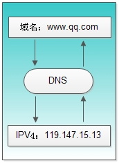
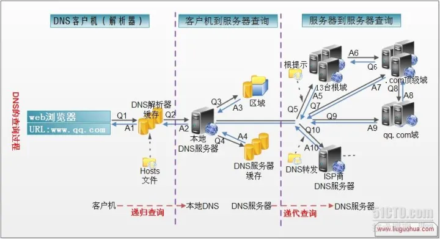
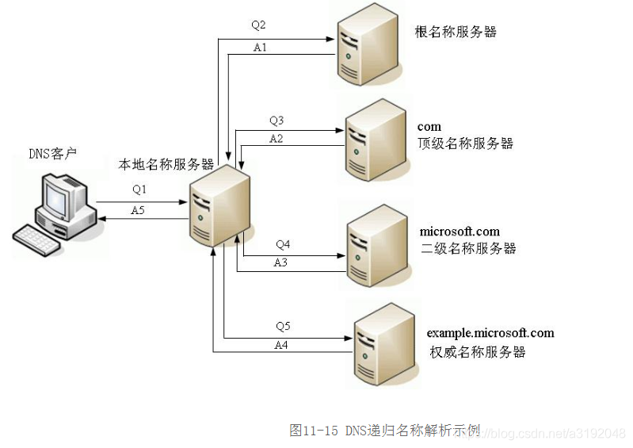
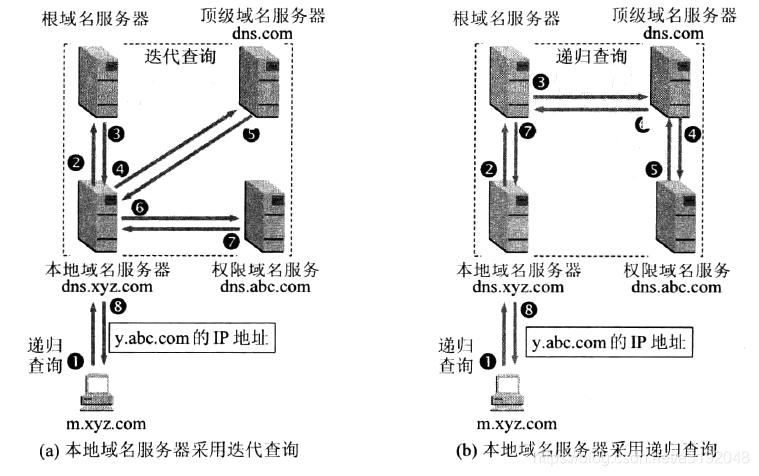
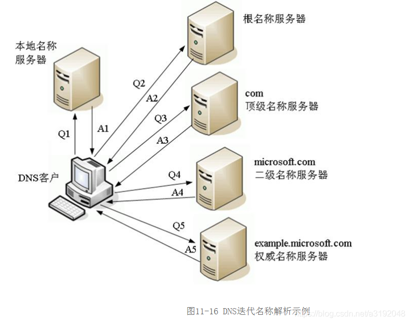

# 网络相关

## DNS

DNS( Domain Name System)是“域名系统”的英文缩写，是一种组织成域层次结构的计算机和网络服务命名系统，它用于TCP/IP网络，它所提供的服务是用来将主机名和域名转换为IP地址的工作。DNS就是这样的一位“翻译官”，它的基本工作原理可用下图来表示。

> DNS 的作用就是通过域名查询到具体的 IP。

因为 IP 存在数字和英文的组合（IPv6），很不利于人类记忆，所以就出现了域名。你可以把域名看成是某个 IP 的别名，DNS 就是去查询这个别名的真正名称是什么。

在 TCP 握手之前就已经进行了 DNS 查询，这个查询是操作系统自己做的。当你在浏览器中想访问 `www.google.com` 时，会进行一下操作：

1. 操作系统会首先在本地缓存中查询
2. 没有的话会去系统配置的 DNS 服务器中查询
3. 如果这时候还没得话，会直接去 DNS 根服务器查询，这一步查询会找出负责 com 这个一级域名的服务器
4. 然后去该服务器查询 google 这个二级域名
5. 接下来三级域名的查询其实是我们配置的，你可以给 www 这个域名配置一个 IP，然后还可以给别的三级域名配置一个 IP

`以上介绍的是 DNS 迭代查询`，还有种是递归查询，区别就是前者是由客户端去做请求，后者是由系统配置的 DNS 服务器做请求，得到结果后将数据返回给客户端。

`DNS 查询以各种不同的方式进行解析`。客户机有时也可通过使用从以前查询获得的缓存信息就地应答查询。DNS 服务器可使用其自身的资源记录信息缓存来应答查询，也可代表请求客户机来查询或联系其他 DNS 服务器，以完全解析该名称，并随后将应答返回至客户机。这个过程称为`递归`。
另外，客户机自己也可尝试联系其他的 DNS 服务器来解析名称。如果客户机这么做，它会使用基于服务器应答的独立和附加的查询，该过程称作`迭代`，即DNS服务器之间的交互查询就是迭代查询。

1. 在浏览器中输入`www.qq.com`域名，操作系统会先检查自己本地的`hosts文件`是否有这个网址映射关系，如果有，就先调用这个IP地址映射，完成域名解析。

2. 如果hosts里没有这个域名的映射，则查找本地DNS解析器缓存，是否有这个网址映射关系，如果有，直接返回，完成域名解析。

3. 如果`hosts`与`本地DNS解析器缓存`都没有相应的网址映射关系，首先会找TCP/ip参数中设置的首选DNS服务器，在此我们叫它`本地DNS服务器`，此服务器收到查询时，如果要查询的域名，包含在本地配置区域资源中，则返回解析结果给客户机，完成域名解析，此解析具有权威性。

4. 如果要查询的域名，不由本地DNS服务器区域解析，但该服务器已缓存了此网址映射关系，则调用这个IP地址映射，完成域名解析，此解析不具有权威性。

5. 如果本地DNS服务器本地区域文件与缓存解析都失效，则根据本地DNS服务器的设置（是否设置转发器）进行查询，如果`未用转发模式`，本地DNS就把`请求发至13台根DNS`，根DNS服务器收到请求后会判断这个域名(.com)是谁来授权管理，并会返回一个负责该顶级域名服务器的一个IP。本地DNS服务器收到IP信息后，将会联系负责.com域的这台服务器。这台负责.com域的服务器收到请求后，如果自己无法解析，它就会找一个管理.com域的下一级DNS服务器地址(http://qq.com)给本地DNS服务器。当本地DNS服务器收到这个地址后，就会找http://qq.com域服务器，重复上面的动作，进行查询，直至找到www . qq .com主机。

6. 如果用的是`转发模式`，此DNS服务器就会把请求转发至上一级DNS服务器，由上一级服务器进行解析，上一级服务器如果不能解析，或找根DNS或把转请求转至上上级，以此循环。不管是本地DNS服务器用是是转发，还是根提示，最后都是把结果返回给本地DNS服务器，由此DNS服务器再返回给客户机。

### 递归查询

#### DNS递归解析基本流程

在这个查询过程中，一直是`以本地名称服务器为中心`的，DNS客户端只是发出原始的域名查询请求报文，然后就一直处于等待状态的，直到本地名称服务器发来了最终的查询结果。此时的`本地名称服务器就相当于中介代理的作用`。如果考虑了本地名称服务器的缓存技术（也就是在DNS服务器上对一定数量的以前查询记录保存一定时间，这样后面查询同样的域名信息时就可直接从缓存中调出来，以加速查询效率）的话，则递归解析的基本流程如下：

（1）客户端向本机配置的本地名称服务器（在此仅以首选DNS服务器为例进行介绍，所配置其它备用DNS服务器的解析流程完全一样）发出DNS域名查询请求。

（2）本地名称服务器收到请求后，先查询本地的缓存，如果有该域名的记录项，则本地名称服务器就直接把查询的结果返回给客户端；如果本地缓存中没有该域名的记录，则本地名称服务器再以DNS客户端的角色发送与前面一样的DNS域名查询请求发给`根名称服务器`。

（3）根名称服务器收到DNS请求后，把所查询得到的所请求的DNS域名中顶级域名所对应的顶级名称服务器地址返回给本地名称服务器。
（4）本地名称服务器根据根名称服务器所返回的顶级名称服务器地址，向对应的顶级名称服务器发送与前面一样的DNS域名查询请求。

（5）对应的顶级名称服务器在收到DNS查询请求后，也是先查询自己的缓存，如果有所请求的DNS域名的记录项，则相接把对应的记录项返回给本地名称服务器，然后再由本地名称服务器返回给DNS客户端，否则向本地名称服务器返回所请求的DNS域名中的二级域名所对应的二级名称服务器地址。

然后本地名称服务器继续按照前面介绍的方法一次次地向三级、四级名称服务器查询，直到最终的对应域名所在区域的权威名称服务器返回到最终的记录给本地名称服务器。然后再由本地名称服务器返回给DNS客户，同时本地名称服务器会缓存本次查询得到的记录项。

#### DNS递归解析示例

为了方便大家理解，下面举一个实例进行介绍。本示例中假设客户端想要访问自己并不识别的`example.microsoft.com`站点，并假设此客户端配置的本地名称服务器假设为`dns.company.com`（通常是以IP地址方式配置的），本地名称服务器上配置的根名称服务器是`a.rootserver.net`。整个递归名称解析过程如图11-15所示（其中的Q1~Q5表示发送DNS查询请求，A1~A5是DNS查询应答），具体描述如下：

（1）DNS客户端向所配置的本地名称服务器dns.company.com发出解析example.microsoft.com域名的DNS请求报文（图中的Q1）。相当于对本地名称服务器说“请给我example.microsoft.com所对应的IP地址”。

（2）`本地名称服务器收到请求后，先查询本地缓存`。假设没有查到该域名对应记录，则本地名称服务器向所配置的`根名称服务器`a.rootserver.net发出解析请求解析example.microsoft.com域名的DNS请求报文（图中的Q2）。

（3）根名称服务器收到查询请求后，通过查询得到.com顶级域名所对应的顶级名称服务器，然后向本地名称服务器返回一条应答报文（图中的A1）。相当说“我不知道example.microsoft.com域名所对应的IP地址，但我现在告诉你.com域名所对应的顶级名称服务器地址”。

（4）本地名称服务器在收到根名称服务器的DNS应答报文，得到.com顶级域名所对应的顶级名称服务器地址后，再次向对应的顶级名称服务器发送一条请求解析example.microsoft.com域名的DNS请求报文（图中的Q3）。

（5）.com顶级名称服务器在收到DNS请求报文后，先查询自己的缓存，假设也没有该域名的记录项，则查询microsoft.com所对应的二级名称服务器，然后也向本地名称服务返回一条DNS应答报文（图中的A2）。相当于说“我不知道example.microsoft.com域名所对应的IP地址，但我现在告诉你microsoft.com域名所对应的二级名称服务器地址”。

（6）本地名称服务器在收到.com顶级名称服务器的DNS应答报文，得到microsoft.com二级域名所对应的二级名称服务器地址后，再次向对应的二级名称服务器发送一条请求解析example.microsoft.com域名的DNS请求报文（图中的Q4）。

（7）microsoft.com二级名称服务器在收到DNS请求报文后，也先查询自己的缓存，假设也没有该域名的记录项，则查询example.microsoft.com所对应的权威名称服务器（因为这个名称服务器已包括了完整域名example.microsoft.com所在区域），然后也向本地名称服务器返回一条DNS应答报文（图中的A3）。相当于说“我不知道example.microsoft.com域名所对应的IP地址，但我现在告诉你example.microsoft.com域名所对应的权威名称服务器地址”。

（8）本地名称服务器在收到microsoft.com二级名称服务器的DNS应答报文，得到example.microsoft.com三级域名所对应的权威名称服务器地址后，再次向对应的权威名称服务器发送一条请求解析example.microsoft.com域名的DNS请求报文（图中的Q5）。

（9）权威名称服务器在收到DNS请求后，在它的DNS区域数据库中查找，最终得出了example.microsoft.com域名所对应的IP地址。然后向本地名称服务器返回到条DNS应答报文（图中的A4）。相当于说“example.microsoft.com域名的IP地址为xxx.xxx.xxx.xxx”。

（10）本地名称服务器在收到权威名称服务器后，向DNS客户端返回一条DNS应答报文（图中的A5），告诉DNS客户端所得到的example.microsoft.com域名的IP地址。这样DNS客户端就可以正常访问这个网站了。

如果在步骤（9）中的对应域名的权威名称服务器都说找不到对应的域名记录，则会向本地名称服务器返回一条查询失败的DNS应答报文，这条报文最终也会由本地名称服务器返回给DNS客户端。当然，如果这个权威名称服务器上配置了指向其它名称服务器的转发器，则权威名称服务器还会在转发器指向的名称服务器上进一步查询。另外，如果DNS客户端上配置了多个DNS服务器，则还会继续向其它DNS服务器查询的。

> 注： 以上DNS客户端和本地名称服务器是`递归`，而本地名称服务器和其他名称服务器之间是`迭代`。也就是下图中的（a）情形。

其实DNS递归查询又可以分2种情况，即

1. DNS客户端和本地名称服务器是`递归`，而本地名称服务器和其他名称服务器之间是`迭代`。

2. DNS客户端和本地名称服务器是`递归`，而本地名称服务器和其他名称服务器之间也是`递归`。

### 迭代查询

#### DNS迭代解析示例

同样，为了方便大家理解，也例举一个具体的示例，看一下DNS迭代解析的工作流程。本示例也与上节介绍的DNS递归解析一样，假设客户端想要访问自己并不识别的example.microsoft.com站点，并假设此客户端配置的本地名称服务器假设为dns.company.com（仅以一个为例进行介绍），在该本地名称服务器上配置的根名称服务器是a.rootserver.net。整个迭代名称解析过程如图11-16所示（其中的Q1~Q5表示发送DNS查询请求，A1~A5是对应序号DNS查询请求的应答），具体描述如下：

1）DNS客户端向所配置的本地名称服务器dns.company.com发出解析example.microsoft.com域名的DNS请求报文（图中的Q1）。

（2）本地名称服务器收到DNS客户端的DNS查询请求报文后，先查询本地缓存。假设没有查到该域名对应记录，则本地名称服务器把所配置的根名称服务器a.rootserver.net地址信息以DNS应答报文返回给DNS客户端（图中和A1）。

（3）DNS客户端在收到本地名称服务器的DNS应答报文后，根据其中给出的根名称服务器地址信息，向对应的根名称服务器再次发送解析example.microsoft.com域名的DNS请求报文（图中的Q2）。

（4）根名称服务器在收到DNS查询请求后，通过查询得到.com顶级域名所对应的顶级名称服务器，然后把查询到的对应顶级域名信息以一条DNS应答报文返回给DNS客户端（图中的A2）。

（5）DNS客户端在收到根名称服务器的DNS应答报文，得到.com顶级域名所对应的顶级名称服务器地址后，再次向对应的顶级名称服务器发送一条解析example.microsoft.com域名的的DNS请求报文（图中的Q3）。

（6）.com顶级名称服务器在收到DNS客户端的DNS查询请求报文后，先查询自己的缓存，假设也没有该域名的记录项，则查询microsoft.com所对应的二级名称服务器，然后把查询到的对应二级域名信息以一条DNS应答报文返回给DNS客户端（图中的A3）。

（7）DNS客户端在收到.com顶级名称服务器的DNS应答报文，得到microsoft.com二级域名所对应的二级名称服务器地址后，再次向对应的二级名称服务器发送一条解析example.microsoft.com域名的DNS请求报文（图中的Q4）。

（8）microsoft.com二级名称服务器在收到DNS客户端的DNS查询请求报文后，也先查询自己的缓存，假设也没有该域名的记录项，则查询example.microsoft.com所对应的权威名称服务器（因为这个名称服务器已包括了整个域名example.microsoft.com所在区域），然后把查询到的对应权威域名信息以一条DNS应答报文返回给DNS客户端（图中的A5）。

（9）DNS客户端在收到microsoft.com二级名称服务器的DNS应答报文，得到example.microsoft.com三级域名所对应的权威名称服务器地址后，再次向对应的权威名称服务器发送解析example.microsoft.com域名的DNS请求报文（图中的Q5）。

（10）权威名称服务器在收到DNS客户端的DNS查询请求报文后，在它的DNS区域数据库中查找，最终得出了example.microsoft.com域名所对应的IP地址。然后向DNS客户端返回一条DNS应答报文（图中的A5）。这样DNS客户端就可以正常访问这个网站了。

如果在步骤（10）中的对应域名的权威名称服务器都说找不到对应的域名记录，则会向DNS客户端返回一条查询失败的DNS应答报文。当然，如果这个权威名称服务器上配置了指向其它名称服务器的转发器，则权威名称服务器还会在转发器指向的名称服务器上进一步查询。另外，如果DNS客户端上配置了多个DNS服务器，则还会继续向其它DNS服务器查询的。

> 为什么默认是递归查询呢？可能是DNS客户端为了节省自己的CPU，内存等各方面资源。

## 网络模型

### 物理层

### 数据链路层

### 网络层

### 传输层

### 应用层

## UDP

## TCP

# 参考文献

1. [DNS递归解析和迭代解析的区别](https://blog.csdn.net/a3192048/article/details/84715996/)