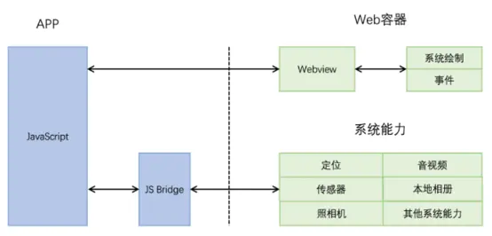
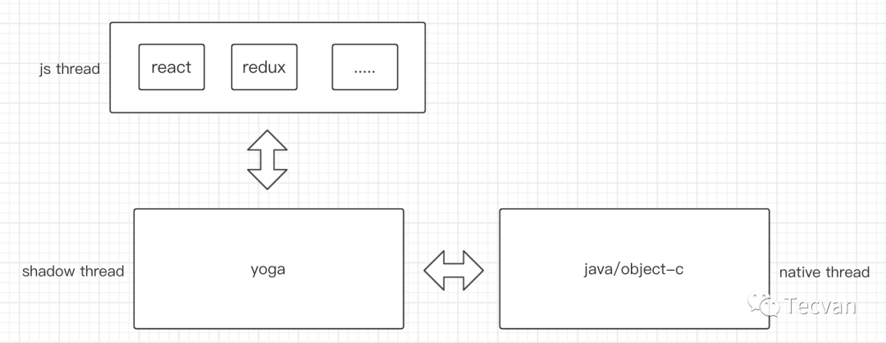
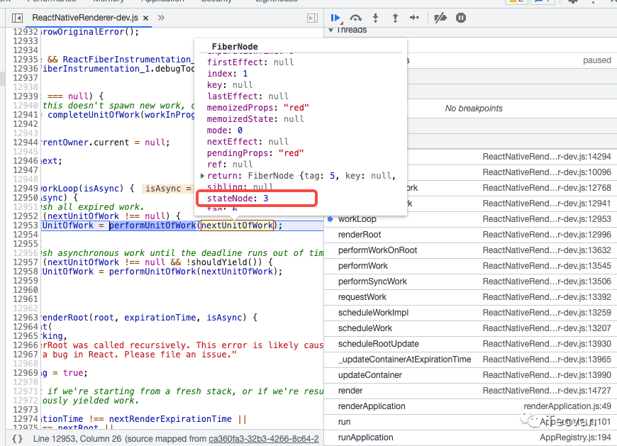
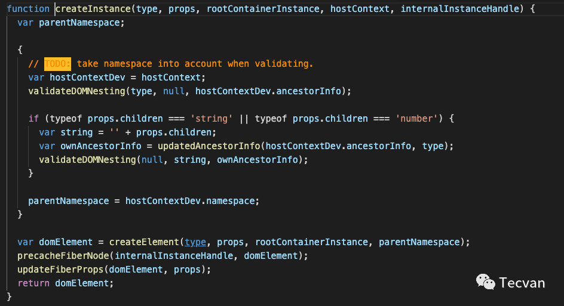
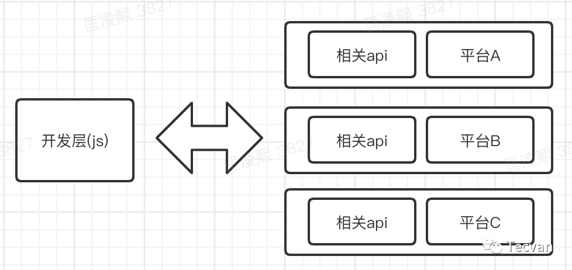
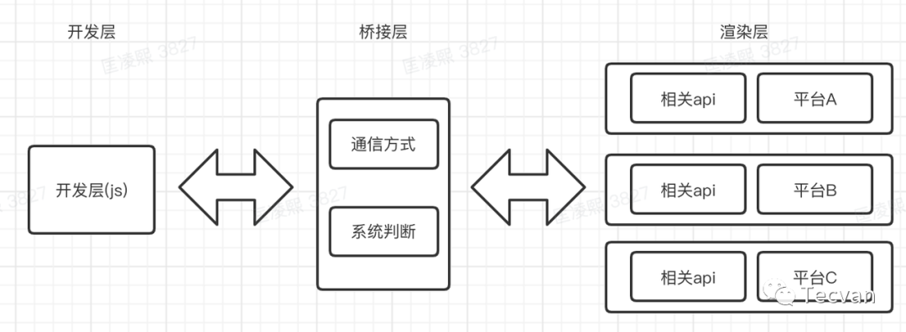
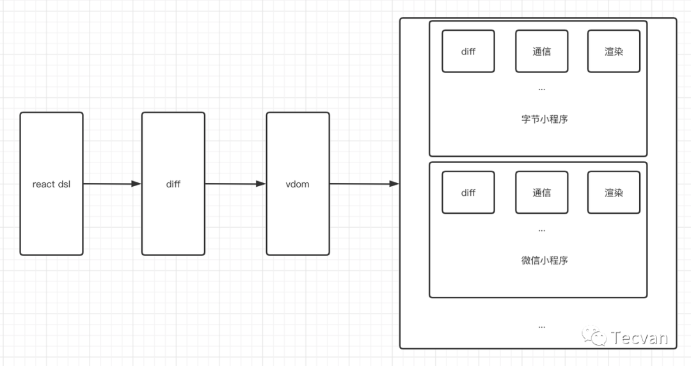
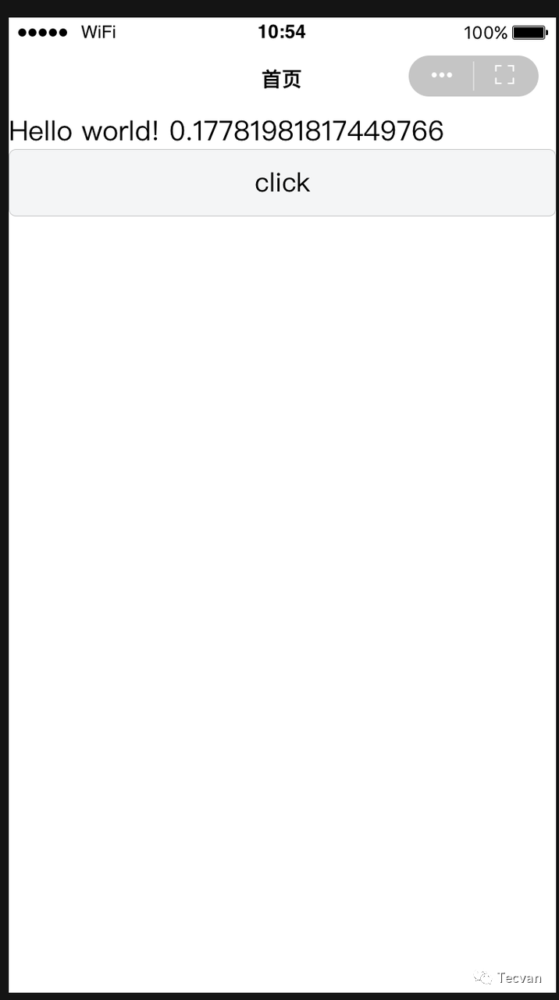
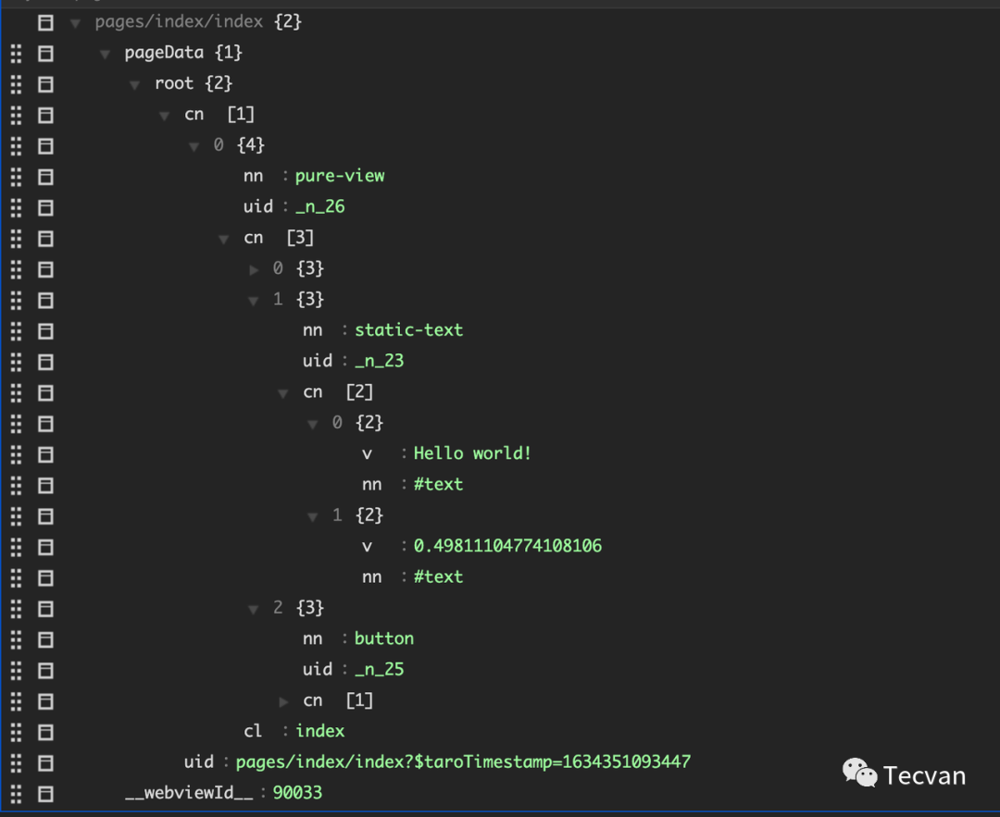
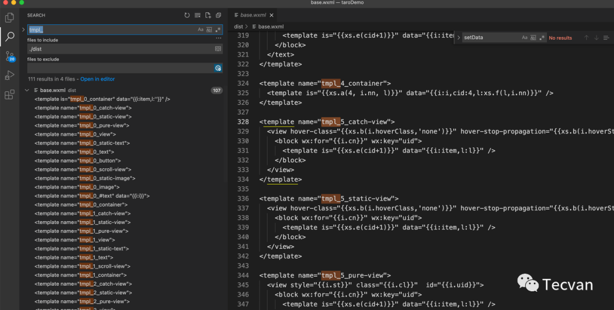

# 跨端技术的本质与现状

## 何为跨端应用

> `write one, run everywhere.`

这就是跨端应用的本质。当前前端运行环境有很多：pc、android、ios、大智慧大屏、甚至车机系统等；当一个项目需要运行在不同的环境时，如果需要每个环境都重新进行开发、部署等流程，成本很高。因此，期待通过某种方式实现一套代码去适配多个环境，从而降低开发成本，这就是跨端技术诞生的背景。

目前应用较广的跨端方案有`React native`、`Weex`、`Taro`、`小程序`、`Flutter`、`Electron`等等；

## 主流跨端方案

### webview方案 —— Hybird混合app

`Hybrid`，即 H5 和原生混合开发。Hybrid 框架提供各种 API、打包工具、调试工具，实际`开发中不会使用到原生技术`，只会使用 H5 和 JS 来编写，通过 `JS` 来调用框架提供的 API。



`用H5开发，但是运行在app内部的webview中`；通过JSBridge实现JS与Native的通信，同时native可以对webview进行功能定制（数据注入、请求拦截、控制缓存等）；一套代码同时运行在安卓和IOS上，达到多端一致的效果；`不受制于app发版的限制，可随时发布`；

从`开发成本低、标准统一、生态繁荣`上来说，H5 Hybrid 方案优秀。但这种方案的劣势也非常明显，就是`性能和体验存在显著的差距`，同时 Web 的生态繁荣来自于其良好的历史兼容性，也意味着沉重的历史包袱。


#### 原理
> `这类方案简单来说就是用网页来跨端`。现在`绝大多数端上（甚至包括封闭的小程序生态）都支持 Webview，所以只要开发网页然后投放到多个端`即可，在`桌面端对应的方案就是 Electron`。

> Hybrid App---`webview实现渲染跨端（绘制、时间）， JS Bridge实现逻辑跨端`

- `webview`是一个承载网页的容器，能渲染web网页，`native开发也可以对webview 进行功能定制`, `修改和扩展js 执行环境的宿主对象`、`拦截webview发起的请求、控制缓存`等功能。通过这些能力，可以实现native 和h5之间的信息互通。

- `JSBridge`相当于一个桥接器，构建了一个可以用于Native和JavaScript相互通信的`全双工通道`；主要包括了：
    - H5调用Native：调用Native的原生功能、通知Native当前JS的状态；包括`注入API`和`URL Scheme`两种方式；

    - Native调用H5：回溯调用结果、通知JS当前Native的状态、消息推送等；

        > Native 调用 JavaScript，其实就是执行拼接 JavaScript 字符串，从外部调用 JavaScript 中的方法，因此 JavaScript 的方法必须在全局的 window 上


### 框架层 + 原生渲染

典型代表`React Native`、`Weex`；

典型的代表是`react-native`，它的开发语言选择了js，使用的语法和 react 完全一致，其实也可以说它就是 react，这就是我们的框架层。而`不同于一般 react 应用，它需要借助原生的能力来进行渲染`，组件最终都会被`渲染为原生组件`，这可以给用户带来比较好的体验。

> 即原生app，安卓和IOS使用不同语言开发，性能最好，用户体验最佳，并且可以完整的使用所有native端的功能；但上手成本较高，安卓与IOS使用不同的语言，不同端之间互不相通，开发成本相较于web会更高；并且发布更新需要通过app市场的审核，发版周期大约在一周左右，更新较慢；

### 框架层 + 自渲染引擎

这种方案和上面的区别就是，`它并没有直接借用原生能力去渲染组件，而是利用了更底层的渲染能力，自己去渲染组件`。这种方式显然链路会比上述方案的链路跟短，那么`性能也就会更好`，同时在`保证多端渲染一致性上也会比上一种方案更加可靠`。这类框架的典型例子就是 `flutter`。

flutter不仅可以支持移动端还有 PC 端。它的渲染基于绘图库（skia）来绘制的。逻辑跨端是基于自研的 Dart vm 来跨端。Flutter 使用编程语言即 Dart 的方法来避免 JsBridge 引起的性能问题


### 另类跨端

众所周知，在最近几年有一个东西变得非常火爆：小程序，现在许多大厂都有一套自己的小程序实现，但相互之间还是有不小差异的，通常可以借助 `taro` `，remax` 这类框架实现一套代码，多端运行的效果，这也算是一种另类的跨端，它的实现方式还是比较有意思的，我们后面会展开细讲。

#### 京东Taro
Taro 是一个开放式跨端跨框架解决方案，支持使用 React、Vue等框架来开发小程序、H5、APP等应用。

APP开发基于 Facebook的开源项目`React Native`，开发语言可以使用vue，但`最终生产的代码是react`。

开发中不仅需要代码调试而且还有底层交互，所以使用taro需要具备react、原生技能

### Uni-app

Uni-app是一个开放式跨端跨框架解决方案，使用 Vue框架来开发小程序、H5、APP等应用。

`uni-app支持webview与weex双重渲染`，h5页面使用webview渲染，原生部分采用nvue weex进行渲染，相当于把h5的技术与rn的技术做了一个结合。

由于`原生是基于weex的`，然后下一层才是通信bridge。多了一层就多了一份性能问题，所以`性能方面会比ReactNative略差`一点。


<br/>


## React-Native实现



### RN的三个线程

rn 包含三个线程：
- `native thread`：主要负责原生渲染和调用原生能力；
- `js thread`：JS 线程用于解释和执行我们的js代码。在大多数情况下，react native 使用的js引擎是JSC(JavaScriptCore) ，在使用 chrome 调试时，所有的 js 代码都运行在 chrome中，并且通过 websocket与原生代码通信。此时的运行环境是v8。
- `shadow thread`：要渲染到界面上一个很重要的步骤就是布局，我们需要知道每个组件应该渲染到什么位置，`这个过程就是通过yoga去实现的，这是一个基于flexbox的跨平台布局引擎`。shadow thread 会维护一个 `shadow tree来计算我们的各个组件在 native 页面的实际布局`，然后通过 bridge 通知native thread 渲染 ui。


### 初始化流程

1. `native`启动一个原生界面，比如android会起一个新的activity来承载rn，并做一些初始化的操作。
2. `加载 js 引擎，运行 js 代码`，此时的流程和 react 的启动流程就非常相似了，我们先简单观察调用栈，

    

    是不是看见了一些非常熟悉的函数名，在上一讲的基本原理中已经提到过了，这里我们就不再赘述。同时再看一下FiberNode的结构，也和react的保持一致，`只不过我们在js层是无法拿到真实结点的，所以stateNode只是一个代号`。

3. `js 线程通知shadow thread`。在react中，走到createInstance以后我们就可以直接调用createElement来创建真实结点了，但是在rn中我们没办法做到这一步，所以我们会`通知native层让它来帮助我们创建一个对应的真实结点`。
    

4. shadow thread 计算布局，通知native Thread 创建原生组件。
5. native 在界面上渲染原生组件，呈现给用户。

### 更新流程

比如某个时候，用户点击了屏幕上的一个按钮触发了一个点击事件，此时界面需要进行相应的更新操作。

1. native 获取到了点击事件，传给了js thread
3. js thread根据 react 代码进行相应的处理，比如处理 onClick 函数，触发了 setState。
3. 和 react 的更新流程一样，触发了 setState 之后会进行 diff，找到需要更新的结点
4. 通知 shadow thread
5。 shadow thread 计算布局之后通知 native thread 进行真正的渲染。

### 特点

`我们上述说的通知，都是通过 bridge 实现的，bridge本身是用实现C++的`，就像一座桥一样，将各个模块关联起来，`整个通信是一个「异步」的过程`。这样做好处就是各自之间不会有阻塞关系，比如 不会native thread因为js thread而阻塞渲染，给用户良好的体验。但是这种「异步」也存在一个比较明显的问题：`因为通信过程花费的时间比较长，所以在一些时效性要求较高场景上体验较差`。

### 优化

我们很容易看出，这是由rn的架构引出的问题，其实小程序的架构也会有这个问题，所以在rn和小程序上出现一些需要频繁通信的场景时，就会导致页面非常差，流畅度降低。那么如果想解决这个问题，势必要从架构上去进行修改。


## 从RN看本质

那么既然我们知道了rn是如何实现的跨端，那么我们就可以来探究一下它本质上是在干什么。首先，跨端可以分为`「逻辑跨端」`和`「渲染跨端」`。

`「逻辑跨端」通常通过 vm来实现`，例如利用 v8 引擎，我们就能在各个平台上运行我们的 js 代码，实现「逻辑跨端」。

那么第二个问题就是「渲染跨端」，我们把业务代码的实现抽象为`开发层`，比如 react-native 中我们写的 react 代码就属于开发层，再把具体要渲染的端称为`渲染层`。作为开发层来说，我一定知道我想要的ui长什么样，但是我没有能力去渲染到界面上，所以当我`声明了一个组件之后，我们需要考虑的问题是如何把我想要什么告诉渲染层`。




就像这样的关系，那么我们最直观的方式肯定是我能够实现一种通信方式，在开发层将消息通知到各个系统，再由各个系统自己去调用对应的 api 来实现最终的渲染。

```js
function render() {
    if(A) {
        message.sendA('render', { type: 'View' })
    }
    
    
    if(B) {
        message.sendB('render', { type: 'View' })
    }
    
    
    if(C) {
        message.sendC('render', { type: 'View' })
    }
}

```

比如这样，我就能通过`判断平台来通知对应的端去渲染View组件`。`这一部分的工作就是跨端框架需要帮助我们做的`，它可以把这一步放到 JS 层，也可以把这一步放到c++ 层。我们应该把这部分工作尽量往底层放，也就是我们可以对各个平台的 api 进行一层封装，上层只负责调用封装的 api，再由这一层封装层去调用真正的 api。因为这样可以复用更多的逻辑，否则像上文中我们在 JS 层去发送消息给不同的平台，我们就需要在A\B\C三个平台写三个不同方法去渲染组件。

但是，归根结底就是，一定有一个地方是通过判断不同平台来调用具体实现，也就是下面这样



有一个地方会对系统进行判断，再通过某种通信方式通知到对应的端，最后执行真正的方法。其实，所有跨端相关操作其实都在做上图中的这些事情。所有的跨端也可以总结为下面这句话：

> 「我知道我想要什么，但是我没有能力去渲染，我要通知有能力渲染的人来帮助我渲染」


比如`hybrid`跨端方案中，`webview`其实就充当了`桥接层`的角色，createElement，appendChild等api就是给我们封装好的跨平台api，底层最终调用到了什么地方，又是如何渲染到界面上的细节都被屏蔽掉了。所以我们利用这些api就能很轻松的实现跨端开发，写一个网页，只要能够加载 webview 的地方，我们的代码就能跑在这个上面。

又比如`flutter`的方案通过研发一个自渲染的引擎来实现跨端，`这种思路是不是相当于另外一个浏览器`？但是不同的点在于 flutter 是一个非常新的东西，而 webview 需要遵循大量的 w3c 规范和背负一堆历史包袱。flutter 并没有什么历史包袱，所以它能够从架构，设计的方面去做的更好更快，能够做更多的事情。


## 跨端目前有什么问题

### 一致性

对于跨端来说，`如何屏蔽好各端的细节至关重要`，比如针对某个端特有的api如何处理，`如何保证渲染细节上各个端始终保持一致`。如果一个跨端框架能够让开发者的代码里面不出现 isIos、isAndroid的字眼，或者是为了兼容各种奇怪的渲染而产生的非常诡异的hack方式。那我认为它绝对是一个真正成功的框架。

但是按我经验而言，先后写过的 h5、rn、小程序，他们都没有真正做到这一点，所以项目里面会出现为了解决不同端不一致问题而出现的各种奇奇怪怪的代码。`而这个问题其实也是非常难解决的，因为各端的差异还是比较大的，所以说很难去完全屏蔽这些细节`。

比如说h5中磨人的垂直居中问题，我相信只要开发过移动端页面的都会遇见，就不用我多说了。


### 为什么出现了这么多框架

为什么大家其实本质上都是在干一件事情，却出现了这么多的解决方案？其实大家都觉得某些框架没能很好的解决某个问题，所以想自己去造一套。其中可能很多开发者最关心的就是性能问题，比如：

- `rn`因为架构上的原因导致某些场景性能差，所以它就想办法从架构上去进行修改。
- `flutter`直接自己搞了一套渲染引擎，同时选用支持`AOT`的`dart`作为开发语言。

但是其实我们在选择框架的时候性能并不是唯一因素，开发体验、框架生态这些也都是关键因素，我个人感受是，目前rn的生态还是比其他的要好，所以在开发过程中你想要的东西基本都有。

## 小程序跨端

ok，说了这么多，对于跨端部分的内容其实我想说的已经说的差不多了，还记得上文提到的 Taro、Uni-app 一类跨小程序方案么。为什么说它是另类的跨端，`因为它其实并没有实际跨端，只是为了解决各个小程序语法之间不兼容的问题`。但是它又确实是一个跨端解决方案，因为它符合 「write once, run everything。」

下面我们先来了解下小程序的背景。

### 什么是小程序

`小程序是各个app厂商对外开放的一种能力。通过厂商提供的框架，就能在他们的app中运行自己的小程序，借助各大app的流量来开展自己的业务`。同时作为厂商如果能吸引到更多的人加入到开发者大军中来，也能给app带来给多的流量，这可以看作一个双赢的业务。那么最终呈现在app中的页面是以什么方式进行渲染的呢？`其实还是通过webview，但是会嵌入一些原生的组件在里面以提供更好的用户体验`，比如video组件其实并不是h5 video，而是native video。

### 什么是小程序跨端

那么到了这里，我们就可以来谈一谈关于小程序跨端的东西了。`关于小程序跨端，核心并不是真正意义上的跨端`，虽然小程序也做到了跨端，例如一份代码其实是可以跑在android和Ios上的，但是实际上这和hybrid跨端十分相似。

在这里我想说的其实是，市面上现在有非常多的小程序：字节小程序、百度小程序、微信小程序、支付宝小程序等等等等。虽然他们的dsl十分相似，但是终归还是有所不同，那么就意味着如果我想在多个app上去开展我的业务，我是否需要维护多套十分相似的代码？我又能否通过一套代码能够跑在各种小程序上？

> 所以这里的小程序跨端更多的指的是跨多个APP。

### 怎么做

想通过一套代码跑在多个小程序上，和想通过一套代码跑在多个端，这两件事到底是不是一件事呢？我们再回到这张图


这些平台是否可以对应上不同的小程序？

再回到那句话：`「我知道我想要什么，但是我没有能力去渲染，我要通知有能力渲染的人来帮助我渲染。」`

现在来理一下我们的需求：

- 小程序的语法不好用，我希望用 react 开发；
- 我希望尽可能低的成本让小程序跑在多个平台上。

那么从这句话来看：`「我」`代表了什么，`「有能力渲染的人」`又代表了什么？

第二个很容易对应上，`「有能力渲染的人」就是小程序本身`，只有它才能帮助我们把内容真正渲染到界面上。

而「我」又是什么呢？其实这个「我」可以是很多东西，不过`这里我们的需求是想用react进行开发`，所以我们回想一下第一讲中react的核心流程，当它拿到vdom的时候，是不是就已经知道【我想要什么】了？所以我们把react拿到vdom之前的流程搬过来，这样就能获取到「我知道我想要什么」的信息，但是「我没有能力去渲染」，因为这不是`web`，没有`dom api`，所以我需要通知小程序来帮助我渲染，我还可以根据不同的端来通知不同的小程序帮助我渲染。

所以整个流程就是下面这样的：



前面三个流程都在我们的js层，也就是开发层，我们写的代码经历一遍完整的 react 流程之后，会将最后的结果给到各个小程序，然后再走小程序自己的内部流程，将其真正的渲染到界面上。


采用这种做法的典型例子有`remax`、`taro3`，他们宣称用真正的react去开发小程序，其实并没有错，因为真的是把react的整套东西都搬了过来，和react并无差异。我们用taro写一个非常简单的例子来看一下:

```js
import { Component } from 'react'
import { View, Text, Button } from '@tarojs/components'
import './index.css'


export default class Index extends Component {

  state = {
    random: Math.random()
  }


  componentWillMount () { }


  componentDidMount () { }


  componentWillUnmount () { }


  componentDidShow () { }


  componentDidHide () { }


  handleClick = () => {
    debugger;
    console.log("Math.random()", Math.random());
    this.setState({random: Math.random()})
  }


  render () {
    return (
      <View className='index'>
        <Text>Hello world! {this.state.random}</Text>
        <Button onClick={this.handleClick}>click</Button>
      </View>
    )
  }
}

```

这是一个用taro写的组件，把它编译到字节小程序之后是这样的效果:



根据我们之前的分析，在最后生成的文件中，一定包含了一个`「小程序渲染器」`。它接受的data就是整个ui结构，`然后通过小程序的渲染能力渲染到界面上`，我们去dist文件中找一下，就能找到一个`base.ttml`的文件，里面的内容是这样的

```js
<template name="taro_tmpl">
  <block tt:for="{{root.cn}}" tt:key="uid">
    <template is="tmpl_0_container" data="{{i:item}}" />
  </block>
</template>

<template name="tmpl_0_catch-view">
  <view hover-class="{{i.hoverClass===undefined?'none':i.hoverClass}}" hover-stop-propagation="{{i.hoverStopPropagation===undefined?false:i.hoverStopPropagation}}" hover-start-time="{{i.hoverStartTime===undefined?50:i.hoverStartTime}}" hover-stay-time="{{i.hoverStayTime===undefined?400:i.hoverStayTime}}" animation="{{i.animation}}" bindtouchstart="eh" bindtouchend="eh" bindtouchcancel="eh" bindlongpress="eh" bindanimationstart="eh" bindanimationiteration="eh" bindanimationend="eh" bindtransitionend="eh" style="{{i.st}}" class="{{i.cl}}" bindtap="eh" catchtouchmove="eh"  id="{{i.uid}}">
    <block tt:for="{{i.cn}}" tt:key="uid">
      <template is="tmpl_0_container" data="{{i:item}}" />
    </block>
  </view>
</template>

<template name="tmpl_0_static-view">
  <view hover-class="{{i.hoverClass===undefined?'none':i.hoverClass}}" hover-stop-propagation="{{i.hoverStopPropagation===undefined?false:i.hoverStopPropagation}}" hover-start-time="{{i.hoverStartTime===undefined?50:i.hoverStartTime}}" hover-stay-time="{{i.hoverStayTime===undefined?400:i.hoverStayTime}}" animation="{{i.animation}}" style="{{i.st}}" class="{{i.cl}}"  id="{{i.uid}}">
    <block tt:for="{{i.cn}}" tt:key="uid">
      <template is="tmpl_0_container" data="{{i:item}}" />
    </block>
  </view>
</template>

<template name="tmpl_0_pure-view">
  <view style="{{i.st}}" class="{{i.cl}}"  id="{{i.uid}}">
    <block tt:for="{{i.cn}}" tt:key="uid">
      <template is="tmpl_0_container" data="{{i:item}}" />
    </block>
  </view>
</template>

<template name="tmpl_0_view">
  <view hover-class="{{i.hoverClass===undefined?'none':i.hoverClass}}" hover-stop-propagation="{{i.hoverStopPropagation===undefined?false:i.hoverStopPropagation}}" hover-start-time="{{i.hoverStartTime===undefined?50:i.hoverStartTime}}" hover-stay-time="{{i.hoverStayTime===undefined?400:i.hoverStayTime}}" animation="{{i.animation}}" bindtouchstart="eh" bindtouchmove="eh" bindtouchend="eh" bindtouchcancel="eh" bindlongpress="eh" bindanimationstart="eh" bindanimationiteration="eh" bindanimationend="eh" bindtransitionend="eh" style="{{i.st}}" class="{{i.cl}}" bindtap="eh"  id="{{i.uid}}">
    <block tt:for="{{i.cn}}" tt:key="uid">
      <template is="tmpl_0_container" data="{{i:item}}" />
    </block>
  </view>
</template>

<template name="tmpl_0_static-text">
  <text selectable="{{i.selectable===undefined?false:i.selectable}}" space="{{i.space}}" decode="{{i.decode===undefined?false:i.decode}}" style="{{i.st}}" class="{{i.cl}}"  id="{{i.uid}}">
    <block tt:for="{{i.cn}}" tt:key="uid">
      <template is="tmpl_0_container" data="{{i:item}}" />
    </block>
  </text>
</template>

<template name="tmpl_0_text">
  <text selectable="{{i.selectable===undefined?false:i.selectable}}" space="{{i.space}}" decode="{{i.decode===undefined?false:i.decode}}" style="{{i.st}}" class="{{i.cl}}" bindtap="eh"  id="{{i.uid}}">
    <block tt:for="{{i.cn}}" tt:key="uid">
      <template is="tmpl_0_container" data="{{i:item}}" />
    </block>
  </text>
</template>

<template name="tmpl_0_button">
  <button size="{{i.size===undefined?'default':i.size}}" type="{{i.type}}" plain="{{i.plain===undefined?false:i.plain}}" disabled="{{i.disabled}}" loading="{{i.loading===undefined?false:i.loading}}" form-type="{{i.formType}}" open-type="{{i.openType}}" hover-class="{{i.hoverClass===undefined?'button-hover':i.hoverClass}}" hover-stop-propagation="{{i.hoverStopPropagation===undefined?false:i.hoverStopPropagation}}" hover-start-time="{{i.hoverStartTime===undefined?20:i.hoverStartTime}}" hover-stay-time="{{i.hoverStayTime===undefined?70:i.hoverStayTime}}" name="{{i.name}}" bindtouchstart="eh" bindtouchmove="eh" bindtouchend="eh" bindtouchcancel="eh" bindlongpress="eh" bindgetphonenumber="eh" data-channel="{{i.dataChannel}}" style="{{i.st}}" class="{{i.cl}}" bindtap="eh"  id="{{i.uid}}">
    <block tt:for="{{i.cn}}" tt:key="uid">
      <template is="tmpl_0_container" data="{{i:item}}" />
    </block>
  </button>
</template>

<template name="tmpl_0_scroll-view">
  <scroll-view scroll-x="{{i.scrollX===undefined?false:i.scrollX}}" scroll-y="{{i.scrollY===undefined?false:i.scrollY}}" upper-threshold="{{i.upperThreshold===undefined?50:i.upperThreshold}}" lower-threshold="{{i.lowerThreshold===undefined?50:i.lowerThreshold}}" scroll-top="{{i.scrollTop}}" scroll-left="{{i.scrollLeft}}" scroll-into-view="{{i.scrollIntoView}}" scroll-with-animation="{{i.scrollWithAnimation===undefined?false:i.scrollWithAnimation}}" enable-back-to-top="{{i.enableBackToTop===undefined?false:i.enableBackToTop}}" bindscrolltoupper="eh" bindscrolltolower="eh" bindscroll="eh" bindtouchstart="eh" bindtouchmove="eh" bindtouchend="eh" bindtouchcancel="eh" bindlongpress="eh" bindanimationstart="eh" bindanimationiteration="eh" bindanimationend="eh" bindtransitionend="eh" style="{{i.st}}" class="{{i.cl}}" bindtap="eh"  id="{{i.uid}}">
    <block tt:for="{{i.cn}}" tt:key="uid">
      <template is="tmpl_0_container" data="{{i:item}}" />
    </block>
  </scroll-view>
</template>

<template name="tmpl_0_static-image">
  <image src="{{i.src}}" mode="{{i.mode===undefined?'scaleToFill':i.mode}}" lazy-load="{{i.lazyLoad===undefined?false:i.lazyLoad}}" style="{{i.st}}" class="{{i.cl}}"  id="{{i.uid}}">
    <block tt:for="{{i.cn}}" tt:key="uid">
      <template is="tmpl_0_container" data="{{i:item}}" />
    </block>
  </image>
</template>

<template name="tmpl_0_image">
  <image src="{{i.src}}" mode="{{i.mode===undefined?'scaleToFill':i.mode}}" lazy-load="{{i.lazyLoad===undefined?false:i.lazyLoad}}" binderror="eh" bindload="eh" bindtouchstart="eh" bindtouchmove="eh" bindtouchend="eh" bindtouchcancel="eh" bindlongpress="eh" style="{{i.st}}" class="{{i.cl}}" bindtap="eh"  id="{{i.uid}}">
    <block tt:for="{{i.cn}}" tt:key="uid">
      <template is="tmpl_0_container" data="{{i:item}}" />
    </block>
  </image>
</template>

<template name="tmpl_0_#text" data="{{i:i}}">
  <block>{{i.v}}</block>
</template>

<template name="tmpl_0_container">
  <template is="{{'tmpl_0_' + i.nn}}" data="{{i:i}}" />
</template>

```


从名字可以看出，这是用于渲染各种组件的template，所以当我们拿到react传递过来的data时，将其传给template，`template就能根据对应的组件名采用不同的模版进行渲染`。`随后再用一个for循环将其子组件进行递归渲染，完成整个页面的渲染`。这个就可以`理解为我们针对不同端写的不同渲染器，如果我们编译到wx小程序，这里面的内容是会不同的`。


> 总之，`「在」**react**「对其处理完之后，会把数据」**setData**「传递给「「小程序」」，小程序再用之前写好的各种」**template**「将其渲染到页面上。」`

下面这张图就是经过react处理之后，能够拿到页面的数据，将其传递给小程序之后，就能递归渲染出来。




`那么这样的架构有什么问题呢，可以很明显的看到会走两遍diff`，为什么会走两遍diff呢？因为在react层为了获取到我想要什么这个信息，我们必须走一遍diff，这样才能将最后得到的data交给小程序。

而交给小程序之后，`小程序对于之前的流程是无感知的，所以它为了得到需要更新什么这个信息，也需要过一遍diff`，或者通过一些其他的方式来拿到这个信息(并没有深入了解过小程序的渲染流程，所以不确定是否是通过diff拿到的)，所以这一整套流程就会走两遍diff。

为什么我们不能将两次diff合并为一次？`因为小程序的渲染对开发者而言就是个黑盒，我们不能干扰到其内部流程`。`如果我们能够直接对接小程序的渲染sdk，那么其实根本没必要走两遍diff`，因为前置的 react的diff我们已经能够知道需要更新什么内容。


这个问题的本质和普通意义上的跨端框架没有太大的区别，开发层也就是 react 知道自己需要什么东西，但是它没有能力去渲染到界面上，所以需要通过小程序充当渲染层来渲染到真正的界面上。这种开发方式有一种用 react 去写 vue 的意思，但是为什么会出现这种诡异的开发方式，如果这个 vue 做的足够好的话，谁又想去这样折腾？


### 组件嵌套

其实还有一个小问题，`wx的template是无法支持递归调用的，也就导致了我们想用template递归渲染data内容是无法实现的`，那么这个问题要如何解决呢..我们看一下上面的代码在wx小程序中编译出来的结果：



我们可以看到各种template之间多了0、1、2、3这种标号..就是为了解决无法递归调用的问题，提前多造几个名字不同功能相同的template，不就能跨过递归调用的限制了么...


## 另一种粗暴的跨端

上述的这些跨端都是通过某种架构方式去实现的，`那如果我们粗暴一点的想，我能不能直接把一套代码通过编译的方式去编译到不同的平台`。比如我把js代码编译成java代码、object-c代码，其实，个人感觉也不是不行，但是因为这些的差异实在太大，所以在写js代码的时候，可能需要非常强的约束性、规范性，把开发者限制在某个区域内，才能很好的编译过去。也就是说，`从js到java其实是一个自由度高到自由度低的一个过程，肯定是无法完全一一对应上的，并且由于开发方式、语法完全不一样，所以想通过编译的方式将js编译到ios和android上去还是比较难的`，但是对于小程序来说，尝试把jsx编译到template似乎是一个可行的方案，实际上，taro1/2 都是这么干的。不过从jsx到template也是一个自由度从高到低的一个过程，所以是没办法绝对完美地将把所有语法都编译到template...

这里可以给大家分享一个很有意思的例子，最近很火的 SolidJS 框架也支持用 JSX 写代码，但是它完全没有react这么重的runtime，因为它的JSX最终会被编译成一些原生的操作...我们看一个简单的例子：https://playground.solidjs.com/

在 react 语境下，我们在input框里面输入内容的时候，上面的文案应该跟着改变，但是实际上并没有。这是因为这个东西最后被编译完之后是一些原生的操作，它其实只会运行一遍，最后你触发的各种click并不会导致函数重新运行，而是直接通过原生操作操作到对应的DOM上来修改视图，也就导致了上面问题的产生。

其实我觉得这样挺反人类的，虽然是JSX的语法，但是却缺少了最核心的东西：函数式的思维。(还不如写template)。

## Virtual Dom

### 对于跨端的意义

提到跨端，可能很多人第一个想到的东西就是 virtual dom，因为它是对于ui的抽象，脱离了平台，所以可能很多人会觉得virtual dom和跨平台已经是绑定在一起的东西了。但是其实个人感觉并不是。

首先我们回想一下，我们之前说到的跨平台的本质是什么？开发层知道自己想要什么，然后告诉渲染层自己想要什么，就这么简单。那对于react-native来说，是通过virtual dom来判断自己需要更新什么结点的吗？其实并不是，单靠一个virtual dom还不足以获取到这个信息，必须还要加上diff，所以是virtual dom+diff获取到了自己想要什么的信息，再通过通信的方式告诉native去更新真正的结点。

所以`virtual dom`在这个里面只扮演了一个获取方法的角色，是通过`virtual dom+diff`这个方法拿到了我们想要的东西。换言之，我们也可以通过其他的方法来拿到我们想要什么。比如之前分享的`san`框架，这是一个没有virtual dom的框架，但是它为什么能够跨平台，我们先不管它内部是如何实现的，但是在更新阶段，如果它在某个时刻调用了 createElement，那么它一定是知道了：自己想要什么。对应上跨端的内容，这个时候就能通过某种手段去告诉native，渲染某个东西。

> 「所以，当我们通过其他手段获取到了：我们想要什么这个信息之后，就能通知」**native**「去渲染真正的内容。」


### virtual dom的优势

那么vdom的优势在于什么地方？我认为主要是下面两个：

- 开创jsx新时代，函数式编程思想
- 强大的表达力。能够使用template获取更多优化信息，又能够支持 jsx

首先，jsx 简直开创了一个新时代，让我们能够以函数式编程思想去写ui，之前谁能想到一个切图仔还能用这样的方式去写ui。

其次，我们知道，`vue虽然是使用的template作为dsl，但是实际上我们也是可以写jsx的，jsx所提供的灵活能力是template无法比拟的`。而`之所以能够同时支持template和jsx其实就是因为vdom的存在`，如果vue不引入vdom，是没办法说去支持jsx的语法的，或者说，是没办法去支持真正的jsx。


---

# Docker


---

# 低代码


---

# 元宇宙

---
# 参考文献
1. [聊聊跨端技术的本质与现状](https://mp.weixin.qq.com/s/G_2eBJyrr6FHm7WjI_MIPw)


