# 栈

> 线性结构，只能在某一端进行添加/删除操作，遵循`先进后出（FILO）`原则，JS中通常通过数组实现

## 实现

```js
class Stack {
    constructor() {
        this.stack = [];
    }

    push(item) {
        this.stack.push(item);
    }

    pop() {
        this.stack.pop();
    }

    getCount() {
        return this.stack.length;
    }

    isEmpty() {
        return this.getCount() === 0;
    }
}
```

## 应用

### 括号匹配
[LeetCode-20 Valid Parentheses - Easy 🟠](https://leetcode.com/problems/valid-parentheses/submissions/)

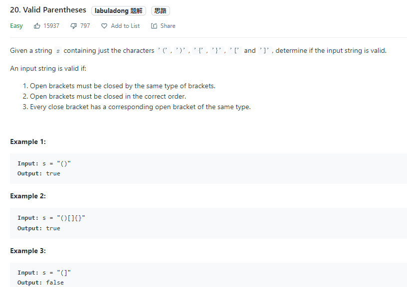

> 栈是一种先进后出的数据结构，处理括号问题的时候尤其有用。遇到左括号就入栈，遇到右括号就去栈中寻找最近的左括号，看是否匹配。

类似题目：
[LeetCode-1541. 平衡括号字符串的最少插入次数 - Medium 🟠](https://leetcode.com/problems/minimum-insertions-to-balance-a-parentheses-string/)
[LeetCode-921. 使括号有效的最少添加 - Medium 🟠](https://leetcode.com/problems/minimum-add-to-make-parentheses-valid/)

```js
/**
 * @param {string} s
 * @return {boolean}
 */
var isValid = function(s) {
        const map = {
        "(": -1,
        ")": 1,
        "[": -2,
        "]": 2,
        "{": -3,
        "}": 3,
    }
    let stack = [];
    for (let i = 0; i < s.length; i++) {
        if (map[s[i]] < 0) {
            stack.push(s[i]);
        } else {
            let top = stack.pop();
            if (map[top] + map[s[i]] !== 0) {
                return false;
            }
        }
    }

    return stack.length === 0;
};
```

```ts
const brackets: { [key: string]: string } = {
    ')': '(',
    ']': '[',
    '}': '{',
};

function isValid(s: string): boolean {
    const stack: string[] = [];
    const chars = s.split('');

    for (const char of chars) {
        if (isClosing(char)) {
            const cur = stack.pop();

            if (brackets[char] !== cur) {
                return false;
            }
        } else {
            stack.push(char);
        }
    }

    return stack.length === 0;
}

function isClosing(s: string): boolean {
    return brackets.hasOwnProperty(s);
}
```

---

# 队列

> 线性数据结构，一端入队，另一端出队，遵循`先进先出（FIFO）`原则

## 实现

这里会分别介绍`单链队列`和`循环队列`；

### 单链队列

```js
Class Queue {
    constructor() {
        this.queue = [];
    }

    enQueue(item) {
        this.queue.push(item);
    }

    deQueue() {
        return this.queue.shift();
    }

    getLength() {
        return this.queue.length;
    }

    isEmpty() {
        return this.getLength() === 0;
    }
}

```

> 因为`单链队列在出队操作`的时候需要` O(n)` 的时间复杂度，所以引入了循环队列。`循环队列的出队操作平均是 O(1) `的时间复杂度。


### 循环队列

```js
class SqQueue {
  constructor(length) {
    this.queue = new Array(length + 1)
    // 队头
    this.first = 0
    // 队尾
    this.last = 0
    // 当前队列大小
    this.size = 0
  }
  enQueue(item) {
    // 判断队尾 + 1 是否为队头
    // 如果是就代表需要扩容数组
    // % this.queue.length 是为了防止数组越界
    if (this.first === (this.last + 1) % this.queue.length) {
      this.resize(this.getLength() * 2 + 1)
    }
    this.queue[this.last] = item
    this.size++
    this.last = (this.last + 1) % this.queue.length
  }
  deQueue() {
    if (this.isEmpty()) {
      throw Error('Queue is empty')
    }
    let r = this.queue[this.first]
    this.queue[this.first] = null
    this.first = (this.first + 1) % this.queue.length
    this.size--
    // 判断当前队列大小是否过小
    // 为了保证不浪费空间，在队列空间等于总长度四分之一时
    // 且不为 2 时缩小总长度为当前的一半
    if (this.size === this.getLength() / 4 && this.getLength() / 2 !== 0) {
      this.resize(this.getLength() / 2)
    }
    return r
  }
  getHeader() {
    if (this.isEmpty()) {
      throw Error('Queue is empty')
    }
    return this.queue[this.first]
  }
  getLength() {
    return this.queue.length - 1
  }
  isEmpty() {
    return this.first === this.last
  }
  resize(length) {
    let q = new Array(length)
    for (let i = 0; i < length; i++) {
      q[i] = this.queue[(i + this.first) % this.queue.length]
    }
    this.queue = q
    this.first = 0
    this.last = this.size
  }
}
```

---

# 链表

链表是一个线性结构，同时也是一个天然的递归结构。链表结构可以充分利用计算机内存空间，实现灵活的`内存动态管理`。但是`链表失去了数组随机读取的优点`，同时链表由于增加了结点的指针域，`空间开销比较大`。

## 实现

```js
class Node {
    constructor(val, next) {
        this.value = val;
        this.next = next;
    }
}

class LinkList {
    constructor() {
        // 链表长度
        this.size = 0;
        // 虚拟头部
        this.dummyNode = new Node(null, null);
    }

    find(header, index, currentIndex) {
        if (index === currentIndex) return header;

        return this.find(header.next, index, currentIndex + 1);
    }

    addNode(v, index) {
        this.checkIndex(index);

        // 在链表末尾插入时，prev.next为空
        // 其他情况下，插入的节点的next为prev.next
        // 最后设置prev.next为插入的节点
        let prev = this.find(this.dummyNode, index, 0);
        prev.next = new Node(v. prev.next);
        this.size++;
        return prev.next;
    }

    insertNode(v, index) {
        return this.addNode(v, index);
    }

    addToFirst(v) {
        return this.addNode(v, 0);
    }

    addToLast(v) {
        return this.addNode(v, this.size);
    }

    removeNode(index, isLast) {
        this.checkIndex(index);
        index = isLast ? index - 1 : index;

        let prev = this.find(this.dummyNode, index, 0);
        let node = prev.next;
        prev.next = node.next;
        node.next = null;
        this.size--;
        return node;
    }

    checkIndex(index) {
        if (index < 0 || index > this.size) throw Error('error index');
    }
}
```


另一种实现参考[JS实现单链表](https://blog.csdn.net/luofeng457/article/details/78027422)

```js
/**
 * 单链表构造函数
 */
function LinkedList () {
    this.ptr = null;
    this.head = null;

    this.length = 0;
    this.insert = insertNode;
    this.delete = deleteNode;
    this.search = searchNode;
    this.traverse = traverseNode;
}

/**
 * 定义链表节点
 */ 
function ListNode (data) {
    this.data = data;
    this.next = null;
}

/**
 * 插入节点
 */
function insertNode (data) {
    var node = new ListNode(data);
    this.ptr = this.head;

    if (!this.ptr) {
        this.ptr = node;
        this.head = node;
    } else {
        while (this.ptr) {
            if (this.ptr.next) {
                this.ptr = this.ptr.next;
            } else {
                break;
            }
        }
        this.ptr.next = node;
    }
    this.length++;
}

/**
 * 搜索节点
 */
function searchNode (data) {
    this.ptr = this.head;
    if (!this.ptr) {
        return false;
    }
    while (this.ptr) {
        if (this.ptr.data === data) {
            return true;
        } else if (this.ptr.next) {
            this.ptr = this.ptr.next;
        } else {
            return false;
        }
    }
    this.ptr = this.head;
}

function deleteNode (data) {
    this.ptr = this.head;
    if (!this.ptr) {
        return false;
    } else if (this.search(data)) {
        this.ptr = this.head;
        if (this.ptr.data === data) {
            this.ptr = null;
            this.head = null;
        } else {
            while (this.ptr.next) {
                if (this.ptr.next.data === data) {
                    if (this.ptr.next.next) {
                        this.ptr.next = this.ptr.next.next;
                    } else {
                        this.ptr.next = null;
                    }
                    return true;
                } else {
                    this.ptr = this.ptr.next;
                }
            }
        }
        this.length--;
    } else {
        return false;
    }
}

/**
 * 遍历输出
 */
function traverseNode () {
    var p = this.head;
    if (!this.head) {
        return false;
    }
    while (this.head) {
        console.log(this.head.data);
        if (this.head.next) {
            this.head = this.head.next;
        } else {
            break;
        }
    }

    this.head = p;
}

/**
 * 序列测试
 */
var list = new LinkedList();
list.insert('a');
console.log(list.length);
list.insert('b');
console.log(list.length);
list.insert('c');
console.log(list.length);
list.traverse();
console.log(list.search('b'));
list.delete('b');
list.insert('d');
list.traverse();
list.delete('a');
list.delete('c');
list.delete('d');
list.traverse();
list.insert('e');
list.traverse();

```

<br>


### LeetCode-206.反转单链表

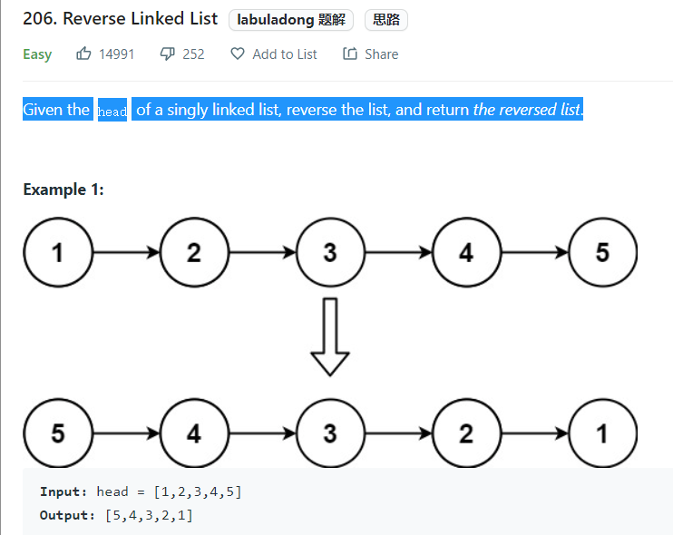


该题目来自 LeetCode，题目需要将一个单向链表反转。思路很简单，`使用三个变量分别表示当前节点和当前节点的前后节点`，虽然这题很简单，但是却是一道面试常考题


```js
/**
 * Definition for singly-linked list.
 * function ListNode(val, next) {
 *     this.val = (val===undefined ? 0 : val)
 *     this.next = (next===undefined ? null : next)
 * }
 */
/**
 * @param {ListNode} head
 * @return {ListNode}
 */
var reverseList = function(head) {
    if (!head || !head.next) return head;
    
    let pre = null;
    let current = head;
    let next;
    
    while (current) {
        next = current.next;
        current.next = pre;
        pre = current;
        current = next;
    }
    return pre;
};
```


--- 

# 树

树是一种非线性数据结构，数据元素按照分支关系组织起来；有一个特定元素称为根结点，其余结点被分为m（m>=0）个互不相交的有限集合，每个子集都是一棵树，称为该树的子树。

> 度：度即结点的分支数

## 二叉树
> 二叉树其实就是在普通树的基础上，加上了对树的度限制，即每个结点最多只能有两个子结点。

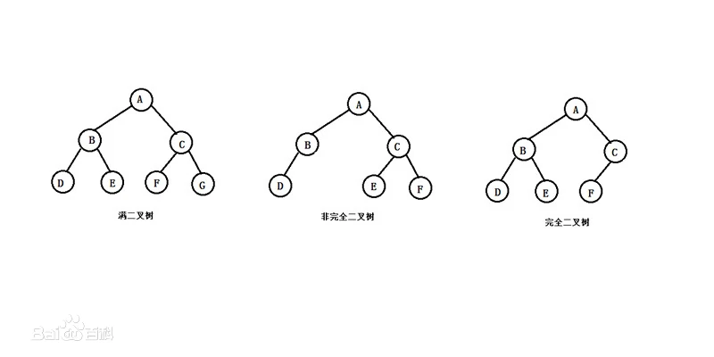

### 二叉树深度优先遍历（递归）

```js
class BinaryTree {
    // ...

    // preOrder
    preTraversal() {
        this._pre(this.root);
    }

    _pre(node) {
        if (node) {
            console.log(node.value);
            this._pre(node.left);
            this._pre(node.right);
        }
    }

    // inorder travesal
    midTraversal() {
        this._mid(this.root);
    }

    _mid(node) {
        if (node) {
            this._mid(node.left);
            console.log(node.value);
            this._mid(node.right);
        }
    }

    // postorder traversal
    postTraversal() {
        this._post(node);
    }

    _post(node) {
        if (node) {
            this._post(node.left);
            this._post(node.right);
            console.log(node.value);
        }
    }
}

```


### 二叉树深度优先遍历（非递归）

任何算法的递归版本都可以改成非递归版本，因为函数递归调用其实质就是压栈的过程，所以我们可以使用堆栈来模拟这个过程

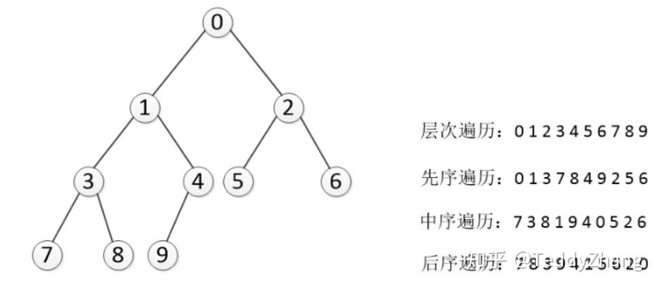

> 先序遍历：我们将数的每个节点压入栈中，由于是先序遍历，`首先压入的是根节点，然后弹出`（弹出节点时打印信息，且一个循环弹出一个节点），`接着是压入右子树节点，最后压入左子树节点`。为什么要这样呢？由于堆栈是“先进后出”结构，我们想要先打印左子树，因此最后压入左子树，循环这个过程，就达到了我们的目的。

> 中序遍历：中序时，我们`首先去遍历二叉树的左分支`，并将节点压入栈中，只到找到最左边的叶节点，接着弹出（并打印节点），并看其有没右分支，如果没有，栈再弹出一个节点（根节点），`看其有没有右分支`。每次弹出，都要观察其是否有右分支，也就是说`每个节点都遍历了两次`！

> 后序遍历：后序遍历在意思上和前序遍历相近，而前序遍历的压栈顺序为：根、右、左。那么如果我们`使用两个堆栈`，`第一个压栈顺序为：根、左、右`，但是在（先序遍历时）`弹出根节点时将根节点压入第二个堆栈`，为什么这里压栈顺序要为左右呢？很简单，在第一个堆栈中最后压入右子树，那么右子树会最先压入第二个堆栈，相应的，当第二个堆栈弹出时，右子树会在左子树的后面弹出（先进后出）。注意：根节点是最先被压入第一个栈中的，同时也是最先被压入第二个栈中的！

```js
class BinaryTree {
    constructor() {
        this.root = null;
        this.size = 0;
    }

    // ...

    // 先序遍历：
    preTraversal() {
        if (!this.root) return null;

        const s = []; 

        s.push(this.root);
        let cur = this.root;

        while (!s.isEmpty()) {
            cur = s.pop();
            console.log(cur.value);

            if (cur.right) {
                s.push(cur.right);
            }

            if (cur.left) {
                s.push(cur.left);
            }
        }

        
    }

    // 中序遍历
    midTraversal() {
        if (!this.root) return null;

        const s = [];

        const cur = this.root;

        while (!s.isEmpty() || cur) {
            if (cur) {
                s.push(cur);
                cur = cur.left; // 找出左子树最左边的叶子结点，依次入栈根节点
            } else { // 不存在根结点，出栈根结点，
                cur = s.pop();
                console.log(cur.value);
                cur = cur.right; // 回溯到根结点时处理其右子树
            }
        }
    }

    // 后序遍历
    postTraversal() {
        if (!this.root) return null;

        const s1 = []; // 入栈顺序：根->左->右
        const s2 = []; // 入栈顺序：根->右->左

        let cur = this.root;
        s1.push(cur);

        while(!s1.isEmpty()) {
            cur = s1.pop();
            s2.push(cur);

            if (cur.left) {
                s1.push(cur.left);
            }

            if (cur.right) {
                s1.push(cur.right);
            }
        }

        while (!s2.isEmpty()) {
            cur = s2.pop();
            console.log(cur.value);
        }
    }
}

```


### 二叉树广度优先遍历

借用队列实现

```js
class BinaryTree {
    // ...

    breadthTraversal() {
        if (!this.root) return null;

        let q = new Queue();

        q.enQueue(this.root);

        while(!q.isEmpty()) {
            let node = q.deQueue();
            
            console.log(n.value);
            if (node.left) q.enQueue(node.left);
            if (node.right) q.enQueue(node.right);
        }
    }
}

```

### LeetCode-104.二叉树的最大深度

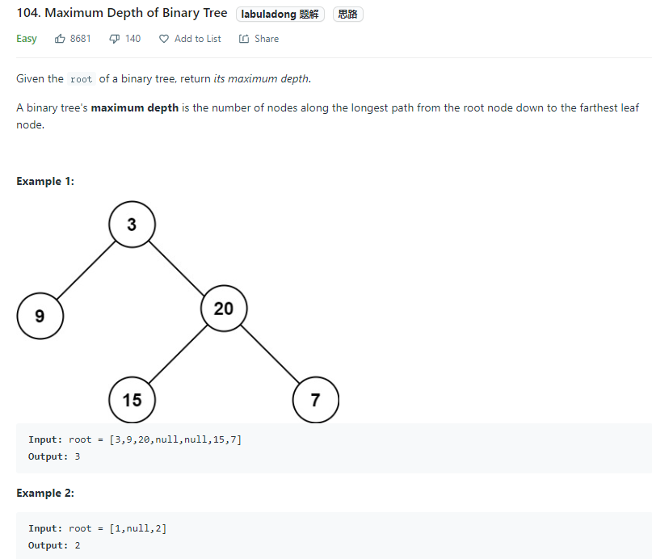

#### 递归 DFS

> 时间复杂度O(N)，空间复杂度O(depth)——递归空间复杂度等于深度；

```js
// 递归
/**
 * Definition for a binary tree node.
 * function TreeNode(val, left, right) {
 *     this.val = (val===undefined ? 0 : val)
 *     this.left = (left===undefined ? null : left)
 *     this.right = (right===undefined ? null : right)
 * }
 */
/**
 * @param {TreeNode} root
 * @return {number}
 */
var maxDepth = function(root) {
    if (!root) return 0;
    
    return Math.max(maxDepth(root.left), maxDepth(root.right)) + 1;
};

```

#### 迭代 BFS

> `思路与算法`：我们也可以用「广度优先搜索」的方法来解决这道题目，但我们需要对其进行一些修改，此时我们广度优先搜索的队列里存放的是「当前层的所有节点」。每次拓展下一层的时候，`不同于广度优先搜索的每次只从队列里拿出一个节点，我们需要将队列里的所有节点都拿出来进行拓展`，这样能保证每次拓展完的时候队列里存放的是当前层的所有节点，即我们是一层一层地进行拓展，最后我们用一个变量 `ans` 来维护拓展的次数，该二叉树的最大深度即为`ans`。

`时间复杂度：O(n)`，其中 n 为二叉树的节点个数。与方法一同样的分析，每个节点只会被访问一次。

`空间复杂度`：此方法空间的消耗取决于队列存储的元素数量，其在`最坏情况下会达到 O(n)`。


```js
/**
 * Definition for a binary tree node.
 * function TreeNode(val, left, right) {
 *     this.val = (val===undefined ? 0 : val)
 *     this.left = (left===undefined ? null : left)
 *     this.right = (right===undefined ? null : right)
 * }
 */
/**
 * @param {TreeNode} root
 * @return {number}
 */
var maxDepth = function(root) {
    if (!root) return 0;
    
    let queue = []; // 层序遍历
    let depth = 0;

    queue.push(root);
    
    while(queue.length > 0) {
        let size = queue.length;

        while (size > 0) {
            let cur = queue.shift();

            if (cur.left) {
                queue.push(cur.left);
            }

            if (cur.right) {
                queue.push(cur.right);
            }

            size--;
        }

        depth++;
    }

    return depth;
};

```


## 空二叉树

只有一个结点的二叉树

## 满二叉树

> 只有度为0的节点和度为2的结点，并且度为0的结点在同一层上

## 完全二叉树

指的是深度为 k，有 n 个结点的二叉树当且仅当其每一个结点都`与深度为 k 的满二叉树中编号从 1 到 n 的结点一一对应`。简单地说，`完全二叉树是满二叉树的一个子集`。简单地说，完全二叉树就是非叶子节点都有两个子结点，并且必须是从左到右、从上到下的顺序。

## 二叉搜索树（Binary Search Tree, BST）

又称`二叉排序树`，平均查找效率为`O(logN)`，最差为`O(N)`（退化为链表）

定义：
1. 若左子树不为空，则左子树上的所有结点的值小于它的根结点的值
2. 若右子树不为空，则右子树上的所有结点的值大于它的根结点的值
3. 左右子树也分别是二叉排序树

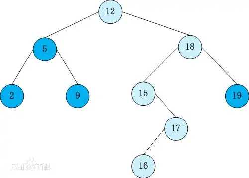


```js
class Node {
    constructor(value) {
        this.value = value;
        this.left = null;
        this.right = null;
    }
}

class BST {
    constructor() {
        this.root = null;
        this.size = 0;
    }

    isEmpty() {
        return this.size;
    }

    addNode(v) {
        this.root = this._addChild(this.root, v);
    }

    _addChild(node, v) {
        if (!node) {
            return new Node(v);
        }

        if (v < node.value) {
            node.left = this._addChild(node.left, v);
        } else if (v > node.value) {
            node.right = this._addChild(node.right, v);
        }

        return node;
    }

    // 最大值：右子树的右子结点查找；最小值-左子树的左子结点查找
    getMin() {
        return this._getMin(this.root).value;
    }

    _getMin(node) {
        if (!node.left) return node;

        return this._getMin(node.left);
    }

    getMax() {
        return this._getMax(this.root).value;
    }

    _getMax(node) {
        if (!node.right) return node;

        return this._getMax(node.right);
    }

    
}

```

### 获取排名

> 这是用于`获取给定值的排名或者排名第几的节点的值`，这两个操作也是相反的，所以这个只介绍如何获取排名第几的节点的值。对于这个操作而言，我们需要略微的改造点代码，让每个节点拥有一个 size 属性。该属性表示该节点下有多少子节点（包含自身）。

```js
class Node {
  constructor(value) {
    this.value = value
    this.left = null
    this.right = null
    // 修改代码
    this.size = 1
  }
}
// 新增代码
_getSize(node) {
  return node ? node.size : 0
}
_addChild(node, v) {
  if (!node) {
    return new Node(v)
  }
  if (node.value > v) {
    // 修改代码
    node.size++
    node.left = this._addChild(node.left, v)
  } else if (node.value < v) {
    // 修改代码
    node.size++
    node.right = this._addChild(node.right, v)
  }
  return node
}
select(k) {
  let node = this._select(this.root, k)
  return node ? node.value : null
}
_select(node, k) {
  if (!node) return null
  // 先获取左子树下有几个节点
  let size = node.left ? node.left.size : 0
  // 判断 size 是否大于 k
  // 如果大于 k，代表所需要的节点在左节点
  if (size > k) return this._select(node.left, k)
  // 如果小于 k，代表所需要的节点在右节点
  // 注意这里需要重新计算 k，减去根节点除了右子树的节点数量
  if (size < k) return this._select(node.right, k - size - 1)
  return node
}

```

### 删除节点

接下来讲解的是二分搜索树中最难实现的部分：删除节点。因为对于删除节点来说，会存在以下几种情况

- 需要删除的节点没有子树
- 需要删除的节点只有一条子树
- 需要删除的节点有左右两条树

对于前两种情况很好解决，但是第三种情况就有难度了，所以先来实现相对简单的操作：删除最小节点，对于`删除最小节点来说，是不存在第三种情况`的，`删除最大节点操作是和删除最小节点相反的`，所以这里也就不再赘述。

```js
deleteMin() {
    this.root = this._deleteMin(this.root);
    console.log(this.root);
}

_deleteMin(node) {
    // 一直递归左子树
    // 如果左子树为空，就判断节点是否拥有右子树
    // 有右子树的话就把需要删除的节点替换为右子树
    if (!node && !node.left) return node.right;

    node.left = this._deleteMin(node.left);
    // 最后需要重新维护下节点的 `size`
    node.size = this._getSize(node.left) + this._getSize(node.right) + 1

    return node;
}
```


最后讲解的就是`如何删除任意节点`了。对于这个操作，`T.Hibbard` 在 1962 年提出了解决这个难题的办法，也就是`如何解决第三种情况`。

当遇到这种情况时，需要`取出当前节点的后继节点`（也就是当前节点右子树的最小节点）`来替换需要删除的节点`。然后`将需要删除节点的左子树赋值给后继结点，右子树删除后继结点后赋值给他`。

你如果对于这个解决办法有疑问的话，可以这样考虑。因为二分搜索树的特性，父节点一定比所有左子节点大，比所有右子节点小。那么当需要删除父节点时，势必需要拿出一个比父节点大的节点来替换父节点。这个节点肯定不存在于左子树，必然存在于右子树。然后又需要保持父节点都是比右子节点小的，那么就可以取出右子树中最小的那个节点来替换父节点。

```js
delete(v) {
    this.root = this._delete(this.root, v);
}

_delete(node, v) {
    if (!node) return null;

    if (v > node.value) {
        node.right = this._delete(node.right, v);
    } else if (v < node.value) {
        node.left = this._delete(node.left, v);
    } else {
        // 找到节点
        // 先判断节点是否拥有拥有左右子树中的一个
        // 是的话，将子树返回出去，这里和 `_delectMin` 的操作一样
        if (!node.left) return node.right;
        if (!node.right) return node.left;

        // 进入这里，代表节点拥有左右子树
        // 先取出当前节点的后继结点，也就是取当前节点右子树的最小值
        let min = this._getMin(node.right);
        // 取出最小值后，删除最小值
        // 然后把删除节点后的子树赋值给最小值节点的右子树
        min.right = this._delectMin(node.right);
        // 左子树不动
        min.left = node.left;
        node = min;
    }

    // 维护 size
    node.size = this._getSize(node.left) + this._getSize(node.right) + 1
    return node
}

```


## 平衡二叉树（AVL）

上面提到的BST在最差的情况下会退化为链表，导致查找效率变为`O(N)`，如果可以保证二叉树不出现这种极端情况，就可以保证较高的搜索效率了。

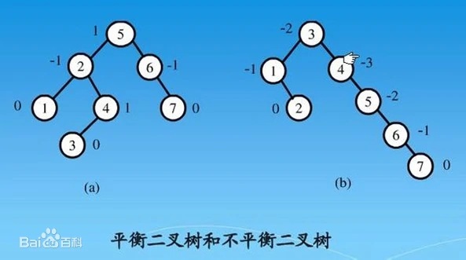

> `平衡二叉树`又称`平衡二叉搜索树`，要么是`一棵空树`，要么保证`左右子树的高度之差不大于 1`，并且子树也必须是一棵平衡二叉树。这样保证了时间复杂度是严格的 `O(logN)`

由于AVL的左右子树高度差不超过1，所以增加、删除节点可能需要旋转树来达到高度平衡。


### 实现

因为 AVL 树是改进了二分搜索树，所以部分代码是于二分搜索树重复的，对于重复内容不作再次解析。

对于 AVL 树来说，添加节点会有四种情况


- 对于左左情况来说，新增加的节点位于节点 2 的左侧，这时树已经不平衡，需要旋转。因为搜索树的特性，节点比左节点大，比右节点小，所以旋转以后也要实现这个特性。

- 旋转之前：new < 2 < C < 3 < B < 5 < A，右旋之后节点 3 为根节点，这时候需要将节点 3 的右节点加到节点 5 的左边，最后还需要更新节点的高度。

- 对于右右情况来说，相反于左左情况，所以不再赘述。

- 对于左右情况来说，新增加的节点位于节点 4 的右侧。对于这种情况，需要通过两次旋转来达到目的。

- 首先对节点的左节点左旋，这时树满足左左的情况，再对节点进行一次右旋就可以达到目的。

```js
class Node {
  constructor(value) {
    this.value = value
    this.left = null
    this.right = null
    this.height = 1
  }
}

class AVL {
  constructor() {
    this.root = null
  }
  addNode(v) {
    this.root = this._addChild(this.root, v)
  }
  _addChild(node, v) {
    if (!node) {
      return new Node(v)
    }
    if (node.value > v) {
      node.left = this._addChild(node.left, v)
    } else if (node.value < v) {
      node.right = this._addChild(node.right, v)
    } else {
      node.value = v
    }
    node.height =
      1 + Math.max(this._getHeight(node.left), this._getHeight(node.right))
    let factor = this._getBalanceFactor(node)
    // 当需要右旋时，根节点的左树一定比右树高度高
    if (factor > 1 && this._getBalanceFactor(node.left) >= 0) {
      return this._rightRotate(node)
    }
    // 当需要左旋时，根节点的左树一定比右树高度矮
    if (factor < -1 && this._getBalanceFactor(node.right) <= 0) {
      return this._leftRotate(node)
    }
    // 左右情况
    // 节点的左树比右树高，且节点的左树的右树比节点的左树的左树高
    if (factor > 1 && this._getBalanceFactor(node.left) < 0) {
      node.left = this._leftRotate(node.left)
      return this._rightRotate(node)
    }
    // 右左情况
    // 节点的左树比右树矮，且节点的右树的右树比节点的右树的左树矮
    if (factor < -1 && this._getBalanceFactor(node.right) > 0) {
      node.right = this._rightRotate(node.right)
      return this._leftRotate(node)
    }

    return node
  }
  _getHeight(node) {
    if (!node) return 0
    return node.height
  }
  _getBalanceFactor(node) {
    return this._getHeight(node.left) - this._getHeight(node.right)
  }
  // 节点右旋
  //           5                    2
  //         /   \                /   \
  //        2     6   ==>       1      5
  //       /  \               /       /  \
  //      1    3             new     3    6
  //     /
  //    new
  _rightRotate(node) {
    // 旋转后新根节点
    let newRoot = node.left
    // 需要移动的节点
    let moveNode = newRoot.right
    // 节点 2 的右节点改为节点 5
    newRoot.right = node
    // 节点 5 左节点改为节点 3
    node.left = moveNode
    // 更新树的高度
    node.height =
      1 + Math.max(this._getHeight(node.left), this._getHeight(node.right))
    newRoot.height =
      1 +
      Math.max(this._getHeight(newRoot.left), this._getHeight(newRoot.right))

    return newRoot
  }
  // 节点左旋
  //           4                    6
  //         /   \                /   \
  //        2     6   ==>       4      7
  //             /  \         /   \      \
  //            5     7      2     5      new
  //                   \
  //                    new
  _leftRotate(node) {
    // 旋转后新根节点
    let newRoot = node.right
    // 需要移动的节点
    let moveNode = newRoot.left
    // 节点 6 的左节点改为节点 4
    newRoot.left = node
    // 节点 4 右节点改为节点 5
    node.right = moveNode
    // 更新树的高度
    node.height =
      1 + Math.max(this._getHeight(node.left), this._getHeight(node.right))
    newRoot.height =
      1 +
      Math.max(this._getHeight(newRoot.left), this._getHeight(newRoot.right))

    return newRoot
  }
}

```

## Trie

又称`字典树`、`前缀树`，是一种`有序树`，`用于保存关联数组`，其中的键通常是字符串。

这个结构的作用大多是为了`方便搜索字符串`，该树有以下几个特点：

- 根节点代表空字符串，每个节点都有 N（假如搜索英文字符，就有 26 条） 条链接，每条链接代表一个字符
- `节点不存储字符，只有路径才存储`，这点和其他的树结构不同
- 从根节点开始到任意一个节点，将沿途经过的字符连接起来就是该节点对应的字符串

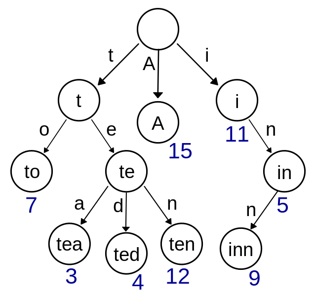


### 实现

总得来说 Trie 的实现相比别的树结构来说简单的很多，实现就以搜索英文字符为例。

```js
class TrieNode {
    contructor() {
        // 代表每个字符经过节点的次数
        this.path = 0
        // 代表到该节点的字符串有几个
        this.end = 0
        // 链接
        this.next = new Array(26).fill(null)
    }
}

class Trie {
    contructor() {
        // 根结点，代表空字符
        this.root = new TrieNode();
    }

    // 插入字符串
    insert(str) {
        if (!str) return;

        let node = this.root;

        for (let i = 0; i < str.length; i++) {
            // 获得字符先对应的索引
            let index = str[i].charCodeAt() - 'a'.charCodeAt();
            // 如果索引对应没有值，就创建
            if (!node.next[index]) {
                node.next[index] = new TrieNode();
            }

            node.path += 1;
            node = node.next[index];
        }

        node.end += 1;
    }

    // 搜索字符串出现的次数
    search(str) {
        if (!str) return;
        let node = this.root;

        for (let i = 0; i < str.length; i++) {
            let index = str[i].charCodeAt() - 'a'.charCodeAt();
            // 如果索引对应没有值，代表没有需要搜素的字符串
            if (!node.next[index]) {
                return 0;
            }
            node = node.next[index];
        }

        return node.end;
    }

    // 删除字符串
    delete(str) {
        if (!this.search(str)) return;

        let node = this.root;

        for (let i = 0; i < str.length; i++) {
            let index = str[i].charCodeAt() - 'a'.charCodeAt();
            // 如果索引对应的节点的 Path 为 0，代表经过该节点的字符串
            // 已经一个，直接删除即可
            if (--node.next[index].path == 0) {
                node.next[index] = null;
                return
            }
            node = node.next[index];
        }

        node.end -= 1;
    }
}

```


## 红黑树

> 红黑树是一种自平衡的二叉搜索树，在进行插入和删除操作时通过特定操作保持二叉查找树的平衡，从而获得较高的查找性能。它可以在 `O (log N) `时间内做查找、插入和删除，这里的 N 是树中元素的数目。典型用途是实现关联数组

### 特点
- 若一棵二叉查找树是红黑树，则它的任一子树必为红黑树。
- 红黑树是一种平衡二叉查找树的变体，它的左右子树高差有可能大于 1。
- 与 AVL 树相比，其通过牺牲查询效率来提升插入、删除效率。


### 属性
- 根结点是黑色
- 结点为红色或黑色
- 所有叶子结点为黑色
- 每个红色结点的两个子结点都是黑色（从每个叶子结点到根的路径上不能有连续两个红色结点）
- 任意结点到每个叶子结点的路径都包含数量相同的黑色结点

> 上面这 5 个性质使得红黑树有一个关键的性质：从根到叶子的最长的可能路径不多于最短的可能路径的两倍长。结果是这个树大致上是平衡的

## B树

B树可以有2个以上的子结点，是一种自平衡的树数据结构

> 与其他自平衡二进制搜索树不同，`B树非常适合读取和写入相对较大的数据块（如光盘）的存储系统`。它通常`用于数据库和文件系统`，例如 mysql 的 InnoDB 引擎使用的数据结构就是 B 树的变形 B+ 树。

B 树是一种平衡的多分树，通常我们说 m 阶的 B 树，它必须满足如下条件：

- 每个节点最多只有 m 个子节点。
- 每个非叶子节点（除了根）具有至少 ⌈m/2⌉ 子节点。
- 如果根不是叶节点，则根至少有两个子节点。
- 具有 k 个子节点的非叶节点包含 k -1 个键。
- 所有叶子都出现在同一水平，没有任何信息（高度一致）。

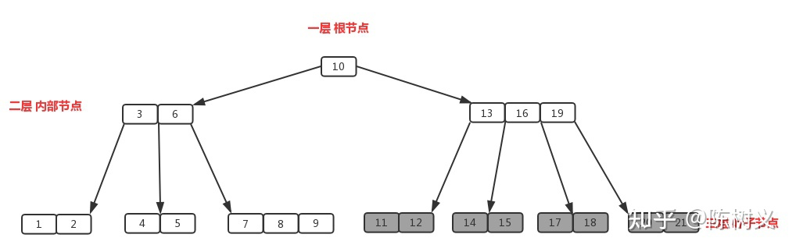

`B 树的阶，指的是 B 树中节点的子节点数目的最大值`。例如在上图的书中，「13,16,19」拥有的子节点数目最多，一共有四个子节点（灰色节点）。所以该 B 树的阶为 4，该树称为 4 阶 B 树。在实际应用中，`B树应用于 MongoDB 的索引`。


## B+树

`B+ 树是应文件系统所需而产生的 B 树的变形树`。B+ 树的特征：

- 有 m 个子树的`中间节点包含有 m 个元素`（B 树中是 k-1 个元素），每个元素`不保存数据，只用来索引`。

- 所有的`叶子结点中包含了全部关键字的信息`，及指向含有这些关键字记录的指针，且`叶子结点本身依关键字的大小自小而大的顺序链接`。而 B 树的叶子节点并没有包括全部需要查找的信息。

- 所有的`非终端结点可以看成是索引部分`，结点中仅含有其子树根结点中最大（或最小）关键字。而 B 树的非终节点也包含需要查找的有效信息。例如下图中的根节点 8 是左子树中最大的元素，15 是右子树中最大的元素。


### 优势

`与 B 树相比，B+ 树有着如下的好处`：

- B+ 树的磁盘读写代价更低

    B+ 树的内部结点并没有指向关键字具体信息的指针，所以其内部结点相对 B 树更小。如果把所有同一内部结点的关键字存放在同一盘块中，那么盘块所能容纳的关键字数量也越多，所以一次性读入内存中的需要查找的关键字也就越多。相对来说 IO 读写次数也就降低了，查找速度就更快了。

- B+ 树查询效率更加稳定

    由于非终结点并不是最终指向文件内容的结点，而只是叶子结点中关键字的索引。所以 B+ 树中任何关键字的查找必须走一条从根结点到叶子结点的路。所有关键字查询的路径长度相同，导致每一个数据的查询效率相当。而对于 B 树来说，因为其每个节点都存具体的数据，因此其查询速度可能更快，但是却并不稳定。

- B+ 树便于范围查询（最重要的原因，范围查找是数据库的常态）

    `B 树在提高了 IO 性能的同时，并没有解决元素遍历效率低下的问题`。为了解决这个问题，B+ 树应用而生。`B+ 树只需要去遍历叶子节点就可以实现整棵树的遍历`。在数据库中基于范围的查询是非常频繁的，因此 `MySQL 的 InnoDB 引擎就使用了 B+ 树作为其索引的数据结构`。


### B树与B+树总结

`B 树是为了解决大数据量的查找问题`而诞生的，其是二叉搜索树的一般化。通过`每个节点存储更多的数据，使得 B 树比起二叉搜索树更加扁平化`，从而`减少 IO 读取频次，提高搜索速度`。

`B+ 树比起 B 树，最大的差异是非叶子节点不再存储具体数据`，以及`叶子节点是链表结构`。非叶子节点不再存储具体数据，这使得 B+ 树更加扁平化，查找效率更高。叶子节点是链表结构，这使得 B+ 树更适合用在范围查找的场景中。

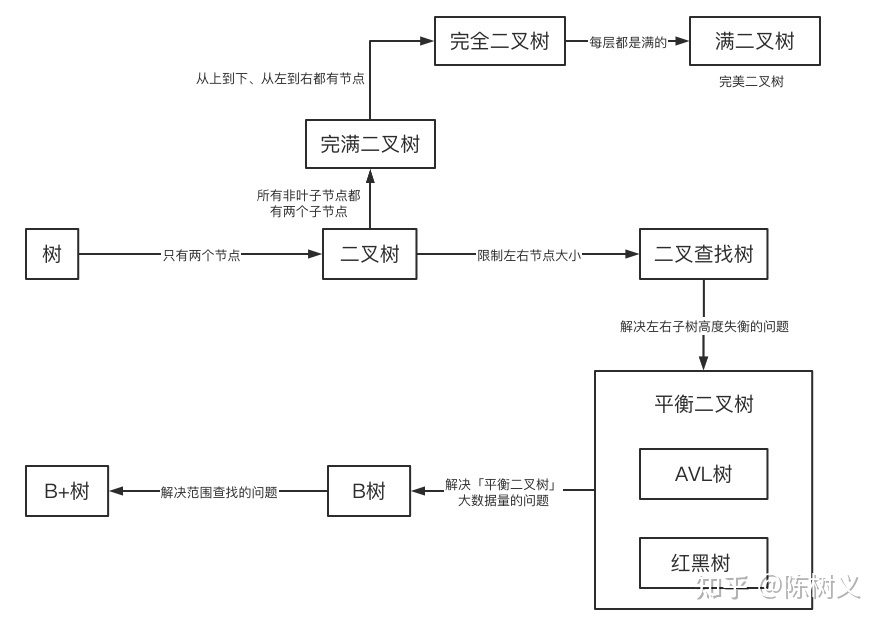


# 并查集（Union-Find）

## 概念

并查集是一种特殊的树结构，`用于处理一些不交集的合并及查询问题`。该结构中每个节点都有一个父节点，如果只有当前一个节点，那么该节点的父节点指向自己。

这个结构中有两个重要的操作，分别是：

- Find：确定元素属于哪一个子集。它可以被用来确定两个元素是否属于同一子集。
- Union：将两个子集合并成同一个集合。

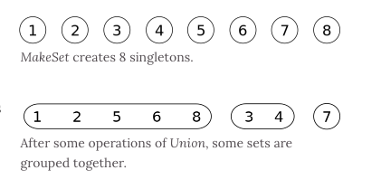


## 实现

```js
class DisjointSet {
  // 初始化样本
  constructor(count) {
    // 初始化时，每个节点的父节点都是自己
    this.parent = new Array(count)
    // 用于记录树的深度，优化搜索复杂度
    this.rank = new Array(count)
    for (let i = 0; i < count; i++) {
      this.parent[i] = i
      this.rank[i] = 1
    }
  }
  find(p) {
    // 寻找当前节点的父节点是否为自己，不是的话表示还没找到
    // 开始进行路径压缩优化
    // 假设当前节点父节点为 A
    // 将当前节点挂载到 A 节点的父节点上，达到压缩深度的目的
    while (p != this.parent[p]) {
      this.parent[p] = this.parent[this.parent[p]]
      p = this.parent[p]
    }
    return p
  }
  isConnected(p, q) {
    return this.find(p) === this.find(q)
  }
  // 合并
  union(p, q) {
    // 找到两个数字的父节点
    let i = this.find(p)
    let j = this.find(q)
    if (i === j) return
    // 判断两棵树的深度，深度小的加到深度大的树下面
    // 如果两棵树深度相等，那就无所谓怎么加
    if (this.rank[i] < this.rank[j]) {
      this.parent[i] = j
    } else if (this.rank[i] > this.rank[j]) {
      this.parent[j] = i
    } else {
      this.parent[i] = j
      this.rank[j] += 1
    }
  }
}

```

<br>

---

# 堆

## 概念

> `堆通常是一个可以被看做一棵树的数组对象`。

`堆的实现通过构造二叉堆`，实为`二叉树`的一种。这种数据结构具有以下性质：
- 任意节点小于（或大于）它的所有子节点；
- 堆总是一棵`完全树`。即除了最底层，其他层的节点都被元素填满，且最底层从左到右填入；

所以堆可以看做是一个完全二叉树

## 实现大根堆

堆的每个节点的左边子节点索引是 `i * 2 + 1`，右边是 `i * 2 + 2`，父节点是 `Math.floor((i - 1) / 2)`。

堆有两个核心的操作，分别是 `shiftUp` 和 `shiftDown` 。前者用于添加元素，后者用于删除根节点：

- `shiftUp` 的核心思路是一路将节点与父节点对比大小，如果比父节点大，就和父节点交换位置。

- `shiftDown` 的核心思路是先将根节点和末尾交换位置，然后移除末尾元素。接下来循环判断父节点和两个子节点的大小，如果子节点大，就把最大的子节点和父节点交换。


```js
class MaxHeap {
    constructor() {
        this.heap = [];
    }

    size() {
        return this.heap.length;
    }

    empty() {
        return this.size() === 0;
    }

    add(item) {
        this.heap.push(item);
        this._shiftUp(this.size() - 1);
    }

    removeMax() {
        this._shiftDown(0);
    }

    getParentIndex(k) {
        return Math.floor((k - 1) / 2);
    }

    getLeftIndex(k) {
        return 2 * k + 1;
    }

    getRightIndex(k) {
        return 2 * k + 2;
    }

    _shiftUp(k) {
        // 如果当前节点比父节点大，则交换
        while (this.heap[k] > this.heap[this.getParentIndex(k)]) {
            this._swap(k, this.getParentIndex(k));
            // 继续向上查找
            k = this.getParentIndex(k);
        }
    }

    _shiftDown(k) {
        // 交换首尾并移除原根结点
        this._swap(k, this.size() - 1);
        this.heap.splice(this.size() - 1, 1);
        // 判断节点是否有做孩子，因为二叉堆的特性，有右必有左
        while (this.getLeftIndex(k) < this.size()) {
            let j = this.getLeftIndex(k);
            // 判断是否有右孩子，并且右孩子是否大于左孩子
            if (j + 1 < this.size() && this.heap[j + 1] > this.heap[j]) j++;
            // 判断父节点是否已经比子结点大
            if (this.heap[k] >= this.heap[j]) break;

            this._swap(k, j);
            k = j;
        }
    }

    _swap(a, b) {
        let tmp = this.heap[a];
        this.heap[a] = this.heap[b];
        this.heap[b] = tmp;
    }
}

```

<br>

---

## 位运算

位运算在算法中很有用，速度可以比四则运算快很多。

### 左移 <<

```js
10 << 1 // 20
```

左移就是将二进制全部往左移动，10 在二进制中表示为 1010 ，左移一位后变成 10100 ，转换为十进制也就是 20，所以基本可以把左移看成以下公式 `newVal = base * (2 ^ shift)`：10 * 2^1 = 20;

### 右移 >>

```js
10 >> 1 // 5

13 >> 1 // 6
```

算数右移就是将二进制全部往右移动并去除多余的右边，10 在二进制中表示为 1010 ，右移一位后变成 101 ，转换为十进制也就是 5，所以基本可以把右移看成以下公式 `newVal = Math.floor(base / (2 ^ shift))`


### 按位与 &
每一位都为 1，结果才为 1

```js
8 & 7 // 1000 & 0111 -> 0000 -> 0
```

### 按位或 |
其中一位为 1，结果就是 1

```js
8 | 7 // 1000 | 0111 -> 1111 -> 15
```

### 按位异或 ^

每一位都不同，结果才为 1

```js
8 ^ 7 // 15
8 ^ 8 // 0
0 ^ a // a, a为任意整数
```
> 从以上代码中可以发现按位异或就是`不进位加法`

`面试题：`两个数不使用四则运算得出和

这道题中可以按位异或，因为按位异或就是不进位加法，8 ^ 8 = 0 如果进位了，就是 16 了，所以我们只需要将两个数进行异或操作，然后进位。那么也就是说`两个二进制都是 1 的位置，左边应该有一个进位 1`，所以可以得出以下公式 `a + b = (a ^ b) + ((a & b) << 1)` ，然后通过迭代的方式模拟加法

```js
function sum (a, b) {
    if (a === 0) return b;
    if (b === 0) return a;

    let c = a ^ b;
    let d = (a & b) << 1;

    return sum(c, d);
}
```

### 取反 ~

```js
~10011  01100
```
#### 用于-1判定

`抽象渗漏`：指在代码中暴露了底层实现细节；
“~”非运算符可以用于防止抽象渗漏；

```js
var str = "Hello World";
if (a.indexOf("ol") == -1) {	// 暴露了条件判断临界点
	Toast('not found');
}
// 使用'~'运算符
if (!~a.indexOf("ol")) {
	Toast('not found');
}

```

#### 取整

```js
~~2.4 // 2

~~ 3.8 // 3

~~-2.1 // -2

```


### 位运算的奇技淫巧

#### 位运算实现乘除法

数 a 向右移一位，相当于将 a 除以 2；数 a 向左移一位，相当于将 a 乘以 2

#### 交换两数

```js
// 普通操作
function swap(a, b) {
    let tmp = a;
    a = b;
    b = tmp;
}

// 位运算
function swap(a, b) {
    a ^= b; // a = a ^ b
    b ^= a; // b = b ^ (a ^ b) = (b ^ b) ^ a = a;
    a ^= b; // a = (a ^ b) ^ a = (a ^ a) ^ b = b;
}

```

#### 位操作判断奇偶数

只要根据数的最后一位是 0 还是 1 来决定即可，`为 0 就是偶数，为 1 就是奇数`。

```js
if (0 == (a & 1)) {
    // a是偶数
}
```

#### 位操作统计二进制中1的个数

以 34520 为例，我们计算其 a &= (a-1)的结果：

第一次：计算前：1000 0110 1101 1000 计算后：1000 0110 1101 0000
第二次：计算前：1000 0110 1101 0000 计算后：1000 0110 1100 0000
第三次：计算前：1000 0110 1100 0000 计算后：1000 0110 1000 0000

我们发现，每计算一次二进制中就少了一个 1，则我们可以通过下面方法去统计：

```js
count = 0;

while (a) {
    a = a & (a - 1);
    count++;
}
```


<br>

---

# 排序

常见排序算法复杂度

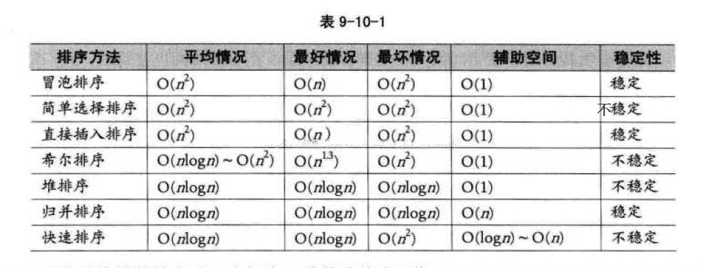

> A sorting algorithm is said to be `stable` if two objects with equal or same keys appear in the same order in sorted output as they appear in the input array to be sorted.


## 冒泡排序

冒泡排序是一种简单的排序算法：每一轮排序时依次比较相邻的两个元素，如果当前的元素大于后面的元素，那就交换两者；一轮结束后当前最大的元素就到了队列末尾，重复上面的操作至多n-1轮就可以完成数组排序。

> 时间复杂度O(N²)，空间复杂度O(1)，是一种稳定排序


```js
function bubbleSort (arr) {
    const len = arr.length;
    let i, j, tmp, swapped;
    for (i = 0; i < len - 1; i++) {
        swapped = false;
        for (j = 0; j < len - 1 - i; j++) {
            if (arr[j] > arr[j + 1]) {
                tmp = arr[j];
                arr[j] = arr[j + 1];
                arr[j + 1] = tmp;
            }
        }

        if (!swap) break; // 优化处理，如果一轮遍历后没有发生顺序变换，说明已经完成了数组排序
    }

    return arr;
}

```


## 插入排序

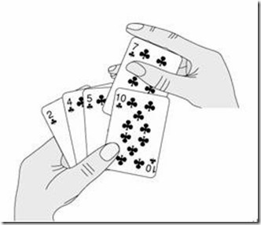


对于未排序数据，在已排序序列中从后向前扫描，找到相应位置并插入

插入排序在实现上，通常采用`in-place`排序（即只需用到O(1)的额外空间的排序），因而在从后向前扫描过程中，需要反复把`已排序元素逐步向后挪位`，为最新元素提供插入空间。

具体算法描述如下：

- 从第一个元素开始，该元素可以认为已经被排序
- 取出下一个元素，在已经排序的元素序列中从后向前扫描
- 如果该元素（已排序）大于新元素，将该元素移到下一位置
- 重复步骤3，直到找到已排序的元素小于或者等于新元素的位置
- 将新元素插入到该位置后
- 重复步骤2~5

> `时间复杂度O(N²)`，空间复杂度O(1)，稳定；

```js
function insertionSort (arr: number[]) {
    let i, j, cur;
    const len = arr.length;

    for (i = 1; i < len; i++) {
        cur = arr[i];
        j = i - 1;
        while (cur < arr[j] && j >= 0) {
            arr[j + 1] = arr[j];
            j--;
        }
        arr[j + 1] = cur;
    }

    return arr;
}

const arr = [3, 1, 5, 4, 2, 6, 9];

```


## 希尔排序

希尔排序，也叫`递减增量排序`，是插入排序的一种更高效的改进版本。`希尔排序是不稳定的排序算法`。

插入排序有两个特点：
- 在大多数元素已经有序的情况下，插入排序的工作量较小
- 在元素数量较少的情况下，插入排序的工作量较小

因此，可以对待排序的元素进行一些预处理，使其变得相对有序。

希尔排序是基于插入排序的以下两点性质而提出改进方法的：
- 插入排序在对几乎已经排好序的数据操作时，效率高，即可以达到线性排序的效率
- 但插入排序一般来说是低效的，因为插入排序每次只能将数据移动一位

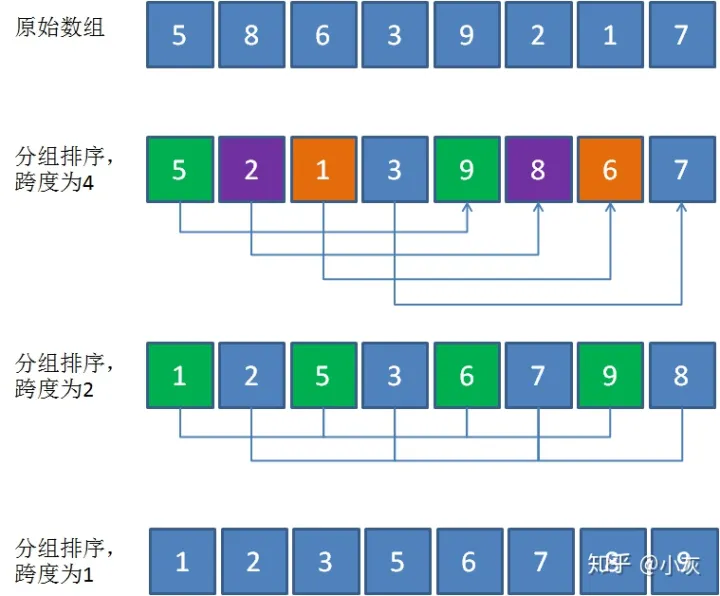

像这样逐步分组进行粗调，再进行直接插入排序的思想（分治），就是希尔排序，根据该算法的发明者，计算机科学家`Donald Shell`的名字所命名。

> `希尔排序是不稳定排序，时间复杂度O(Nlog₂N)，最坏时间复杂度O(N²)`


上面的例子进行希尔排序时不管gap是4还是2都不会发生交换，最终进行了所有元素的直接插入排序（增加了分组的成本）。


希尔排序通过`将比较的全部元素分为几个区域来提升插入排序的性能`。这样可以让一个元素可以一次性地朝最终位置前进一大步。然后算法再取越来越小的步长进行排序，算法的最后一步就是普通的插入排序，但是到了这步，需排序的数据几乎是已排好的了（此时插入排序较快）。

假设有一个很小的数据在一个已按升序排好序的数组的末端。如果用复杂度为O(n^2)的排序（冒泡排序或直接插入排序），可能会进行n次的比较和交换才能将该数据移至正确位置。而希尔排序会用较大的步长移动数据，所以小数据只需进行少数比较和交换即可到正确位置。


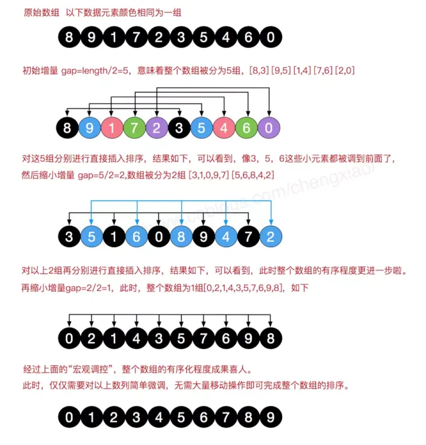

```js
function shellSort(arr) {
    const len = arr.length;
    let i,
        j,
        k,
        tmp,
        gap = len;

    while (gap > 1) {
        gap = gap >> 1;

        for (i = 0; i < gap; i++) {
            for (j = i + gap; j < len; j = j + gap) {
                tmp = arr[j];
                for (k = j - gap; k >= 0 && tmp < arr[k]; k = k - gap) {
                    arr[k + gap] = arr[k];
                }
                arr[k + gap] = tmp;
            }
        }
    }

    return arr;
}

```


## 选择排序

选择排序也是一种简单直观的排序算法。它的工作原理很容易理解：初始时在序列中找到最小（大）元素，放到序列的起始位置作为已排序序列；然后，`再从剩余未排序元素中继续寻找最小（大）元素`，放到已排序序列的末尾。以此类推，直到所有元素均排序完毕。

`注意选择排序与冒泡排序的区别`：冒泡排序通过依次交换相邻两个顺序不合法的元素位置，从而将当前最小（大）元素放到合适的位置；而选择排序每遍历一次都记住了当前最小（大）元素的位置，最后仅需一次交换操作即可将其放到合适的位置。


> `时间复杂度O(N²)`，空间复杂度O(1)，`不稳定`；

```js
// unstable
Note: Subscripts are only used for understanding the concept.

Input : 4A 5 3 2 4B 1
Output : 1 2 3 4B 4A 5

Stable Selection Sort would have produced
Output : 1 2 3 4A 4B 5
```


### 实现

```js
function selectionSort (arr) {
    let i, j, minIndex, tmp;
    const len = arr.length;

    for (i = 0; i < len - 1; i++) {
        minIndex = i; // 保存遍历的最小元素下标
        for (j = i + 1; j < len; j++) {
            if (arr[j] < arr[minIndex]) {
                minIndex = j;
            }
        }
        tmp = arr[i];
        arr[i] = arr[minIndex];
        arr[minIndex] = tmp;
    }

    return arr;
}

const arr = [3, 1, 5, 4, 2, 6, 9];
console.log(selectionSort(arr));
```


## 归并排序

`归并排序`是建立在归并操作上的一种有效的排序算法。该算法是采用`分治法`（Divide and Conquer）的一个非常典型的应用。将已有序的子序列合并，得到完全有序的序列；即先使每个子序列有序，再使子序列段间有序。若将两个有序表合并成一个有序表，称为`2-路归并`。

算法步骤：
- 把长度为n的输入序列分成两个长度为`n/2`的子序列；
- 对这两个子序列分别采用归并排序；
- 将两个排序好的子序列合并成一个最终的排序序列；


> 归并排序算法中，归并最后到底都是相邻元素之间的比较交换，并不会发生相同元素的相对位置发生变化，故是`稳定性算法`。


### 复杂度分析

平均时间复杂度：O(NlogN)
最佳时间复杂度：O(NlogN)
最差时间复杂度：O(NlogN)
空间复杂度：O(N)


### 实现逻辑

#### 迭代法
- 申请空间，使其大小为两个已经排序序列之和，该空间用来存放合并后的序列
- 设定两个指针，最初位置分别为两个已经排序序列的起始位置
- 比较两个指针所指向的元素，选择相对小的元素放入到合并空间，并移动指针到下一位置
- 重复步骤③直到某一指针到达序列尾
- 将另一序列剩下的所有元素直接复制到合并序列尾

#### 递归法
- 将序列每相邻两个数字进行归并操作，形成floor(n/2)个序列，排序后每个序列包含两个元素
- 将上述序列再次归并，形成floor(n/4)个序列，每个序列包含四个元素
- 重复步骤②，直到所有元素排序完毕


### 实现

```js
// 迭代法：
function mergeSort(arr) {
    const len = arr.length;
    let help = [];
     
    let block, start;

    // 原版代码的迭代次数少了一次，没有考虑到奇数列数组的情况
    for (block = 1; block < len * 2; block *= 2) {
        for (start = 0; start < len; start += 2 * block) {
            let low = start;
            let mid = (start + block) < len ? (start + block) : len;
            let high = (start + 2 * block) < len ? (start + 2 * block) : len;
            //两个块的起始下标及结束下标
            let start1 = low, end1 = mid;
            let start2 = mid, end2 = high;
            //开始对两个block进行归并排序
            while (start1 < end1 && start2 < end2) {
                help[low++] = arr[start1] < arr[start2] ? arr[start1++] : arr[start2++];
            }
            while(start1 < end1) {
                help[low++] = arr[start1++];
            }
            while(start2 < end2) {
                help[low++] = arr[start2++];
            }
        }
        let tmp = arr;
        arr = help;
        help = tmp;
    }
    return arr;
}


// 递归法
function sort(array) {
    mergeSort(array, 0, array.length - 1)
    return array
}

function mergeSort(arr: number[], left: number, right: number) {
    if (left >= right) return;

    let i = 0,
        help = [],
        mid = left + (right - left) >> 1,
        p1 = left,
        p2 = mid + 1;

    mergeSort(arr, left, mid);
    mergeSort(arr, p2, right);

    while (p1 <= mid && p2 <= right) {
        help[i++] = arr[p1] < arr[p2] ? arr[p1++] : arr[p2++];
    }

    while (p1 <= mid) {
        help[i++] = arr[p1++];
    }

    while(p2 <= right) {
        help[i++] = arr[p2++];
    }

    for (let i = 0; i < help.length; i++) {
        arr[left + i] = help[i];
    }

    return arr;
}


```

`递归的本质就是压栈`，每递归执行一次函数，就将该函数的信息（比如参数，内部的变量，执行到的行数）压栈，直到遇到终止条件，然后出栈并继续执行函数。对于以上递归函数的调用轨迹如下

```js
mergeSort(data, 0, 6) // mid = 3
mergeSort(data, 0, 3) // mid = 1
mergeSort(data, 0, 1) // mid = 0
mergeSort(data, 0, 0) // 遇到终止，回退到上一步
mergeSort(data, 1, 1) // 遇到终止，回退到上一步
// 排序 p1 = 0, p2 = mid + 1 = 1
// 回退到 `mergeSort(data, 0, 3)` 执行下一个递归
mergeSort(2, 3) // mid = 2
mergeSort(3, 3) // 遇到终止，回退到上一步
// 排序 p1 = 2, p2 = mid + 1 = 3
// 回退到 `mergeSort(data, 0, 3)` 执行合并逻辑
// 排序 p1 = 0, p2 = mid + 1 = 2
// 执行完毕回退
// 左边数组排序完毕，右边也是如上轨迹

```


## 快排

### 原理

`与归并排序类似，快排也是一个分治算法`。


快排的关键步骤是分支函数`partition()`。分治的目标是：对于`给定的数组和选定的pivot`，一轮排序结束后总是让其左边的数都小于`pivot`，右边的数都大于`pivot`，此时pivot正好位于排序结束时的最终位置；然后递归进行该操作。

pivot的选取比较多样，一般可以选择：
- 总是选择第一个元素作为pivot
- 总是选择最后一个元素作为pivot
- 选择一个随机元素作为pivot
- 选择中线值作为pivot

 | 
-|-
a|b


### 复杂度及稳定性

平均时间复杂度：O(NlogN)
最坏时间复杂度：O(N²)
最好时间复杂度：O(NlogN)

默认实现是不稳定的

> 尽管快排的最坏时间复杂度是O(N²)，但是`实践证明大多数情况下快排更快`——因为它的内部循环可以在大多数体系结构和大多数真实世界的数据上有效地实现。最快情况对于给定类型的数据很少发生。


### 扩展

#### 为什么排序数组时快排优于归并排序

- 两者时间复杂度都是`O(NlogN)`，快排是`in-place`排序，而归并排序需要`O(N)`的额外存储空间，分配和回收空间会影响算法运行时间。

- Quick Sort is also tail recursive, therefore `tail call optimizations` is done.

#### 为什么对于链表来说归并优于快排

> 这主要是因为数组和链表的内存分配方式的不同。与数组不同，链表的内存分配不是连续的，所以在链表中插入元素时时间复杂度和空间复杂度都是`O(1)`，因此归并排序处理链表时不用额外的存储空间。


#### 什么是三路快排
> 考录一个数组有许多冗余元素，比如`[1, 4, 2, 4, 2, 4, 1, 2, 4, 1, 2, 2, 2, 2, 4, 1, 4, 4, 4]`，如果4被选择作为pivot，我们只恢复一个4的位置并且递归处理其余的。在`三路快排`中，一个数组`arr[l...r]`被分为3部分：

- `arr[l..i]`：小于pivot的元素
- `arr[i+1..j-1]`：等于pivot的元素
- `arr[j..r]`：大于pivot的元素

```js


```


### 实现


```js
function swap(arr, i, j) {
    let tmp = arr[i];
    arr[i] = arr[j];
    arr[j] = tmp;
}

function quickSort(arr, low, high) {
    if (low < high) {
        // pivot是分治的索引，此时arr[pivot]已经位于了排序后正确的位置
        let pivot = partition(arr, low, high);
        quickSort(arr, low, pivot - 1);
        quickSort(arr, pivot + 1, high);
    }
    return arr;
}

function partition(arr, low, high) {
    let pivot = arr[high];
    let i = low - 1; // 目前为止找到的较小元素的pivot(上个较小序列的最后一个元素)
    for (let j = low; j < high; j++) {
        if (arr[j] < pivot) {
            i++;
            swap(arr, i, j);
        }
    }
    swap(arr, i + 1, high); // 每次可以将pivot置于最终的位置
    return i + 1;
}

```


```js
// 非递归

var arr = [10, 80, 30, 90, 40, 50, 70];

function swap(arr, x, y) {
  let tmp = arr[x];
  arr[x] = arr[y];
  arr[y] = tmp;
}

function quickSort (arr, low, high) {
  let stack = [];
  let map = new Map();
  map.set('low', low);
  map.set('high', high);
  stack.push(map);

  while (stack.length > 0) {
    let param = stack.pop();
    let _low = param.get('low');
    let _high = param.get('high');
    let pivot = partition(arr, _low, _high);

    if (_low < pivot - 1) {
      const map = new Map();
      map.set('low', param.get('low'));
      map.set('high', pivot - 1);
      stack.push(map);
    }

    if (pivot + 1 < _high) {
      const map = new Map();
      map.set('low', pivot + 1);
      map.set('high', param.get('high'));
      stack.push(map);
    }
  }

  return arr;
}

// pivot选取最后一个元素
function partition (arr, low, high) {
  let pivot = arr[high];
  let i = low - 1; 

  for (let j = low; j < high; j++) {
    if (arr[j] < pivot) {
      swap(arr, ++i, j);
    }
  }
  swap(arr, i + 1, high);
  return i + 1;
}

// pivot选取第一个元素
function partition2 (arr, low, high) {
  let pivot = arr[low];
  let mark = low;

  for (let i = low + 1; i <= high; i++) {
    if (arr[i] < pivot) {
      swap(arr, ++mark, i);
    }
  }

  swap(arr, mark, low);
  return mark;
}

console.log(quickSort(arr, 0, 6))
```


#### partition函数的阐释

考虑数组`[10, 80, 30, 90, 40, 50, 70]`：
- indexes: 0 1 2 3 4 5 6
- low = 0; high = 6, pivot = arr[h] = 70（取最后一个元素作为pivot）
- 初始化较小元素的索引，`i=-1`


- 遍历元素从`j=low`到`high - 1`
    - `j = 0`: `arr[j] <= pivot`，进行`i++`及`swap(arr[i], arr[j])`;
    - `i = 0`;
- `arr = [10, 80, 30, 90, 40, 50, 70]`，数组无变更，因为i=j
- `j=1`：因为`arr[j] > pivot，不做任何事


- `j=2`: 由于`arr[j]<pivot`，进行`i++`及`swap(arr[i], arr[j])`;
- `i = 1`
- `arr = [10, 30, 80, 90, 40, 50, 70]` // 交换了30与80


- `j=3`: 由于`arr[j]>pivot`，跳过;
- `j=4`: 由于`arr[j]<pivot`，进行`i++`及`swap(arr[i], arr[j])`
- `i = 2`
- `arr = [10, 30, 40, 90, 80, 50, 70]` // 交换了40与80


- `j=5`: 由于`arr[j]<pivot`，进行`i++`及`swap(arr[i], arr[j])`
- `i = 3`
- `arr = [10, 30, 40, 50, 80, 90, 70]` // 交换了50与90


- `j=6`: 跳出循环
- 将pivot置于正确的位置`arr[i+1]`;
- `arr = [10, 30, 40, 50, 70, 90, 80]` // 交换了70与80
000000000000000000000000000000000000000000000.00
- 现在70位于正确的位置，并且小于70的数全部位于其左侧，大于70的数全部位于其右侧
- 由于快排是递归函数，我们在`partition()`中在`pivot`左右两侧可以再次调用它。


### leetCode对应题目

#### 75.颜色分类（Sort Colors）

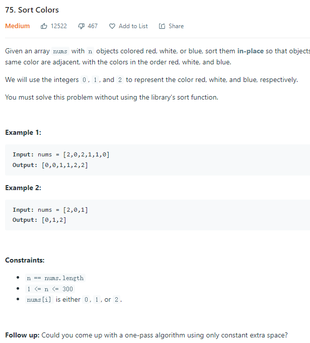

本题是经典的`「荷兰国旗问题」`，由计算机科学家 `Edsger W. Dijkstra` 首先提出。

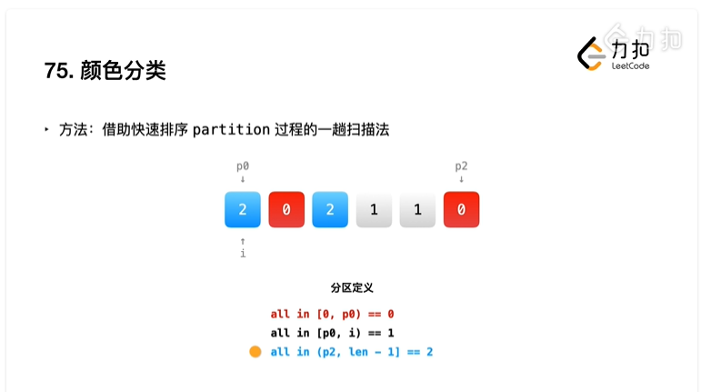


```js
// 解法一：单指针————采用两次遍历，第一次遍历将所有的0交换到数据头部，第二次遍历将所有的1交换到头部的0之后。
// 时间复杂度O(n)，空间复杂度O(1)
var sortColors = function(nums) {
    var len = nums.length;
    let ptr = 0;
    for (let i = 0; i < len; i++) {
        if (nums[i] === 0) {
            swap(nums, i, ptr);
            ++ptr;
        }
    }

    for (let i = ptr; i < len; i++) {
        if (nums[i] === 1) {
            swap(nums, i, ptr);
            ++ptr;
        }
    }

    return nums;
}


// 解法二：双指针法————可以额外使用一个指针，即用两个指针分别用来交换0和1
// 我们用指针 p0来交换0，p1交换1，初始值都为 0。当我们从左向右遍历整个数组时：
// 1. 如果找到了 1，那么将其与nums[p_1]

var sortColors = function(nums) {
    let p0 = 0, p1 = 0;
    for (let i = 0; i < nums.length; i++) {
        if (nums[i] === 1) {
            swap(nums, i, p1);
            ++p1;
        } else if (nums[i] === 0) {
            swap(nums, i, p0);
            if (p0 < p1) {
                swap(nums, i, p1);
            }
            ++p0;
            ++p1;
        }
    }

    return nums;
}

// 解法三：双指针法————可以考虑使用p0交换0，p2交换2；p0初始值为0，p2初始值为n-1；
// 由于此时其中一个指针p2是自右向左移动的，因此当我们自左至右遍历数组时，如果遍历位置超过了p2，就可以停止遍历了。
var sortColors = function(nums) {
    let len = nums.length,
        p0 = 0,
        p2 = len - 1;
    
    for (let i = 0; i <= p2; i++) {
        while (i <= p2 && nums[i] === 2) {
            swap(nums, i, p2);
            --p2;
        }

        if (nums[i] === 0) {
            swap(nums, i, p0);
            ++p0;
        }
    }
}


var sortColors = function(nums) {
    let twoI = nums.length - 1
    let zeroI = 0
    for (let i = 0; i <= twoI; i++) {
        if (nums[i] == 0) {
            [nums[i], nums[zeroI]] = [nums[zeroI], nums[i]]
            zeroI++
        } else if (nums[i] == 2) {
            [nums[i], nums[twoI]] = [nums[twoI], nums[i]]
            twoI--
            i--
        }
    }
};

var sortColors = function(nums) {
    let low = 0, mid = 0, high = nums.length - 1;
    
    while(mid <= high){
        switch(nums[mid]){
            case 0:
                [nums[low], nums[mid]] = [nums[mid], nums[low]];
                low++;
                mid++;
                break;
            case 1:
                mid++;
                break;
            case 2:
                [nums[mid], nums[high]] = [nums[high], nums[mid]];
                high--;
                break;
        }
    }
};


```

#### 215. 数组中第k个大的元素（Kth Largest Element in an Array）

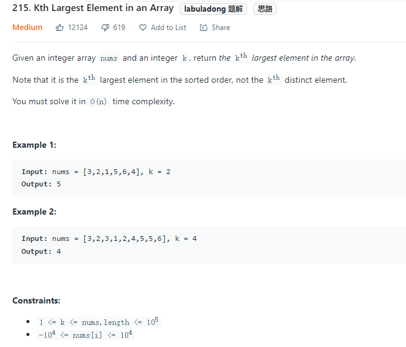

题目需要找出数组中第 K 大的元素，这问题`也可以使用快排的思路`。并且因为是找出第 K 大元素，所以在分离数组的过程中，可以找出需要的元素在哪边，然后只需要排序相应的一边数组就好。

> 我们知道快速排序的性能和「划分」出的子数组的长度密切相关。直观地理解如果每次规模为 n 的问题我们都划分成 `1` 和 `n−1`，每次递归的时候又向 n - 1 的集合中递归，这种情况是最坏的，时间代价是 `O(n ^ 2)`。我们可以`引入随机化来加速这个过程`，它的时间代价的期望是 `O(n)`，证明过程可以参考「《算法导论》9.2：期望为线性的选择算法」。

```js
// 快排
function swap(arr, i, j) {
    let tmp = arr[i];
    arr[i] = arr[j];
    arr[j] = tmp;
}

function quickSelect(a, l, r, index) {
    let q = randomPartition(a, l, r);
    if (q === index) {
        return a[q];
    } else {
        return q < index
            ? quickSelect(a, q + 1, r, index)
            : quickSelect(a, l, q - 1, index);
    }
}

function randomPartition(a, l, r) {
    let i = Math.floor(Math.random() * (r - l)) + l;
    swap(a, i, r);
    return partition(a, l, r);
}

function partition(arr, low, high) {
    let pivot = arr[high];
    let i = low - 1;
    for (let k = low; k < high; k++) {
        if (arr[k] < pivot) {
            swap(arr, ++i, k);
        }
    }

    swap(arr, i + 1, high);
    return i + 1;
}

var findKthLargest = function (nums, k) {
    return quickSelect(nums, 0, nums.length - 1, nums.length - k);
}

```


## 堆排序

> Heap sort is a comparison-based sorting technique based on `Binary Heap` data structure. It is `similar to the selection sort` where we first `find the minimum element` and place the minimum element at the beginning. Repeat the same process for the remaining elements.

堆排序是基于二叉堆数据结构实现的分类方法，实现过程与选择排序比较类似，首先选取一个最小（大）的元素，然后在剩余元素中重复该过程；二叉堆分为`大根堆`和`小根堆`


### 原理

堆排序的原理就是组成一个大根堆或者小根堆。以大根堆为例，某个节点的左边子节点索引是 `i * 2 + 1`，右边是 `i * 2 + 2`，父节点是 `(i - 1) /2`：

1. 首先遍历数组，判断该节点的父节点是否比他小，如果小就交换位置并继续判断，直到他的父节点比他大；
2. 重新以上操作 1，直到数组首位是最大值
3. 然后将首位和末尾交换位置并将数组长度减一，表示数组末尾已是最大值，不需要再比较大小
4. 对比左右节点哪个大，然后记住大的节点的索引并且和父节点对比大小，如果子节点大就交换位置
5. 重复以上操作 3 - 4 直到整个数组都是大根堆。


#### heapify如何工作

> `heapify`是从使用数组表示的二叉树创建堆数据结构的过程;它用于创建最小堆或最大堆。`从索引由n/2 - 1给出的非叶节点的第一个索引开始`。Heapify使用递归

Array = [1, 3, 5, 4, 6, 13, 10, 9, 8, 15, 17]
对应`完全二叉树`为:

               1
            /     \
           3        5
        /    \     /  \
      4      6   13    10
     / \    / \
    9   8  15  17

任务是从上述数组建立最大堆

总的节点数为11
从索引为`11 >> 1 - 1 = 4`的非叶子结点作为第一个索引开始，即nodeVal = 6
为构建堆，需要堆化这些元素`[1, 3, 5, 4, 6]`为倒序；

`Heapify 6`: 交换6和17

               1
            /     \
           3        5
        /    \     /  \
      4      17   13  10
     / \    /  \
    9   8  15   6

`Heapify 4`：交换4和9

               1
            /     \
           3        5
        /    \     /  \
      9      17   13  10
     / \    /  \
    4   8  15   6


`Heapify 5`：交换5和13

               1
            /     \
           3        13
        /    \     /  \
      9      17   5   10
     / \    /  \
    4   8  15   6


`Heapify 3`: 交换3和17，然后交换15和3

               1
            /     \
           17       13
        /    \     /  \
      9      15   5   10
     / \    /  \
    4   8  3    6

`Heapify 1`: 交换1和17，然后交换1和15，最后交换1和6

               17
            /      \
          15         13
         /    \      /  \
       9      6     5    10
      / \    /  \
    4   8  3    1


### 应用场景

1. Sort a nearly sorted (or K sorted) array
2. `k largest`(or smallest) elements in an array


### 详细流程

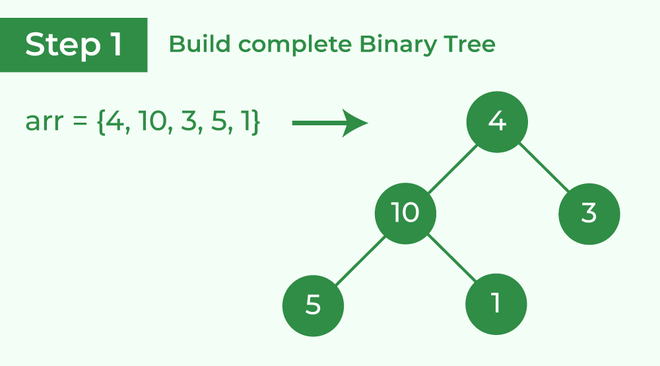 | 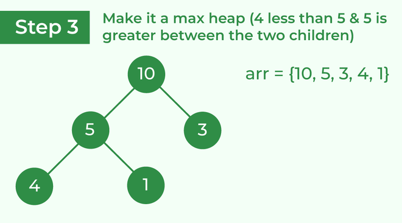
-|-
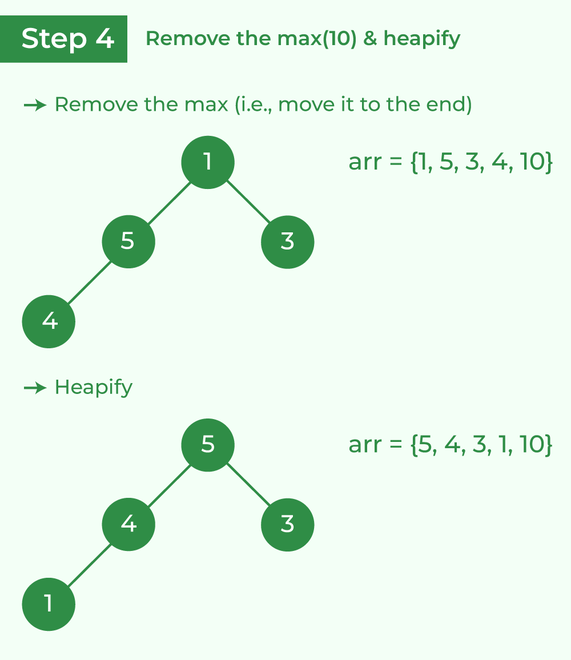 | 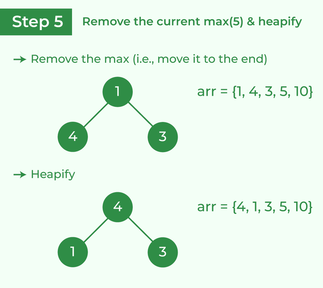
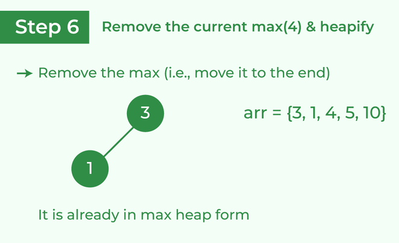 | 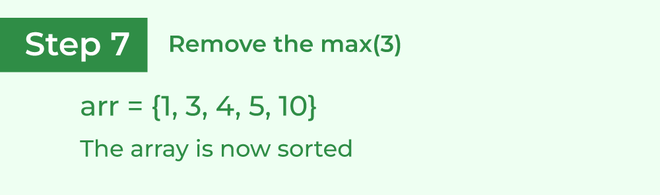


### 复杂度及稳定性

> 时间复杂度O(NlogN)，空间复杂度O(1)，不稳定排序；


### 代码实现

```js
// 大根堆
function heap(arr) {
    let len = arr.length;

    // 构建二叉堆
    // 从索引由n/2 - 1给出的非叶节点的第一个索引开始，逐个进行heapify
    for (let i = len >> 1 - 1; i >= 0; i--) {
        heapify(arr, len, i);
    }

    // 堆排序，将大根堆堆顶元素逐个交换到数组末尾，并继续对剩余元素（除去交换前的堆顶元素）堆化剩余数组，递归处理
    // 上一步已经构建完成二叉堆，这里进行堆排序（递增），通过依次将栈顶元素交换到尾端，这样每次循环后大根堆的根元素位被移动到数据末端；继续堆化后递归处理；最终得到一个递增序列
    for (let i = len - 1; i > 0; i--) {
        // Move current root to end
        var temp = arr[0];
        arr[0] = arr[i];
        arr[i] = temp;

        // call max heapify on the reduced heap
        heapify(arr, i, 0);
    }

    return arr;
}

// To heapify a subtree rooted with node i which is
// an index in arr[]. n is size of heap.
function heapify(arr, n, i) {
    var largest = i; // Initialize largest as root
    var l = 2 * i + 1; // left = 2*i + 1
    var r = 2 * i + 2; // right = 2*i + 2

    // If left child is larger than root
    if (l < n && arr[l] > arr[largest]) {
        largest = l;
    }

    // If right child is larger than largest so far
    if (r < n && arr[r] > arr[largest]) {
        largest = r;
    }

    // If largest is not root
    if (largest !== i) {
        var swap = arr[i];
        arr[i] = arr[largest];
        arr[largest] = swap;

        // Recursively heapify the affected sub-tree
        heapify(arr, n, largest);
    }
}

var arr = [12, 11, 13, 5, 6, 7];
var arr2 = [1, 3, 5, 4, 6, 13, 10, 9, 8, 15, 17]
console.log(heap(arr))
console.log(heap(arr2))

```

```js
// 实现大根堆
class MaxHeap {
    constructor() {
        this.heap = [];
    }

    size() {
        return this.heap.length;
    }

    empty() {
        return this.size() === 0;
    }

    add(item) {
        this.heap.push(item);
        this._shiftUp(this.size() - 1);
    }

    removeMax() {
        this._shiftDown(0);
    }

    getParentIndex(k) {
        return Math.floor((k - 1) / 2);
    }

    getLeftIndex(k) {
        return 2 * k + 1;
    }

    getRightIndex(k) {
        return 2 * k + 2;
    }

    _shiftUp(k) {
        // 如果当前节点比父节点大，则交换
        while (this.heap[k] > this.heap[this.getParentIndex(k)]) {
            this._swap(k, this.getParentIndex(k));
            // 继续向上查找
            k = this.getParentIndex(k);
        }
    }

    _shiftDown(k) {
        // 交换首尾并移除原根结点
        this._swap(k, this.size() - 1);
        this.heap.splice(this.size() - 1, 1);
        // 判断节点是否有做孩子，因为二叉堆的特性，有右必有左
        while (this.getLeftIndex(k) < this.size()) {
            let j = this.getLeftIndex(k);
            // 判断是否有右孩子，并且右孩子是否大于左孩子
            if (j + 1 < this.size() && this.heap[j + 1] > this.heap[j]) j++;
            // 判断父节点是否已经比子结点大
            if (this.heap[k] >= this.heap[j]) break;

            this._swap(k, j);
            k = j;
        }
    }

    _swap(a, b) {
        let tmp = this.heap[a];
        this.heap[a] = this.heap[b];
        this.heap[b] = tmp;
    }
}

const heap = new MaxHeap();
heap.add(12);
console.log(heap.heap); // [ 12 ]
heap.add(11);
console.log(heap.heap); // [ 12, 11 ]
heap.add(13);
console.log(heap.heap); // [ 13, 11, 12 ]
heap.add(5);
console.log(heap.heap); // [ 13, 11, 12, 5 ]
heap.add(6);
console.log(heap.heap); // [ 13, 11, 12, 5, 6 ]
heap.add(7);
console.log(heap.heap); // [ 13, 11, 12, 5, 6, 7 ]
heap.removeMax();
console.log(heap.heap); // [ 12, 11, 7, 5, 6 ]
heap.removeMax();
console.log(heap.heap); // [ 11, 6, 7, 5 ]
heap.removeMax();
console.log(heap.heap); // [ 7, 6, 5 ]

```


同样，可以利用小根堆实现递减排序，只需要修改`heapify`函数：
```js
function heapify(arr, n, i) {
	let min = i;
	let l = 2 * i + 1;
	let r = 2 * i + 2;
	
	if (l < n && arr[l] < arr[min]) {
		min = l;
	}
	
	if (r < n && arr[r] < arr[min]) {
		min = r;
	}
	
	if (i !== min) {
		let tmp = arr[i];
		arr[i] = arr[min];
		arr[min] = tmp;
		
		heapify(arr, n, min);
	}
}

```


## 系统自带排序

> 每个语言的排序内部实现都是不同的。

> `对于 JS 来说，数组长度大于 10 会采用快排，否则使用插入排序 源码实现` 。选择插入排序是因为虽然时间复杂度很差，但是在数据量很小的情况下和 O(N * logN)相差无几，然而插入排序需要的常数时间很小，所以相对别的排序来说更快。

> 对于 Java 来说，还会考虑内部的元素的类型。对于存储对象的数组来说，会采用稳定性好的算法。稳定性的意思就是对于相同值来说，相对顺序不能改变。


## 桶排序

桶排序是一种线性时间的排序算法。

`每个桶代表一个区间范围`，里面可以`承载一个或多个元素`。

以下列的非整数数列为例：
```js
4.5, 0.84, 3.25, 2.18, 0.5
```

`第一步`：创建桶，并确定每一个桶的区间范围。

创建的桶数量等于原始数列的元素数量，除`最后一个桶只包含数列最大`之外，`前面各个桶的区间按照比例`来确定。

```js
区间跨度 = (最大值 - 最小值) / (桶的数量 - 1)
```

`第二步`：遍历原始数列，把元素对号入座放入各个桶中。

|元素|.84<br>0.5|2.18|3.25|| 4.5|
|-|-|-|-|-|-|
|区间|[0.5, 1.5)|[1.5, 2.5)|[2.5, 3.5)|[3.5, 4.5)|[4.5, 4.5]|

`第三步`：对每个桶内部的元素分别进行排序

|元素|.5<br>0.84|2.18|3.25|| 4.5|
|-|-|-|-|-|-|
|区间|[0.5, 1.5)|[1.5, 2.5)|[2.5, 3.5)|[3.5, 4.5)|[4.5, 4.5]|

第四步：遍历所有的桶，输出所有元素

```js
0.5, 0.84, 2.18, 3.25, 4.5
```

### 代码实现

```js


```


## 基数排序


## 计数排序

假设有20个随机整数，取值范围为0~10，要求用最快的速度把20个整数从小到大进行排序。

假设数组如下：
```js
arr = [9, 3, 5, 4, 9, 1, 2, 7, 8, 1, 3, 6, 5, 3, 4, 0, 10, 9, 7, 9];
```
由于这些数取值范围都为0~10，我们可以建立一个长度为11的统计数组，下标为0~10；遍历数组让值等于数组索引的元素放入对应位置并从0计数，排序后的统计数组状态为：

|计数|1|2|1|3|2|2|1|2|1|4|1|
|-|-|-|-|-|-|-|-|-|-|-|-|
|索引|0|1|2|3|4|5|6|7|8|9|10|

遍历统计数组，即可得到排序后的数组

### 代码实现
```js
function countSort(arr: number[]): number[] {
    // 1. 得到数组最大值
    let max = arr[0];
    let res = []
    for (let i = 1; i < arr.length; i++) {
        if (arr[i] > max) {
            max = arr[i];
        }
    }

    // 2. 根据数组最大值确定统计数组的长度
    const countArr = new Array(max + 1).fill(0);

    // 3. 遍历数组，填充统计数组
    for (let i = 0; i < arr.length; i++) {
        if (countArr[arr[i]]) {
            countArr[arr[i]]++;
        } else {
            countArr[arr[i]] = 1;
        }
    }
    // 遍历统计数组，输出结果
    for (let i = 0; i < countArr.length; i++) {
        for (let j = 0; j < countArr[i]; j++) {
            res.push(i);
        }
    }

    return res;
}

const arr = [9, 3, 5, 4, 9, 1, 2, 7, 8, 1, 3, 6, 5, 3, 4, 0, 10, 9, 7, 9];
countSort(arr); // [0, 1, 1, 2, 3, 3, 3, 4, 4, 5, 5, 6, 7, 7, 8, 9, 9, 9, 9, 10]
```


> 计数排序适用于`一定范围`内的`整数`排序，时间复杂度为O(n)，空间复杂度为O(n)；


### 计数排序的优化

上面我们以数组的最大值作为统计数组的长度，这样其实是有问题的，如果一组数聚集在较高数值，比如`90, 91, 92, 93, 96`，以上面的方式创建方式会造成统计数组的空间浪费。所以我们需要更合理的创建统计数组的方式

> 一般我们可以使用`数组的最大值 - 数组最小值 + 1`作为统计数组的长度。同时，数组的最小值作为偏移量用于计算整数在统计数组中的下标。

还是以`90, 91, 92, 93, 96`为例，创建的统计数组长度为`96 - 90 + 1 = 7`，`93`对应下标为`93-90=3`；

上面计数排序的另一个问题是：在实际问题中，比如这是学生考试成绩，会无法区分同分的学生分别是谁

|姓名|成绩|
|-|-|
|小灰|90|
|大黄|99|
|小红|95|
|小白|94|
|小绿|95|

上面的数据得到的统计数组为
|计数|1|0|0|0|1|2|0|0|0|1|
|-|-|-|-|-|-|-|-|-|-|-|
|索引|0|1|2|3|4|5|6|7|8|9|

我们做简单的变形，从统计数组第二个元素开始，每个元素都加上前边的所有元素之和。

|计数|1|1|1|1|2|4|4|4|4|5|
|-|-|-|-|-|-|-|-|-|-|-|
|索引|0|1|2|3|4|5|6|7|8|9|


> 这样相加的目的，是让统计数组存储的元素值，等于相应整数的最终排序位置的序号。

然后创建一个空数组存放已排序数组，并从后向前遍历原数组。

#### 第一步，遍历成绩表最后一行的小绿同学的成绩

95对应countArr下标为5的元素，值为4，表示小绿的成绩排在第4位。`同时，给countArr下标为5的元素值减1`，从4变为3，代表下次再遇到95分的成绩时，排名为第3。

countArr
|计数|1|1|1|1|2|3|4|4|4|5|
|-|-|-|-|-|-|-|-|-|-|-|
|索引|0|1|2|3|4|5|6|7|8|9|

|name||||小绿||
|-|-|-|-|-|-|
|value||94|95|95||
|index|0|1|2|3|4|

#### 继续遍历倒数第二行小白同学的成绩

小白成绩为94，找到countArr下标为4的元素，值为2，代表小白的成绩排名最终位置在第2位。

同时对应countArr下标为4的元素对应值减1，从2变为1，代表下次再遇到94分时（实际上遇不到了）最终排名为1。

countArr
|计数|1|1|1|1|1|3|4|4|4|5|
|-|-|-|-|-|-|-|-|-|-|-|
|索引|0|1|2|3|4|5|6|7|8|9|

|name||小白||小绿||
|-|-|-|-|-|-|
|value||94|95|95||
|index|0|1|2|3|4|

#### 继续遍历倒数第三行小红同学的成绩

小红成绩为95，找到countArr下标为5的元素怒，值为3，代表小红成绩排名位置为第3位。

同时，给countArr下标为5的元素值减1，从3变为2，代表下次再遇到95的成绩时（实际上不会遇到了）最终排名是第2位。

countArr
|计数|1|1|1|1|1|2|4|4|4|5|
|-|-|-|-|-|-|-|-|-|-|-|
|索引|0|1|2|3|4|5|6|7|8|9|

sortedArr
|name||小白|小红|小绿||
|-|-|-|-|-|-|
|value||94|95|95||
|index|0|1|2|3|4|

类似地，可以遍历处理所有元素并排序。

> 需要注意的是，通过这样的优化，最后我们得到的新版本的计数排序属于`稳定排序`。

#### 代码实现

```js
function countSort2(arr: number[]): number[] {
    let max = arr[0],
        min = arr[0];
    const len = arr.length;
    const res = new Array(len).fill(null);
    
    // 1. 获取数组最大最小值
    for (let i = 0; i < len; i++) {
        if (arr[i] > max) {
            max = arr[i];
        }
        if (arr[i] < min) {
            min = arr[i];
        }
    }

    const d = max - min;

    // 2. 创建统计数组并遍历数组进行填充；
    const countArr = new Array(d + 1).fill(0);
    for (let i = 0; i < len; i++) {
        countArr[arr[i] - min]++;
    }

    // 3. 为统计数组做变形
    for (let i = 1; i < countArr.length; i++) {
        countArr[i] += countArr[i - 1];
    }

    // 4. 倒序遍历原始数组，从统计数组中找出正确位置，输出到结果数组
    for (let i = arr.length - 1; i >= 0; i--) {
        let index = countArr[arr[i] - min];
        countArr[arr[i] - min]--;
        res[index] = arr[i];
    }

    return arr;
}

```


---
# 动态规划

动态规划背后的基本思想非常简单。就是将一个问题拆分为子问题，一般来说这些子问题都是非常相似的，那么我们可以通过只解决一次每个子问题来达到减少计算量的目的。

一旦得出每个子问题的解，就存储该结果以便下次使用

> 本质就是问题的拆分，每个子问题的解决方案与问题本身是相似的，所以可以通过得到子问题的解来解决问题本身。

## 斐波那契数列

### 定义

指的是从0和1起始的一个数列，后面每个数都是前两个数之和

```js
0 1 1 2 3 5 8 13, 21, 34, 55, 89...
```

### 方案

根据定义我们很容易想到使用递归求解，主要关系是：
```js
fib(n) = fib(n - 1) + fib(n - 2);
```

所以我们很容易得到递归的代码：

```js
function fib(n) {
    if (n >= 0 && n < 2) return n;
    return fib(n - 1) + fib(n - 2);
}

```

> 递归算法的时间复杂度本质上是看：`递归的次数 * 每次递归中的操作数`

以上代码已经可以完美的解决问题。`但是以上解法却存在很严重的性能问题`，当 n 越大的时候，需要的时间是指数增长的，这时候就可以通过动态规划来解决这个问题。


`动态规划的本质其实就是两点`:
1. 自顶向上分解子问题
2. 通过变量存储已经计算过的值

根据以上两点，斐波那契数列的动态规划解法也就出来了

1. 斐波那契数列从0和1,开始，这是最底层的子问题
2. 通过数组来存储每一位所对应的菲波那切数列的值

```js
function fib(n) {
    let arr = new Array(n + 1).fill(null);

    arr[0] = 0;
    arr[1] = 1;
    
    for (let i = 2; i<= n; i++) {
        arr[i] = arr[i - 1] + arr[i - 2];
    }

    return arr[n];
}
```

## 0 - 1 背包问题

> 该问题可以描述为：给定一组物品，每种物品都有自己的重量和价格，在`限定的总重量`内，我们如何选择，才能使得物品的`总价格最高`。每个物品只能`放入至多一次`。

| 物品ID/重量|价值
|-|-|
|1|3
|2|7|
|3|12|

对于一个总容量为 5 的背包来说，我们可以放入重量 2 和 3 的物品来达到背包内的物品总价值最高。

对于这个问题来说，`子问题就两个，分别是放物品和不放物品`，可以通过以下表格来理解子问题

| 物品ID/剩余容量|0|1|2|3|4|5|
|-|-|-|-|-|-|-|
|1|0|3|3|3|3|3|
|2|0|3|7|10|10|10|
|3|0|3|7|12|15|19|

直接来分析能放三种物品的情况，也就是最后一行：

- 容量小于3时，不能取商品3，所以只能取上一行的数据（第二行）

- 容量等于3时，分是否放入商品3考虑：
    - 不放物品 3 的情况下，总价值为 10
    - 放入物品 3 的情况下，总价值为 12，所以应该放入物品 3

- 容量等于4时，分是否放入商品3考虑：
    - 不放物品 3 的情况下，总价值为 10
    - 放入物品 3 的情况下，总价值为 15（加商品1），所以应该放入物品 3

- 容量等于5时，分是否放入商品3考虑：
    - 不放物品 3 的情况下，总价值为 10
    - 放入物品 3 的情况下，总价值为 19（加商品2），所以应该放入物品 3

以下代码对照上表更容易理解

```js
/**
 * @param {*} w 物品重量
 * @param {*} v 物品价值
 * @param {*} C 总容量
 * @returns
 */
function knapsack(w, v, C) {
  let length = w.length
  if (length === 0) return 0

  // 对照表格，生成的二维数组，第一维代表物品，第二维代表背包剩余容量
  // 第二维中的元素代表背包物品总价值
  let array = new Array(length).fill(new Array(C + 1).fill(null))

  // 完成底部子问题的解
  for (let i = 0; i <= C; i++) {
    // 对照表格第一行， array[0] 代表物品 1
    // i 代表剩余总容量
    // 当剩余总容量大于物品 1 的重量时，记录下背包物品总价值，否则价值为 0
    array[0][i] = i >= w[0] ? v[0] : 0
  }

  // 自底向上开始解决子问题，从物品 2 开始
  for (let i = 1; i < length; i++) {
    for (let j = 0; j <= C; j++) {
      // 这里求解子问题，分别为不放当前物品和放当前物品
      // 先求不放当前物品的背包总价值，这里的值也就是对应表格中上一行对应的值
      array[i][j] = array[i - 1][j]
      // 判断当前剩余容量是否可以放入当前物品
      if (j >= w[i]) {
        // 可以放入的话，就比大小
        // 放入当前物品和不放入当前物品，哪个背包总价值大
        array[i][j] = Math.max(array[i][j], v[i] + array[i - 1][j - w[i]])
      }
    }
  }
  return array[length - 1][C]
}
```

## 最长递增子序列

最长递增子序列意思是在一组数字中，找出最长一串递增的数字，比如

0, 3, 4, 17, 2, 8, 6, 10

对于以上这串数字来说，最长递增子序列就是 `0, 3, 4, 8, 10`，可以通过以下表格更清晰的理解

|数字|0|3|4|17|2|8|6|10|
|-|-|-|-|-|-|-|-|-|
|长度|1|2|3|4 |2|4|4|5|

通过以上表格可以很清晰的发现一个规律，`找出刚好比当前数字小的数，并且在小的数组成的长度基础上加一`。

这个问题的动态思路解法很简单，直接上代码

```js
function lis(n) {
  if (n.length === 0) return 0
  // 创建一个和参数相同大小的数组，并填充值为 1
  let array = new Array(n.length).fill(1)
  // 从索引 1 开始遍历，因为数组已经所有都填充为 1 了
  for (let i = 1; i < n.length; i++) {
    // 从索引 0 遍历到 i
    // 判断索引 i 上的值是否大于之前的值
    for (let j = 0; j < i; j++) {
      if (n[i] > n[j]) {
        array[i] = Math.max(array[i], 1 + array[j])
      }
    }
  }
  let res = 1
  for (let i = 0; i < array.length; i++) {
    res = Math.max(res, array[i])
  }
  return res
}
```

# 字符串相关

在字符串相关算法中，`Trie` 树可以解决解决很多问题，同时具备良好的空间和时间复杂度，比如以下问题：

- 词频统计
- 前缀匹配


# 参考文献
1. [前端进阶之道-计算机通识](https://yuchengkai.cn/docs/cs/dataStruct.html)
2. [geeksforgeeks sort](https://www.geeksforgeeks.org/heap-sort/)
3. [漫画：什么是希尔排序？](https://zhuanlan.zhihu.com/p/87781731)
4. [【算法】排序算法之归并排序](https://zhuanlan.zhihu.com/p/124356219)
5. [常见数组排序](https://blog.csdn.net/luofeng457/article/details/103073124)