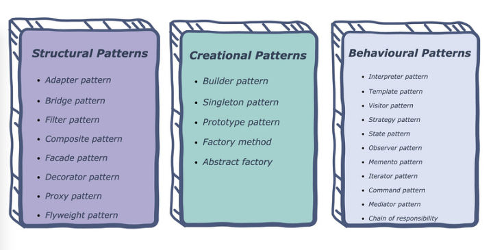
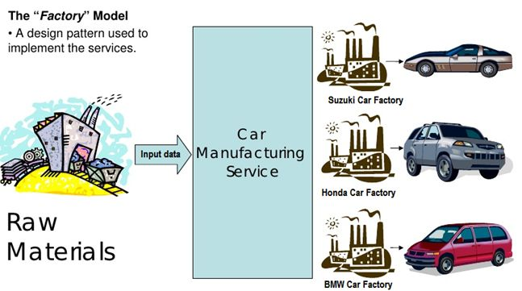
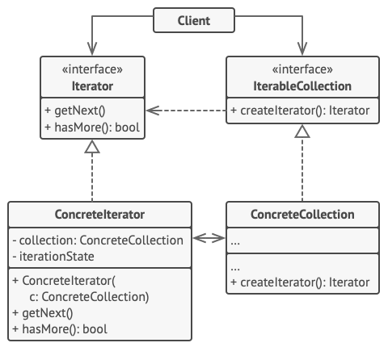
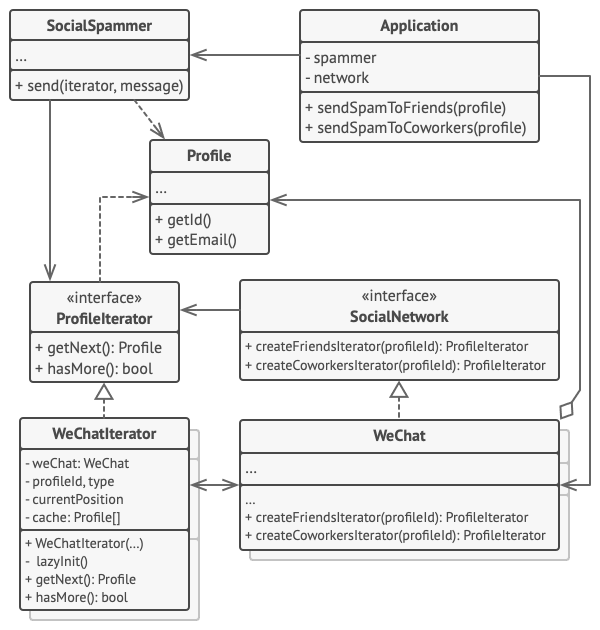
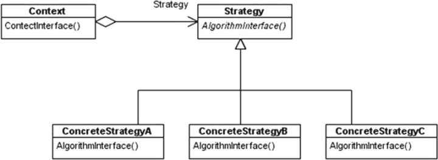

# 设计模式

## 定义

> Design patterns are typical solutions to commonly occurring problems in software design. They are like pre-made blueprints that you can customize to solve a recurring design problem in your code.

设计模式是软件设计中常见问题的典型解决方案。它们就像预先定制的蓝图，你可以通过定制去解决代码中反复发生的设计问题。

> You can’t just find a pattern and copy it into your program, the way you can with off-the-shelf functions or libraries. The pattern is not a specific piece of code, but a general concept for solving a particular problem. You can follow the pattern details and implement a solution that suits the realities of your own program.

你不能像使用现成的函数或库那样，直接找一个模式并将其复制到你的项目中。`模式不是一段特定的代码，而是用于解决特定问题的一般概念`。你可以遵循模式细节并且实现适合你项目实际情况的解决方案。


## 设计模式分类



### 创建模式（Creational patterns）

> These patterns provide various object creation mechanisms, which increase flexibility and reuse of existing code.

该模式提供了各种对象的创建机制，增加了已有代码的灵活性和重用性。

- 工厂方法（Factory Method）
- 单例模式（Singleton）
- 抽象工厂（Abstract Factory）
- 生成器模式（Builder）
- 原型模式（Prototype）

### 结构模式（structural patterns）

> These patterns explain how to assemble objects and classes into larger structures while keeping these structures flexible and efficient.

这些模式解释了如何将对象和类组装成更大的结构，同时保持这些结构的灵活性和效率。

- 代理模式（Proxy）
- 外观模式（Facade）
- 适配器模式（Adapter）
- 桥接模式（Bridge）
- 组合模式（Composite）
- 装饰模式（Decorator）
- 享元模式（Flyweight）


### 行为模式（behavioral patterns）

> These patterns are concerned with algorithms and the assignment of responsibilities between objects.

这类模式与算法和对象间的职责分配有关

- 策略模式（Strategy）
- 观察者模式（Observer）
- 访问者模式（Visitor）
- 迭代器模式（Iterator）
- 中介者模式（Mediator）
- 模板模式（Template Method）
- 职责链模式（Chain of Responsibility）
- 命令模式（Command）
- 备忘录模式（Memento）
- 状态模式（State）


## 工厂模式

> Factory Method is a creational design pattern that provides an interface for creating objects in a superclass, but allows subclasses to alter the type of objects that will be created.

工厂模式是一种创建型设计模式，其在父类提供了一个创建对象的方法，允许子类决定实例化对象的类型。

### 适用场景

> `什么场景适合应用工厂模式而不是直接 new 一个对象呢`？当构造函数过多不方便管理，且需要创建的对象之间存在某些关联（有`同一个父类`、`实现同一个接口`等）时，不妨使用工厂模式。工厂模式提供一种集中化、统一化的方式，`避免了分散创建对象导致的代码重复`、灵活性差的问题。


- 当你在编写代码的过程中，如果无法预知对象确切类别及其依赖关系时， 可使用工厂方法。
- 如果你希望用户能扩展你软件库或框架的内部组件， 可使用工厂方法。
- 如果你希望复用现有对象来节省系统资源， 而不是每次都重新创建对象， 可使用工厂方法。


### 工厂方法模式结构


1. `产品`（Prod­uct） 将会对接口进行声明。 对于所有由创建者及其子类构建的对象， 这些接口都是通用的
2. `具体产品` （Con­crete Prod­ucts） 是产品接口的不同实现。
3. `创建者` （Cre­ator） 类声明返回产品对象的工厂方法。 该方法的返回对象类型必须与产品接口相匹配。

    你可以将工厂方法声明为抽象方法， 强制要求每个子类以不同方式实现该方法。 或者， 你也可以在基础工厂方法中返回默认产品类型。

    注意，尽管它的名字是创建者，但它最主要的职责并不是创建产品。一般来说，`创建者类包含一些与产品相关的核心业务逻辑`。工厂方法将这些逻辑处理从具体产品类中分离出来。

4. `具体创建者`（Con­crete Cre­ators）将会`重写基础工厂方法`， 使其返回不同类型的产品。

    注意， 并不一定每次调用工厂方法都会创建新的实例。 工厂方法也可以返回缓存、 对象池或其他来源的已有对象。


### 实现方式

1. 让所有产品都遵循同一接口。 该接口必须声明对所有产品都有意义的方法。

2. 在创建类中添加一个空的工厂方法。 该方法的返回类型必须遵循通用的产品接口。

3. 在创建者代码中找到对于产品构造函数的所有引用。 将它们依次替换为对于工厂方法的调用， 同时将创建产品的代码移入工厂方法。

`你可能需要在工厂方法中添加临时参数来控制返回的产品类型`。

工厂方法的代码看上去可能非常糟糕。 其中可能会有复杂的 switch分支运算符， 用于选择各种需要实例化的产品类。 但是不要担心， 我们很快就会修复这个问题。

4. 现在， 为工厂方法中的每种产品编写一个创建者子类， 然后在子类中重写工厂方法， 并将基本方法中的相关创建代码移动到工厂方法中。

5. 如果应用中的产品类型太多， 那么为每个产品创建子类并无太大必要， 这时你也可以在子类中复用基类中的控制参数。

例如， 设想你有以下一些层次结构的类。 基类 邮件及其子类 航空邮件和 陆路邮件 ； ​ 运输及其子类 飞机, 卡车和 火车 。 ​ 航空邮件仅使用 飞机对象， 而 陆路邮件则会同时使用 卡车和 火车对象。 你可以编写一个新的子类 （例如 火车邮件 ） 来处理这两种情况， 但是还有其他可选的方案。 客户端代码可以给 陆路邮件类传递一个参数， 用于控制其希望获得的产品。

如果代码经过上述移动后， 基础工厂方法中已经没有任何代码， 你可以将其转变为抽象类。 如果基础工厂方法中还有其他语句， 你可以将其设置为该方法的默认行为。


### Pseudocode


```js

// 创建者类声明的工厂方法必须返回一个产品类的对象。创建者的子类通常会提供
// 该方法的实现。
class Dialog is
    // 创建者还可提供一些工厂方法的默认实现。
    abstract method createButton():Button

    // 请注意，创建者的主要职责并非是创建产品。其中通常会包含一些核心业务
    // 逻辑，这些逻辑依赖于由工厂方法返回的产品对象。子类可通过重写工厂方
    // 法并使其返回不同类型的产品来间接修改业务逻辑。
    method render() is
        // 调用工厂方法创建一个产品对象。
        Button okButton = createButton()
        // 现在使用产品。
        okButton.onClick(closeDialog)
        okButton.render()


// 具体创建者将重写工厂方法以改变其所返回的产品类型。
class WindowsDialog extends Dialog is
    method createButton():Button is
        return new WindowsButton()

class WebDialog extends Dialog is
    method createButton():Button is
        return new HTMLButton()


// 产品接口中将声明所有具体产品都必须实现的操作。
interface Button is
    method render()
    method onClick(f)

// 具体产品需提供产品接口的各种实现。
class WindowsButton implements Button is
    method render(a, b) is
        // 根据 Windows 样式渲染按钮。
    method onClick(f) is
        // 绑定本地操作系统点击事件。

class HTMLButton implements Button is
    method render(a, b) is
        // 返回一个按钮的 HTML 表述。
    method onClick(f) is
        // 绑定网络浏览器的点击事件。


class Application is
    field dialog: Dialog

    // 程序根据当前配置或环境设定选择创建者的类型。
    method initialize() is
        config = readApplicationConfigFile()

        if (config.OS == "Windows") then
            dialog = new WindowsDialog()
        else if (config.OS == "Web") then
            dialog = new WebDialog()
        else
            throw new Exception("错误！未知的操作系统。")

    // 当前客户端代码会与具体创建者的实例进行交互，但是必须通过其基本接口
    // 进行。只要客户端通过基本接口与创建者进行交互，你就可将任何创建者子
    // 类传递给客户端。
    method main() is
        this.initialize()
        dialog.render()
```


### Conceptual Example

```js
/**
 * The Creator class declares the factory method that is supposed to return an
 * object of a Product class. The Creator's subclasses usually provide the
 * implementation of this method.
 */
abstract class Creator {
    /**
     * Note that the Creator may also provide some default implementation of the
     * factory method.
     */
    public abstract factoryMethod(): Product;

    /**
     * Also note that, despite its name, the Creator's primary responsibility is
     * not creating products. Usually, it contains some core business logic that
     * relies on Product objects, returned by the factory method. Subclasses can
     * indirectly change that business logic by overriding the factory method
     * and returning a different type of product from it.
     */
    public someOperation(): string {
        // Call the factory method to create a Product object.
        const product = this.factoryMethod();
        // Now, use the product.
        return `Creator: The same creator's code has just worked with ${product.operation()}`;
    }
}

/**
 * Concrete Creators override the factory method in order to change the
 * resulting product's type.
 */
class ConcreteCreator1 extends Creator {
    /**
     * Note that the signature of the method still uses the abstract product
     * type, even though the concrete product is actually returned from the
     * method. This way the Creator can stay independent of concrete product
     * classes.
     */
    public factoryMethod(): Product {
        return new ConcreteProduct1();
    }
}

class ConcreteCreator2 extends Creator {
    public factoryMethod(): Product {
        return new ConcreteProduct2();
    }
}

/**
 * The Product interface declares the operations that all concrete products must
 * implement.
 */
interface Product {
    operation(): string;
}

/**
 * Concrete Products provide various implementations of the Product interface.
 */
class ConcreteProduct1 implements Product {
    public operation(): string {
        return '{Result of the ConcreteProduct1}';
    }
}

class ConcreteProduct2 implements Product {
    public operation(): string {
        return '{Result of the ConcreteProduct2}';
    }
}

/**
 * The client code works with an instance of a concrete creator, albeit through
 * its base interface. As long as the client keeps working with the creator via
 * the base interface, you can pass it any creator's subclass.
 */
function clientCode(creator: Creator) {
    // ...
    console.log('Client: I\'m not aware of the creator\'s class, but it still works.');
    console.log(creator.someOperation());
    // ...
}

/**
 * The Application picks a creator's type depending on the configuration or
 * environment.
 */
console.log('App: Launched with the ConcreteCreator1.');
clientCode(new ConcreteCreator1());
console.log('');

console.log('App: Launched with the ConcreteCreator2.');
clientCode(new ConcreteCreator2());
```


### Demo
以下图为例，构建一个简单的汽车工厂来生产汽车




```js
// 汽车构造函数
function SuzukiCar(color) {
  this.color = color;
  this.brand = 'Suzuki';
}

// 汽车构造函数
function HondaCar(color) {
  this.color = color;
  this.brand = 'Honda';
}

// 汽车构造函数
function BMWCar(color) {
  this.color = color;
  this.brand = 'BMW';
}

// 汽车品牌枚举
const BRANDS = {
  suzuki: 1,
  honda: 2,
  bmw: 3
}

/**
 * 汽车工厂
 */
function CarFactory() {
  this.create = function (brand, color) {
    switch (brand) {
      case BRANDS.suzuki:
        return new SuzukiCar(color);
      case BRANDS.honda:
        return new HondaCar(color);
      case BRANDS.bmw:
        return new BMWCar(color);
      default:
        break;
    }
  }
}


const carFactory = new CarFactory();
const cars = [];

cars.push(carFactory.create(BRANDS.suzuki, 'brown'));
cars.push(carFactory.create(BRANDS.honda, 'grey'));
cars.push(carFactory.create(BRANDS.bmw, 'red'));

function say() {
  console.log(`Hi, I am a ${this.color} ${this.brand} car`);
}

for (const car of cars) {
  say.call(car);
}

// Hi, I am a brown Suzuki car
// Hi, I am a grey Honda car
// Hi, I am a red BMW car
```

<br/>

### 工厂模式优缺点
- 你可以避免`创建者`和`具体产品`之间的紧密耦合。
- `单一职责`原则。 你可以将产品创建代码放在程序的单一位置， 从而使得代码更容易维护。
- `开闭原则`。 无需更改现有客户端代码， 你就可以在程序中引入新的产品类型。

---

## 单例模式

> Singleton is a creational design pattern that lets you ensure that a class has only one instance, while providing a global access point to this instance.

单例模式是一个创建型设计模式，可以让你确保一个类只有一个实例，同时提供该实例的一个全局访问点。

### 实现方式
1. 在类中添加一个私有静态成员变量用于保存单例实例。
2. 声明一个公有静态构建方法用于获取单例实例。
3. 在静态方法中实现“延迟初始化”。该方法会在首次被调用时创建一个新对象，并将其存储在静态成员变量中。伺候该方法每次被调用时都返回该实例。
4. 将类的构造函数设为私有。类的静态方法仍能调用构造函数，但是其他对象不能调用。
5. 检查客户端代码，将对单例的构造函数的调用替换为对其静态构建方法的调用。

### 适用场景
- 如果程序中的某个类对于所有客户端只有一个可用的实例，可以使用单例模式。

    单例模式禁止通过除特殊构建方法以外的任何方式来创建自身类的对象。 该方法可以创建一个新对象， 但如果该对象已经被创建， 则返回已有的对象。

- 如果你需要更加严格地控制全局变量， 可以使用单例模式。

    单例模式与全局变量不同， 它保证类只存在一个实例。 除了单例类自己以外， 无法通过任何方式替换缓存的实例。

    请注意， 你可以随时调整限制并设定生成单例实例的数量， 只需修改 获取实例方法， 即 getInstance 中的代码即可实现。


### 真实世界类比
`政府是单例模式的一个很好的示例`。 一个国家只有一个官方政府。 不管组成政府的每个人的身份是什么，​“某政府” 这一称谓总是鉴别那些掌权者的全局访问节点。

### 优缺点

#### 优点

- 你可以保证一个类只有一个实例。
- 你获得了一个指向该实例的全局访问节点。
- 仅在首次请求单例对象时对其进行初始化。

#### 缺点
- 违反了单依职责原则，该模式同时解决了两个问题。
- 单元测试困难：因为许多测试框架以基于继承的方式创建模拟对象。 由于单例类的构造函数是私有的， 而且绝大部分语言无法重写静态方法， 所以你需要想出仔细考虑模拟单例的方法。 要么干脆不编写测试代码， 或者不使用单例模式。—


### 与其他模式的关系

- `外观模式`类通常可以转换为`单例模式`类， 因为在大部分情况下一个外观对象就足够了。
- `抽象工厂模式`、 `生成器模式`和`原型模式`都可以用`单例`来实现。


### Demo

```js
/**
 * The Singleton class defines the `getInstance` method that lets clients access
 * the unique singleton instance.
 */
class Singleton {
    private static instance: Singleton;

    /**
     * The Singleton's constructor should always be private to prevent direct
     * construction calls with the `new` operator.
     */
    private constructor() { }

    /**
     * The static method that controls the access to the singleton instance.
     *
     * This implementation let you subclass the Singleton class while keeping
     * just one instance of each subclass around.
     */
    public static getInstance(): Singleton {
        if (!Singleton.instance) {
            Singleton.instance = new Singleton();
        }

        return Singleton.instance;
    }

    /**
     * Finally, any singleton should define some business logic, which can be
     * executed on its instance.
     */
    public someBusinessLogic() {
        // ...
    }
}

/**
 * The client code.
 */
function clientCode() {
    const s1 = Singleton.getInstance();
    const s2 = Singleton.getInstance();

    if (s1 === s2) {
        console.log('Singleton works, both variables contain the same instance.');
    } else {
        console.log('Singleton failed, variables contain different instances.');
    }
}

clientCode();
```

---


## 原型模式

原型和原型链是 JS 必备的基础知识，还扩展了 JS 对象属性描述符。

> 原型模式是一种创建型设计模式，使你能够复制已有对象，而又无需使代码依赖它们所属的类。

### 真实世界类比


### 伪代码

在本例中， 原型模式能让你生成完全相同的几何对象副本， 同时无需代码与对象所属类耦合。

```js
// 基础原型。
abstract class Shape is
    field X: int
    field Y: int
    field color: string

    // 常规构造函数。
    constructor Shape() is
        // ……

    // 原型构造函数。使用已有对象的数值来初始化一个新对象。
    constructor Shape(source: Shape) is
        this()
        this.X = source.X
        this.Y = source.Y
        this.color = source.color

    // clone（克隆）操作会返回一个形状子类。
    abstract method clone():Shape


// 具体原型。克隆方法会创建一个新对象并将其传递给构造函数。直到构造函数运
// 行完成前，它都拥有指向新克隆对象的引用。因此，任何人都无法访问未完全生
// 成的克隆对象。这可以保持克隆结果的一致。
class Rectangle extends Shape is
    field width: int
    field height: int

    constructor Rectangle(source: Rectangle) is
        // 需要调用父构造函数来复制父类中定义的私有成员变量。
        super(source)
        this.width = source.width
        this.height = source.height

    method clone():Shape is
        return new Rectangle(this)


class Circle extends Shape is
    field radius: int

    constructor Circle(source: Circle) is
        super(source)
        this.radius = source.radius

    method clone():Shape is
        return new Circle(this)


// 客户端代码中的某个位置。
class Application is
    field shapes: array of Shape

    constructor Application() is
        Circle circle = new Circle()
        circle.X = 10
        circle.Y = 10
        circle.radius = 20
        shapes.add(circle)

        Circle anotherCircle = circle.clone()
        shapes.add(anotherCircle)
        // 变量 `anotherCircle（另一个圆）`与 `circle（圆）`对象的内
        // 容完全一样。

        Rectangle rectangle = new Rectangle()
        rectangle.width = 10
        rectangle.height = 20
        shapes.add(rectangle)

    method businessLogic() is
        // 原型是很强大的东西，因为它能在不知晓对象类型的情况下生成一个与
        // 其完全相同的复制品。
        Array shapesCopy = new Array of Shapes.

        // 例如，我们不知晓形状数组中元素的具体类型，只知道它们都是形状。
        // 但在多态机制的帮助下，当我们在某个形状上调用 `clone（克隆）`
        // 方法时，程序会检查其所属的类并调用其中所定义的克隆方法。这样，
        // 我们将获得一个正确的复制品，而不是一组简单的形状对象。
        foreach (s in shapes) do
            shapesCopy.add(s.clone())

        // `shapesCopy（形状副本）`数组中包含 `shape（形状）`数组所有
        // 子元素的复制品。
```

---

## 观察者模式

> 观察者模式是一种行为设计模式， 允许你定义一种订阅机制， 可在对象事件发生时通知多个 “观察” 该对象的其他对象。


### 观察者模式结构


1. `发布者`（Pub­lish­er）会向其他对象发送值得关注的事件。事件会在发布者自`身状态改变或执行特定行为`后发生。发布者中包含一个`允许新订阅者加入和当前订阅者离开列表的订阅构架`。

2. 当新事件发生时，发送者会`遍历订阅列表并调用每个订阅者对象的通知方法`。 该方法是在订阅者接口中声明的。

3. `订阅者`（Sub­scriber）接口声明了通知接口。 在绝大多数情况下， 该接口仅包含一个`update`更新方法。该方法可以拥有多个参数，使发布者能在更新时传递事件的详细信息。

4. `具体订阅者` （Con­crete Sub­scribers） 可以执行一些操作来回应发布者的通知。 所有具体订阅者类都实现了同样的接口， 因此发布者不需要与具体类相耦合。

5. 订阅者通常需要一些上下文信息来正确地处理更新。因此，发布者通常会将一些上下文数据作为通知方法的参数进行传递。发布者也可将自身作为参数进行传递， 使订阅者直接获取所需的数据。

6. `客户端`（Client）会分别创建发布者和订阅者对象， 然后为订阅者注册发布者更新。

### demo

```js
// 被观察者
function Subject() {
  this.observers = [];
}

Subject.prototype = {
  // 订阅
  subscribe: function (observer) {
    this.observers.push(observer);
  },
  // 取消订阅
  unsubscribe: function (observerToRemove) {
    this.observers = this.observers.filter(observer => {
      return observer !== observerToRemove;
    })
  },
  // 事件触发
  fire: function () {
    this.observers.forEach(observer => {
      observer.call();
    });
  }
}

```


### 实现方式
1. 仔细检查你的业务逻辑，试着将其拆分为两个部分：独立于其他代码的核心功能将作为发布者；其他代码则将转化为一组订阅类。

2. 声明订阅者接口。该接口至少应声明一个 update方法。

3. 声明发布者接口并定义一些接口来在列表中添加和删除订阅对象。记住发布者必须仅通过订阅者接口与它们进行交互。

4. 确定存放实际订阅列表的位置并实现订阅方法。通常所有类型的发布者代码看上去都一样，因此将列表放置在直接扩展自发布者接口的抽象类中是显而易见的。具体发布者会扩展该类从而继承所有的订阅行为。

但是，如果你需要在现有的类层次结构中应用该模式，则可以考虑使用组合的方式：将订阅逻辑放入一个独立的对象，然后让所有实际订阅者使用该对象。

5. 创建具体发布者类。每次发布者发生了重要事件时都必须通知所有的订阅者。

6. `在具体订阅者类中实现通知更新的方法`。 绝大部分订阅者需要一些与事件相关的上下文数据。 这些数据可作为通知方法的参数来传递。

但还有另一种选择。订阅者接收到通知后直接从通知中获取所有数据。在这种情况下，发布者必须通过更新方法将自身传递出去。另一种不太灵活的方式是通过构造函数将发布者与订阅者永久性地连接起来。

7. 客户端必须生成所需的全部订阅者，并在相应的发布者处完成注册工作。

### 优缺点

- ✔ 开闭原则：你无需修改发布者代码就能引入新的订阅者类 （如果是发布者接口则可轻松引入发布者类）
- ✔ 你可以在运行时建立对象之间的联系。
- ✘ 订阅者的`通知顺序是随机的`。


### 与其他模式的关系

- `责任链模式`、`命令模式`、`中介者模式`和`观察者模式`用于处理请求发送者和接收者之间的不同连接方式：

    - `责任链`按照顺序将请求动态传递给一系列的潜在接收者，直至其中一名接收者对请求进行处理。
    - `命令`在发送者和请求者之间建立`单向连接`。
    - `中介者`清除了发送者和请求者之间的`直接连接`，`强制它们通过一个中介对象进行间接沟通`。
    - `观察者`允许接收者动态地订阅或取消接收请求。

- `中介者`和`观察者`之间的区别往往很难记住。 在大部分情况下， 你可以使用其中一种模式， 而有时可以同时使用。 让我们来看看如何做到这一点。

    > 中介者的主要目标是`消除一系列系统组件之间的相互依赖`。 这些组件将依赖于同一个中介者对象。 观察者的目标是在对象之间建立动态的单向连接， 使得部分对象可作为其他对象的附属发挥作用。

---

## 迭代器模式

遍历数据不仅仅是 for 和 forEach ，还有更高级的 Iterator ，JS 早已支持了。

> 迭代器模式是一种行为设计模式， 让你能在不暴露集合底层表现形式 （列表、 栈和树等） 的情况下遍历集合中所有的元素。

### 迭代器模式结构



一个迭代器通常需要实现以下接口：
- getNext(): 查找下一个并返回
- hasMore()：判断迭代是否结束


### 伪代码

在本例中， `迭代器模式`用于遍历一个封装了访问微信好友关系功能的特殊集合。 该集合提供使用不同方式遍历档案资料的多个迭代器。



`“好友（friends）”迭代器`可用于遍历指定档案的好友。`“同事（col­leagues）”`迭代器也提供同样的功能，`但仅包括与目标用户在同一家公司工作的好友。`这两个迭代器都实现了同一个通用接口，客户端能在不了解认证和发送 REST 请求等实现细节的情况下获取档案。

客户端仅通过接口与集合和迭代器交互，也就不会同具体类耦合。如果你决定将应用连接到全新的社交网络，只需提供新的集合和迭代器类即可，无需修改现有代码。

```js
// 集合接口必须声明一个用于生成迭代器的工厂方法。如果程序中有不同类型的迭
// 代器，你也可以声明多个方法。
interface SocialNetwork is
    method createFriendsIterator(profileId):ProfileIterator
    method createCoworkersIterator(profileId):ProfileIterator


// 每个具体集合都与其返回的一组具体迭代器相耦合。但客户并不是这样的，因为
// 这些方法的签名将会返回迭代器接口。
class WeChat implements SocialNetwork is
    // ……大量的集合代码应该放在这里……

    // 迭代器创建代码。
    method createFriendsIterator(profileId) is
        return new WeChatIterator(this, profileId, "friends")
    method createCoworkersIterator(profileId) is
        return new WeChatIterator(this, profileId, "coworkers")

// 所有迭代器的通用接口。
interface ProfileIterator is
    method getNext():Profile
    method hasMore():bool


// 具体迭代器类。
class WeChatIterator implements ProfileIterator is
    // 迭代器需要一个指向其遍历集合的引用。
    private field weChat: WeChat
    private field profileId, type: string

    // 迭代器对象会独立于其他迭代器来对集合进行遍历。因此它必须保存迭代器
    // 的状态。
    private field currentPosition
    private field cache: array of Profile

    constructor WeChatIterator(weChat, profileId, type) is
        this.weChat = weChat
        this.profileId = profileId
        this.type = type

    private method lazyInit() is
        if (cache == null)
            cache = weChat.socialGraphRequest(profileId, type)

    // 每个具体迭代器类都会自行实现通用迭代器接口。
    method getNext() is
        if (hasMore())
            currentPosition++
            return cache[currentPosition]

    method hasMore() is
        lazyInit()
        return currentPosition<cache.length>


// 这里还有一个有用的绝招：你可将迭代器传递给客户端类，无需让其拥有访问整
// 个集合的权限。这样一来，你就无需将集合暴露给客户端了。
//
// 还有另一个好处：你可在运行时将不同的迭代器传递给客户端，从而改变客户端
// 与集合互动的方式。这一方法可行的原因是客户端代码并没有和具体迭代器类相
// 耦合。
class SocialSpammer is
    method send(iterator: ProfileIterator, message: string) is
        while (iterator.hasMore())
            profile = iterator.getNext()
            System.sendEmail(profile.getEmail(), message)


// 应用程序（Appli­ca­tion）类可对集合和迭代器进行配置，然后将其传递给客户
// 端代码。
class Application is
    field network: SocialNetwork
    field spammer: SocialSpammer

    method config() is
        if working with WeChat
            this.network = new WeChat()
        if working with LinkedIn
            this.network = new LinkedIn()
        this.spammer = new SocialSpammer()

    method sendSpamToFriends(profile) is
        iterator = network.createFriendsIterator(profile.getId())
        spammer.send(iterator, "非常重要的消息")

    method sendSpamToCoworkers(profile) is
        iterator = network.createCoworkersIterator(profile.getId())
        spammer.send(iterator, "非常重要的消息")
```


### demo

```js
/**
 * Iterator Design Pattern
 *
 * Intent: Lets you traverse elements of a collection without exposing its
 * underlying representation (list, stack, tree, etc.).
 */

interface Iterator<T> {
    // Return the current element.
    current(): T;

    // Return the current element and move forward to next element.
    next(): T;

    // Return the key of the current element.
    key(): number;

    // Checks if current position is valid.
    valid(): boolean;

    // Rewind the Iterator to the first element.
    rewind(): void;
}

interface Aggregator {
    // Retrieve an external iterator.
    getIterator(): Iterator<string>;
}

/**
 * Concrete Iterators implement various traversal algorithms. These classes
 * store the current traversal position at all times.
 */

class AlphabeticalOrderIterator implements Iterator<string> {
    private collection: WordsCollection;

    /**
     * Stores the current traversal position. An iterator may have a lot of
     * other fields for storing iteration state, especially when it is supposed
     * to work with a particular kind of collection.
     */
    private position: number = 0;

    /**
     * This variable indicates the traversal direction.
     */
    private reverse: boolean = false;

    constructor(collection: WordsCollection, reverse: boolean = false) {
        this.collection = collection;
        this.reverse = reverse;

        if (reverse) {
            this.position = collection.getCount() - 1;
        }
    }

    public rewind() {
        this.position = this.reverse ?
            this.collection.getCount() - 1 :
            0;
    }

    public current(): string {
        return this.collection.getItems()[this.position];
    }

    public key(): number {
        return this.position;
    }

    public next(): string {
        const item = this.collection.getItems()[this.position];
        this.position += this.reverse ? -1 : 1;
        return item;
    }

    public valid(): boolean {
        if (this.reverse) {
            return this.position >= 0;
        }

        return this.position < this.collection.getCount();
    }
}

/**
 * Concrete Collections provide one or several methods for retrieving fresh
 * iterator instances, compatible with the collection class.
 */
class WordsCollection implements Aggregator {
    private items: string[] = [];

    public getItems(): string[] {
        return this.items;
    }

    public getCount(): number {
        return this.items.length;
    }

    public addItem(item: string): void {
        this.items.push(item);
    }

    public getIterator(): Iterator<string> {
        return new AlphabeticalOrderIterator(this);
    }

    public getReverseIterator(): Iterator<string> {
        return new AlphabeticalOrderIterator(this, true);
    }
}

/**
 * The client code may or may not know about the Concrete Iterator or Collection
 * classes, depending on the level of indirection you want to keep in your
 * program.
 */
const collection = new WordsCollection();
collection.addItem('First');
collection.addItem('Second');
collection.addItem('Third');

const iterator = collection.getIterator();

console.log('Straight traversal:');
while (iterator.valid()) {
    console.log(iterator.next());
}

console.log('');
console.log('Reverse traversal:');
const reverseIterator = collection.getReverseIterator();
while (reverseIterator.valid()) {
    console.log(reverseIterator.next());
}
```


### 适用场景

- 当集合背后为复杂的数据结构，且你希望对客户端隐藏其复杂性时 （出于使用便利性或安全性的考虑），可以使用迭代器模式。

- 使用该模式可以减少程序中重复的遍历代码。

- 如果你希望代码能够遍历不同的甚至是无法预知的数据结构， 可以使用迭代器模式。


---


## 装饰器模式

Decorator 现已是 JS 的标准语法，装饰器正在前端普及开来。

> 装饰模式是一种结构型设计模式，允许你通过将对象放入包含行为的特殊封装对象中来`为原对象绑定新的行为`。

### 真实世界类比


### 伪代码

在本例中， 装饰模式能够对敏感数据进行压缩和加密， 从而将数据从使用数据的代码中独立出来。


程序使用一对装饰来封装数据源对象。 这两个封装器都改变了从磁盘读写数据的方式：

- 当数据即将被`写入磁盘前`， 装饰对数据进行`加密和压缩`。 在原始类对改变毫无察觉的情况下， 将加密后的受保护数据写入文件。

- 当数据刚从`磁盘读出后`， 同样通过装饰对数据进行`解压和解密`。

`装饰和数据源类实现同一接口`，从而能在客户端代码中相互替换。

### demo

```js
var decorator = function(dom, fn) {
  if ((typeof dom.onclick = 'function')) {
    var _old = dom.onclick
    dom.onclick = function() {
      _old()
      fn()
    }
  }
}
decorator(document.getElementById('dom1'), function() {
  // 自己的操作
})

```


### 适用场景

- 如果你希望在`无需修改代码的情况下即可使用对象`，且希望在运行时为对象新增额外的行为，可以使用装饰模式。
- 如果用继承来扩展对象行为的方案难以实现或者根本不可行， 你可以使用该模式。


### 优缺点
- ✔ 你无需创建新子类即可扩展对象的行为。
- ✔ 你可以在运行时添加或删除对象的功能。
- ✔ 你可以用`多个装饰封装对象来组合几种行为`。
- ✔ `单一职责原则`。 你可以将实现了许多不同行为的一个大类拆分为多个较小的类。


---


## 代理模式

编程处处有代理，无论开发环境还是线上环境。Vue3 也用 Proxy 实现数据响应式。

> 代理模式是一种结构型设计模式，让你能够提供对象的替代品或其占位符。代理控制着对于原对象的访问，并`允许在将请求提交给对象前后进行一些处理`。

### 真实世界类比


`信用卡是银行账户的代理，银行账户则是一大捆现金的代理。它们都实现了同样的接口，均可用于进行支付`。消费者会非常满意，因为不必随身携带大量现金；商店老板同样会十分高兴，因为交易收入能以电子化的方式进入商店的银行账户中，无需担心存款时出现现金丢失或被抢劫的情况。

### 代理模式适合应用场景

- `延迟初始化（虚拟代理）`。如果你有一个偶尔使用的重量级服务对象，一直保持该对象运行会消耗系统资源时，可使用代理模式。

- `访问控制（保护代理）`。如果你只希望特定客户端使用服务对象，这里的对象可以是操作系统中非常重要的部分，而客户端则是各种已启动的程序（包括恶意程序），此时可使用代理模式。

- `本地执行远程服务（远程代理）`。适用于服务对象位于远程服务器上的情形。

    代理可以在向服务传递请求前进行记录

- `记录日志请求（日志记录代理）`。适用于当你需要保存对于服务对象的请求历史记录时。

- `缓存请求结果（缓存代理）`。适用于需要缓存客户请求结果并对缓存生命周期进行管理时，特别是当返回结果的体积非常大时。

- `智能引用`。可在没有客户端使用某个重量级对象时立即销毁该对象。


### demo

```js
/**
 * The Subject interface declares common operations for both RealSubject and the
 * Proxy. As long as the client works with RealSubject using this interface,
 * you'll be able to pass it a proxy instead of a real subject.
 */
interface Subject {
    request(): void;
}

/**
 * The RealSubject contains some core business logic. Usually, RealSubjects are
 * capable of doing some useful work which may also be very slow or sensitive -
 * e.g. correcting input data. A Proxy can solve these issues without any
 * changes to the RealSubject's code.
 */
class RealSubject implements Subject {
    public request(): void {
        console.log('RealSubject: Handling request.');
    }
}

/**
 * The Proxy has an interface identical to the RealSubject.
 */
class Proxy implements Subject {
    private realSubject: RealSubject;

    /**
     * The Proxy maintains a reference to an object of the RealSubject class. It
     * can be either lazy-loaded or passed to the Proxy by the client.
     */
    constructor(realSubject: RealSubject) {
        this.realSubject = realSubject;
    }

    /**
     * The most common applications of the Proxy pattern are lazy loading,
     * caching, controlling the access, logging, etc. A Proxy can perform one of
     * these things and then, depending on the result, pass the execution to the
     * same method in a linked RealSubject object.
     */
    public request(): void {
        if (this.checkAccess()) {
            this.realSubject.request();
            this.logAccess();
        }
    }

    private checkAccess(): boolean {
        // Some real checks should go here.
        console.log('Proxy: Checking access prior to firing a real request.');

        return true;
    }

    private logAccess(): void {
        console.log('Proxy: Logging the time of request.');
    }
}

/**
 * The client code is supposed to work with all objects (both subjects and
 * proxies) via the Subject interface in order to support both real subjects and
 * proxies. In real life, however, clients mostly work with their real subjects
 * directly. In this case, to implement the pattern more easily, you can extend
 * your proxy from the real subject's class.
 */
function clientCode(subject: Subject) {
    // ...

    subject.request();

    // ...
}

console.log('Client: Executing the client code with a real subject:');
const realSubject = new RealSubject();
clientCode(realSubject);

console.log('');

console.log('Client: Executing the same client code with a proxy:');
const proxy = new Proxy(realSubject);
clientCode(proxy);


// Client: Executing the client code with a real subject:
// RealSubject: Handling request.

// Client: Executing the same client code with a proxy:
// Proxy: Checking access prior to firing a real request.
// RealSubject: Handling request.
// Proxy: Logging the time of request.
```


---

## 策略模式



`策略模式`简单描述就是：`对象有某个行为，但是在不同的场景中，该行为有不同的实现算法`。比如每个人都要“交个人所得税”，但是“在美国交个人所得税”和“在中国交个人所得税”就有不同的算税方法。`最常见的使用策略模式的场景如登录鉴权`，鉴权算法取决于用户的登录方式是手机、邮箱或者第三方的微信登录等等，而且登录方式也只有在运行时才能获取，获取到登录方式后再动态的配置鉴权策略。所有这些策略应该实现统一的接口，或者说有统一的行为模式。`Node 生态里著名的鉴权库 Passport.js API的设计就应用了策略模式`。

还是以登录鉴权的例子我们仿照 passport.js 的思路通过代码来理解策略模式：

```js
/**
 * 登录控制器
 */
function LoginController() {
  this.strategy = undefined;
  this.setStrategy = function (strategy) {
    this.strategy = strategy;
    this.login = this.strategy.login;
  }
}

/**
 * 用户名、密码登录策略
 */
function LocalStragegy() {
  this.login = ({ username, password }) => {
    console.log(username, password);
    // authenticating with username and password... 
  }
}

/**
 * 手机号、验证码登录策略
 */
function PhoneStragety() {
  this.login = ({ phone, verifyCode }) => {
    console.log(phone, verifyCode);
    // authenticating with hone and verifyCode... 
  }
}

/**
 * 第三方社交登录策略
 */
function SocialStragety() {
  this.login = ({ id, secret }) => {
    console.log(id, secret);
    // authenticating with id and secret... 
  }
}

const loginController = new LoginController();

// 调用用户名、密码登录接口，使用LocalStrategy
app.use('/login/local', function (req, res) {
  loginController.setStrategy(new LocalStragegy());
  loginController.login(req.body);
});

// 调用手机、验证码登录接口，使用PhoneStrategy
app.use('/login/phone', function (req, res) {
  loginController.setStrategy(new PhoneStragety());
  loginController.login(req.body);
});

// 调用社交登录接口，使用SocialStrategy
app.use('/login/social', function (req, res) {
  loginController.setStrategy(new SocialStragety());
  loginController.login(req.body);
});

```

从以上示例可以得出使用策略模式有以下优势：
- 方便在运行时切换算法和策略
- 代码更简洁，避免使用大量的条件判断
- 关注分离，每个strategy类控制自己的算法逻辑，strategy和其使用者之间也相互独立


# 参考文献
1. [The Catalog of Design Patterns](https://refactoring.guru/design-patterns/catalog)
2. [前端需要了解的9种设计模式](https://zhuanlan.zhihu.com/p/133263261)
