# npm与yarn机制及异同

## npm

### 核心目标
> Bring the best of open source to you, your team and your company.

### npm安装原理
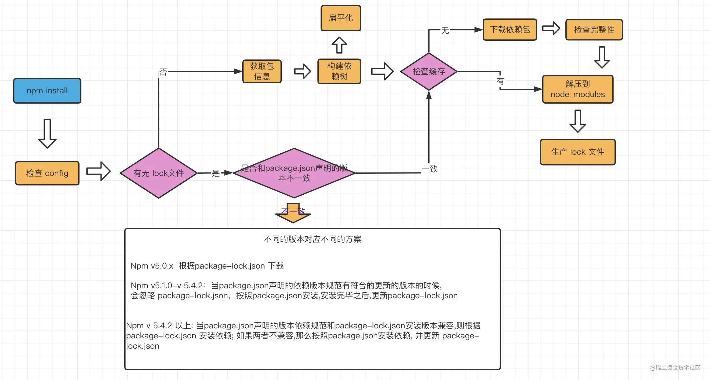


检查config时优先级为：
`project config` -> `user config` -> `global config` -> `npm内置的.npmrc文件`

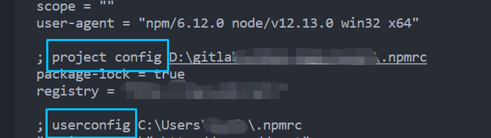
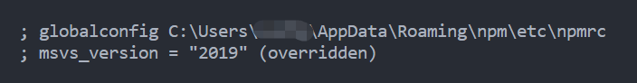


### 缓存机制

> npm config get cache // 查看本地缓存位置

C:\Users\xxx\AppData\Roaming\npm-cache

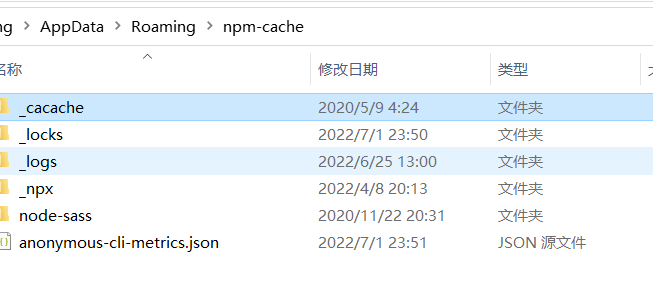

`_cache`目录下共有三个文件夹`content-v2`、`index-v5`、`tmp`；

> `content-v2` 目录用于存储 tar包的缓存，而`index-v5`目录用于存储tar包的 hash

> 当npm下载依赖的时候, 先下载到缓存当中,再解压到我们的项目的 node_modules中。其实 pacote是依赖 npm-registry-fetch来下载包, npm-registry-fetch 可以通过设置 cache 字段进行相关的缓存工作。

npm 在执行安装时，会根据`package-lock.json`中的`integrity`/`version`/`name`生成一个唯一的key，这个key 就能够对应上 index-v5 目录下的缓存记录; 从而找到 tar包的 hash，然后根据 hash 再去找缓存的 tar包直接使用，pacote将二进制文件解压缩进我们项目的 node_modules目录中，这样就省去了资源下载的网络开销。

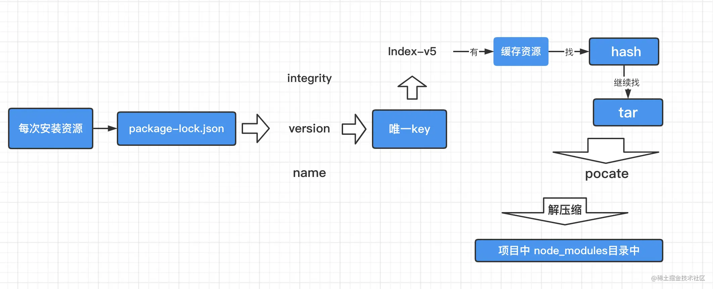


> 我们使用 `npm i --timing=true --loglevel=verbose` 命令可以看到 npm install的完整过程


> 这里需要注意的是, 这里的缓存策略是在 npm v5开始的,那么在 v5之前呢, 每个缓存模块是在我们之前提到的 ~./npmrc 文件中以模块名的格式直接存储的
> 存储的格式:{cache}{name}{version}


### 缓存机制demo
我们的一个项目中有`@babel/core`依赖，`package-lock.json`中的相关信息如下。以此为例，我们探索下npm的缓存机制
```json
    "@babel/core": {
      "version": "7.18.6",
      "resolved": "https://registry.npmmirror.com/@babel/core/-/core-7.18.6.tgz",
      "integrity": "sha512-cQbWBpxcbbs/IUredIPkHiAGULLV8iwgNRMFzvbhEXISp4f3rUUXE5+TIw6KwUWUR3DwyI6gmBRnmAtYaWehwQ==",
      ...
```

上面提到`package-lock.json`中的`integrity`/`version`/`name`生成一个唯一的key，这个key 就能够对应上 index-v5 目录下的缓存记录，所以参考`./assets/npm_cache_mechanism.webp`


1. 缓存分2个，index-v是meta的缓存，content-v是tar包的缓存
2. 在有package-lock的情况下，根据lock里面的包名、版本、integrity拼一个key出来去找meta信息。没有lock就只能去请求registry了，请求下来也有一样的meta信息。
3. 根据meta里面的`shasum`字段去找tar包的缓存。事实上，npm用了cacache和pacote来管理缓存，具体的key的算法看pacote，具体文件夹的分布看cacache，强行从代码层面也是能读出来的，虽然很累人


#### key => index-v5
> 这里需要注意：npm v5 改变了他们以往的integrity checksum 系统, 从sha1 到sha512

参考https://www.zhihu.com/question/305539244目前使用的实际是`sha256`算法，我们可以验证下，输入下面json的`key`，可以看到和index-v5中的目录是一致的

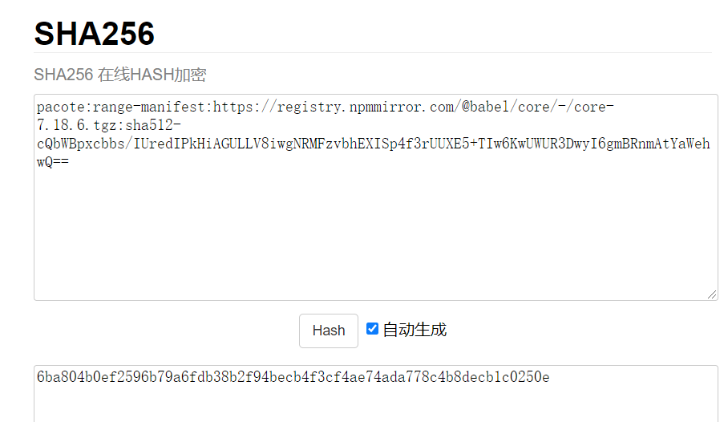

> 根据package-lock中具体包的信息，用`pacote:range-manifest:{url}:{integrity}作为key`，通过`SHA256`得到的hash，去`_cacache/index-v5`里找对应的文件，就能拿到基本的meta信息了``

##### 获取tar包hash
我们使用如下命令搜索上述包在`index-v5`目录下的位置，以获取tar包的hash

> grep "https://registry.npmmirror.com/@babel/core/-/core-7.18.6.tgz" -r index-v5

得到如下结果
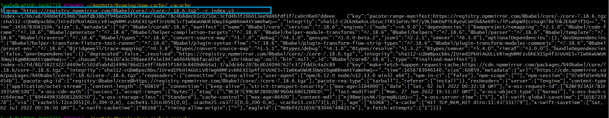

json格式化如下：
```json
index-v5/6b/a8/04b0ef2596b79a6fdb38b2f94becb4f3cf4ae74ada778c4b8decb1c0250e: 3cfd4b3f26b013ee9d4bfdf1f7ca0c06e07ddeee    {
    "key": "pacote:range-manifest:https://registry.npmmirror.com/@babel/core/-/core-7.18.6.tgz:sha512-cQbWBpxcbbs/IUredIPkHiAGULLV8iwgNRMFzvbhEXISp4f3rUUXE5+TIw6KwUWUR3DwyI6gmBRnmAtYaWehwQ==",
    "integrity": "sha512-C2EkHXwXvLsbrucJTRS3xFHv7Mf/y9klmKDxPTE8yevCoH5h8Ae69Y+/lP+ahpW91crnzgO78elOk2E6APJfIQ==",
    "time": 1656783041104,
    "size": 1,
    "metadata": {
        "id": "@babel/core@7.18.6",
        "manifest": {
            "name": "@babel/core",
            "version": "7.18.6",
            "engines": {
                "node": ">=6.9.0"
            },
            "dependencies": {
                "@ampproject/remapping": "^2.1.0",
                "@babel/code-frame": "^7.18.6",
                "@babel/generator": "^7.18.6",
                "@babel/helper-compilation-targets": "^7.18.6",
                "@babel/helper-module-transforms": "^7.18.6",
                "@babel/helpers": "^7.18.6",
                "@babel/parser": "^7.18.6",
                "@babel/template": "^7.18.6",
                "@babel/traverse": "^7.18.6",
                "@babel/types": "^7.18.6",
                "convert-source-map": "^1.7.0",
                "debug": "^4.1.0",
                "gensync": "^1.0.0-beta.2",
                "json5": "^2.2.1",
                "semver": "^6.3.0"
            },
            "optionalDependencies": {},
            "devDependencies": {
                "@babel/helper-transform-fixture-test-runner": "^7.18.6",
                "@babel/plugin-syntax-flow": "^7.18.6",
                "@babel/plugin-transform-flow-strip-types": "^7.18.6",
                "@babel/plugin-transform-modules-commonjs": "^7.18.6",
                "@babel/preset-env": "^7.18.6",
                "@jridgewell/trace-mapping": "^0.3.8",
                "@types/convert-source-map": "^1.5.1",
                "@types/debug": "^4.1.0",
                "@types/resolve": "^1.3.2",
                "@types/semver": "^5.4.0",
                "rimraf": "^3.0.0"
            },
            "bundleDependencies": false,
            "peerDependencies": {},
            "deprecated": false,
            "_resolved": "https://registry.npmmirror.com/@babel/core/-/core-7.18.6.tgz",
            "_integrity": "sha512-cQbWBpxcbbs/IUredIPkHiAGULLV8iwgNRMFzvbhEXISp4f3rUUXE5+TIw6KwUWUR3DwyI6gmBRnmAtYaWehwQ==",
            "_shasum": "54a107a3c298aee3fe5e1947a6464b9b6faca03d",
            "_shrinkwrap": null,
            "bin": null,
            "_id": "@babel/core@7.18.6"
        },
        "type": "finalized-manifest"
    }
}
index-v5/fd/80/58223227d449efc502d5ab4d14996786d21e9f74b945f1843c8409d664a1: 37a2dc64c2078cd0340947627c372fdd3c4a2c89    {
    "key": "make-fetch-happen:request-cache:https://cdn.npmmirror.com/packages/%40babel/core/7.18.6/core-7.18.6.tgz",
    "integrity": "sha512-cQbWBpxcbbs/IUredIPkHiAGULLV8iwgNRMFzvbhEXISp4f3rUUXE5+TIw6KwUWUR3DwyI6gmBRnmAtYaWehwQ==",
    "time": 1656783046140,
    "size": 60859,
    "metadata": {
        "url": "https://cdn.npmmirror.com/packages/%40babel/core/7.18.6/core-7.18.6.tgz",
        "reqHeaders": {
            "connection": [
                "keep-alive"
            ],
            "user-agent": [
                "npm/6.12.0 node/v12.13.0 win32 x64"
            ],
            "npm-in-ci": [
                "false"
            ],
            "npm-scope": [
                ""
            ],
            "npm-session": [
                "07e8fd3e4b9d454b"
            ],
            "pacote-pkg-id": [
                "registry:@babel/core@https://registry.npmmirror.com/@babel/core/-/core-7.18.6.tgz"
            ],
            "pacote-req-type": [
                "tarball"
            ],
            "referer": [
                "install"
            ]
        },
        "resHeaders": {
            "server": [
                "Tengine"
            ],
            "content-type": [
                "application/octet-stream"
            ],
            "content-length": [
                "60859"
            ],
            "connection": [
                "keep-alive"
            ],
            "strict-transport-security": [
                "max-age=5184000"
            ],
            "date": [
                "Sat, 02 Jul 2022 00:32:58 GMT"
            ],
            "x-oss-request-id": [
                "62BF923A1F7B1F3935A9C10D"
            ],
            "x-oss-cdn-auth": [
                "success"
            ],
            "accept-ranges": [
                "bytes"
            ],
            "etag": [
                "\"9E3F7C99E8F2B0D2BF960AE68012D0CD\""
            ],
            "last-modified": [
                "Mon, 27 Jun 2022 19:51:07 GMT"
            ],
            "x-oss-object-type": [
                "Normal"
            ],
            "x-oss-hash-crc64ecma": [
                "8944498358081269250"
            ],
            "x-oss-storage-class": [
                "Standard"
            ],
            "cache-control": [
                "max-age=86400"
            ],
            "content-md5": [
                "nj98mejysNK/lgrmgBLQzQ=="
            ],
            "x-oss-server-time": [
                "5"
            ],
            "ali-swift-global-savetime": [
                "1656721978"
            ],
            "via": [
                "cache55.l2cn3051[0,0,304-0,H], cache41.l2cn3051[0,0], vcache25.cn3773[0,0,200-0,H], vcache13.cn3773[1,0]"
            ],
            "age": [
                "61068"
            ],
            "x-cache": [
                "HIT TCP_MEM_HIT dirn:11:437331779"
            ],
            "x-swift-savetime": [
                "Sat, 02 Jul 2022 00:36:50 GMT"
            ],
            "x-swift-cachetime": [
                "86168"
            ],
            "timing-allow-origin": [
                "*"
            ],
            "eagleid": [
                "968bf42116567830467488217e"
            ],
            "x-fetch-attempts": [
                "1"
            ]
        }
    }
}

```

#### 根据上述meta中的`_shasum`从content-v2查找tar包内容

根据上述index-v5 hash，获取到对应目录的一个hash串是一个gzip压缩数据，解压后可以看到是对应tar包的内容


### peerDependencies

#### 出现背景
`npmV2时`，如果项目中的有一个依赖包packageA，它有一个子依赖packageB：
```js
{
  "dependencies": {
    "packageB": "1.0.1"
  }
}
```

此时使用`npm install packageA`时依赖的目录结构如下
```
Project
  node_modules
    packageA
      node_modules
        packageB


```

由于node的路径搜索限制，如果我们直接在项目中使用下列方式引入packageB是不会成功的；

```js
var packageB = require('packageB');
```

为了能够在项目中直接引入`packageB`，我们需要在项目的`package.json`中声明对packageB的依赖并将其安装在项目的`\node_modules`目录下；

`peerDependencies`的引入解决了这一问题。如果packageA的`package.json`定义如下：

```json
{
  "peerDependencies": {
    "packageB": "1.0.1",
  }
}

```

它会告诉npm，如果你安装packageA，那么最好也安装我——packageB，这样安装后的依赖目录

```json
Project
  node_modules
    packageA
    packageB
```


#### npmV3中的peerDependencies

npmV3中不会再强制安装`peerDependencies`，而是在安装结束后检查本次安装是否正确，不正确的话会输出warning告警提示。如果需要的peerDependencies未安装，需要你去手动安装

```js
npm WARN ts-jest@22.0.1 `requires a peer of jest`@^22.0.1 || ^22.1.0-alpha.1 || ^23.0.0-alpha.1 but none is installed. `You muststall peer dependencies yourself`.
```


## yarn


> Yarn is a package manager that doubles down as project manager. Whether you work on one-shot projects or large monorepos, as a hobbyist or an enterprise user, we've got you covered.

### 出现背景
yarn 是一个由Facebook、Google、Exponent和Tilde构建的新的JavaScript包管理器。它的出现是为了`解决历史上npm的某些不足`(比如npm对于依赖的完整性和一致性的保证,以及npm安装过程中速度很慢的问题)

2016年时，npm在`v3`版本时还不存在`package-lock.json`，安装速度和稳定很差；`yarn`解决了以下问题：

- 确定性：

    通过yarn.lock等机制,即使是不同的安装顺序,相同的依赖关系在任何的环境和容器中,都可以以相同的方式安装

- 模块扁平化安装：

    将不同版本的依赖包,按照一定的策略，归结为单个版本;以避免创建多个版本造成工程的冗余

- 网络性能更好：

    yarn采用了请求排队的理念,类似于并发池连接,能够更好的利用网络资源;同时也引入了一种安装失败的`重试机制`

- 采用缓存机制,实现了离线模式：

### yarn.lock
yarn.lock没有使用json格式，而是使用了一种自定义的标记方式;

> "@babel/cli@^7.1.6", "@babel/cli@^7.5.5":
  version "7.8.4"
  resolved "http://npm.in.zhihu.com/@babel%2fcli/-/cli-7.8.4.tgz#505fb053721a98777b2b175323ea4f090b7d3c1c"
  integrity sha1-UF+wU3IamHd7KxdTI+pPCQt9PBw=
  dependencies:
    commander "^4.0.1"
    convert-source-map "^1.1.0"
    fs-readdir-recursive "^1.1.0"
    glob "^7.0.0"
    lodash "^4.17.13"
    make-dir "^2.1.0"
    slash "^2.0.0"
    source-map "^0.5.0"
  optionalDependencies:
    chokidar "^2.1.8"

作者：酒窝yun过去了
链接：https://juejin.cn/post/7060844948316225572
来源：稀土掘金
著作权归作者所有。商业转载请联系作者获得授权，非商业转载请注明出处。

> 相比于npm,Yarn另一个显著的区别就是yarn.lock的子依赖的版本不是固定的版本。这其实就说明了一个问题: `一个单独的yarn.lock的问题并不能确定✅node-modules的文件结构,还需要package.json的配合·。`


### yarn安装机制
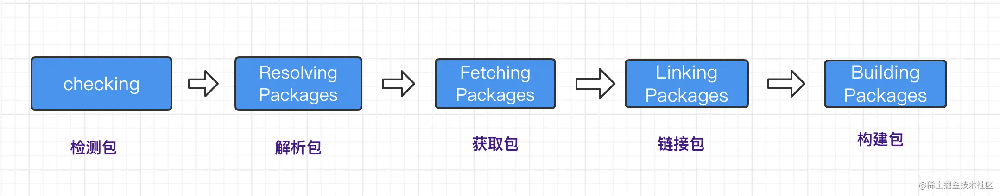

#### 检测包
这一步，最主要的目的就是检测我们的项目中`是否存在npm相关的文件`,比如package-lock.json等;如果有,就会有相关的提示用户注意：这些文件可能会存在冲突。在这一步骤中 也会`检测系统OS, CPU等信息`。


#### 解析包
这一步会解析依赖树中的每个包的信息，也是一个扁平化依赖树的过程。`经过解析包后,我们可以确定解析包的具体版本信息和下载地址`

首先获取到顶层依赖: 即当前项目中的package.json定义的dependencies、devDependencies、optionalDependencies，然后使用递归遍历方式获取所有的依赖包的信息，`并将解析过的包和正在进行解析包用Set数据结构进行存储，以保证同一版本范围内的包不会进行重复的解析`

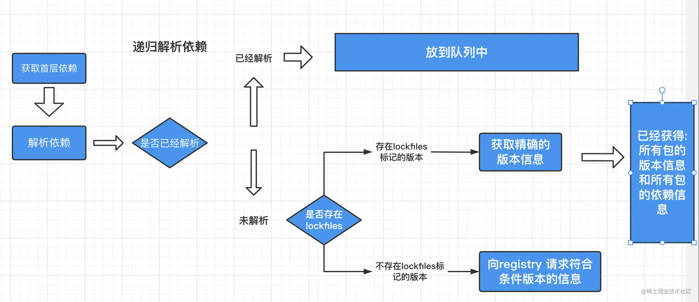


#### 获取包
检查缓存中是否有当前依赖的包，并将未缓存的包下载到缓存的目录中

> 在Yarn中会根据 cacheFolder+slug+node_modules+pkg.name 生成一个路径;判断系统中是否存在该path,如果存在证明已经有缓存,不用重新下载。这个path也就是依赖包缓存的具体路径。

未命中缓存的加入到Fetch队列，按照具体规则进行网络请求；

> 如果下载的包是一个file协议,或者是相对路径,就说明指向一个本地目录,此时会调用Fetch From Local从离线缓存中获取包;否则调用 Fetch From External 获取包,最终获取的结果使用 fs.createWriteStream 写入到缓存目录

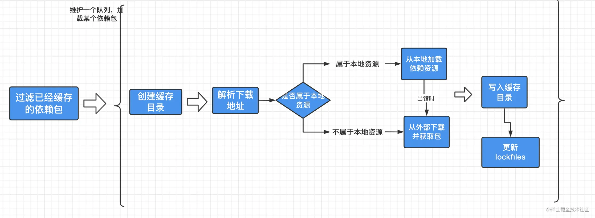


#### 链接包
在上一步将依赖放到了缓存目录后，下一步我们需要在遵循扁平化原则的前提下把项目依赖复制到`node_modules`目录下；

> 复制依赖之前, Yarn会先解析 peerDepdencies，如果找不到符合要求的peerDepdencies的包,会有 warning提示，并最终拷贝依赖到项目中。

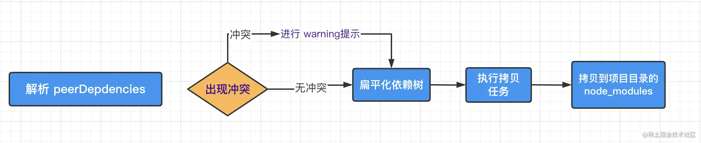


#### 构建包
如果依赖包中存在二进制包需要进行编译，那么会在这一步进行


--- 

# git

## 基本概念


我们先来理解下 Git 工作区、暂存区和版本库概念：

- `工作区`：就是你在电脑里能看到的目录。
- `暂存区`：英文叫 stage 或 index。`一般存放在 .git 目录下的 index 文件`（.git/index）中，所以我们把暂存区有时也叫作索引（index）。
- `版本库`：工作区有一个隐藏目录 `.git`，这个不算工作区，而是 Git 的版本库。


## git指令

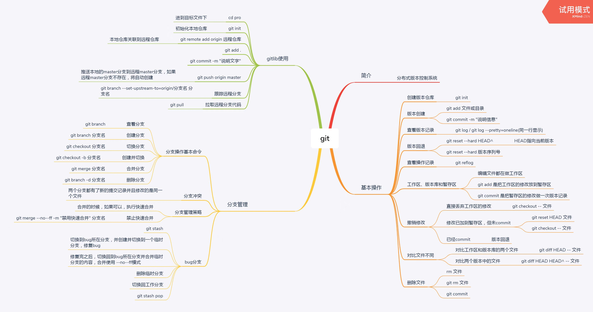


### git diff

git diff 有两个主要的应用场景。

- 尚未缓存的改动：`git diff`
- 查看已缓存的改动（暂存区与上一次commit的差异）： `git diff --cached`
- 查看已缓存的与未缓存的所有改动：`git diff HEAD`
- 显示摘要而非整个diff：`git diff --stat`

### git reset 

git reset 命令用于回退版本，可以指定退回某一次提交的版本。

```
git reset [--soft | --mixed | --hard] [HEAD]
```

> `git reset HEAD` 命令用于取消已缓存的内容。

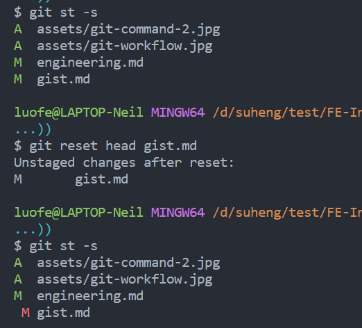


### 撤销修改 

1. 直接丢弃工作区的修改
    > `git checkout -- filename` // 直接丢弃工作区的修改

2. 修改已加到暂存区，但未commit
    - `git restore --staged <file>...`
    - `git reset HEAD filename`

3. 已经commit
    版本回退

### 版本回退

1. git reset --hard HEAD^ (HEAD指向当前版本)
2. git reset --hard 版本序列号


### reflog

`reflog` 可以看到 HEAD 的移动记录，假如之前误删了一个分支，可以通过 git reflog 看到移动 HEAD 的哈希值

> reflog 记录是时效的，只会保存一段时间内的记录。


## .git目录探析
[.git目录探析](https://blog.csdn.net/luofeng457/article/details/117577275)


---

# Webpack


---

# Babel

---

# CI/CD


---

# 监控

前端监控一般分为三种，分别为`页面埋点`、`性能监控`以及`异常监控`

## 页面埋点

一般会监控以下指标：
- PV/UV
- 停留时长
- 流量来源
- 用户交互；

对于这几类统计，一般的实现思路大致可以分为两种，分别为手写埋点和无埋点的方式。

第一种方式：根据产品及业务需求，对指定的用户交互等进行手动埋点，比较灵活；缺点是侵入业务代码、需要频繁添加；

无埋点的方式：统计所有的事件并且定时上报，基本不需要手动处理。这种方式虽然没有前一种方式繁琐了，但是因为统计的是所有事件，所以还需要后期过滤出需要的数据。


## 性能监控

一般借助`Performance API`实现。

对于性能监控来说，其实我们只需要调用 `performance.getEntriesByType('navigation') `这行代码就行了。对，你没看错，一行代码我们就可以获得页面中各种详细的性能相关信息。

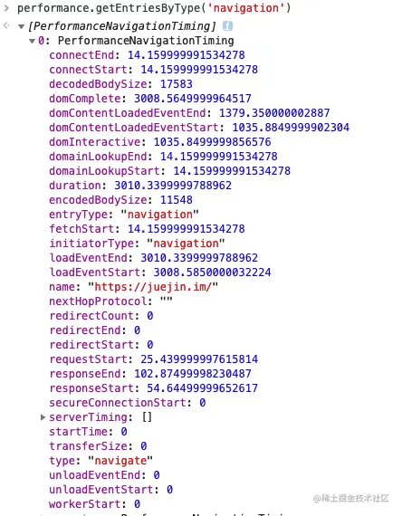

我们可以发现这行代码返回了一个数组，内部包含了相当多的信息，从数据开始在网络中传输到页面加载完成都提供了相应的数据。

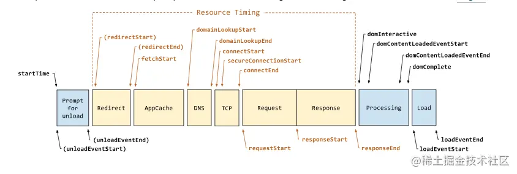


## 异常监控

对于异常监控来说，以下两种监控是必不可少的，分别是`代码报错`以及`接口异常上报`

对于代码运行错误，通常的办法是使用 `window.onerror` 拦截报错。该方法能拦截到大部分的详细报错信息，但是也有例外

    - 对于跨域的代码运行错误会显示` Script error`. 对于这种情况我们需要给 script 标签添加 crossorigin 属性

    - 对于某些浏览器可能不会显示调用栈信息，这种情况可以通过 arguments.callee.caller 来做栈递归

对于异步代码来说，可以使用 catch 的方式捕获错误。比如 Promise 可以直接使用 catch 函数，`async await 可以使用 try catch`。

但是要注意线上运行的代码都是压缩过的，需要在打包时生成 sourceMap 文件便于 debug。

> 对于捕获的错误需要上传给服务器，通常可以`通过 img 标签的 src 发起一个请求`。

另外接口异常就相对来说简单了，可以列举出出错的状态码。一旦出现此类的状态码就可以立即上报出错。接口异常上报可以让开发人员迅速知道有哪些接口出现了大面积的报错，以便迅速修复问题。


---

## 参考文献
1. [字节的一个小问题 npm 和 yarn不一样吗？](https://yuchengkai.cn/home/)
2. [npm缓存现在是怎么做的？](https://www.zhihu.com/question/305539244)
3. [.git目录探析](https://blog.csdn.net/luofeng457/article/details/117577275)
4. [图解Git](http://marklodato.github.io/visual-git-guide/index-zh-cn.html)