## JS

### 为什么`typeof null === 'object'`?

A: [The history of “typeof null”](https://2ality.com/2013/10/typeof-null.html)
第一版JS是用32位比特来存储值的，且通过低1或3位来识别类型的
 `1:整型`， `000:引用类型（object）`，`010：双精度浮点型（double）`，`100：字符串（string）`，`110：布尔型（boolean）`，`undefined: −2^30`；null也是使用`000`表示的；可以借助`Number.EPSILON`
 
 > 虽然 typeof null 会输出 object，但是这只是 JS 存在的一个悠久 Bug。在 JS 的最初版本中使用的是 32 位系统，为了性能考虑使用低位存储变量的类型信息，000 开头代表是对象，然而 null 表示为全零，所以将它错误的判断为 object 。虽然现在的内部类型判断代码已经改变了，但是对于这个 Bug 却是一直流传下来。


### 数据类型及判断
- 数据类型：基本类型（6种）和引用类型
- 判断： `typeof`/`Object.prototype.toString.call(xx)（返回[object Type）`

### 类型转换
可以参考[类型与语法](https://blog.csdn.net/luofeng457/article/details/88736357)
#### 转Boolean
#### 对象转基本类型
对象转基本类型时首先会调用`valueOf`，不存在则调用`toString`方法；如果存在`Symbol.toPrimitive`，则该方法在转基本类型时最先调用；
```js
a = {
    valueOf() {
        return 0;
    },
    toString() {
        return 1;
    },
    [Symbol.toPrimitive]() {
        return 2;
    }
}

a + 1 // 3
a + '1' // '21'
```

#### 四则运算
 - 加法运算：有一个是字符串类型则都转为字符串类型；`加法运算会触发三种类型转换：将值转换为原始值，转换为数字，转换为字符串`
 - 其他运算：只要有一个为数字则另一个也需要转为数字；

```js
a = {
    valueOf() {
        return [1, 2];
    },
    toString() {
        return '1,2';
    },
}
a + 3 // '1,23' 需要将a转为原始值，`valueOf`返回的是数组不符合，故取`toString`的值

[1, 2] + [2, 1] // '1,22,1'

'a' + + 'b' // -> "aNaN"
// b = '1c'
// +b // 'NaN'
// Number(b) // 'NaN'
// parseInt(b) // 1
```

#### `==`操作符

类型不同时：
1. 分别为`undefined`和`null`时，相等；
2. 分别为`Number`和`String`时，将`String`转为`Number`;
3. 有一个为`Boolean`时，先将`Boolean`转为`Number`再比较；
4. 有一个为`String`或`Number`，另一个为`Object`时，先将对象转为基本类型再比较；


#### 比较运算符
1. 如果是对象，就通过 toPrimitive 转换对象
2. 如果是字符串，就通过 unicode 字符索引来比较


### 原型

`prototype`: 每个函数都有 prototype 属性，除了 Function.prototype.bind()，该属性指向原型。

`__proto__`: 每个对象都有`__proto__`属性，`指向了创建该对象的构造函数的原型`。其实这个属性指向了 `[[prototype]]`，但是 [[prototype]] 是内部属性，我们并不能访问到，所以使用 `__proto__` 来访问。

对象可以通过 `__proto__`来寻找不属于该对象的属性，`__proto__`将对象连接起来组成了原型链。


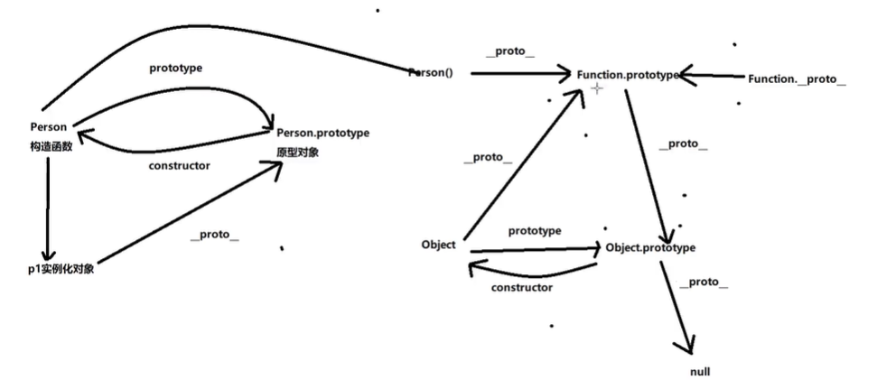

1. `hasOwnProperty`: `obj.hasOwnProperty`
2. `isPrototypeOf`: `prototypeObj.isPrototypeOf(obj)`
3. `getPrototypeOf`:

```js
function Person(name, age) {
    this.name = name;
    this.age = age;
}

var p = new Person();

p.hasOwnProperty('name') // true
p.hasOwnProperty('type') // false

Person.prototype.isPrototypeOf(p) // true
Object.getPrototypeOf(p) === Person.prototype; // true
```

```js
function Foo() {};
const f = new Foo;
const obj = new Object;

f.constructor === Foo;
f.__proto__ === Foo.prototype;
Foo.prototype.constructor === Foo;
Foo.prototype.__proto__ === Object.prototype;

Function.prototype === Object.__proto__;
Function.prototype === Function.__proto__;

Object.prototype.__proto__ === null;

```


### instanceof

`object` instanceof `constructor`

返回一个boolean，用于判断右边构造函数的`prototype`属性是否出现在左边对象的原型链上

```javascript
function Con() {}

const o = new Con();

o instanceof Con; // true，因 o.__proto__ === Con.prototype;
```

```javascript
// mock instanceof

function instanceof(left, right) {
    let prototype = right.prototype;
    left = left.__proto__;

    if (right instanceof Object) return false;

    while (true) {
        if (left === null) {
            return false;
        }
        if (left === right) {
            return true;
        }
        
        left = left.__proto__;
    }
}
```


### new
1. 创建一个空对象；
2. 链接到原型
3. 绑定this
4. 返回新对象


```js
function create() {
    // 创建一个空对象
    let obj = new Object();
    // 获得构造函数
    let Con = [].shift.call(arguments);
    // 链接到原型
    obj.__proto__ = Con.prototype;
    // 绑定this，执行构造函数
    let res = Con.apply(obj, arguments);
    return typeof res === 'object' ? : res : obj; 
}
```

需要注意`new`运算的优先级: `new Foo()大于new Foo`
```js
function Foo() {
    return this;
}
Foo.getName = function () {
    console.log('1');
};
Foo.prototype.getName = function () {
    console.log('2');
};

new Foo.getName();   // -> 1, new (Foo.getName());
new Foo().getName(); // -> 2, (new Foo()).getName();
```

### this

> 1. 通过`new`构造出的新对象，this总是指向该对象，不会被任何方式修改`this`指向；

> 2. `this`指向依赖于调用函数前的对象;

> 3. `call`/`apply`/`bind`可以改变`this`指向；
·
> 4. 箭头函数中实际上没有`this`，所以箭头函数中的`this`指向同它外层第一个非箭头函数

```javascript
function foo() {
	console.log(this.a)
}
var a = 1
foo() // 1

var obj = {
	a: 2,
	foo: foo
}
obj.foo() // 2

// 以上两者情况 `this` 只依赖于调用函数前的对象，优先级是第二个情况大于第一个情况

// 以下情况是优先级最高的，`this` 只会绑定在 `c` 上，不会被任何方式修改 `this` 指向
var c = new foo()
c.a = 3
console.log(c.a) // 3

// 还有种就是利用 call，apply，bind 改变 this，这个优先级仅次于 new

function a() {
    return () => {
        return () => {
        	console.log(this)
        }
    }
}
console.log(a()()()) // window
```

### 执行上下文

JS有三种执行上下文：
- 全局执行上下文
- 函数执行上下文
- eval执行上下文

每个执行上下文有三个重要属性：
- 变量对象（VO），包含变量、函数声明和函数的形参，`该属性只能在全局上下文中访问`
- 作用域链（JS 采用词法作用域，也就是说变量的作用域是在定义时就决定了）
- this

```javascript
var a = 10;
function foo(i) {
    var b = 20;
}
foo();
```

对于上述代码，执行栈中有两个上下文：全局上下文和函数`foo`上下文

执行栈为
```javascript
stack = [
    globalContext,
    fooContext,
]
```

对于全局上下文，VO大概描述如下
```javacript
globalContext.VO === global
globalContext.VO = {
    a: undefined,
    foo: <Function>,
}
```

对于函数`foo`，由于VO不能访问，只能访问到活动对象AO
```javasscript
fooContext.VO === foo.AO

foo.AO = {
    i: undefined,
    b: undefined,
    arguments: <>,
}
// arguments 是函数独有的对象(箭头函数没有)
// 该对象是一个类数组对象，有 `length` 属性且可以通过下标访问元素
// 该对象中的 `callee` 属性代表函数本身
// `caller` 属性代表函数的调用者
```

> 对于作用域链，可以将其理解为包含自身变量对象和上级变量对象的列表，通过`[[Scope]]`属性查找上级变量

```javascript
fooContext.[[Scope]] = [
    globalContext.VO
]

fooContext.Scope = fooContext.[[Scope]] + fooContext.VO;
                 = [
                     fooContext.VO,
                     globalContext.VO,
                 ]
```

> `在生成执行上下文时，会有两个阶段`。第一个阶段是`创建的阶段`（具体步骤是创建 VO），JS 解释器会找出需要提升的变量和函数，并且给他们提前在内存中开辟好空间，函数的话会将整个函数存入内存中，变量只声明并且赋值为 undefined，所以在第二个阶段，也就是`代码执行阶段`，我们可以直接提前使用。

> `let` 提升了声明但没有赋值，因为临时死区导致了并不能在声明前使用

这也解释了`函数及变量提升`；
```javascript
b() // call b
console.log(a) // undefined

var a = 'Hello world'

function b() {
	console.log('call b')
}
```

##### 非匿名立即执行函数
```javascript
var foo = 1
(function foo() {
    foo = 10
    console.log(foo)
}()) // -> ƒ foo() { foo = 10 ; console.log(foo) }

var foo = 1;
(function() {
    foo = 10
    console.log(foo)
}()) // 10
```

> 当 JS 解释器在遇到非匿名的立即执行函数时，会创建一个`辅助的特定对象，然后将函数名称作为这个对象的属性`，因此`函数内部才可以访问`到 foo，但是`这个值又是只读的，所以对它的赋值并不生效`，所以打印的结果还是这个函数，并且外部的值也没有发生更改


### 闭包
`定义`：函数A返回了一个函数B，并且函数B中使用了函数A的变量，则函数B就被称为闭包；
更准确的定义应当是：如果一个函数能访问外部变量，那么就形成了一个闭包。

```
function A() {
  let a = 1
  function B() {
      console.log(a)
  }
  return B
}
```

> 你是否会疑惑，为什么`函数 A 已经弹出调用栈了，为什么函数 B 还能引用到函数 A 中的变量。因为函数 A 中的变量这时候是存储在堆上的`。现在的 JS 引擎可以通过逃逸分析辨别出哪些变量需要存储在堆上，哪些需要存储在栈上。

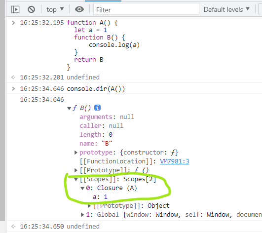

```js
let a = 1;
var b = 2;

function fn() {
    console.log(a, b);
}

console.dir(fn)
```

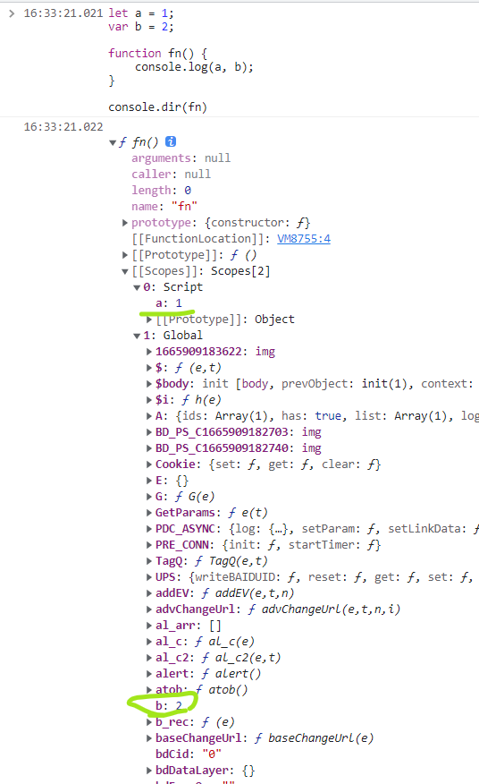

从上图我们能发现全局下声明的变量，如果是` var 的话就直接被挂到 global 上，如果是其他关键字声明的话就被挂到 Script 上`。虽然这些数据同样还是存在 [[Scopes]] 上，但是全局变量在内存中是存放在静态区域的，因为全局变量无需进行垃圾回收。

> 最后总结一下`原始类型存储`位置：`局部变量被存储在栈上，全局变量存储在静态区域上，其它都存储在堆上`。

### 深浅拷贝

##### 浅拷贝
使用`Object.assign`或者`...`

`Object.assign`仅可以拷贝对象自身的可枚举属性到目标对象，如果遇到错误，则报错前添加的属性仍然会改变`target`；

```javascript
if (typeof Object.assign !== 'function') {
    Object.defineProperty(Object, 'assign', {
        value: function(target, args) {
            if (target === null || target === undefined) {
                throw new TypeError('Cannot convert null or undefined to object')
            }

            var to = Object(target);
            for (var i = 1; i < arguments.length; i++) {
                var nextSource = arguments[i];

                if (nextSource !== null && nextSource !== undefined) {
                    for (var key in nextSource) {
                        if (Object.prototype.hasOwnProperty.call(nextSource, key)) {
                            to[key] = nextSource[key];
                        }
                    }
                }
            }

            return to;
        },
        writable: true,
        configurable: true,
    })
}
```

##### 深拷贝

可以使用`JSON.parse(JSON.stringify(object))`，可以解决大部分数据问题，但是存在一定局限性：

- 会忽略undefined
- 会忽略symbol
- 不能序列化函数
- 不能解决循环引用的对象

可以使用`lodash`提供的拷贝方法`cloneDeep`；

如果你所需拷贝的对象含有内置类型并且不包含函数，可以使用 `MessageChannel`；

```javascript
function structuralClone(obj) {
  return new Promise(resolve => {
    const {port1, port2} = new MessageChannel();
    port2.onmessage = ev => resolve(ev.data);
    port1.postMessage(obj);
  });
}

var obj = {a: 1, b: {
    c: b
}}
// 注意该方法是异步的
// 可以处理 undefined 和循环引用对象
(async () => {
  const clone = await structuralClone(obj)
})()
```

```js
// 简单深拷贝
function deepClone(originObj, typedObj) {
    var obj = typedObj || {};
    for (var key in originObj) {
        if (typeof originObj[key] === 'object') {
            obj[key] = Array.isArray(originObj[key]) ? [] : {};
            deepClone(originObj[key], obj[key]);
        } else {
            obj[key] = originObj[key];
        }
    }
    return obj;
}

// 处理缓存及循环引用
let map = new WeakMap();

function deepClone2(obj) {
    if (obj instanceof Object) {
        // 缓存
        if (map.has(obj)) {
            return map.get(obj);
        }

        let newObj;

        // 区分类型处理
        if (obj instanceof Array) {
            newObj = [];
        } else if (obj instanceof Function) {
            newObj = function() {
                return obj.apply(this, arguments);
            }
        } else if (obj instanceof RegExp) {
            newObj = new RegExp(obj.source, obj.flags);
        } else if (obj instanceof Date) {
            newObj = new Date(obj);
        } else {
            newObj = {};
        }

        let desc = Object.getOwnPropertyDescriptors(obj);
        let clone = Object.create(Object.getPrototypeOf(obj), desc);

        map.set(obj, clone);

        // 递归处理子属性
        for (let key in obj) {
            newObj[key] = deepClone2(obj[key]);
        }

        return newObj;
    }

    // 原始类型直接返回值
    return obj;
}
```


### 模块化
#### ES6模块
在有 Babel 的情况下，我们可以直接使用 ES6 

> ES6 模块的运行机制与 CommonJS 不一样。JS引擎对脚本静态分析时，遇到模块加载命令import，就会生成一个只读引用。等到脚本真正执行时，再根据这个只读引用，到被加载的那个模块里面去取值。ES6 模块中，原始值变了，import 加载的值也会跟着变。因此，ES6 模块是动态引用，并且不会缓存值。

##### ES6模块与CommonJS模块区别
- CommonJS 模块是运行时加载，ES6 模块是编译时输出接口。
- ES6模块输出的是值的引用，输出接口动态绑定，而CommonJS输出的是值的拷贝。


#### CommonJS
> CommonJs 是 Node 独有的规范，浏览器中使用就需要用到 Browserify 解析了

以下面这个demo为例
```js
// a.js
module.exports = {
    a: 1
}
// or
exports.a = 1

// b.js
var module = require('./a.js')
module.a // -> log 1
```

在上述代码中，module.exports 和 exports 很容易混淆，让我们来看看大致内部实现

```js
var module = require('./a.js')
module.a
// 这里其实就是包装了一层立即执行函数，这样就不会污染全局变量了，
// 重要的是 module 这里，module 是 Node 独有的一个变量
module.exports = {
    a: 1
}

// 基本实现
var module = {
    exports = {} // exports就是个空对象
}
// 这个是为什么 exports 和 module.exports 用法相似的原因
var exports = module.exports;

var load = function (module) {
    // 导出的东西
    var a = 1;

    module.exports = a;

    return module.exports;
}
```

> 对于 CommonJS 和 ES6 中的模块化的两者区别是：
 - 前者支持动态导入，也就是 require(${path}/xx.js)，后者目前不支持，但是已有提案
 - 前者是同步导入，因为用于服务端，文件都在本地，同步导入即使卡住主线程影响也不大。而后者是异步导入，因为用于浏览器，需要下载文件，如果也采用同步导入会对渲染有很大影响
 - 前者在导出时都是值拷贝，就算导出的值变了，导入的值也不会改变，所以如果想更新值，必须重新导入一次。但是后者采用实时绑定的方式，导入导出的值都指向同一个内存地址，所以导入值会跟随导出值变化
 - 后者会编译成 require/exports 来执行的

 #### AMD(Asynchronous Module Definition)
AMD由`RequireJS`提出的，用于解决早期JS模块多依赖加载顺序问题；

```js
// AMD 模块定义
define(id?, dependencies?, factory);
define.amd = {};

// 定义无依赖的模块
define({
    add: function(x,y){
        return x + y;
    }
});

// 定义有依赖的模块
define(["alpha"], function(alpha){
    return {
        verb: function(){
            return alpha.verb() + 1;
        }
    }
});
```

AMD也采用`require()`加载模块，但与`CommonJS`不同，有2个入参；第一个是依赖的模块，第二个是加载成功后的回调函数
```js
require([module], callback)

require(['math'], function (math) {
    math.add(2, 3);
});
```

#### CMD(Common Module Definition)
> CMD = Common Module Definition，即通用模块定义。CMD 是 SeaJS 在推广过程中对模块定义的规范化产出。
> CMD 规范和 AMD 规范类似，都主要运行于浏览器端，写法上看起来也很类似。主要区别，在于 `模块初始化时机`

##### AMD 与 CMD 的异同
- AMD 中，只要模块作为依赖时就会加载并进行初始化;
- CMD 中，模块作为依赖且被引用时才会初始化，否则只会加载;
- CMD 推崇依赖就近，可以把依赖写进你的代码中的任意一行。AMD 推崇依赖前置;

#### UMD(Universal Module Definition)
UMD即通用模块定义，兼具AMD与CommonJS的特点；
> `AMD`模块以 浏览器第一的原则 发展，选择异步加载。CommonJS 模块以 服务器第一原则 发展，选择同步加载。由此，迫使人们又想出另一个更通用的模式 `UMD`（Universal Module Definition)，实现跨平台的解决方案。
> UMD 先判断支持 `Node.js 的模块（exports）是否存在`，存在则使用 Node.js 模块模式。再判断支持 AMD（define ）是否存在，存在则使用 AMD 方式加载模块。

```js
(function (global, factory) {
  typeof exports === 'object' && typeof module !== 'undefined' ? module.exports = factory() :
  typeof define === 'function' && define.amd ? define(factory) :
  (global = global || self, global.utilName = factory());
}(this, function () {
    //module ...
}); 
```


### 防抖与节流

> 防抖动和节流本质是不一样的。防抖动是将多次执行变为最后一次执行，节流是将多次执行变成每隔一段时间执行。

`共同点：`防抖和节流的目的都是防止函数的多次调用

`区别：`函数去抖和函数节流都是密集型操作中避免事件频繁出发造成性能损耗的解决方案；函数节流，顾名思义就是节约流量，所以每个时间段内只会执行一次，并在此时间段内屏蔽触发的同类事件；而函数去抖则是在用户连续操作中避免事件处理的处理效率不及时间触发速度，从而导致画面卡顿，操作不畅等不良用户体验，所以在很短的时间段内只响应最近触发的事件；


#### 去抖

##### 定义
函数去抖的含义就是在一定时间段内只有一个同类的事件触发并执行；如果该时间段有同类的事件触发，则重新开始响应该事件；

##### 应用
输入合法性检测、浏览器resize时自身的处理、scroll事件等


```js
// 这个是用来获取当前时间戳的
function now() {
  return +new Date()
}
/**
 * 防抖函数，返回函数连续调用时，空闲时间必须大于或等于 wait，func 才会执行
 *
 * @param  {function} func        回调函数
 * @param  {number}   wait        表示时间窗口的间隔
 * @param  {boolean}  immediate   设置为ture时，是否立即调用函数
 * @return {function}             返回客户调用函数
 */
function debounce (func, wait = 50, immediate = true) {
  let timer, context, args

  // 延迟执行函数
  const later = () => setTimeout(() => {
    // 延迟函数执行完毕，清空缓存的定时器序号
    timer = null
    // 延迟执行的情况下，函数会在延迟函数中执行
    // 使用到之前缓存的参数和上下文
    if (!immediate) {
      func.apply(context, args)
      context = args = null
    }
  }, wait)

  // 这里返回的函数是每次实际调用的函数
  return function(...params) {
    // 如果没有创建延迟执行函数（later），就创建一个
    if (!timer) {
      timer = later()
      // 如果是立即执行，调用函数
      // 否则缓存参数和调用上下文
      if (immediate) {
        func.apply(this, params)
      } else {
        context = this
        args = params
      }
    // 如果已有延迟执行函数（later），调用的时候清除原来的并重新设定一个
    // 这样做延迟函数会重新计时
    } else {
      clearTimeout(timer)
      timer = later()
    }
  }
}
```


#### 节流
##### 定义
函数节流的含义就是在一定的时间段内相应的事件只能被触发一次；如果某段有已经有相应的事件在执行，则在该时间段内不再触发，直到本次事件执行结束；


##### 应用
请求接口的一些提交按钮、翻页器等；


```js
// 简易实现
// 返回函数版本
function throttle(fn, wait) {
    let tid;
    return function (...args) {
        if (tid) {
            return;
        }
        tid = setTimeout(() => {
            fn.apply(this, args);
        }, wait);
    }
}
```


```js
/**
 * underscore 节流函数，返回函数连续调用时，func 执行频率限定为 次 / wait
 *
 * @param  {function}   func      回调函数
 * @param  {number}     wait      表示时间窗口的间隔
 * @param  {object}     options   如果想忽略开始函数的的调用，传入{leading: false}。
 *                                如果想忽略结尾函数的调用，传入{trailing: false}
 *                                两者不能共存，否则函数不能执行
 * @return {function}             返回客户调用函数
 */
_.throttle = function(func, wait, options) {
    var context, args, result;
    var timeout = null;
    // 之前的时间戳
    var previous = 0;
    // 如果 options 没传则设为空对象
    if (!options) options = {};
    // 定时器回调函数
    var later = function() {
      // 如果设置了 leading，就将 previous 设为 0
      // 用于下面函数的第一个 if 判断
      previous = options.leading === false ? 0 : _.now();
      // 置空一是为了防止内存泄漏，二是为了下面的定时器判断
      timeout = null;
      result = func.apply(context, args);
      if (!timeout) context = args = null;
    };
    return function() {
      // 获得当前时间戳
      var now = _.now();
      // 首次进入前者肯定为 true
	  // 如果需要第一次不执行函数
	  // 就将上次时间戳设为当前的
      // 这样在接下来计算 remaining 的值时会大于0
      if (!previous && options.leading === false) previous = now;
      // 计算剩余时间
      var remaining = wait - (now - previous);
      context = this;
      args = arguments;
      // 如果当前调用已经大于上次调用时间 + wait
      // 或者用户手动调了时间
 	  // 如果设置了 trailing，只会进入这个条件
	  // 如果没有设置 leading，那么第一次会进入这个条件
	  // 还有一点，你可能会觉得开启了定时器那么应该不会进入这个 if 条件了
	  // 其实还是会进入的，因为定时器的延时
	  // 并不是准确的时间，很可能你设置了2秒
	  // 但是他需要2.2秒才触发，这时候就会进入这个条件
      if (remaining <= 0 || remaining > wait) {
        // 如果存在定时器就清理掉否则会调用二次回调
        if (timeout) {
          clearTimeout(timeout);
          timeout = null;
        }
        previous = now;
        result = func.apply(context, args);
        if (!timeout) context = args = null;
      } else if (!timeout && options.trailing !== false) {
        // 判断是否设置了定时器和 trailing
	    // 没有的话就开启一个定时器
        // 并且不能同时设置 leading 和 trailing
        timeout = setTimeout(later, remaining);
      }
      return result;
    };
  };
```

### 继承
#### 原型链继承
原型链继承方式的实质是用一个新类型的实例重写原型对象；

##### 缺点
1. 原型中包含引用类型时一个实例对原型的引用类型值改变会影响到其他所有的实例对象；
2. 创建子类实例时无法在不影响其他子类实例的情况下向父类构造函数传递参数；


##### 实例

```js
// 原型链继承
function Person () {
	this.type = 'person';
	this.cans = ['talk', 'eat', 'sleep'];
	this.greet = function () {
		console.log('Hello, I am ' + this.type);
	}
}

function Student () {
	this.type = 'student';
	this.name = 'B';
	this.gender = 'male';
	this.greet = function () {
		console.log('Hello, I am ' + this.type);
	}
}

Student.prototype = new Person();

var person1 = new Person();
var stu1 = new Student();
var stu2 = new Student();

stu1.cans.push('sing');
console.log(stu1.cans);	// [ 'talk', 'eat', 'sleep', 'sing' ]
console.log(stu2.cans);	// [ 'talk', 'eat', 'sleep', 'sing' ]

```


#### 借用构造函数

该方法通过在子类构造函数中通过`call`或`apply`调用父类构造函数；

##### 优点
1. 该方法解决了原型中包含引用类型值的问题；
2. 通过调用call和apply，可以在子类构造函数向父类构造函数传递参数，且不影响其他子类实例；

##### 缺点
构造函数中定义的方法无法复用；
而且在父类原型中定义的方法子类实例无法访问到；

```js
function Person(name, age) {
    this.name = name;
    this.age = age;
    this.cans = ['talk', 'eat', 'sleep'];
}

Person.prototype.greet = function () {
    console.log(`Hello, ${name}`);
}

function Student(name, age) {
    Person.call(this, name, age);
    this.grade = 98;
}

var stu3 = new Student();
console.log(stu3.name); // Neil
console.log(stu3.age); // 20
console.log(stu3.grade); //98
stu3.greet(); // TypeError
console.log(Student.prototype.__proto__)
```

#### 组合式继承
也称作伪经典继承，结合了原型链继承和借用构造函数继承的优点 —— 使用原型链实现对原型属性和方法的继承，使用借用构造函数实现对实例属性的继承；

##### 缺点
组合式继承调用了两次父类构造函数，导致子类实例和子类原型上存在两组同名的属性；


```js
function Person (name) {
    this.name = name;
    this.cans = ['talk', 'eat', 'sleep'];
}

Person.prototype.test = true;
Person.prototype.greet = function () {
    console.log(`Hello, ${this.name}`)
}

function Student (name, grade) {
    // 借用构造函数继承实例属性
    Person.call(this, name);
    this.grade = grade;
}

// 原型链实现原型属性和方法的继承
Student.prototype = new Person();

Student.prototype.getGrade = function() {
    console.log(`${this.name}'s grade is ${this.grade}`);
}

const stu4 = new Student('D', 88);
const stu5 = new Student('E', 96);

stu4.cans.push('learning');
console.log('==========实例属性==========');
console.log(`1: ${stu4.name}`); // 1: D
console.log(`2: ${stu4.cans}`); // 2: talk,eat,sleep,learning
console.log(`3: ${stu5.cans}`); // 3: talk,eat,sleep
console.log('==========原型属性与方法==========');
console.log(`4: ${stu4.test}`) // 4: true
stu4.greet() // Hello, D
console.log('==========自身属性与方法==========');
console.log(`5: ${stu4.grade}`) // 88
stu5.getGrade() // E's grade is 96

```


#### 原型式继承
##### 原理
原型式继承借助已存在的对象创建新对象，实质是对传入其中的对象实现了一次浅拷贝，然后可以根据需求在新对象上进行修改；

##### 实例
```js
var init = {
  name: 'E',
  interests: ['basketball, music']
}

function object(o) {
    function F() {}
    F.prototype = o;
    return new F();
}

var me = object(init);
me.name = "E+"
me.interests.push('movies');
var me2 = object(init);
console.log(me.name); // E+
console.log(me2.name);  // E
console.log(me.interests);  // [ 'basketball, music', 'movies' ]
console.log(me2.interests); // [ 'basketball, music', 'movies' ]
```

> ES5增加了方法可以更加规范地实现原型式继承；它接受两个参数，第一个为创建新对象所依赖的prototype，第二项用于给新对象添加新属性，它的设置与Object.defineProperties()一样采用对象字面量形式；支持该方法的浏览器包括IE 9+、Chrome、Firefox 4+、Safari 5+等；

```js
var init = {
  name: 'E',
  interests: ['basketball, music']
}

var me = Object.create(init, {
    name: {
        value: 'Neil',
        configurable: true,
        enumerable: true,
        writable: false
    },
    age: {
        value: 24,
        writable: true  // 默认为false
    }
})

console.log(me.name); // Neil
console.log(me.interests); // [ 'basketball, music' ]
console.log(init.isPrototypeOf(me)); // true
```

#### 寄生式继承
寄生式继承与原型式继承基本思想类似，具体实现则与工厂模式类似；该方法使用了一个仅用于封装继承过程的函数，`在函数内部对新创建的对象进行改造`；

该方法与构造函数模式类似，也存在函数不可复用的缺点；

```js
function object(o) {
    function F() {}
    F.prototype = o;
    return new F();
}

var o = {
    name: 'F',
    interests: ['basketball', 'movies'],
    greet: function () {
        console.log(this.interests);
    }
}

function createObject(superObj) {
    var copy = object(superObj); // 创建新对象
    copy.interests.push('sports'); // 以某种方式增强新对象
    copy.print = function () {
        console.log(this.interests);
    }

    return copy;
}

var obj = createObject(o);
console.log(obj.name);
obj.print();
obj.greet();
```


#### 寄生组合式继承
寄生组合式继承的目的是为了改善JS最常用的继承方式——组合继承的不足：每次创建子类实例会调用两次父类构造函数；

两次调用会导致在子类实例上和子类原型上同时存在两组同名的属性，两次调用分别是： 1、在子类构造函数内部 2、在创建子类原型时（用于原型属性和方法的继承）；

`但是创建子类原型时其实只需要父类原型的副本即可`；这样仅调用一次构造函数，同时避免在子类原型创建不必要的属性，有效提高了效率；同时，`该方式是引用类型最理想的继承方式`；

> 其本质是使用寄生式继承方式继承父类原型，然后将其赋值给子类原型；

##### 实例
```js
function object(o) {
    function F() {}
    F.prototype = o;
    return new F();
}

function inheritPrototype(subType, superType) {
    var prototype = object(superType.prototype); // 以父类原型创建新对象，相当于创建了父类副本而不是调用父类构造函数
    prototype.constructor = subType; // 增强对象
    subType.prototype = prototype; // 指定对象 (subType.prototype.constructor = subType)
}


function SuperType (name) {
  this.name = name;
  this.interests = ['basketball', 'music'];
}

SuperType.prototype.print = function () {
  console.log(this.interests);
}

function SubType (name, age) {
  SuperType.call(this, name);
  this.age = age;
}

inheritPrototype(SubType, SuperType); // 该行需要在添加属性或方法到SubType.prototype之前，否则属性或方法会被覆盖

SubType.prototype.report = function () {
  console.log('age is ' + this.age);
}

var instance = new SubType('G', 25);
var instance2 = new SubType('H', 27);
console.log(instance.name); // G
console.log(instance.age); // 25
instance.interests.push('chess');
instance.print(); // ['basketball', 'music', 'chess']
instance.report(); // age is 25
console.log('=============================');
instance2.print(); // ['basketball', 'music']

```

> 因为每个实例的原型都只是SuperType.prototype的一个对象副本，各自是独立的，因此instance对引用类型值的改变不会影响到instance2；


使用`Object.create()`简化该过程：
```js
function SuperType (name) {
    this.name = name;
    this.interests = ['basketball', 'music'];
}

SuperType.prototype.print = function () {
  console.log(this.interests);
}

function SubType (name, age) {
  SuperType.call(this, name);
  this.age = age;
}

SubType.prototype = Object.create(SuperType.prototype, {
    constructor: {
        value: SubType,
        configurable: true,
        enumerable: true,
        writable: true,
    }
})

SubType.prototype.report = function () {
    console.log('age is ' + this.age);
}

var instance = new SubType('G', 25);
var instance2 = new SubType('H', 27);
console.log(instance.name);
console.log(instance.age);
instance.interests.push('chess');
instance.print();
instance.report();
console.log('=============================');
instance2.print();

```

### call, apply, bind

#### 模拟call实现

可以从以下几点来考虑如何实现
1. 不传入第一个参数，那么默认为 window
2. 改变了 this 指向，让新的对象可以执行该函数。那么思路是否可以变成给新的对象添加一个函数，然后在执行完以后删除？
```js
Function.prototype.myCall = function (context) {
    var context = context || window;
    // 给context添加一个属性
    // getValue.call(a, 'neil', 22) => a.fn = getValue
    context.fn = this;
    // 将context后的参数取出
    var args = [...arguments].slice(1);
    // getValue.call(a, 'neil', 22) <=> a.fn('neil', 22)
    var result = context.fn(...args);
    // 删除fn
    delete context.fn;
    return result;
}
```

#### apply

```js
Function.prototype.myApply = function (context) {
    var context = context || window;
    context.fn = this;
    var result;
    if (arguments[1]) {
        result = context.fn(...arguments[1]);
    } else {
        result = context.fn();
    }

    delete context.fn;
    return this;
}
```

#### bind
bind 和其他两个方法作用也是一致的，只是该方法会返回一个函数。并且我们可以通过 bind 实现柯里化。

```js
Function.prototype.myBind = function (context) {
  if (typeof this !== 'function') {
    throw new TypeError('Error')
  }
  var _this = this
  var args = [...arguments].slice(1)
  // 返回一个函数
  return function F() {
    // 因为返回了一个函数，我们可以 new F()，所以需要判断
    if (this instanceof F) {
      return new _this(...args, ...arguments)
    }
    return _this.apply(context, args.concat(...arguments))
  }
}
```


### Promise
> Promise 是 ES6 新增的语法，解决了回调地狱的问题。

> 可以把 Promise 看成一个状态机。初始是 pending 状态，可以通过函数 resolve 和 reject ，将状态转变为 resolved 或者 rejected 状态，`状态一旦改变就不能再次变化`。

> `then 函数会返回一个 Promise 实例，并且该返回值是一个新的实例而不是之前的实例`。因为 Promise 规范规定除了 pending 状态，其他状态是不可以改变的，如果返回的是一个相同实例的话，多个 then 调用就失去意义了。


> 对于 then 来说，本质上可以把它看成是 flatMap


```js
// 三种状态
const PENDING = 'pending'
const RESOLVED = 'resolved'
const REJECTED = 'rejected'

// promise接收一个函数，该函数会立即执行
function MyPromise (fn) {
    let _this = this;
    _this.currentState = PENDING;
    _this.value = undefined;
    // 用于保存then中的回调，只有当promise状态为pending时才会缓存，并且每个实例至多缓存一个
    _this.resolvedCallback = [];
    _this.rejectedCallback = [];
    
    _this.resolve = function (value) {
        if (value instanceof MyPromise) {
            // 如果value是个Promise，递归执行
            return value.then(_this.resolve, _this.reject);
        }

        setTimeout(() => { // 异步执行，保证执行顺序
            if (_this.currentState === PENDING) {
                _this.currentState = RESOLVED;
                _this.value = value;
                _this.resolvedCallback.forEach(cb => cb());
            }
        })
    }

    _this.reject = function (reason) {
        setTimeout(() => { // 异步执行，保证执行顺序
            if (_this.currentState === PENDING) {
                _this.currentState = REJECTED;
                _this.value = reason;
                _this.rejectedCallback.forEach(cb => cb());
            }
        })
    }

    // 用于解决以下问题
    // new Promise(() => throw Error('error))
    try {
        fn(_this.resolve, _this.reject);
    } catch (e) {
        _this.reject(e);
    }
}

MyPromise.prototype.then = function (onResolved, onRejected) {
    var self = this;
    // 规范 2.2.7，then 必须返回一个新的 promise
    var promise2;
    // 规范 2.2.onResolved 和 onRejected 都为可选参数
    // 如果类型不是函数需要忽略，同时也实现了透传
    // Promise.resolve(4).then().then((value) => console.log(value))
    onResolved = typeof onResolved === 'function' ? onResolved : v => v;
    onRejected = typeof onRejected === 'function' ? onRejected : r => throw r;

    if (self.currentState === RESOLVED) {
        return (promise2 = new MyPromise(function(resolve, reject) {
            // 规范 2.2.4，保证 onFulfilled，onRjected 异步执行
            // 所以用了 setTimeout 包裹下
            setTimeout(function() {
                try {
                    x = onResolved(self.value);
                    resolutionProcedure(promise2, x, resolve, reject);
                } catch (reason) {
                    reject(reason)
                }
            })
        }));
    }

    if (self.currentState === REJECTED) {
        return (promise2 = new MyPromise(function (resolve, reject) {
            setTimeout(function () {
            // 异步执行onRejected
                try {
                    var x = onRejected(self.value);
                    resolutionProcedure(promise2, x, resolve, reject);
                } catch (reason) {
                    reject(reason);
                }
            });
        }));
    }

    if (self.currentState === PENDING) {
        return (promise2 = new MyPromise(function (resolve, reject) {
            self.resolvedCallbacks.push(function () {
                // 考虑到可能会有报错，所以使用 try/catch 包裹
                try {
                    var x = onResolved(self.value);
                    resolutionProcedure(promise2, x, resolve, reject);
                } catch (r) {
                    reject(r);
                }
            });

            self.rejectedCallbacks.push(function () {
                try {
                    var x = onRejected(self.value);
                    resolutionProcedure(promise2, x, resolve, reject);
                } catch (r) {
                    reject(r);
                }
            });
        }));
    }

    // 规范规定，执行 onFulfilled 或者 onRejected 函数时会返回一个 x，并且执行 Promise 解决过程，
    // 这是为了不同的 Promise 都可以兼容使用，比如 JQuery 的 Promise 能兼容 ES6 的 Promise
    function resolutionProcedure(promise2, x, resolve, reject) {
        // 规范 2.3.1，x 不能和 promise2 相同，避免循环引用
        if (promise2 === x) {
            return reject(new TypeError('error'));
        }

        // 如果 x 为 Promise，状态为 pending 需要继续等待否则执行
        if (x instanceof MyPromise) {
            if (x.currentState === PENDING) {
                x.then(function (value) {
                    // 再次调用该函数是为了确认 x resolve 的
                    // 参数是什么类型，如果是基本类型就再次 resolve
                    // 把值传给下个 then
                    resolutionProcedure(promise2, value, resolve, reject);
                }, reject);
            } else {
                x.then(resolve, reject);
            }
            return;
        }

        // reject 或者 resolve 其中一个执行过得话，忽略其他的
        let called = false;
        // 判断 x 是否为对象或者函数
        if (x !== null && (typeof x === 'object' || typeof x === 'function')) {
            try {
                let then = x.then;
                if (typeof then === 'function') {
                    then.call(
                        x,
                        y => {
                            if (called) return;
                            called = true;
                            resolutionProcedure(promise2, y, resolve, reject);
                        },
                        e => {
                            if (called) return;
                            called = true;
                            reject(e);
                        }
                    );
                } else {
                    resolve(x);
                }
            } catch (e) {
                if (called) return;
                called = true;
                reject(e);
            }
        } else {
            // 规范 2.3.4，x 为基本类型
            resolve(x);
        }
    }
}
```

### Generator
ES6新增语法，用于异步编程。每个生成器对象都有一个`next`方法，该方法返回一个包含2个属性的对象：value表示当前迭代值；done——布尔类型，表示迭代是否完成；

Generator函数内部的`yield`可以暂停函数执行，而每次调用`next`则可以继续执行被暂定的代码；

> 生成器（generator）对象是由一个generator function 返回的,并且它符合可迭代协议和迭代器协议。

```js
function* test() {
    let a = 1 + 2;
    yield 2;
    yield 3;
}

var b = test(); // 获取生成器对象
console.log(b.next()) // { value: 2, done: false }
console.log(b.next()) // { value: 3, done: false }
console.log(b.next()) // { value: undefined, done: true }

```

#### 生成器委托
```js
function* c1(){
  yield 1;
  yield 2;
}

function* c2(){
  yield 's1';
  yield 's2';
}

function* c3(){
  yield *c1();
  yield *c2();
  yield true
}

let gen = c3();

gen.next(); // { value: 1, done: false }
gen.next(); // { value: 2, done: false }
gen.next(); // { value: 's1', done: false }
gen.next(); // { value: 's2', done: false }
gen.next(); // { value: true, done: false }
gen.next(); // { value: undefined, done: true }

```

#### Generator函数的简单实现
```js
// cb 也就是编译过的 test 函数
function generator(cb) {
    return (function() {
        var object = {
            next: 0,
            stop: function() {}
        };

        return {
            next: function() {
                var ret = cb(object);
                if (ret === undefined) return {
                    value: undefined,
                    done: true,
                }

                return {
                    value: ret,
                    done: false,
                }
            }
        }
    })();
}

// 如果你使用 babel 编译后可以发现 test 函数变成了这样
function test() {
  var a;
  return generator(function(_context) {
    while (1) {
      switch ((_context.prev = _context.next)) {
        // 可以发现通过 yield 将代码分割成几块
        // 每次执行 next 函数就执行一块代码
        // 并且表明下次需要执行哪块代码
        case 0:
          a = 1 + 2;
          _context.next = 4;
          return 2;
        case 4:
          _context.next = 6;
          return 3;
		// 执行完毕
        case 6:
        case "end":
          return _context.stop();
      }
    }
  });
}
```


### async与await
> 一个函数如果加上 async ，那么该函数就会返回一个 Promise

```js
async function test() {
  return "1";
}
console.log(test()); // -> Promise {<fulfilled>: '1'}
```

> 可以把 async 看成将函数返回值使用 Promise.resolve() 包裹了下

> await 只能在 async 函数中使用

#### demos

```js
// demo1
async function test() {
    console.log(111)
    await 10;
    console.log(222)
    return "1";
}
test()
console.log(333)
```

上述代码打印顺序：111 -> 333 -> 222；aysnc函数执行时遇到await时会返回一个pending状态的Promise对象，暂时返回代码控制权，使得函数外代码可以继续执行


```js
// demo2
function sleep() {
  return new Promise(resolve => {
    setTimeout(() => {
      console.log('finish')
      resolve("sleep");
    }, 2000);
  });
}
async function test() {
  let value = await sleep();
  console.log("object");
}
test()
```

上面代码会先打印 finish 然后再打印 object 。因为 await 会等待 sleep 函数 resolve ，所以即使后面是同步代码，也不会先去执行同步代码再来执行异步代码。

```js
// demo3
var a = 0
var b = async () => {
  a = a + await 10
  console.log('2', a) // -> '2' 10
  a = (await 10) + a
  console.log('3', a) // -> '3' 20
}
b()
a++
console.log('1', a) // -> '1' 1
```

- 首先函数 b 先执行，在执行到 await 10 之前变量 a 还是 0，因为在 `await 内部实现了 generators ，generators 会保留堆栈中东西`，所以这时候 a = 0 被保存了下来
- 因为 await 是异步操作，遇到await就会立即返回一个pending状态的Promise对象，暂时返回执行代码的控制权，使得函数外的代码得以继续执行，所以会先执行 console.log('1', a)
- 这时候同步代码执行完毕，开始执行异步代码，将保存下来的值拿出来使用，这时候 a = 10
- 然后后面就是常规执行代码了


#### 对比Promise的优劣
`优点：`相比Promise的then方法的链式调用，`async/await`可以让用户以同步编码的方式书写代码，更符合思维习惯，方便阅读；

`缺点：`滥用 await 可能会导致性能问题，因为 await 会阻塞代码，也许之后的异步代码并不依赖于前者，但仍然需要等待前者完成，导致代码失去了并发性


### Proxy
#### 定义
> Proxy 对象用于创建一个对象的代理，从而实现基本操作的拦截和自定义（如属性查找、赋值、枚举、函数调用等）。

#### 语法
```js
const p = new Proxy(target, handler)
```

- target：要使用 Proxy 包装的目标对象（可以是任何类型的对象，包括原生数组，函数，甚至另一个代理）
- handler：一个通常以函数作为属性的对象，各属性中的函数分别定义了在执行各种操作时代理 p 的行为。

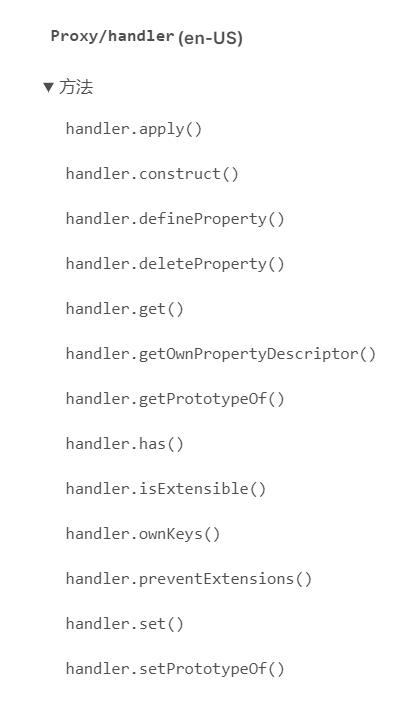

#### demos

##### 基础示例
```js
const handler = {
    get: function (obj, prop) {
        return prop in obj ? obj[prop] : 233
    }
}

const p = new Proxy({}, handler)
p.a = 123;
p.b = undefined;

console.log(p.a, p.b); // 123 undefined
console.log(p.c); // 233

```


##### 无操作转发代理

我们使用了一个原生 JavaScript 对象，代理会将所有应用到它的操作转发到这个对象上。

```js
let target = {};
let p = new Proxy(target, {});

p.a = 37; // 操作转发到目标

console.log(target.a); // 37. 操作已经被正确地转发
```

##### 验证
通过代理，你可以轻松地验证向一个对象的传值。下面的代码借此展示了 set handler 的作用

```js
let validator = {
    set: function (obj, prop, value) {
        if (prop === 'age') {
            if (!Number.isInteger(value)) {
                throw new TypeError('The age is not an integer');
            }

            if (value > 200) {
                throw new RangeError('The age is out-of-range')
            }
        }
        // The default behavior to store the value
        obj[prop] = value;

        // 表示成功
        return true;
    }
}

var person = new Proxy({}, validator);

person.age = 100; // Proxy: { age: 100 }

person.age = '123' // Uncaught TypeError: The age is not an integer

person.age = 222 // Uncaught RangeError: The age is out-of-range
```

##### 操作DOM节点
有时，我们可能需要互换两个不同的元素的属性或类名。下面的代码以此为目标，展示了 set handler 的使用场景。

```js
let view = new Proxy({
  selected: null
}, {
  set: function(obj, prop, newval) {
    let oldval = obj[prop];

    if (prop === 'selected') {
      if (oldval) {
        oldval.setAttribute('aria-selected', 'false');
      }
      if (newval) {
        newval.setAttribute('aria-selected', 'true');
      }
    }

    // 默认行为是存储被传入 setter 函数的属性值
    obj[prop] = newval;

    // 表示操作成功
    return true;
  }
});

let i1 = view.selected = document.getElementById('item-1');
console.log(i1.getAttribute('aria-selected')); // 'true'

let i2 = view.selected = document.getElementById('item-2');
console.log(i1.getAttribute('aria-selected')); // 'false'
console.log(i2.getAttribute('aria-selected')); // 'true'
```

##### 值修正及附加属性

以下`products`代理会计算传值并根据需要转换为数组。这个代理对象同时支持一个叫做 `latestBrowser`的附加属性，这个属性可以同时作为 getter 和 setter。

```js
et products = new Proxy({
  browsers: ['Internet Explorer', 'Netscape']
}, {
  get: function(obj, prop) {
    // 附加一个属性
    if (prop === 'latestBrowser') {
      return obj.browsers[obj.browsers.length - 1];
    }

    // 默认行为是返回属性值
    return obj[prop];
  },
  set: function(obj, prop, value) {
    // 附加属性
    if (prop === 'latestBrowser') {
      obj.browsers.push(value);
      return;
    }

    // 如果不是数组，则进行转换
    if (typeof value === 'string') {
      value = [value];
    }

    // 默认行为是保存属性值
    obj[prop] = value;

    // 表示成功
    return true;
  }
});

console.log(products.browsers); // ['Internet Explorer', 'Netscape']
products.browsers = 'Firefox';  // 如果不小心传入了一个字符串
console.log(products.browsers); // ['Firefox'] <- 也没问题，得到的依旧是一个数组

products.latestBrowser = 'Chrome';
console.log(products.browsers);      // ['Firefox', 'Chrome']
console.log(products.latestBrowser); // 'Chrome'
```

##### 数据绑定和监听
```js
let onWatch = (obj, setBind, getLogger) => {
    let handler = {
        get(target, prop, receiver) {
            getLogger(target, prop);
            return Reflect.get(target, prop, receiver);
        },
        set(target, prop, value, receiver) {
            setBind(value);
            return Reflect.set(target, prop, value);
        }
    }

    return new Proxy(obj, handler);
}

let obj = { a: 1 }
let value
let p = onWatch(obj, (v) => {
  value = v
}, (target, property) => {
  console.log(`Get '${property}' = ${target[property]}`);
})
p.a = 2 // bind `value` to `2`
p.a // -> Get 'a' = 2

```

### 为什么 0.1 + 0.2 != 0.3

#### Why

> Computers can only natively store integers, so they need some way of representing decimal numbers. This representation is not perfectly accurate. This is why, more often than not, 0.1 + 0.2 != 0.3.

计算器原本只支持整数的表示，因此需要一些方法来表示小数，但这种方法并不是完全精确，所以导致了一些小数相加的结果出乎意料。

> It’s actually rather interesting. When you have a `base-10 system (like ours), it can only express fractions that use a prime factor of the base.` `The prime factors of 10 are 2 and 5`. So 1/2, 1/4, 1/5, 1/8, and 1/10 can all be expressed cleanly because the denominators all use prime factors of 10. In contrast, `1/3, 1/6, 1/7 and 1/9 are all repeating decimals because their denominators use a prime factor of 3 or 7`.

十进制系统里只能准确表示以`10`的质因子组成的小数，其它的都表示为循环小数

> In binary (or base-2), `the only prime factor is 2, so you can only cleanly express fractions whose denominator has only 2 as a prime factor.` In binary, 1/2, 1/4, 1/8 would all be expressed cleanly as decimals, while 1/5 or 1/10 would be repeating decimals. So 0.1 and 0.2 (1/10 and 1/5), while clean decimals in a base-10 system, are repeating decimals in the base-2 system the computer uses. When you perform math on these repeating decimals, you end up with leftovers which carry over when you convert the computer’s base-2 (binary) number into a more human-readable base-10 representation.

在二进制系统中，只有质因子2，所以`1/4`/`1/8`可以准确表达，其它的如`1/5`/`1/10`都会表示为循环小数，所以尽管`0.1`和`0.2`在十进制中是可以准确表达的小数，但在计算机使用的二进制系统中是循环小数。当你对这些循环小数进行数学运算时，当你把电脑上以2为底(二进制)的数字转换成更容易被人类读懂的以10为底的数字时，你会得到一些剩余的结果。

前面的现象，其它一些语言也可能有同样的问题，归根结底其实和具体的编程语言无关，主要问题还是计算机中到底是如何表示小数以及如何进行小数运算的。

> 与许多其他编程语言不同，JavaScript 并未定义不同类型的数字数据类型，而是始终遵循国际 IEEE 754 标准，将数字存储为双精度浮点数。


#### 推导

因为 JS 采用 IEEE 754 双精度版本（64位），并且只要采用 IEEE 754 的语言都有该问题。

计算器内部的数都是采用二进制表示的，十进制转二进制方法：
- 十进制整数转二进制整数：除2取余，逆向排序；
- 十进制小数转二进制小数：乘2取整，顺序排列；

所以十进制0.1转为二进制的过程是乘2取整过程：
```js
0.1 * 2 = 0.2 // 0
0.2 * 2 = 0.4 // 0
0.4 * 2 = 0.8 // 0
0.8 * 2 = 1.6 // 1
0.6 * 2 = 1.2 // 1
0.2 * 2 = 0.4 // 0
...

```
从上面可以看出0.1的二进制格式为：0.000110011...———— 一个无限循环小数，计算器存储位数有限，我们没办法将其精确表示，因此存在精度问题；

> 为了解决部分小数无法用二进制精确表示的问题，于是有了`IEEE 754规范`；

> 浮点数和小数并不是完全一样的，计算机中小数的表示法，其实有定点和浮点两种。因为在位数相同的情况下，定点数的表示范围要比浮点数小。所以在计算机科学中，使用浮点数来表示实数的近似值。

IEEE 754规定了四种表示浮点数值的方式：单精确度（32位）、双精确度（64位）、延伸单精确度（43比特以上，很少使用）与延伸双精确度（79比特以上，通常以80位实现）。`其中最常用的就是32位单精度浮点数和64位双精度浮点数。`

> IEEE并没有解决小数无法精确表示的问题，只是提出了一种使用近似值表示小数的方式，并且引入了精度的概念。

浮点数是一串0和1构成的位序列(bit sequence)，从逻辑上用三元组{S,E,M}表示一个数N,如下图所示：

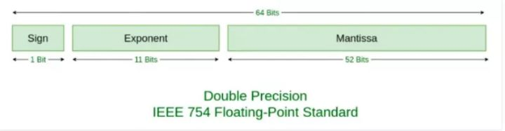

- S(sign)表示N的符号位。对应值s满足：n>0时，s=0; n≤0时，s=1。
- E(exponent)表示N的指数位，位于S和M之间的若干位。对应值e值也可正可负。
- M(mantissa)表示N的尾数位，恰好，它位于N末尾。M也叫有效数字位（significand）、系数位（coefficient）, 甚至被称作"小数"。

一个浮点数实际可以表示为：
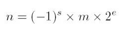

> 而对于那些无限循环的二进制数来说，计算机采用浮点数的方式保留了一定的有效数字，那么这个值只能是近似值，不可能是真实值。

十进制`0.1`
=> 二进制0.0001100110011001100110011...（循环0011）
=> 尾数为1.1001100110011001100...1100（共52位，除了小数点左边的1）,指数为-4（二进制移码为00000000100）,符号位为0 => 存储为0 00000000100 100110011...11001 => => 因为尾数最多52位，所以实际存储的值为0.00011001100110011001100110011001100110011001100110011001


十进制`0.2`
=> 二进制0.00110011001100110011001100110011001100110011001100110011（循环0011）=> 尾数为1.1001100110011001100...1100（共52位，除了小数点左边的1）,指数为-3（二进制移码为00000000011）,符号位为0 => 存储为0 00000000011 100110011...11001 => => 因为尾数最多52位，所以实际存储的值为0.0011001100110011001100110011001100110011001100110011001

两者相加得：
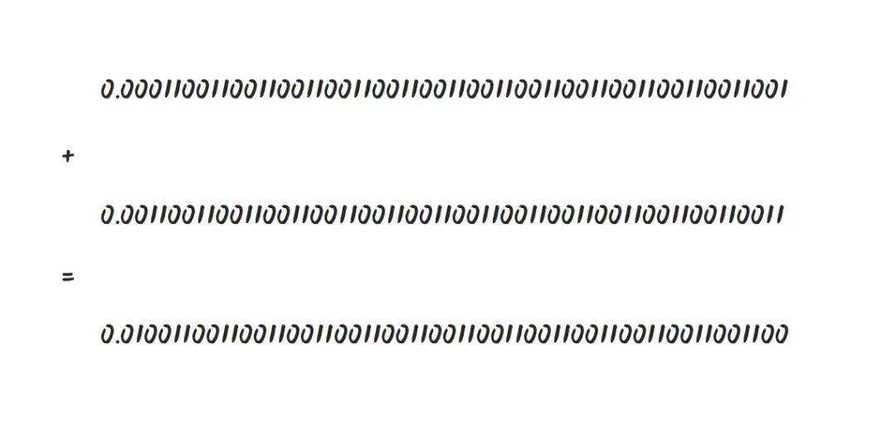

0.01001100110011001100110011001100110011001100110011001100转为十进制后得到： 0.30000000000000004


#### 解决方案：
```js
parseFloat((0.1 + 0.2).toFixed(10))
```

### V8 下的垃圾回收机制
V8 实现了准确式 GC，GC 算法采用了分代式垃圾回收机制。因此，V8 将内存（堆）分为新生代和老生代两部分。

#### 新生代算法
新生代中的对象一般`存活时间较短`，使用 Scavenge GC 算法。

在新生代空间中，内存空间分为两部分，分别为 From 空间和 To 空间。在这两个空间中，必定有一个空间是使用的，另一个空间是空闲的。新分配的对象会被放入 From 空间中，当 From 空间被占满时，新生代 GC 就会启动了。算法会检查 From 空间中存活的对象并复制到 To 空间中，如果有失活的对象就会销毁。当复制完成后将 From 空间和 To 空间互换，这样 GC 就结束了。

#### 老生代算法
`老生代中的对象一般`存活时间较长且数量也多，使用了两个算法，分别是`标记清除算法`和`标记压缩算法`

在老生代中，以下情况会先启动标记清除算法：
- 某一个空间没有分块的时候
- 空间中被对象超过一定限制
- 空间不能保证新生代中的对象移动到老生代中

在这个阶段中，会遍历堆中所有的对象，`然后标记活的对象，在标记完成后，销毁所有没有被标记的对象`。在标记大型对内存时，可能需要几百毫秒才能完成一次标记。这就会导致一些性能上的问题。为了解决这个问题，2011 年，V8 从 stop-the-world 标记切换到`增量标记`。在增量标记期间，GC 将标记工作分解为更小的模块，可以让 JS 应用逻辑在模块间隙执行一会，从而不至于让应用出现停顿情况。但在 2018 年，GC 技术又有了一个重大突破，这项技术名为并发标记。该技术可以让 GC 扫描和标记对象时，同时允许 JS 运行。

除对象后会造成堆内存出现碎片的情况，`当碎片超过一定限制后会启动压缩算法`。在压缩过程中，将活的对象像一端移动，直到所有对象都移动完成然后清理掉不需要的内存。

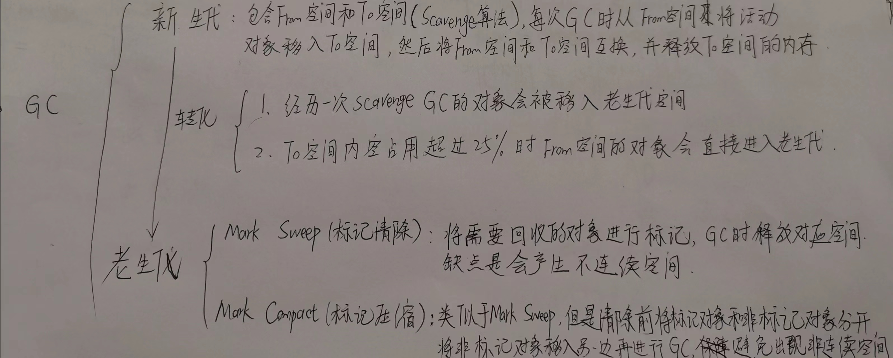


___

# 浏览器

## 事件机制
### DOM事件级别
> DOM有4次版本更新，与DOM版本变更，产生了3种不同的DOM事件：`DOM 0级事件处理，DOM 2级事件处理和DOM 3级事件处理`。由于DOM 1级中没有事件的相关内容，所以没有DOM 1级事件。

#### DOM 0级事件

> 同一个元素只能绑定一个函数，否则后面的函数与覆盖之前的函数，非HTML属性类DOM 0级事件解绑时btn.onclick = null即可
1. on-event(HTML属性)
```
<button onclick="alert('xxx')"/>
```

2. on-event(非HTML属性)
```
window.onload = function(){
  document.write("Hello world!");
};

btn.onclick = function () {

}
```

#### DOM 2级事件
> DOM 2级事件通过`addEventListener`定义；同一个元素可以绑定多个事件，按照绑定顺序执行；解绑使用`removeEventListener`；


```js
element.addEventListener(event, function, useCapture)
```

> Dom 2级事件有三个参数：第一个参数是事件名（如click）；第二个参数是事件处理程序函数；`第三个参数如果是true的话表示在捕获阶段调用`，为false的话表示在冒泡阶段调用，默认为冒泡。


```html
<body>
    <div class="wrapper">
        <button id="a">aaa</button>
        <button id="b">bbb</button>
    </div>
    <script>
        window.onload = function () {
            var btn = document.querySelector('#a')
            var btn2 = document.querySelector('#b')
            
            btn.onclick = function () {
                console.log(111)
            }

            btn.onclick = function () {
                console.log(222)
            }

            btn.addEventListener('click', function() {
                console.log(333)
            })

            btn2.addEventListener('click', function() {
                console.log(444)
            })

            btn2.addEventListener('click', function() {
                console.log(555)
            })
        }
    </script>
</body>
```

点击`btn`先输出222，后输出333；点击`btn2`先输出444，后输出555；


#### DOM 3级事件
DOM3级事件在DOM2级事件的基础上添加了更多的事件类型，增加的类型如下：
- UI事件，当用户与页面上的元素交互时触发，如：load、scroll
- 焦点事件，当元素获得或失去焦点时触发，如：blur、focus
- 鼠标事件，当用户通过鼠标在页面执行操作时触发如：dblclick、mouseup
- 滚轮事件，当使用鼠标滚轮或类似设备时触发，如：mousewheel
- 文本事件，当在文档中输入文本时触发，如：textInput
- 键盘事件，当用户通过键盘在页面上执行操作时触发，如：keydown、keypress
- 合成事件，当为IME（输入法编辑器）输入字符时触发，如：compositionstart
- 变动事件，当底层DOM结构发生变化时触发，如：DOMsubtreeModified
同时DOM3级事件也允许使用者自定义一些事件。


### DOM事件流
事件流(Event Flow)指的就是「网页元素接收事件的顺序」。`事件流可以分成两种机制`：
- 事件捕获
- 事件冒泡

当一个事件发生后，会在子元素和父元素之间传播（propagation）。这种`传播分成三个阶段`：

- 捕获阶段：事件从window对象自上而下向目标节点传播的阶段；
- 目标阶段：真正的目标节点正在处理事件的阶段；
- 冒泡阶段：事件从目标节点自下而上向window对象传播的阶段。


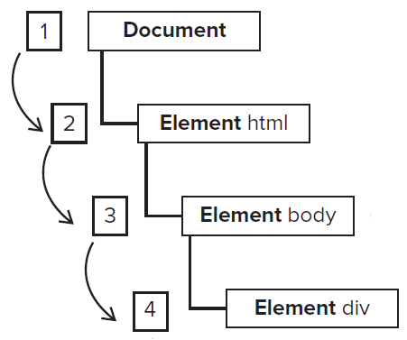
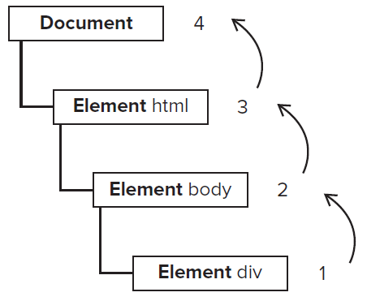


> 一般我们只希望事件触发在目标上，这时可以使用`stopPropagation`来阻止事件的进一步传播。通常我们认为`stopPropagation`是用来阻止事件冒泡的，其实它也可以阻止事件捕获；

> stopImmediatePropagation 同样也能实现阻止事件，但是还能阻止该事件目标执行别的注册事件


### 事件代理
`定义：`如果一个节点中的子节点是动态生成的，那么子节点需要注册事件的话应该注册在父节点上

事件代理有以下优势：
- 节约内存
- 不需要给子节点注销事件


这里需要区分下`target`与`currentTaget`：
- target: 触发事件的元素
- currentTarget: 事件绑定的元素


## 跨域
> `一般我们所说的跨域是指访问非同源的资源的行为`；浏览器通常会允许发送跨域请求，但是会拦截跨域请求的响应；这主要是为了防止恶意网站读取其他网站的可信任信息，以及合理读取其他网站的网页内容；

### 浏览器同源策略
> `同源策略`是一个重要的安全策略，它用于限制一个origin的文档或者它加载的脚本如何能与另一个源的资源进行交互。它能帮助阻隔恶意文档，减少可能被攻击的媒介。

#### 同源定义
> 如果两个 URL 的 protocol、port (en-US) (如果有指定的话) 和 host 都相同的话，则这两个 URL 是同源。

#### 源的更改
> 满足某些限制条件的情况下，页面是可以修改它的源。`脚本可以将 document.domain 的值设置为其当前域或其当前域的父域`。如果将其设置为其当前域的父域，则这个较短的父域将用于后续源检查。

> `端口号是由浏览器另行检查的`。任何对 document.domain 的赋值操作，包括 document.domain = document.domain 都会`导致端口号被重写为 null` 。

#### 跨源网络访问
同源策略控制不同源之间的交互，例如在使用`XMLHttpRequest` 或 `` 标签时则会受到同源策略的约束。这些交互通常分为三类：

- 跨源写操作一般是被允许的；例如链接（links），重定向以及表单提交。特定少数的 HTTP 请求需要添加预检请求。
- 跨源资源嵌入一般是被允许
- 跨源读一般是不被允许的；但常可以通过内嵌资源来巧妙的进行读取访问；

#### 跨源数据存储访问
1. 访问存储在浏览器中的数据，如 `localStorage` 和 `IndexedDB`，是以源进行分割。每个源都拥有自己单独的存储空间，一个源中的 JavaScript 脚本不能对属于其它源的数据进行读写操作。
2. `Cookies` 使用不同的源定义方式。一个页面`可以为本域和其父域设置 cookie`，只要是父域不是公共后缀（public suffix）即可

### 跨域解决方案
#### CORS


##### 定义
> CORS （Cross-Origin Resource Sharing，跨域资源共享）是一个系统，它由一系列传输的HTTP 头组成，`这些 HTTP 头决定浏览器是否阻止前端 JavaScript 代码获取跨域请求的响应`。

> 跨源域资源共享（CORS）机制允许 Web 应用服务器进行跨源访问控制，从而使跨源数据传输得以安全进行。

> 同源安全策略 默认阻止“跨域”获取资源。但是 CORS 给了 web 服务器这样的权限，即服务器可以选择，允许跨域请求访问到它们的资源。

##### 相关的CORS头：
- `Access-Control-Allow-Origin`：响应头，允许的请求域
- `Access-Control-Allow-Credentials`：响应头，Access-Control-Allow-Credentials 标头需要与 `XMLHttpRequest.withCredentials` 或 Fetch API 的 Request() 构造函数中的 credentials 选项结合使用。Credentials 必须在前后端都被配置（即 Access-Control-Allow-Credentials header 和 XHR 或 Fetch request 中都要配置）才能使带 credentials 的 CORS 请求成功。
- `Access-Control-Allow-Headers`：响应头，用在对预请求的响应中，指示实际的请求中可以使用哪些 HTTP 头，包括自定义头
- `Access-Control-Allow-Methods`：指定对预请求的响应中，哪些 HTTP 方法允许访问请求的资源。
- `Access-Control-Max-Age`：指示预请求的结果能被缓存多久
- `Access-Control-Request-Headers`：用于发起一个预请求，告知服务器正式请求会使用哪些 HTTP 头
- `Access-Control-Request-Method`：用于发起一个预请求，告知服务器正式请求会使用哪一种 HTTP 请求方法
- `Origin`：指示获取资源的请求是从什么域发起的

> 一般而言，对于跨源 XMLHttpRequest 或 Fetch 请求，浏览器 不会 发送身份凭证信息。如果要发送凭证信息，需要设置 `XMLHttpRequest` 的某个特殊标志位。（XMLHttpRequest的`withCredentials = true`或Fetch的`credentials: 'include'`）

```js
// 允许 credentials:
Access-Control-Allow-Credentials: true

// 使用带 credentials 的 XHR：
var xhr = new XMLHttpRequest();
xhr.open('GET', 'http://example.com', true) // 第三个参数标识是否为异步请求
xhr.withCredentials = true;

// 使用带credentials的Fetch
fetch(url, {
    credentials: 'include'
})
```

##### 什么情况下需要cors
- XHR或者Fetch APIs发起的跨域请求；
- Web字体（css中通过@font-face使用跨域字体资源）；
- 使用 drawImage 将 Images/video 画面绘制到 canvas
- WebGL textures
- image shappes


##### 简单请求
> 使用CORS时，只有非`简单请求`不会触发`预检请求`

满足下列所有条件则可视为简单请求：
1. 使用以下方法之一：
    - GET
    - POST
    - HEAD

2. 人为设置的请求头在以下请求头之内
    - Accept
    - Accept-Language
    - Content-Language
    - Content-Type（值有限制）

3. Content-Type的值仅限以下之一
    - text/plain
    - multipart/form-data
    - application/x-www-form-urlencoded

4. 请求中的任意 XMLHttpRequest 对象均没有注册任何事件监听器；XMLHttpRequest 对象可以使用 XMLHttpRequest.upload 属性访问

5. 请求中没有使用 ReadableStream 对象

##### 预检请求
> 与前述简单请求不同，“需预检的请求”要求必须`首先使用 OPTIONS 方法发起一个预检请求到服务器，以获知服务器是否允许该实际请求`。"预检请求“的使用，`可以避免跨域请求对服务器的用户数据产生未预期的影响`。

```js
// 预检请求示例
const xhr = new XMLHttpRequest();
xhr.open('POST', 'https://bar.other/resources/post-here/');
xhr.setRequestHeader('X-PINGOTHER', 'pingpong');
xhr.setRequestHeader('Content-Type', 'application/xml');
xhr.onreadystatechange = handler;
xhr.send('<person><name>Arun</name></person>');

```


下面是服务端和客户端完整的信息交互。首次交互是 预检请求/响应：

```
OPTIONS /doc HTTP/1.1
Host: bar.other
User-Agent: Mozilla/5.0 (Macintosh; Intel Mac OS X 10.14; rv:71.0) Gecko/20100101 Firefox/71.0
Accept: text/html,application/xhtml+xml,application/xml;q=0.9,*/*;q=0.8
Accept-Language: en-us,en;q=0.5
Accept-Encoding: gzip,deflate
Connection: keep-alive
Origin: https://foo.example
Access-Control-Request-Method: POST
Access-Control-Request-Headers: X-PINGOTHER, Content-Type

HTTP/1.1 204 No Content
Date: Mon, 01 Dec 2008 01:15:39 GMT
Server: Apache/2
Access-Control-Allow-Origin: https://foo.example
Access-Control-Allow-Methods: POST, GET, OPTIONS
Access-Control-Allow-Headers: X-PINGOTHER, Content-Type
Access-Control-Max-Age: 86400
Vary: Accept-Encoding, Origin
Keep-Alive: timeout=2, max=100
Connection: Keep-Alive
```

##### demo
客户端代码：
```html
<!DOCTYPE html>
<html>

<head>
    <meta charset="utf-8" />
    <meta http-equiv="X-UA-Compatible" content="IE=edge">
    <title>Page Title</title>
    <meta name="viewport" content="width=device-width, initial-scale=1">
</head>

<body>
    <div class="hook"></div>
    <script>
        var target = document.querySelector('.hook');
        var xhr = new XMLHttpRequest();
        xhr.onload = function () {
            if (xhr.readyState == 4) {
                if (xhr.status >= 200 && xhr.status < 300 || xhr.status == 304) {
                    target.innerHTML = xhr.responseText;
                    console.log(xhr.responseText);
                } else {
                    target.innerHTML = 'Reuqest failed:' + xhr.status;
                    console.log("Request failed:", xhr.status);
                }
            }
        }
        // xhr.widthCredientials = true;
        xhr.open('post', 'http://localhost:8080', true);
        xhr.setRequestHeader('Content-Type', 'application/x-www-form-urlencoded');
        xhr.setRequestHeader('X-Stage-Test', 0);
        xhr.send('name=fn&id=12377');
    </script>
</body>

</html>

```

服务端处理：
```js
var qs = require('querystring');
var http = require('http');
var server = http.createServer();

server.on('request', function(req, res) {
    var _data = '';
    req.on('data', function (chunk) {
        _data += chunk;
    })

    req.on('end', function () {
        res.writeHead(200, 'success', {
            'Content-Type': 'application/x-www-form-urlencoded',
            'Access-Control-Allow-Origin': '*',
            'Access-Control-Allow-Headers': 'Content-Type, X-Stage-Test',
            'Access-Control-Allow-Methods': 'GET, GET, POST',
        })

        res.end('message from client: ' + _data)
    })
})

server.listen(8080);
console.log('server is running at port 8080...');
```

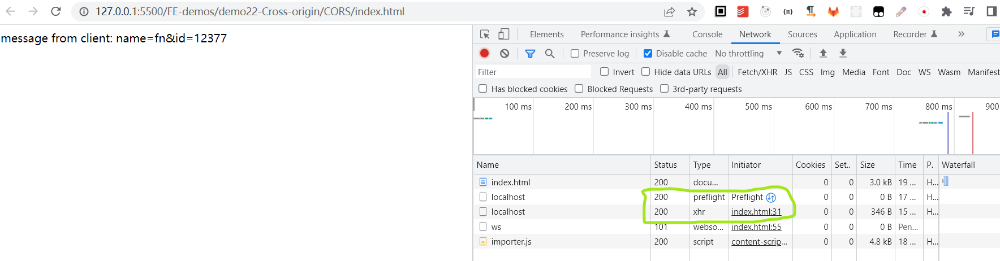


#### JSONP

##### 原理
script标签请求的资源不受同源策略限制，但JSONP跨域需要服务器端相应的处理才能支持；

JSONP跨域通常可以动态创建一个script标签，然后在请求的url中带上一些处理参数，一般是一个回调函数；服务端在接收到请求后，从请求中获得处理参数，然后将处理结果返回给客户端；如果返回的是函数调用，那么客户端的回调函数就会被调用执行；

> 除了 script 标签， link、img 等标签的请求也是允许跨域的。

##### 限制
`JSONP只支持GET请求方式`，本质上是因为script标签请求资源的方式就是GET；另外，根据实现过程可以看到，`jsonp的返回是一个函数调用，容易导致XSS攻击等安全问题`；

##### 实现
客户端代码如下，其URL为http://localhost:8001/test/test1.html；请求的服务器地址为：http://localhost:8080/；为了跨域，在请求的url加入一个callback参数指定jsonp回调函数名称；服务端接收到请求后从中提取请求参数及回调函数名，然后将对应的回调函数包裹相应参数返回给客户端handleCallback(id)；这时客户端的handleCallback()函数就会被自动调用。

```html
// 客户端
<!DOCTYPE html>
<html lang="en">

<head>
    <meta charset="UTF-8">
    <meta http-equiv="X-UA-Compatible" content="IE=edge">
    <meta name="viewport" content="width=device-width, initial-scale=1.0">
    <title>Document</title>
</head>

<body>
    <button onclick="jsonp();">request</button>
    <div id='req_times'></div>
    <script>
        function jsonp() {
            console.log(123)
            var script = document.createElement('script');
            script.type = 'text/javascript';
            script.src = 'http://localhost:8080?callback=handleCallback';
            document.head.appendChild(script);
        }

        // jquery请求方式
        // function ajax() {
        //     $.ajax({
        //         url: 'http://localhost:8080',
        //         type: 'GET',
        //         dataType: 'jsonp',
        //         jsonpCallback: 'handleCallback',
        //     })
        // }

        function handleCallback(id) {
            console.log('handleCallback request times：', id);
            document.querySelector('#req_times').innerHTML = `handleCallback request times：${encodeURI(id)}`
        }
    </script>
</body>

</html>
```

服务端处理：
```js
var qs = require('querystring');
var http = require('http');
var server = http.createServer();

var id = 0;

server.on('request', function (req, res) {
    console.log(req.url);
    console.log(req.url.split('?'));
    var params = qs.parse(req.url.split('?')[1]);
    
    var fn = params.callback;

    res.writeHead(200, {'Content-Type': 'text/javascript'});
    res.write(fn + '(' + id++ + ')');
    res.end();
})

server.listen('8080');
console.log('server is running at port 8080...');	
```


#### postMessage
##### API介绍
```js
targetWindow.postMessage(message, targetOrigin, [transfer]); // 发送消息

window.onmessage = function (e) {
    // console.log(e.data); //e对象下具有data，source及origin属性
}
```

其中，`targetWindow`是想要通信的其他页面的window对象；`targetOrigin`是预通信的其他页面的域名，可以设置为*与任何页面通信，但出于安全考虑不建议；`mesage是要进行通信的数据，已经可以支持字符串、对象等多种数据类型`；transfer是可选参数，表示一个与message同时发送到接收方的Transferable对象，控制权由发送方转移到接收方；

onmessage监听消息，回调函数传入对象e，具有属性data、source、origin；`data`是传递的数据；`source`是对发送方window对象的引用；`origin`是发送方的域名；


##### demo

```html
// index.html 域名localhost:8001
<!DOCTYPE html>
<html lang="en">
<head>
  <meta charset="UTF-8">
  <meta name="viewport" content="width=device-width, initial-scale=1.0">
  <meta http-equiv="X-UA-Compatible" content="ie=edge">
  <title>Document</title>
</head>
<body>
  <h1>HTML5 postMessage</h1>
  <p></p>
  <iframe src="http://localhost:8888/test/sub.html" frameborder="0" onload="load()"></iframe>
  <script>
    function load() {
      var iframe = document.querySelector('iframe');
      iframe.contentWindow.postMessage('i need some msg from you.', 'http://localhost:8888');
      // window.postMessage({'name': 'post', method: 'cors'}, 'http://localhost:8880/test/sub.html');
      window.onmessage = function (e) {
        console.log(e.data);
      }
    }
  </script>
</body>
</html>

```

```js
// sub.html
<!DOCTYPE html>
<html lang="en">
<head>
  <meta charset="UTF-8">
  <meta name="viewport" content="width=device-width, initial-scale=1.0">
  <meta http-equiv="X-UA-Compatible" content="ie=edge">
  <title>Document</title>
</head>
<body>
  <script>
    window.onmessage = function (e) {
      console.log(e.data);
      e.source.postMessage({'name': 'post', method: 'cors'}, e.origin);
    }  
  </script>
</body>
</html>
```

运行结果：
```js
i need some msg from you. // sub.html输出
{name: "post", method: "cors"}	// index.html输出
```

#### WebSocket

WebSocket是HTML5新增的一种用于客户端和服务端进行`全双工通信`的协议，可以在客户端和服务端建立一个持久化的连接，并且在一个TCP连接中高效双向数据传递；


服务端代码：
```js
const WebSocket = require('ws');

const socket = new WebSocket.Server({ port: 5555 });

socket.on('connection', ws => {
    ws.on('message', (data) => {
        console.log('data from client: ', data);
        ws.send('hello websocket...');
        console.log('server finish sending data...')
    })
})

```

客户端代码：
```html
<!DOCTYPE html>
<html>

<head>
    <meta charset="utf-8" />
    <meta http-equiv="X-UA-Compatible" content="IE=edge">
    <title>Page Title</title>
    <meta name="viewport" content="width=device-width, initial-scale=1">
</head>

<body>
    <div class="hook"></div>
    <script>
        SocketEvent = () => {

            if (window.WebSocket) {
                console.log('llll')
                var socket = new WebSocket('ws://localhost:5555');

                socket.onopen = function () {
                    console.log('client socket opening...');
                    socket.send(`I'm requesting some data from you...`);
                }
                socket.onmessage = function (e) {
                    console.log('on message', e);
                    console.log('on message data', e.data);
                }
                socket.onclose = function (e) {
                    console.log('client socket closing...');
                }
            }
        }
    </script>
    <button onclick="SocketEvent()">socket</button>
</body>

</html>
```

#### document.domain + iframe

`document.domain跨域的基础是二级域名、协议及端口号要一致，通过document.domain修改页面的域名，从而达到同一顶级域名下的子域名间的跨域`；举个例子：
比如一主页面的域名是sale.game.abc.com，内嵌一个iframe，如下：
```JS
<iframe id="demo" src="http://gamestatic.abc.com/game/test/a.html">
```

由于主页面的域名与嵌入的子页面的二级域名是一致的，都是abc.com，因此可以使用该方法进行跨域；需要在主页面和子页面的脚本中分别使用以下语句将页面的域名置为abc.com；

```JS
document.domain = 'abc.com';

```

这样，`父级页面就可以获取iframe子页面的document对象，并且获取和操作子页面的dom元素了；否则，受跨域限制直接在不同子域名下的两个关联页面也无法操作对方的dom`；


#### window.name + iframe

##### window.name特性
- `window.name`是一个全局变量
- 每个窗口有一个独立的`window.name`与之对应，默认值为空字符串
- `window.name与每个窗口的生命周期相关`，`同一个窗口载入的多个页面同享同一个window.name值`，窗口关闭则对应的window.name也被销毁；
- 不同窗口打开的同一域名的两个页面的`window.name`不能共享；
- window.name数据格式可以自定义，大小一般不超过2M；


#### node正向代理

##### 原理
`同源策略是浏览器端的安全策略；如果把请求通过node服务器代理请求，那么就没有跨域限制了`；`http-proxy-middleware`是node中常用的设置代理的插件库，可以与express、connet等配合使用

##### demo
```js
const http = require('http');
const server = http.createServer();
const qs = require('qs');
const url = require('url');

let count = 0;

server.on('request', (req, res) => {
    count++;
    const query = url.parse(req.url, true).query;
    res.writeHead(200, {
        'Set-Cookie', 'name=fn;Path=/;Domain=localhost:6688;HttpOnly'
    })
    query.count == 1 ? res.write(`Response from Server -- localhost:6688; visit count: ${count}`) : res.write(`Response from Server -- localhost:6688; no tracking...`);
    res.end();
})

server.listen(6688);
console.log('server is running at port 6688...')
```

```js
const express = require('express');
const proxy = require('http-proxy-middleware');
const app = express();

const options = {
    target = 'http://localhost:6688',
    changeOrigin: true,
    onProxyRes: (proxyRes, req, res) => {
        res.header('Access-Control-Allow-Origin', 'http:localhost');
        res.header('Access-Control-Allow-Credentials', true);
        proxyRes.headers['x-self-defined'] = 'node middleware';
    }
}

app.use('./api', proxy(options));

app.listen(8002);
console.log('proxy server is listen at port 8002');

```

访问`http://localhost:6688/api?count=0`后可以看到
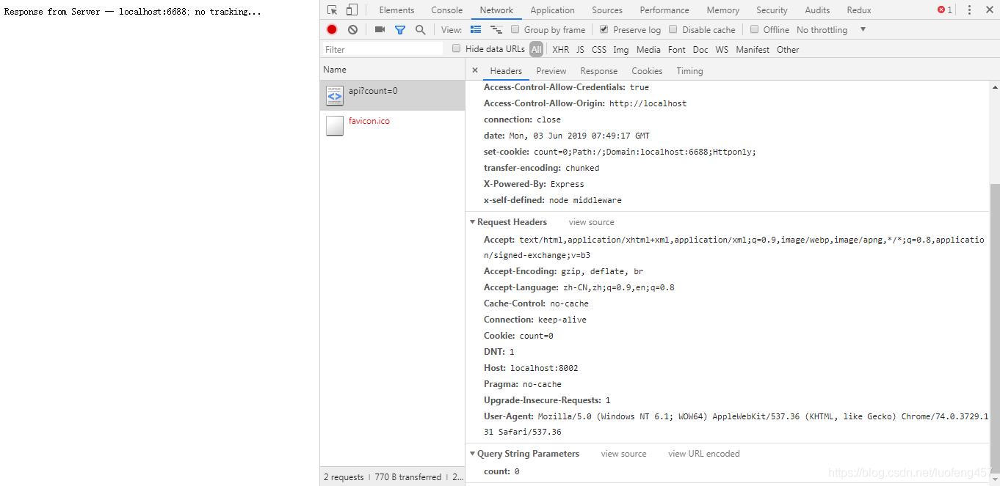


#### nginx反向代理
##### 原理
与node中间件的原理一样，都是利用服务端不受同源策略限制的特点，使用同域名的反向代理服务器转发请求，从而进行跨域；

##### 实现

```
# nginx配置

worker_processes 1; // 工作进程数，与CPU相同

events: {
    connections 1024; // 每个进程最大连接数
}

http {
    sendfile on; // 高效文件传输模式
    server {
        listen 80;
        server_name localhost;
        # 负载均衡与反向代理
        location / {
            root html;
            index index.html index.htm;
        }
        location /test.html {
            proxy_pass http:localhost:6688
        }
    }
}
```

```js
// server.js  http://localhost:6688
const http = require('http');
const server = http.createServer();
const qs = require('querystring');
const url = require('url');

let count= 0;

server.on('request', (req, res) => {
  // var params = url.parse(req.url, true);
  var params = qs.parse(req.url.split('?')[1]);
  res.write(JSON.stringify(params));
  res.end(`port: 6688`);
})

server.listen(6688);
console.log('server is running at port 6688...')
```

此时，直接访问`localhost/test.html`域名时`nginx会将请求代理到localhost:6688`域名下，从而实现跨域；

### Event Loop

JS是非阻塞的单线程语言，

#### 宏任务与微任务

- 微任务：`process.nextTick`、`promise`、`Object.observe`、`MutaionObserver`
- 宏任务： `script`、`setTimeout`、`setInterval`、`setImmediate`、`I/O`、`UI rendering`

#### 一次Event Loop的执行顺序

- 执行同步代码，这属于宏任务 
- 执行栈为空，查询是否有微任务需要执行
- 执行所有微任务
- 必要的话渲染UI
- 然后开始下一轮 Event loop

##### demos
```js
async function async1() {
    console.log("async1 start");
    await async2();
    console.log("async1 end");
}

async function async2() {
    console.log("async2");
}

console.log("script start");

setTimeout(function() {
    console.log("setTimeout");
}, 0);

async1();

new Promise(function(resolve) {
    console.log("promise1");
    resolve();
}).then(function() {
    console.log("promise2");
});

console.log("script end");
// script start -> async1 start -> async2 -> promise1 ->
// script end -> async1 end -> promise2 -> setTimeout
```


#### Node中Event Loop
> Node中的Event Loop和浏览器中的不相同


##### 当nodejs启动时，会执行三件事：
- 初始化`Event Loop`;
- 开始执行脚本；
- 进入`Event Loop`；

共有6个阶段，并按顺序反复执行：
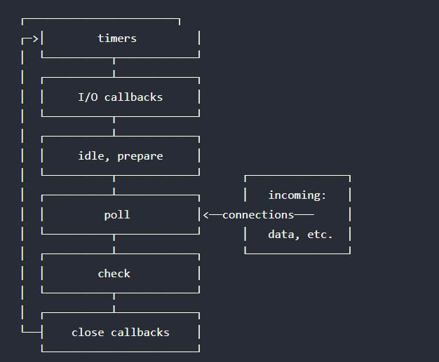


##### timers阶段

处理`setTimeout`和`setInterval`中到时的回调函数，对于timers中队列的处理，setTimeout或setInterval中的函数都添加到队列里，同时记下来这些函数什么时间被调用到了调用时间就调用，没到时间就进入下一阶段，然后会停留在poll阶段

##### I/O callback阶段

I/O 阶段会执行除了 close 事件、定时器及setImmediate的其他回调

###### idle, prepare
idle, prepare 阶段内部实现，暂时不深究

##### poll(轮询)
poll 阶段很重要，这一阶段中，系统会做两件事情：
- 执行到点的定时器
- 执行 poll 队列中的事件

并且当 poll 中没有定时器的情况下，会发现以下两件事情
- 如果 poll 队列不为空，会遍历回调队列并同步执行，直到队列为空或者系统限制
- 如果 poll 队列为空，会有两件事发生
    - 如果有 `setImmediate` 需要执行，poll 阶段会停止并且进入到 `check` 阶段执行 `setImmediate`；
    - 如果没有 `setImmediate` 需要执行，会等待回调被加入到队列中并立即执行回调

如果有别的定时器需要被执行，会回到 timer 阶段执行回调

##### check
check 阶段执行 `setImmediate`;

##### close callbacks
close callbacks 阶段执行 close 事件

##### nextTick

> 进入每个阶段前都会执行，也就是当前阶段结束后立马执行nextTick，然后进入下一阶段，包括nodejs启动的时候也会执行

> Node 中的 `process.nextTick` 会先于其他 `microtask` 执行。

```js
setTimeout(() => {
    console.log('timeout')
    process.nextTick(() => {
        console.log('timeout next tick')
    })
})
setImmediate(() => {
    console.log('immediate')
})
process.nextTick(() => {
    console.log('next tick')
})
// next tick -> timeout -> timeout next tick -> immediate
```

```js
var fs = require('fs')

fs.readFile(__filename, () => {
  setTimeout(() => {
    console.log('timeout')
  }, 0)
  setImmediate(() => {
    console.log('immediate')
  })
})
// 因为 readFile 的回调在 poll 中执行
// 发现有 setImmediate ，所以会立即跳到 check 阶段执行回调
// 再去 timer 阶段执行 setTimeout
// 所以以上输出一定是 setImmediate，setTimeout
```

上面介绍的都是 macrotask 的执行情况，microtask 会在以上每个阶段完成后立即执行。
```js
setTimeout(() => {
  console.log('timer1')

  Promise.resolve().then(function() {
    console.log('promise1')
  })
}, 0)

setTimeout(() => {
  console.log('timer2')

  Promise.resolve().then(function() {
    console.log('promise2')
  })
}, 0)

// 以上代码在浏览器和 node 中打印情况是不同的
// 浏览器中一定打印 timer1, promise1, timer2, promise2
// node 中可能打印 timer1, timer2, promise1, promise2
// 也可能打印 timer1, promise1, timer2, promise2
```


### 存储

#### cookie, localStorage, sessionStorage, indexDB对比

|特性|cookie|localStorage|sessionStorage|indexDB|
|-|-|-|-|-|
|数据生命周期|一般由服务器生成，可以设置过期时间|持久存储，除非被清理，否则一直存在|会话级别，页面关闭就清理|除非被清理，否则一直存在|
|数据存储大小|4kb|5M|5M|无限|
|与服务端通信|每次都会携带在 header 中，对于请求性能影响|不参与|不参与|不参与|

#### cookie安全性
|属性|作用|
|-|-|
|value|如果用于保存用户登录态，应该将该值加密，不能使用明文的用户标识|
|http-only|`用于阻止 JavaScript 通过 Document.cookie 属性访问 cookie`。注意，设置了 HttpOnly 的 cookie 在 JavaScript `初始化的请求中仍然会被发送`。减少 XSS 攻击|
|secure|只能在协议为 HTTPS 的请求中携带|
|same-site|规定浏览器不能在跨域请求中携带 Cookie，减少 CSRF 攻击；可选值有`Strict`、`Lax`、`None`|

- Strict: 这意味`浏览器仅对同一站点的请求发送 cookie`，即请求来自设置 cookie 的站点。如果请求来自不同的域或协议（即使是相同域），则携带有 SameSite=Strict 属性的 cookie 将不会被发送。

- Lax：这意味着 `cookie 不会在跨站请求中被发送`，如：加载图像或 frame 的请求。`但 cookie 在用户从外部站点导航到源站时，cookie 也将被发送`（例如，跟随一个链接）。这是 SameSite 属性未被设置时的默认行为。

-None：这意味着`浏览器会在跨站和同站请求中均发送 cookie`。在`设置这一属性值时，必须同时设置 Secure 属性`，就像这样：SameSite=None; Secure。


#### Service Worker
> Service Workder相当于浏览器与web应用程序之间的代理服务器，可以捕获请求事件并做相应处理；目前主要用于`离线应用`以及`消息推送`及`后台同步`等；

##### 特性
- 无法直接访问和操作DOM
- 在长时间不用时会被中止并在下次需要时重启
- 可以访问和操作indexedDB API
- 推荐使用HTTPS
- 内部实现基于Promise

##### 生命周期


##### 事件
;

##### demo
1. 注册
```js
if ('serviceWorker' in navigator) {
    window.addEventListener('load', () => {
        navigator.serviceWorker.register('sw.js')
            .then(registration => {
                console.log('sw installed: ', registration);
            })
            .catch(err => console.log('sw installed failed: ', err));
    })
}
```

2. 安装Service Worker
```js
// 监听install事件并缓存所需文件
var CACHE_NAME = 'sw-cache';
var CACHE_URLS = ['./index.html', './index.js', './public/equal.png', './public/icon.png'];
self.addEventListener('install', e => {
    self.skipWaiting();  /* 跳过等待状态并尽快替代旧的SW进入活动状态 */
    e.waitUntil(
        caches.open(CACHE_NAME) // 打开缓存
        .then(cache => cache.addAll(CACHE_URLS))
    )
})
```

3. 捕获请求并处理
```js
self.addEventListener('fetch', e => {
    e.responseWith(
        caches.match(e.request)
        .then(res => { // 检测缓存资源和请求资源是否匹配， e.request具有以下属性：url/method/header/body
            if (res) {
                return res;
            }
            console.log('loaded from sw：', res);
        })
    )
})
```

运行结果
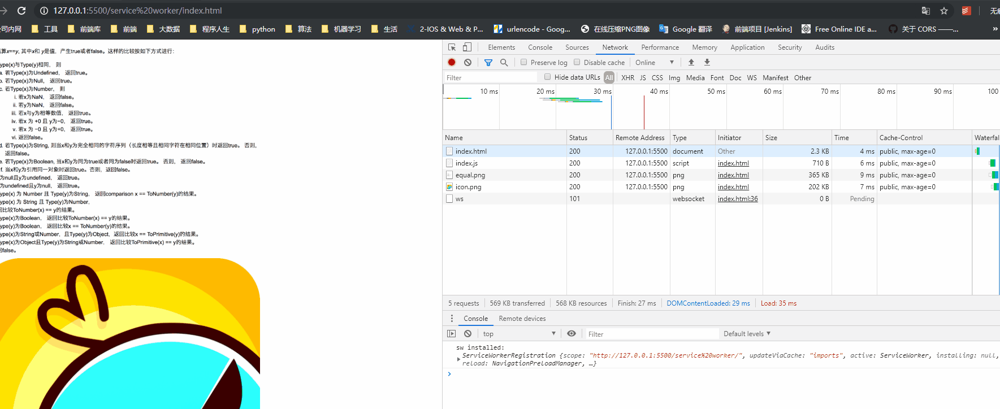

在`cache Storage`中可以看到名为`sw-cache`的缓存；


### 渲染机制

#### 渲染流程
浏览器的渲染机制一般分为以下几个步骤：
1. 处理HTML并构建DOM树；
2. 处理CSS并构建CSSOM树；
3. 将DOM树和CSSOM树合并为一个渲染树；
4. genj渲染树布局，计算每个节点的位置；
5. 调用GPU绘制，合成图层，并显示在屏幕上；


> `在构建 CSSOM 树时，会阻塞渲染，直至 CSSOM 树构建完成`。并且`构建 CSSOM 树是一个十分消耗性能的过程，所以应该尽量保证层级扁平，减少过度层叠`，越是具体的 CSS 选择器，执行速度越慢。

>当 HTML 解析到 script 标签时，会暂停构建 DOM，完成后才会从暂停的地方重新开始。也就是说，如果你想首屏渲染的越快，就越不应该在首屏就加载 JS 文件。并且 CSS 也会影响 JS 的执行，只有当解析完样式表才会执行 JS，所以也可以认为这种情况下，CSS 也会暂停构建 DOM。

#### `Load`与`DOMContentLoaded`区别

- Load 事件触发代表页面中的 DOM，CSS，JS，图片已经全部加载完毕。

- DOMContentLoaded 事件触发代表初始的 HTML 被完全加载和解析，不需要等待 CSS，JS，图片加载


#### 图层

一般来说，可以把普通文档流看成一个图层。特定的属性可以生成一个新的图层。`不同的图层渲染互不影响，所以对于某些频繁需要渲染的建议单独生成一个新图层，提高性能`。但也不能生成过多的图层，会引起反作用。

通过以下几个常用属性可以生成新图层
- 3D变换：`translate3d`、`translateZ`
- `will-change`
- `video`、`iframe`标签
- 通过动画实现的`opacity`动画转场
- `position: fixed`

#### 重绘（repaint）和重排/回流（reflow）

- 重绘：节点改变外观但不会影响布局的，比如`color`；
- 回流：节点尺寸、位置等发生变化导致重新布局的称为回流；

> `回流一定伴随着重绘，但重绘不一定引发回流；回流所需的成本比重绘高的多`，改变深层次的节点很可能导致父节点的一系列回流。

以下几个动作可能会触发性能问题：
- 改变window大小
- 改变字体
- 增删样式
- 文字改变
- 定位或者浮动
- 盒模型

很多人不知道的是，重绘和回流其实和 Event loop 有关。

1. 当 Event loop 执行完 Microtasks 后，会判断 document 是否需要更新。因为浏览器是 60Hz 的刷新率，每 16ms 才会更新一次。
2. 然后判断是否有`resize`或者`scroll`，有的话会去触发事件，所以 `resize 和 scroll 事件也是至少 16ms 才会触发一次，并且自带节流功能`。
3. 判断是否触发了`media query`
4. 更新动画并且发送事件
5. 判断是否有全屏操作事件
6. 执行`requestAnimationFrame`回调
7. 执行`IntersectionObserver`回调，该方法用于判断元素是否可见，可以用于懒加载上，但是兼容性不好
8. 更新界面
9. 以上就是一帧中可能会做的事情。如果在一帧中有空闲时间，就会去执行 requestIdleCallback 回调

#### 减少重绘和回流

- 使用 translate 替代 top
- 使用 visibility 替换 display: none ，因为前者只会引起重绘，后者会引发回流（改变了布局）
- 把 DOM 离线后修改，比如：先把 DOM 给 display:none (有一次 Reflow)，然后你修改 100 次，然后再把它显示出来
- 不要把 DOM 结点的属性值放在一个循环里当成循环里的变量
- 不要使用 table 布局，可能很小的一个小改动会造成整个 table 的重新布局
- 动画实现的速度的选择，`动画速度越快，回流次数越多`，也可以选择使用 requestAnimationFrame
- 将频繁运行的动画变为图层，图层能够阻止该节点回流影响别的元素


___

# 性能

## 网络相关
### DNS预解析

DNS预解析将DNS解析的时间点提前，可以节约DNS解析的时间；
```
<link rel="dns-prefetch" href="//yuchengkai.cn" />
```

```js
// 检测是否支持`dns-prefetch`
const link = document.createElement('link');
const relList = link.relList;
if (!relList || relList.supports)
    return false;
return relList.supports('preload');

```

### 使用HTTP/2.0
由于浏览器的并发请求数限制（通常5-8个），每个请求需要进行TCP三次握手和四次挥手的过程，而TCP的连接比较耗时；另外，TCP的`慢启动`的拥塞控制策略（TCP 连接会随着时间的推移自我调节，起初会限制连接的最大速度，如果数据传输成功，会随着时间的推移提高传输速度）也会一定程度影响传输效率

HTTP/2.0支持了多路复用（多个请求复用一个TCP连接）、头部压缩，更够提升传输性能

#### TCP三次握手与四次挥手

TCP是一种面向连接的单播协议，在发送数据前，通信双方必须在彼此间建立一条连接。所谓的“连接”，其实是客户端和服务器的内存里保存的一份关于对方的信息，如ip地址、端口号等。

TCP提供了一种`可靠`、`面向连接`、字节流、`传输层`的服务，采用三次握手建立一个连接。采用四次挥手来关闭一个连接

##### TCP服务模型
一个TCP连接由一个4元组构成，分别是两个`IP地址`和两个`端口号`。

>一个TCP连接通常分为三个阶段：`启动`、`数据传输`、`退出（关闭）`。

当TCP接收到另一端的数据时，它会发送一个确认，但这个确认不会立即发送，一般会延迟一会儿。ACK是累积的，一个确认字节号N的ACK表示所有直到N的字节（不包括N）已经成功被接收了。这样的好处是如果一个ACK丢失，很可能后续的ACK就足以确认前面的报文段了。

> 序列号的作用是使得一个TCP接收端可丢弃重复的报文段，记录以杂乱次序到达的报文段。因为TCP使用IP来传输报文段，而IP不提供重复消除或者保证次序正确的功能。

##### TCP头部
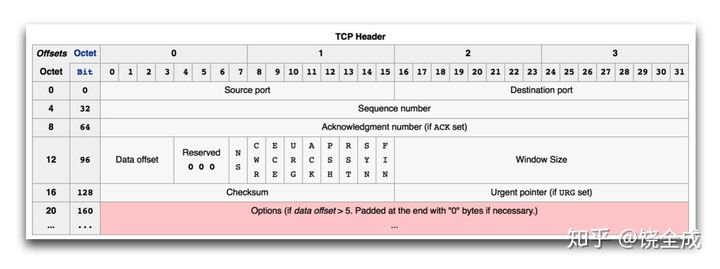

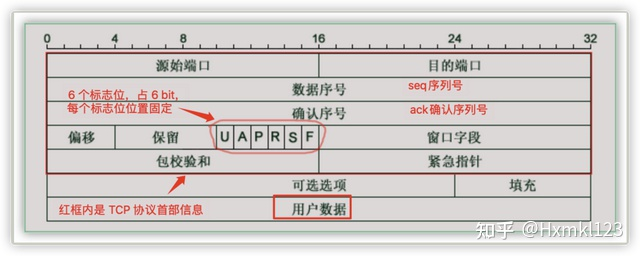
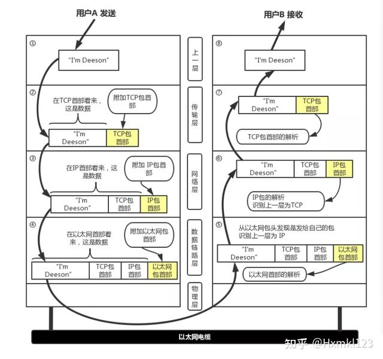

> 源端口和目的端口在TCP层确定双方进程，`序列号`表示的是报文段数据中的第一个字节号，`ACK`表示确认号，该确认号的发送方期待接收的下一个序列号，即最后被成功接收的数据字节序列号加1，这个字段只有在ACK位被启用的时候才有效。


- ACK：确认，使得确认号有效；
- RST：重置连接（经常看到的reset by peer）就是此字段搞的鬼；
- SYN：用于初始化一个连接的序列号；
- FIN：该报文段的发送方已经结束向对方发送数据。
- 2的16次方等于 65536，所以系统中端口号的限制个数为 65536，`一般1024以下端口被系统占用`；
- seq 序列号，ack 确认序列号，序列号在数据传输时分包用到。`三次握手时 seq 序列号是随机的，没有实际意义`；

当一个连接被建立或被终止时，交换的报文段只包含TCP头部，而没有数据。


##### 状态转移

- `标志位`、`随机序列号`和`确认序列号`是在数据包的 TCP 首部里面；
- 几个状态是指客户端和服务端连接过程中`socket`状态；


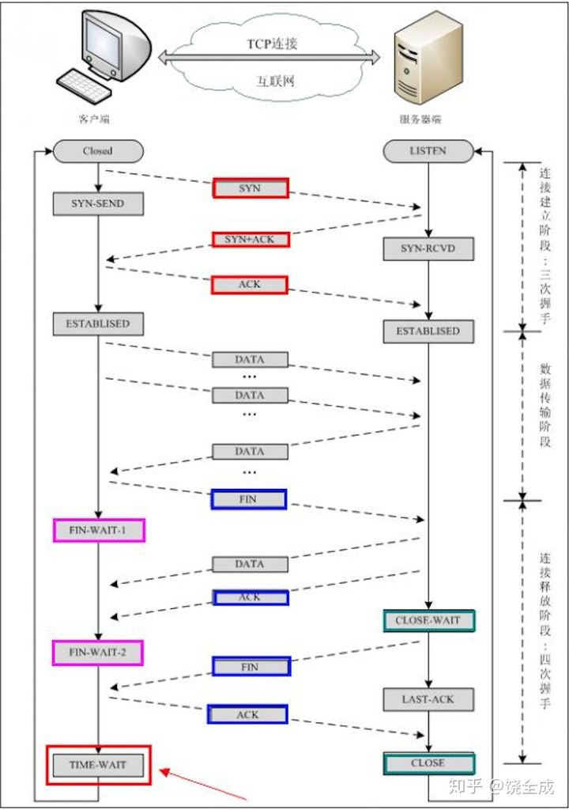

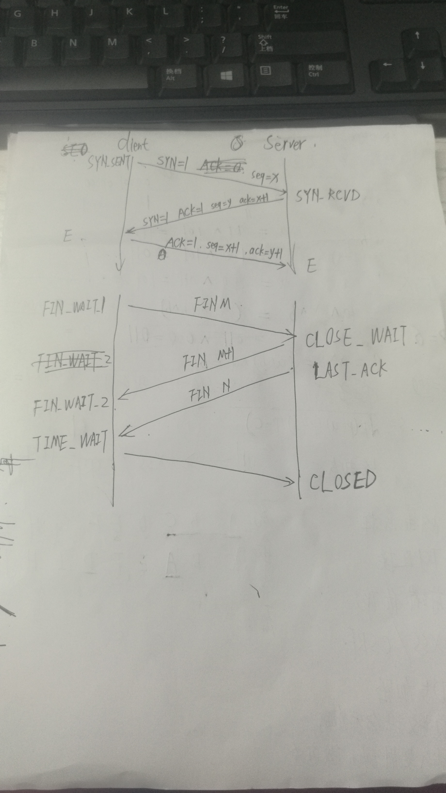

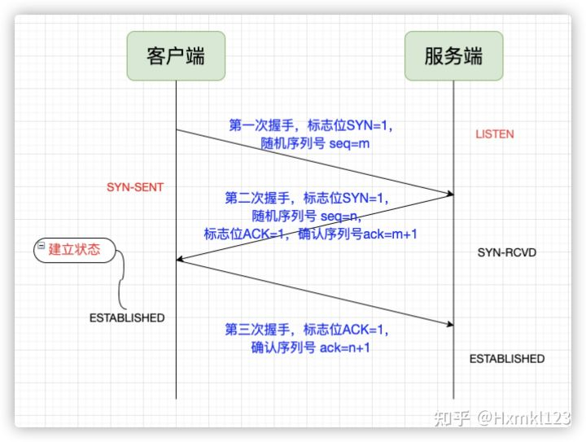

- 第一次握手，客户端向服务端发送数据包，该数据包中 SYN 标志位为 1，还有随机生成的序列号c_seq，客户端状态改为 `SYN-SENT`；

- 第二次握手，服务端接收到客户端发过来的数据包中 SYN 标志位为 1，就知道客户端想和自己建立连接，服务端会根据自身的情况决定是拒绝连接，或确定连接，还是丢弃该数据包；
    - 拒绝连接，会往客户端发一个数据包，该数据包中 `RST` 标志位为 1，客户端会报 `Connection refused`；
    - 丢弃客户端的数据包，超过一定时间后客户端会报 `Connection timeout`；
    - 确定连接时会往客户端发一个数据包，该数据包中 ACK 标志位为 1，确认序列号 ack=c_seq+1，SYN 标志位为 1，随机序列号 s_seq，状态由 `LISTEN` 改为 `SYN-RCVD`；

- 第三次握手，客户端接收到数据包会做校验，校验ACK标志位和确认序列号 ack=c_seq+1，如果确定是服务端的确认数据包，改自己的状态为 ESTABLISHED，并给服务端发确认数据包；

- 服务端接到客户端数据包，会`校验ACK标志位和确认序列号 ack=s_seq+1`，改自己的状态为 ESTABLISHED，之后就可以进行数据传输了；

- 建立连接时的数据包是没有实际内容的，没有应用层的数据

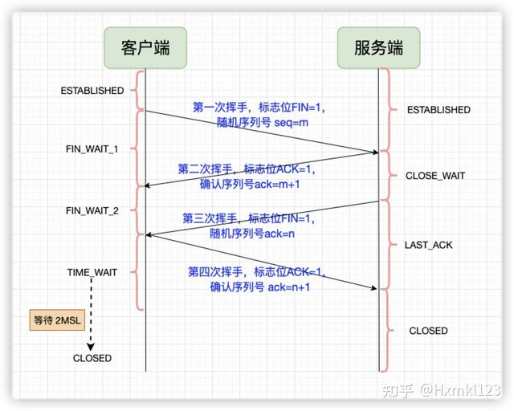

> 服务端会根据自身情况，没有要处理的数据时会把第二次和第三次挥手合并成一次挥手，此时标志位 FIN=1 / ACK=1；

> `MSL`是 `Maximum Segment Lifetime` 缩写，`指数据包在网络中最大生存时间`，RFC 建议是 2分钟；

- 客户端、服务端都可以主动发起断开连接；

- 第一次挥手，客户端向服务端发送含 FIN=1 标志位的数据包，随机序列号 seq=m，此时客户端状态由 ESTABLISHED 变为 FIN_WAIT_1；

- 第二次挥手，服务端收到含 FIN=1 标志位的数据包，就知道客户端要断开连接，服务端会向客户端发送含 ACK=1 标志位的应答数据包，确认序列号 ack=m+1，此时服务端状态由 ESTABLISHED 变为 CLOSE_WAIT；

- 客户端收到含 ACK=1 标志位的应答数据包，知道服务端的可以断开的意思，此时客户端状态由 `FIN_WAIT_1 变为 FIN_WAIT_2`；（第一、二次挥手也只是双方交换一下意见而已）

- 第三次挥手，`服务端处理完剩下的数据后再次向客户端发送含 FIN=1 标志位的数据包`，随机序列号 seq=n，`告诉客户端现在可以真正的断开连接`了，此时服务端状态由 CLOSE_WAIT 变为 `LAST_ACK`；

- 第四次挥手，客户端收到服务端再次发送的含 FIN=1 标志位的数据包，就知道服务端处理好了可以断开连接了，但是`客户端为了慎重起见，不会立马关闭连接，而是改状态`，且向服务端发送含 ACK=1 标志位的应答数据包，确认序列号 ack=n+1，此时客户端状态由 FIN_WAIT_2 变为 `TIME_WAIT`；

- `等待 2 个MSL时间还是未收到服务端发过来的数据，则表明服务端已经关闭连接了，客户端也会关闭连接释放资源`，此时客户端状态由 TIME_WAIT 变为 CLOSED；

> `SYN 洪水攻击（SYN Flood）`：是一种 DoS攻击（拒绝服务攻击），大概`原理是伪造大量的TCP请求，服务端收到大量的第一次握手的数据包，且都会发第二次握手数据包去回应，但是因为 IP 是伪造的，一直都不会有第三次握手数据包，导致服务端存在大量的半连接`，即 SYN_RCVD 状态的连接，导致半连接队列被塞满，且服务端默认会发 5 个第二次握手数据包，耗费大量 CPU 和内存资源，使得正常的连接请求进不来；


##### 为什么要“三次握手，四次挥手”
> 客户端和服务端通信前要进行连接，三次握手的作用就是`双方都能明确自己和对方的收、发能力是正常的`。

##### 为什么建立连接是三次握手，而关闭连接却是四次挥手呢？
> 这是因为服务端在LISTEN状态下，收到建立连接请求的SYN报文后，把ACK和SYN放在一个报文里发送给客户端。而关闭连接时，当收到对方的FIN报文时，仅仅表示对方不再发送数据了但是还能接收数据，`己方是否现在关闭发送数据通道，需要上层应用来决定，因此，己方ACK和FIN一般都会分开发送`。


#### HTTPS

一般http中存在以下问题：
- 窃听风险：请求信息`明文传输`，容易被窃取；（加密）
- 篡改风险：`数据完整性`未校验，容易被篡改；（校验）
- 冒充风险：没有`验证对方身份`，存在冒充危险；（身份认证）

参考：[十分钟搞懂HTTP和HTTPS协议？](https://zhuanlan.zhihu.com/p/72616216)
[HTTPS为什么安全 &分析 HTTPS 连接建立全过程](https://wetest.qq.com/labs/110)

HTTPS(HyperText Transfer Protocol Secure)，是以安全为目标的HTTP通道，是在HTTP的基础上通过`传输加密`和`身份认证`保证了传输过程的安全性，可以理解为是`HTTP + SSL/TLS`

##### https通信过程
使用无SSL/TLS的HTTP协议进行通信时，消息相当于在裸奔，存在被窃取或者篡改的可能性；`SSL/TLS`的提出就是为了解决http通信的安全问题；

> SSL（Secure Socket Layer）即安全套接层，最早由Netscape提出，主要用于数据安全问题，后期逐渐演化为一种标准；TLS（Transport Layer Security）即传输层安全协议，是SSL的继任者，主要的功能包括：`数据加密`、`身份认证`、`消息完备性校验`；是位于传输层和应用层之间的一种协议；

参考阮一峰文章，SSL/TLS的握手过程大概如下：
1. Client发送SSL/TLS`协议的版本号`、一个Client生成的`随机数`及`客户端支持的加密算法`；
    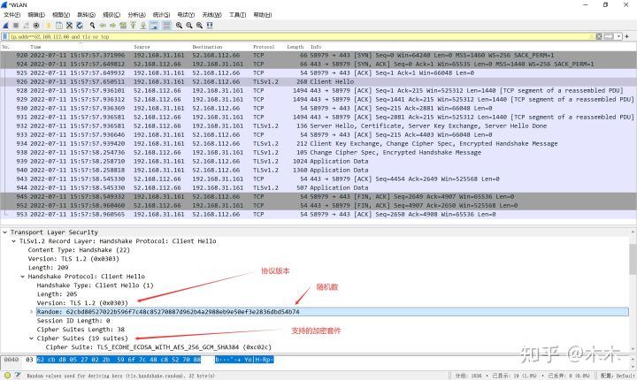
2. Server确认`SSL/TLS`协议版本（如果浏览器不支持，则关闭加密通信），确认通信的`加密算法`，然后返回一个`Server生成的随机数`及`服务器的数字证书`；
    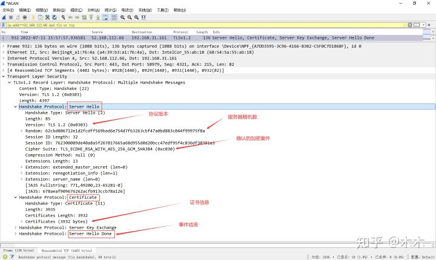
3. Client校验数字证书有效性，并`从数字证书中取出服务器公钥`，然后发送一个由数字证书公钥加密的随机数到Server；
    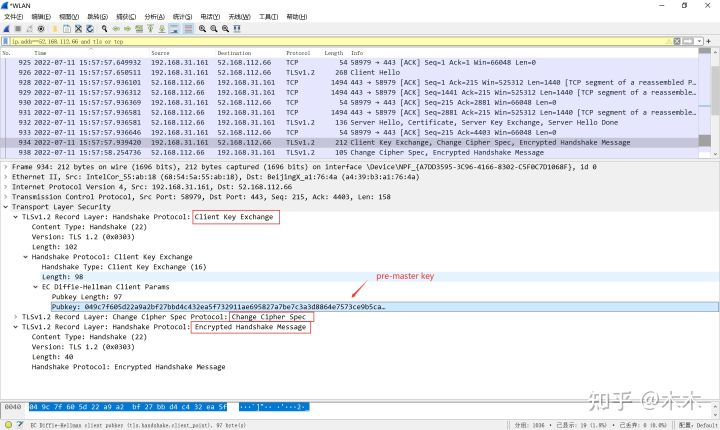
    - `Client Key Exchange`：基于前面提到的两个随机数（client random+server random），再生成第 3 个随机数 pre-master，然后通过CA证书中的公钥，对 pre-master 加密，得到 pre-master key，发送给服务器；
    - `Change Cipher Spec`：加密通信算法改变通知，表示客户端随后的信息都将用会话秘钥加密通信；
    - `Encrypted handshake message`：这一步对应的是 Cleint 的 Finish 消息，client 将前面握手的消息生成摘要，再用协商好的会话秘钥进行加密，这是客户端发出的第一条加密消息， 服务端接收后会用会话秘钥解密，能解出来说明前面协商的秘钥是一致的，至此客户端的握手完成 
4. Server使用数字证书私钥解密该随机数；
5. 此时，Client和Server都拥有三个相同的随机数；双方按照之前约定的加密算法， `使用这三个随机数生成对话密匙，用于加密后续的数据通信过程`；

> 三个随机数是为了保证对称密匙的可靠性

加密分为`对称加密`和`非对称加密`，对称加密使用同样的秘钥进行加密和解密，非对称加密使用一对秘钥——公钥和私钥，使用其中一个加密，另一个解密；`非对称加密更加安全`，但由于算法复杂度等因素导致其性能开销较大；`对称加密传输速度快`，但是存在一定的安全风险；

> 为了在性能和安全性方面make a trade off，`通常会在对话密匙生成阶段使用非对称加密，在数据传输时使用对话密钥进行对称加密`；

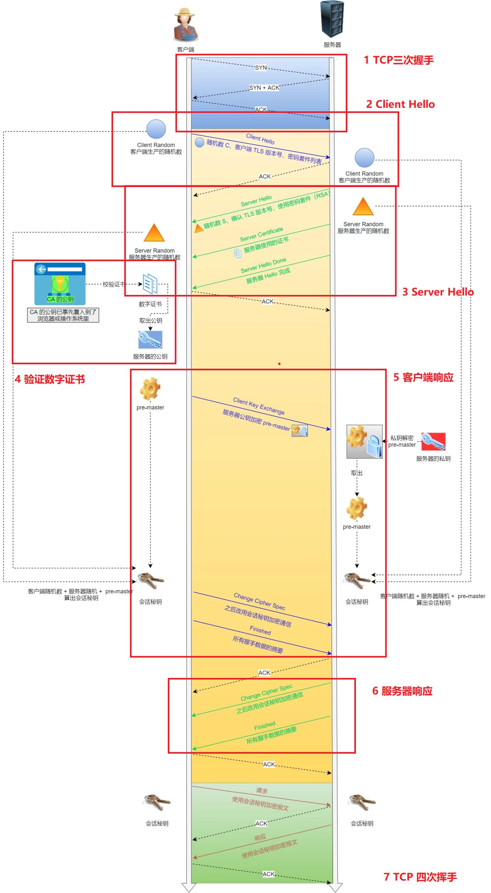


##### 证书认证过程

https通信过程中服务器为什么不直接把公钥给客户端呢，因为可能会被中间人劫持，通信的可靠性无法保障；

如果通信过程中，在三次握手或者客户端发起HTTP请求过程中，客户端的请求被中间人劫持，那么中间人就可以伪装成“假冒客户端”和服务器通信；中间人又可以伪装成“假冒服务器”和客户端通信。接下来，我们详细阐述中间人获取对称密钥的过程：

中间人在收到服务器发送给客户端的公钥（这里是“正确的公钥”）后，并没有发给客户端，而是中间人将自己的公钥（这里中间人也会有一对公钥和私钥，这里称呼为“伪造公钥”）发给客户端。之后，客户端把对称密钥用这个“伪造公钥”加密后，发送过程中经过了中间人，中间人就可以用自己的私钥解密数据并拿到对称密钥，此时中间人再把对称密钥用“正确的公钥”加密发回给服务器。此时，客户端、中间人、服务器都拥有了一样的对称密钥，后续客户端和服务器的所有加密数据，中间人都可以通过对称密钥解密出来。

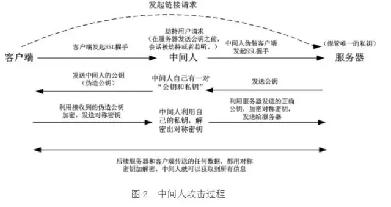


前面提到，`Client`与`Server`间的内容传输采用的是对称加密的方式，使用的是由三个随机数加密生成的密匙；Client向Server发送的第二个随机数是由数字证书公钥加密的；`为了保证数据通信的可靠性，必须要对证书进行认证`；

服务器返回的`站点证书`一般包含了证书的`有效期`、`服务器名称`、`服务器公钥`、`发证机构名称`及`发证机构对证书的签名`、`数字摘要计算方法`以及`证书对应的域名`；发证机构会对证书信息hash得到证书的数字摘要，然后使用发证机构的私钥加密证书摘要；客户端拿到证书后，可以使用`CA的公钥`进行解密得到证书的信息摘要；同时使用数字摘要的方法对证书信息进行计算同样得到一份信息摘要；如果两者一致，则表示证书未被篡改；

一般可以通过`发证机构来保证服务器站点的可靠性`，而服务器站点的可靠性则通过上一级的中间证书商进行认证；这样逐级回溯，最终可以追溯到`根证书机构`；而`根证书机构一般是固定的，并且是被浏览器识别的`，是可信的；因此`证书认证是通过证书信任链确保服务器站点的可靠性`；

> 证书颁发者一般提供两种方式来验证证书的有效性： CRL 和 OCSP

其中`CRL`（Certificate Revocation List）即证书吊销名单，表示发证机构维护的一份失效证书名单，客户端缓存在本地并定期更新，并作为证书有效性查询参考；

`OCSP`（Online Certificate Status Protocol）即在线证书状态协议，是由发证机构提供的一份实时查询某个证书有效性的接口，延时较大；

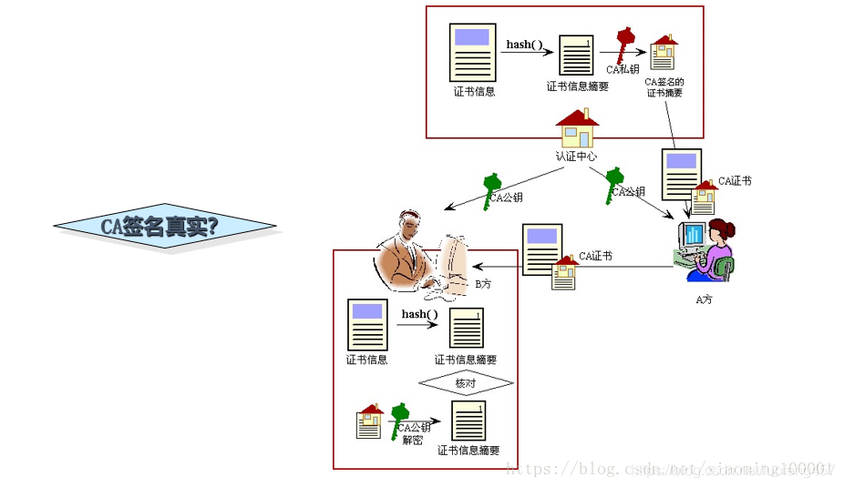

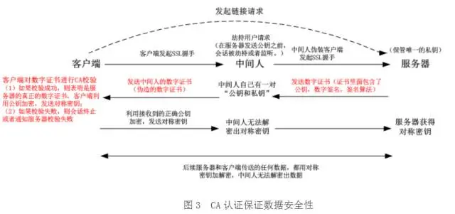

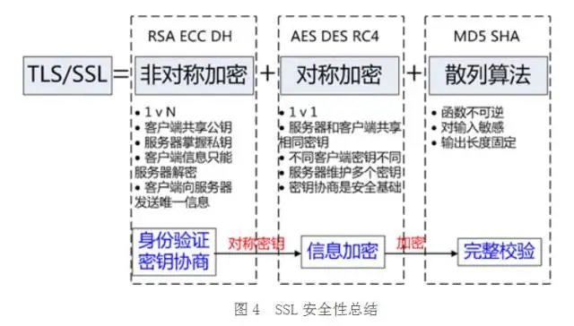


#### HTTP版本介绍
HTTP(Hyper Text Transfer Protocol)即超文本传输协议，是一种用于客户端与服务端进行信息交换的通信协议，特点为：
- 简单
- 无状态：http本身是无状态协议，通过Http Cookie实现了有状态的会话
- 连接：一般基于TCP连接，请求默认端口号是80（HTTPS默认端口号是443）

##### HTTP/0.9 —— 单行协议

已弃用，具体可以参考W3C网站的介绍[HTTP/0.9](https://www.w3.org/Protocols/HTTP/AsImplemented.html)

特点：
- 请求不包括版本号信息，仅支持`get`请求
- 协议由单行指令构成：`GET /index.html`
- 响应无Header及状态码，仅包括HTML文档本身


##### HTTP/1.0 —— 构建可扩展性
特点：
- 协议版本随GET行发送
- 支持更多的请求方法：GET、HEAD、POST
- 引入HTTP头，请求或响应由多行指令构成；包括：Allow/ Authorization/content-type/content-coding/content-length/Date/Expires/From/If-modified-Since/Last-Modified/Location/Pragma/Referer/Server/User-Agent/WWW-Authenticate等
- 支持更多的资源类型：html、图片、音视频等；
- 引入状态码

缺点：
- 默认不提供keepalive，需要显式声明
- 不支持连接复用：HTTP请求基于TCP连接，HTTP/1.0协议中每次请求均需要建立TCP连接，不可复用；
- 安全性：是一种无状态协议，身份认证需要通过HTTP Cookie，明文传输数据，因此具有被攻击的危险；
- 协议开销大：头部信息过大后，每次请求都会携带这些信息；不仅造成带宽浪费，也会增加服务延时；
- 请求为blocking，即下一个请求的发送必须在收到前一个请求包的响应包后；这些问题造成的一个显著后果是请求延迟大，网络带宽资源不能被充分利用。


##### HTTP/1.1 —— 标准化协议
特点：

- 长连接：`HTTP/1.1默认采用长连接`，即同域名下建立一个TCP连接用于多次通信和数据传输；可以通过`Connection: keep-alive`字段进行指定；是否为长连接可以打开调试控制台查看`connection id`是否一致；
- 管道化：持久化连接中，可以不用等一个请求被响应后再发送请求，可以连续发送多个请求；当然，服务端的响应顺序是与请求顺序保持一致的；
- 分块传输编码：支持`Chunked Transfer Coding`，对响应数据进行分块传输，每个`chunk`包含其大小及数据（均为十六进制），size信息独占一行；可以用于动态处理内容的传输；使用头部`Transfer-Encoding: chunked`标识；最后一个chunk仅包含size信息，用于告知数据传输完成；
- 引入新的缓存机制：`Cache-Control`机制；
- 内容协商机制：客户端与服务端约定请求的方法、语言、编码类型等信息；使用`Accept`/`Accept-Language`/`Accept-Encoding`等；
- 更加丰富的请求方法：`OPTIONS`/`GET`/`HEAD`/`POST`/`PUT`/`DELETE`/`TRACE`/`CONNECT`；
- 新增状态码

HTTP/1.1是目前应用最广泛的版本。引入管道机制一定程度上解决了1.0中请求的blocking问题，但是仍然可能造成队头阻塞，因为服务端的响应是按照请求顺序的；


##### HTTP/2 —— quicker、better、faster
> HTTP/2主要基于SPDY协议，SPDY协议是由google开发的一个应用层协议，可以说SPDY协议是HTTP/2的前身。HTTP/2强制使用TLS协议，也就是说HTTP/2发送的都是加密的数据，关于强制使用TLS协议这一点引起了很多争议，因为有些HTTP服务没必要加密，且TLS会引入一定的开销，特别是TLS握手阶段的非对称加密。

特点
- `头部压缩`：使用`HPACK`算法，减少每次传输不必要的头部信息；它的实质就是一种diff算法；客户端和服务端同时维护一张保存头信息的表，并在每次通信后同步更新；首次请求会保存全部字段；之后只需要传输差别信息即可；
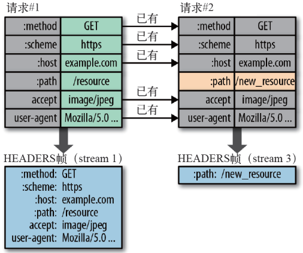
- `二进制分帧`：HTTP/2.0的每个请求或响应称为消息，每个消息分为一个或多个帧，`采用效率更高的二进制而不是文本格式进行编码传输`；
- `多路复用`：同域名下建立一个TCP连接，该连接可以用于多个请求的处理；与管道化不同的是每个请求可以单独处理，不会造成HTTP/1.1中的队头阻塞
- `Server Push`：即客户端请求一个页面后，服务端在未接受到后续请求时就返回响应请求，以及通过页面解析发现的客户端后续可能用到的资源，如图片、css、js等；
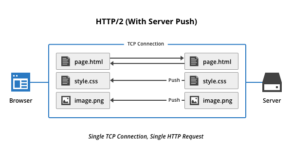

##### HTTP/3

http/3.0以`UDP`而不是`TCP`作为传输协议，UDP不提供可靠和流控服务，所以还需要另外另外一个协议——QUIC。QUIC工作在应用层，位于UDP和HTTP之间。

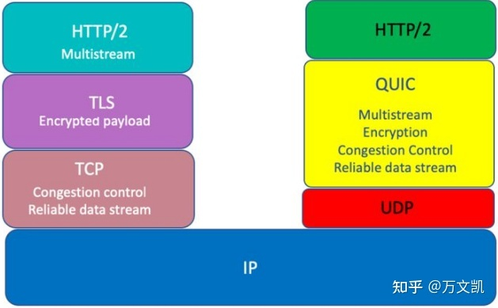

> QUIC（Quick UDP Internet Connections）是一种实验性`传输层网络协议`，提供`与TLS/SSL相当的安全性，同时具有更低的连接和传输延迟`。`QUIC基于UDP，因此拥有极佳的弱网性能`，在丢包和网络延迟严重的情况下仍可提供可用的服务。`QUIC在应用程序层面就能实现不同的拥塞控制算法`，不需要操作系统和内核支持，这相比于传统的TCP协议，拥有了更好的改造灵活性，非常适合在TCP协议优化遇到瓶颈的业务。目前，阿里云CDN开放使用的是七层协议的QUIC。

HTTP因为不使用TCP，所以解决了TCP的队头阻塞问题，完整得解决了队头阻塞问题。

- HTTP/3不再需要TCP三次握手，相比HTTP/2进一步降低了请求延迟；
- `解决了连接迁移问题`：以前使用TCP作为传输层协议时，移动网络从4G切换到wifi，因为涉及到IP改变，所以需要重新建立连接，而HTTP/3使用CID（connection id）来标识一条流，改变IP并不会造成影响。

### 预加载
在preload和prefetch之前，我们一般根据编码需求通过link或者script标签引入页面渲染和交互所依赖的js和css等；然后这些资源由浏览器决定优先级进行加载、解析、渲染等。

> preload和prefetch的出现为我们提供了可以更加细粒度地控制浏览器加载资源的方法。

> Chrome有四种缓存：http cache、memory cache、Service Worker cache和Push
cache。在`preload或prefetch的资源加载时，两者均存储在http
cache`。当资源加载完成后，如果资源是可以被缓存的，那么其被存储在http
cache中等待后续使用；`如果资源不可被缓存，那么其在被使用前均存储在memory cache`；

#### preload
link标签的preload是一种声明式的资源获取请求方式，用于提前加载一些需要的依赖，并且`不会影响页面的onload`事件；使用方式如下：
```html
<link rel="preload" as="script" href="test.js" onload="handleOnload()" onerror="handlepreloadError()">
<link rel="preload" as="style" href="test.css" onload="this.rel=stylesheet"> // css加载后立即生效
```

其中，`rel`属性值为preload；`as`属性用于规定资源的类型，并根`据资源类型设置Accep请求头`，以便能够使用正常的策略去请求对应的资源；`href`为资源请求地址；`onload`和`onerror`则分别是资源加载成功和失败后的回调函数；

其中as的值可以取`style、script、image、font、fetch、document、audio、video`等；

> 如果as属性被省略，那么该请求将会当做异步请求处理

另外，在`请求跨域资源时推荐加上crossorigin属性`，否则可能会导致资源的二次加载（尤其是font资源）；
```html
<link rel="preload" as="font" href="www.font.com" crossorigin="anonymous">
<link rel="preload" as="font" href="www.font.com" crossorigin="use-credentials">
```

##### preload特点
- preload加载的资源是在浏览器渲染机制之前进行处理的，并且不会阻塞onload事件；
- preload可以支持加载多种类型的资源，并且可以加载跨域资源；
- `preload加载的js脚本其加载和执行的过程是分离`的。即preload会预加载相应的脚本代码，待到需要时自行调用；


#### prefetch
prefetch是一种`利用浏览器的空闲时间加载页面将来可能用到的资源`的一种机制；通常`可以用于加载非首页的其他页面所需要的资源`，以便加快后续页面的首屏速度；

##### prefetch特点
prefetch加载的资源`可以获取非当前页面所需要的资源`，并且将其放入缓存至少5分钟（`无论资源是否可以缓存`）；并且，当页面跳转时，未完成的prefetch请求不会被中断；

##### 属性支持度检测
```js
const preloadSupported = () => {
    const link = document.createElement('link');
    const relList = link.relList;
    if (!relList || relList.supports)
        return false;
    return relList.supports('preload');
}
```


### 预渲染

> With prerendering, the content is prefetched and then rendered in the background by the browser as if the content had been rendered into an invisible separate tab. When the user navigates to the prerendered content, the current content is replaced by the prerendered content instantly.

使用预渲染时，对应资源会被`prefetch`，然后在浏览器后台进行渲染。当用户浏览到预渲染的内容时，当前内容就会被预渲染内容立即代替。可以使用以下代码开启预渲染

```js
<link rel="prerender" href="http://example.com" />
```

预渲染虽然可以提高页面的加载速度，但是要确保该页面百分百会被用户在之后打开，否则就白白浪费资源去渲染


### 缓存
缓存对于前端性能优化来说是个很重要的点，良好的缓存策略可以降低资源的重复加载提高网页的整体加载速度。


#### Pragma
Pragma是`HTTP1.0`中定义的通用首部字段，与HTTP1.0中的`Expires`标头共同决定HTTP1.0中的缓存策略；`Pragma: no-cache`作用与`Cache-Control: no-cache`作用一致；`现在通常用与对HTTP1.0客户端的兼容`；


#### Expires
Expires是HTTP1.0及HTTP1.1都有的`响应头部字段`，表`示启用缓存并设置资源过期的时间点，包含日期、时间`；设置过去的时间则表示资源过期；同时设置Pragma和Expires则不缓存；这里需要注意的是服务器时间和本地时间的统一问题，否则可能导致合法的资源被当做过期处理，在项目中已采坑。。

```js
// 示例
Expires: Wed, 21 Oct 2015 07:28:00 GMT
```

> 如果响应头部中包含Cache-Control：max-age或Cache-Control：s-max-age字段，则Expires字段会被忽略；


```
Response Headers
access-control-allow-origin: *
cache-control: max-age=604800
content-encoding: gzip
content-md5: JZeM8QtTaNUNZtAn96xplQ==
content-type: text/css; charset=utf-8
date: Thu, 01 Sep 2022 13:16:39 GMT
expires: Tue, 26 Jul 2022 20:33:04 GMT
last-modified: Mon, 27 Aug 2018 07:13:39 GMT
server: AliyunOSS
vary: Accept-Encoding
x-oss-hash-crc64ecma: 14495222281733060606
x-oss-object-type: Normal
x-oss-request-id: 624326AF1567603531317BBA
x-oss-server-time: 18
x-oss-storage-class: Standard
x-ser: BC202_dx-lt-yd-jiangsu-taizhou-4-cache-11, BC9_yd-shan3xi-shangluo-2-cache-1

Request Headers
:authority: csdnimg.cn
:method: GET
:path: /public/sandalstrap/1.4/css/sandalstrap.min.css
:scheme: https
accept: text/css,*/*;q=0.1
accept-encoding: gzip, deflate, br
accept-language: zh-CN,zh;q=0.9
cache-control: no-cache
pragma: no-cache
referer: https://blog.csdn.net/luofeng457/article/details/90373977?ops_request_misc=%257B%2522request%255Fid%2522%253A%2522166203531816781667812271%2522%252C%2522scm%2522%253A%252220140713.130102334.pc%255Fblog.%2522%257D&request_id=166203531816781667812271&biz_id=0&utm_medium=distribute.pc_search_result.none-task-blog-2~blog~first_rank_ecpm_v1~rank_v31_ecpm-1-90373977-null-null.nonecase&utm_term=%E5%8D%8F%E5%95%86%E7%BC%93%E5%AD%98&spm=1018.2226.3001.4450
sec-ch-ua: ".Not/A)Brand";v="99", "Google Chrome";v="103", "Chromium";v="103"
sec-ch-ua-mobile: ?0
sec-ch-ua-platform: "Windows"
sec-fetch-dest: style
sec-fetch-mode: no-cors
sec-fetch-site: cross-site
user-agent: Mozilla/5.0 (Windows NT 10.0; Win64; x64) AppleWebKit/537.36 (KHTML, like Gecko) Chrome/103.0.0.0 Safari/537.36
```
#### Cache-Control
`Cache-Control是HTTP1.1中引入的一种通用头部字段，可以用于请求和响应头部`；现代浏览器都支持Cache-Control，主要`用于替代HTTP1.0中定义的一些相应缓存标头，如Expires、Pragma`等；客户端和服务端的请求头有一些差异：

|指令|客户端|服务端|
|-|-|-|
|no-cache|√|√|
|no-store|√|√|
|max-age=<seconds>|√|√|
|no-transform|√|√|
|public|×|√|
|private|×|√|
|max-stale|√|×|
|only-if-cached|√|×|
|must-revalidate|×|√|
|proxy-revalidate|×|√|
|s-maxage=<seconds>|×|√|


`max-age: <seconds>`：从请求时间开始计算的缓存存储的最大有效时长，单位为秒；超过则为过期；

`max-stale[=<seconds>]`：客户端标头，表示客户端可以接受一个过期资源；如果设置了可选的时间参数，则表示过期时间不超过该时长；

`must-revalidate`：服务端标头，使用缓存前需要验证旧资源的状态，过期资源不可用；

##### demo
```js
// 禁止缓存
Cache-Control: no-store

// 缓存静态文件
Cache-Control: public, max-age=31536000

// 需要重新验证
Cache-Control: no-cache // 或
Cache-Control: max-age=0, must-revalidate

// 对于频繁变动的资源，可以使用 Cache-Control: no-cache 并配合 ETag 使用，表示该资源已被缓存，但是每次都会发送请求询问资源是否更新。

```

##### `no-cache`和`no-store`：
`no-store`禁止浏览器及所有的中间件（代理服务器等）缓存任何版本的响应信息，`即我们通常所说的不缓存`，每次请求都需要向服务器发送完整地请求并下载相应的响应；

`no-cache不直接使用缓存，需要先在与服务器确认返回的响应是否发生变化`。即如果存在ETag（如ETag: af47a1d）等验证令牌时，会发送请求（请求带着If-None-Match: af47a1d标头）到服务器检验之前的缓存内容和当前版本有无变化，如果无变化则返回响应状态码304，否则重新请求并下载资源；(`协商缓存验证`)

##### public与private
- `private`：响应仅对单个用户进行缓存，也就是说对于代理服务器、CDN等中间缓存机构不进行缓存；
- `public`：非必须项，表示响应在多数情况下均可以被缓存（包括CDN、代理服务器等）；


下图是MDN推荐的最佳Cache-Control策略：


#### 强制缓存与协商缓存

通常浏览器缓存策略分为两种：`强缓存`和`协商缓存`

- 强缓存: 由`expires`与`cache-control: max-age`控制；表示在缓存有效期内不需要重新请求服务端资源，返回的状态码为200

- 协商缓存：由`ETags`与`If-No-Match`、`Last-Modified`与`If-Modified-Since`控制；在`缓存过期时，会用到协商缓存`；协商缓存需要向浏览器发送请求，以确认当前过期的资源是否发生过更新，如果没有更新，即缓存有效则返回304；否则重新获取资源；


#### 缓存校验机制

如果由于服务器时间精度问题；或者如果设置的缓存时间已经过期，并且服务端资源并未发生更新，仅使用max-age等类似的缓存过期判断策略，会重新下载整个并未发生变化的资源，这会造成带宽浪费与服务器负载压力；

##### Last-Modified与If-Modified-Since

1. `Last-Modified`：响应头部字段；表示服务器端资源上次修改的日期和时间，通常与请求字段If-Modified-Since搭配使用；其`精度低于ETag，故常作为备用机制`；

    ```js
    // 用法
    Last-Modified: <day-name>, <day> <month> <year> <hour>:<minute>:<second> GMT

    // 示例
    Last-Modified: Wed, 20 May 2019 11:11:11 GMT
    ```

2. `If-Modified-Since`：请求字段（GET/HEAD方式），如果请求的资源在给定时间后未被修改，那么返回一个不带响应主体的304响应；否则是一个200的请求；同样，`如果同时设置了If-None-Match，If-Modified-Since也会被忽略`；

    ```js
    // 示例
    If-Modified-Since: Wed, 20 May 2019 11:11:11 GMT
    ```


##### ETag与If-None-Match

Last-Modified的精度与服务器的时间精度有关，无法识别一秒内进行多次修改的情况，也就是说资源的修改时间有可能存在一定偏差，而ETag可以精确标识资源的改动；另外，如果资源修改而其内容未发生变化（修改后再恢复）的情况下还是会重新加载资源；

`ETag相当于资源的摘要，值是一段ASCII码组成的字符串，仅在其内容发生变化时对应的ETag值才会改变`；这样就可以避免Last-Modified中资源被修改而内容未发生变化的状况了；`ETag的生成方式不唯一`；

服务器响应资源请求时，可以在响应头部加上ETag指令，如ETag: "33a64df551425fcc55e4d42a148795d9f25f89d4"，客户端可以选择是否缓存该资源及标识并且在下次请求该资源时在请求头中加入一个If-None-Match: "33a64df551425fcc55e4d42a148795d9f25f89d4"的头部字段；服务器将当前版本的ETag与客户端的ETag字段值进行比较，如果两者保持一致则表示资源未被更改，返回304；

需要注意的是，上边已经提到了ETag生成的方式不唯一，可以通过hash散列或者其他算法获得；因此在使用CDN或者其他分布式服务器系统时，需要保障ETag的唯一性，从而避免不必要的资源请求；当然，计算ETag对服务器性能也有一定的影响；

`W/为可选参数，用于标识是否为弱校验`；ETag支持强校验和弱校验：`强校验需要资源每个字节都对应相同，包括Content-Type、Content-Encoding`等；弱校验仅需二者在语义上相同，即可以使用不同的Content-Type值等，尤其是在动态生成内容上弱校验更能发挥作用；

```js
// 示例
ETag: "33a64df551425fcc55e4d42a148795d9f25f89d4"
ETag: W/"0815"

If-None-Match: "33a64df551425fcc55e4d42a148795d9f25f89d4"
```

#### F5与Ctrl+F5

`Ctrl+F5`：会强制不用所有缓存并全部向服务器发送新的请求，请求头中移除了If-Modified-Since及If-none-Match标头，并且加入Cache-Control: no-cache及Pragma: no-cache；

`F5`：F5则会加入请求头If-Modified-Since、If-none-Match及Cache-Control: max-age=0请求头以有效使用缓存；

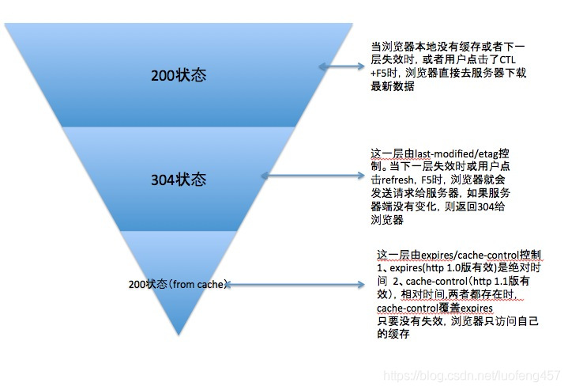

结合上图，为了更高效地利用HTTP缓存，应当尽量为可缓存资源设置Expires/Cache-Control及ETag/Last-Modified标头，这样可以能减少304请求造成的性能开销，同时能在资源更新的时候尽可能早的获取新版本的资源，从而使用户体验更好；现在，使用webpack构建项目时，通常会将静态资源的文件名后缀加上md5等，这样可以在资源有新版本时直接更新资源，减少304的开销；


## 优化渲染过程
### 懒加载
懒加载就是将非关键的资源延后加载。

懒加载的原理就是只加载自定义区域（通常是可视区域，但也可以是即将进入可视区域）内需要加载的东西。对于图片来说，先设置图片标签的 src 属性为一张占位图，将真实的图片资源放入一个自定义属性中，当进入自定义区域时，就将自定义属性替换为 src 属性，这样图片就会去下载资源，实现了图片懒加载。

懒加载不仅可以用于图片，也可以使用在别的资源上。比如进入可视区域才开始播放视频等等。

### 懒执行
懒执行就是`将某些逻辑延迟到使用时再计算`。`该技术可以用于首屏优化`，对于某些耗时逻辑并不需要在首屏就使用的，就可以使用懒执行。懒执行需要唤醒，一般可以通过定时器或者事件的调用来唤醒。


## 文件优化
### 图片优化
#### 计算图片大小
对于一张 100 _ 100 像素的图片来说，图像上有 10000 个像素点，如果每个像素的值是 RGBA 存储的话，那么也就是说每个像素有 4 个通道，每个通道 1 个字节（8 位 = 1 个字节），所以该图片大小大概为 39KB（10000 _ 1 * 4 / 1024）。

但是在实际项目中，一张图片可能并不需要使用那么多颜色去显示，我们可以通过减少每个像素的调色板来相应缩小图片的大小。

了解了如何计算图片大小的知识，那么对于如何优化图片，想必大家已经有 2 个思路了：
- 减少像素点
- 减少每个像素点能够显示的颜色 


#### 图片加载优化

- 非必要可以使用CSS替代：很多时候会使用到很多修饰类图片，其实这类修饰图片完全可以用 CSS 去代替
- 合适的尺寸：对于移动端来说，屏幕宽度就那么点，完全没有必要去加载原图浪费带宽。一般图片都用 CDN 加载，可以计算出适配屏幕的宽度，然后去请求相应裁剪好的图片
- 小图使用 `base64` 格式
- 将多个图标文件整合到一张图片中（雪碧图）
- 选择正确的图片格式：
    - 支持webp的情况下`优先使用webp`，同等质量的前提下具有更高的压缩比，但有一定的兼容性问题
    - 小图使用 PNG，
    - 一般图片使用JPEG，有透明区域的图片使用PNG
### 其他文件优化
- CSS 文件放在 head 中
- 服务端开启文件压缩功能（请求头`Accept-Encoding: gzip, deflate, br`，响应头`Content-Encoding: br`）
- 将 script 标签放在 body 底部，因为 JS 文件执行会阻塞渲染。当然也可以把 script 标签放在任意位置然后加上 `defer ，表示该文件会并行下载，但是会放到 HTML 解析完成后顺序执行`。对于没有任何依赖的 JS 文件可以加上 `async ，表示加载和渲染后续文档元素的过程将和 JS 文件的加载与执行并行无序进行`。
- 执行 JS 代码过长会卡住渲染，对于`需要很多时间计算的代码可以考虑使用 Webworker`。Webworker 可以让我们另开一个线程执行脚本而不影响渲染


### CDN

静态资源尽量使用 CDN 加载，由于浏览器对于单个域名有并发请求上限，可以考虑使用多个 CDN 域名。对于 `CDN 加载静态资源需要注意 CDN 域名要与主站不同，否则每次请求都会带上主站的 Cookie`

## 其他

### webpack优化
- 对于 Webpack4，打包项目使用 `production 模式`，这样会自动开启代码压缩
- 使用 ES6 模块来开启 `tree shaking`，这个技术可以`移除没有使用的代码`
- 优化图片，对于小图可以使用 base64 的方式写入文件中
- 按照路由拆分代码，实现`按需加载`
- 给打包出来的文件名添加哈希，实现`浏览器缓存`文件

### 监控
对于代码运行错误，通常的办法是使用 window.onerror 拦截报错。该方法能拦截到大部分的详细报错信息，但是也有例外

- 对于`跨域的代码运行错误会显示 Script error`. 对于这种情况我们需要给 script 标签添加 `crossorigin` 属性
- 对于某些浏览器可能不会显示调用栈信息，这种情况可以通过 `arguments.callee.caller` 来做栈递归

对于`异步代码`来说，可以使用 `catch` 的方式捕获错误。比如 Promise 可以直接使用 catch 函数，async await 可以使用 try catch

但是要注意线上运行的代码都是压缩过的，需要在打包时生成 sourceMap 文件便于 debug

对于捕获的错误需要上传给服务器，通常可以通过 img 标签的 src 发起一个请求


### 面试题

如何渲染几万条数据并不卡住界面

这道题考察了如何在不卡住页面的情况下渲染数据，也就是说不能一次性将几万条都渲染出来，而应该一次渲染部分 DOM，那么就可以通过 `requestAnimationFrame`来每16 ms刷新一次

```html
<!DOCTYPE html>
<html lang="en">
  <head>
    <meta charset="UTF-8" />
    <meta name="viewport" content="width=device-width, initial-scale=1.0" />
    <meta http-equiv="X-UA-Compatible" content="ie=edge" />
    <title>Document</title>
  </head>
  <body>
    <ul>
      控件
    </ul>
    <script>
      setTimeout(() => {
        // 插入十万条数据
        const total = 100000
        // 一次插入 20 条，如果觉得性能不好就减少
        const once = 20
        // 渲染数据总共需要几次
        const loopCount = total / once
        let countOfRender = 0
        let ul = document.querySelector('ul')
        function add() {
          // 优化性能，插入不会造成回流
          const fragment = document.createDocumentFragment()
          for (let i = 0; i < once; i++) {
            const li = document.createElement('li')
            li.innerText = Math.floor(Math.random() * total)
            fragment.appendChild(li)
          }
          ul.appendChild(fragment)
          countOfRender += 1
          loop()
        }
        function loop() {
          if (countOfRender < loopCount) {
            window.requestAnimationFrame(add)
          }
        }
        loop()
      }, 0)
    </script>
  </body>
</html>
```


# 安全
## XSS
XSS（Cross-Origin Script），跨站脚本攻击是一种常见的网站安全漏洞攻击，是代码注入的一种。它允许`恶意使用者将程式码注入到网页上，其他使用者在观看网页时就会受到影响`。这类攻击通常包含了 HTML 以及客户端脚本语言。

XSS一般分为存储型、反射型、DOM-Based

> XSS的本质，在于一部分有心人的恶意代码被当做了正常数据处理，进而导致了一系列安全事件，注入恶意代码，是XSS攻击的特征

### 分类

> 从XSS漏洞利用的角度来看，存储型XSS对攻击者的用处比反射型要大。因为存储型XSS在用户访问正常URL时会自动触发；而反射型XSS会修改一个正常的URL，一般要求攻击者将XSS URL发送给用户点击，无形中提高了攻击的门槛。

#### 存储型

存储型XSS攻击指的是`恶意代码被当做正常数据插入到服务器上的数据库中`，当用户正常访问页面的时候，恶意代码从数据库中提取出来并被触发。

> 例如一个留言板被黑客利用进行XSS攻击，提交了形如`<script>alert(“please follow serendipity！”)</script>`的代码，那么所有访问这个留言板的用户都将可能执行这段恶意脚本。

存储型XSS可实现`劫持访问`，盗取访问者`cookie`或者配合csrf攻击完成`恶意请求`等攻击

#### 反射型

> 反射型XSS只是简单得把用户输入的数据“反射”给浏览器，是非持久化的。通常需要`欺骗用户自己去点击带有特定参数的XSS代码链接`才能触发，一般是欺骗用户点击特定链接来进行恶意攻击，`攻击代码就在url当中`

```
// 正常代码
http://www.dvwa.com/vulnerabilities/xss_r/?name=index

// 恶意弹窗
http://www.dvwa.com/vulnerabilities/xss_r/?name=<script>alert(Serendipity)</script>

// cookie劫持
http://www.dvwa.com/vulnerabilities/xss_r/?name=<script>alert(document.cookie)</script>


```


#### DOM-Based

DOM-Based XSS并非按照“数据是否保存在服务端”来划分，DOM-Based XSS从效果上来说也是反射型XSS。单独划分出来是因为其特殊的形成原因，发现它的专家专门提出了该类型的XSS。

DOM-Based XSS`通过恶意脚本修改页面的DOM节点来发起攻击，是发生在前端的攻击`。DOM型XSS的特殊之处在于，用户的输入经过了DOM操作，特别是在innerHTML、ajax中经常出现。

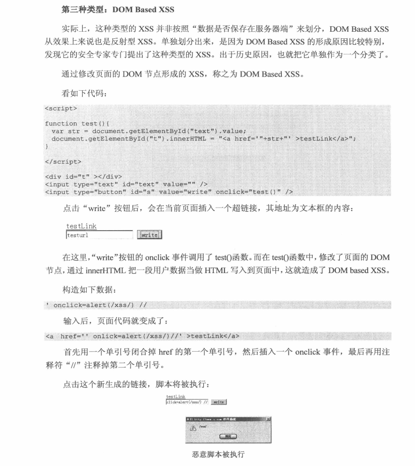


### XSS攻击平台
- [Attack API](https://code.google.com/p/attackapi)

- BeEF

- XSS-Proxy


### XSS Worm

> 一般来说，用户之间发生交互行为的页面，如果存在存储型XSS，则比较容易发起XSS Worm攻击。
- Samy Worm
- 百度空间蠕虫


### 如何攻击
XSS `通过修改 HTML 节点`或者`执行 JS 代码`来攻击网站

### 如何防御


#### HttpOnly

> JavaScript Document.cookie API `无法访问带有 HttpOnly 属性的 cookie`；`此类 Cookie 仅作用于服务器`

```
Set-Cookie: id=a3fWa; Expires=Wed, 21 Oct 2015 07:28:00 GMT; Secure; HttpOnly
```

#### CSP

> 内容安全策略 (CSP) 是一个额外的安全层，用于检测并削弱某些特定类型的攻击，包括跨站脚本 (XSS) 和数据注入攻击等。无论是数据盗取、网站内容污染还是散发恶意软件，这些攻击都是主要的手段。

CSP 本质上也是建立白名单，规定了浏览器只能够执行特定来源的代码

可以通过设置 `Content-Security-Policy` HTTP头部来开启 CSP

```
// 所有内容均来自站点的同一个源 (不包括其子域名)
Content-Security-Policy: default-src 'self'

// 允许内容来自信任的域名及其子域名 (域名不必须与 CSP 设置所在的域名相同)
Content-Security-Policy: default-src 'self' *.trusted.com

// 限制媒体文件和脚本的来源
Content-Security-Policy: default-src 'self'; img-src *; media-src media1.com media2.com; script-src userscripts.example.com


```

#### 输入检查

一般检查用户输入的数据中是否包含一些特殊字符，如`<`、`>`、`'`、`"`等；输入检查很多时候也被用于格式检查。有些检查会匹配XSS的特征，会查找`javascript`、`<script>`等敏感字符，这种输入检查的方式称为`XSS Filter`。

> `输入检查的逻辑，必须放在服务端代码中实现`。如果只是在客户端使用JavaScript进行输入检查，是很容易被攻击者绕过的。

##### HTMLEncode
某些情况下，不能对用户数据严格过滤，需要对标签进行转换，将字符转换为HTMLEntities

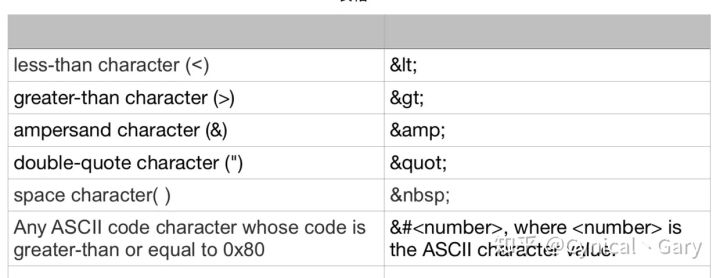

当用户输入`<script>window.location.href=”http://www.baidu.com”;</script>`, 最终保存结果为 &lt;script&gt;window.location.href=&quot;http://www.baidu.com&quot;&lt;/script&gt;, 在展现时，浏览器会对这些字符转换成文本内容，而不是一段可以执行的代码。

##### JavaScriptEncode
使用“\”对特殊字符进行转义，除数字字母之外，小于127的字符编码使用16进制“\xHH”的方式进行编码，大于用unicode（非常严格模式）。

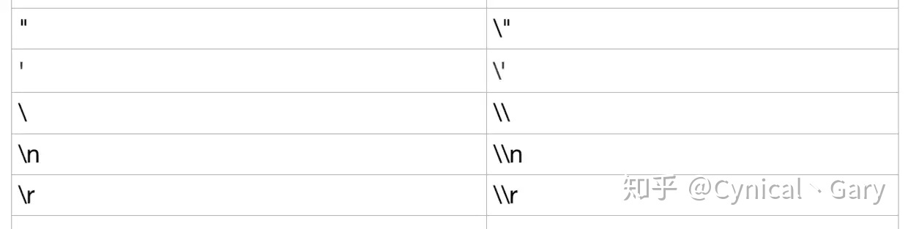


#### 输出检查

除富文本内容特殊处理外，一般需要进行`编码`或者`转义`处理来防御XSS攻击

#### 处理富文本
需要区分富文本和有攻击性的XSS。过滤富文本时，`事件`应该被严格禁止，`<iframe>`、`<script>`、`<form>`等一些危险的标签也应该被禁止；标签选择上可以通过白名单机制只允许部分安全的标签存在；

#### DOM-Based XSS防御

会触发DOM-Based XSS的地方很多，以下几个是JavaScript输出变量到HTML页面的必经之路
- document.write
- innerHTML
- location.replace()
- window.attachEvent
需要注意这些函数的参数是否可以被用户控制

除了服务端直接输出变量到JavaScript外，以下也会导致DOM-Based XSS攻击

- window.name
- document.cookie
- localStorage


## CSRF

Cross-Site Request Forgery，跨站请求伪造

> 跨站请求伪造（CSRF）是一种`冒充受信任用户`，向服务器发送`非预期请求`的攻击方式

简单点说，CSRF 就是利用用户的登录态发起恶意请求

XSS 利用的是用户对指定网站的信任，CSRF 利用的是网站对用户网页浏览器的信任。

> 通常来说 CSRF 是由 XSS 实现的，CSRF 时常也被称为 XSRF（CSRF 实现的方式还可以是直接通过命令行发起请求等）。

> 本质上讲，XSS 是代码注入问题，CSRF 是 HTTP 问题。XSS 是内容没有过滤导致浏览器将攻击者的输入当代码执行。CSRF 则是因为浏览器在发送 HTTP 请求时候自动带上 cookie，而一般网站的 session 都存在 cookie里面。

### 如何攻击
假设网站中有一个通过 Get 请求提交用户评论的接口，那么攻击者就可以在钓鱼网站中加入一个图片，图片的地址就是评论接口
```js

```

如果接口是 Post 提交的，就相对麻烦点，需要用表单来提交接口
```html
<form action='http://www.domain.com/xxx' method='post' id='csrf'>
    <input name='comment' value='attack' type='hidden'>
</form>
```

### 如何防御
1. Get请求不对数据进行修改
2. 不让第三方网站访问用户cookie
3. 阻止第三方网站请求接口
4. 请求时附带验证信息，比如验证码或`token`

#### SameSite

> 可以对 Cookie 设置 SameSite 属性。该属性设置 Cookie 不随着跨域请求发送，该属性可以很大程度减少 CSRF 的攻击，但是该属性目前并不是所有浏览器都兼容。

- Strict：完全禁止第三方cookie，跨站点时任何情况下都不会发送cookie。`这个规则过于严格，可能造成非常不好的用户体验`。比如，当前网页有一个 GitHub 链接，用户点击跳转就不会带有 GitHub 的 Cookie，`跳转过去总是未登陆状态`。
- Lax：Lax规则稍稍放宽，大多数情况也是不发送第三方 Cookie，但是`导航到目标网址的 Get 请求除外`;
- None：关闭`SameSite`属性，不过需要同时设置`Secure`属性，否则不生效；

```
Set-Cookie: CookieName=CookieValue; SameSite=Strict;

Set-Cookie: key=value; SameSite=None; Secure
```

#### 验证Referer

对于需要防范 `CSRF` 的请求，我们可以通过验证 Referer 来判断该请求是否为第三方网站发起的。

> Referer 请求头包含了当前请求页面的来源页面的地址，即表示当前页面是通过此来源页面里的链接进入的。服务端一般使用 Referer 请求头识别访问来源，可能会以此进行统计分析、日志记录以及缓存优化等。

#### Token

服务器下发一个随机 Token（算法不能复杂），每次发起请求时将 Token 携带上，服务器验证 Token 是否有效。


## 密码安全

密码安全虽然大多是后端的事情，但是作为一名优秀的前端程序员也需要熟悉这方面的知识。

### 加盐

对于密码存储来说，必然是不能明文存储在数据库中的，否则一旦数据库泄露，会对用户造成很大的损失。并且不建议只对密码单纯通过加密算法加密，因为存在彩虹表的关系

> 加盐也就是给原密码添加字符串，增加原密码长度

`通常需要对密码加盐，然后进行几次不同加密算法的加密`。

```
// 加盐也就是给原密码添加字符串，增加原密码长度
sha256(sha1(md5(salt + password + salt)))
```

> 但是加盐并不能阻止别人盗取账号，只能确保即使数据库泄露，也不会暴露用户的真实密码。一旦攻击者得到了用户的账号，可以通过暴力破解的方式破解密码。对于这种情况，通常使用验证码增加延时或者限制尝试次数的方式。并且一旦用户输入了错误的密码，也不能直接提示用户输错密码，而应该提示账号或密码错误。


### 对称密码
比较典型的如`AES` ，它是指在加密和解密的过程中使用同一个 密钥 的处理这个过程。我们知道，目前在中国大陆的Web世界中（不仅是Web也包括App），二维码的流行程度几乎很多场景里都有使用，这种不经过网络的直接获取数据，非常适合使用这种对称加密/解密的方式来传输数据，前端这边会使用 `crypto-js` 来处理 AES

### 非对称密码
RSA

### 单向散列函数
单向散列函数就是为了计算散列值而准备的函数，比较典型的有我们下载任何软件包时同时会校验一下MD5值来防止下载的软件包是一个被篡改的软件包。`crypto-js` 包中不仅提供了 `md5`，`hmac` 也有 `sha256`

```js
import * as CryptoJS from "crypto-js";

const sha256 = CryptoJS.algo.SHA256.create();

sha256.update("Message Part 1");
sha256.update("Message Part 2");
sha256.update("Message Part 3"); 

const hash = sha256.finalize();
```


---

# 框架通识

## MVC
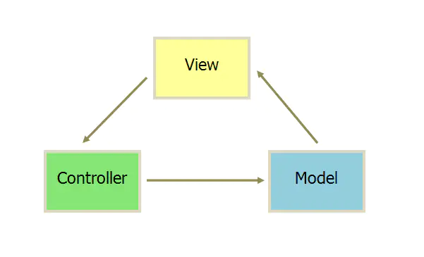

`Model-View-Controller`，

Model（模型）表示应用程序核心（如数据库）：是应用程序中用于`处理应用程序数据逻辑`的部分

View（视图）显示效果（HTML页面）：通常视图是依据模型数据创建的

- Controller：是应用程序中`处理用户交互`的部分。通常控制器负责从视图读取数据，控制用户输入，并向模型发送数据

### 优点
- 耦合度低
- 重用性高
- 可维护性高

### 缺点
- 不适合小型，中等规模的应用程序
- 增加系统结构和实现的复杂性
- 视图与控制器间的过于紧密的连接


## MVP
`Model-View-Presenter`，MVP 是从经典的模式MVC演变而来，它们的基本思想有相通的地方Controller/Presenter负责逻辑的处理，Model提供数据，View负责显示。

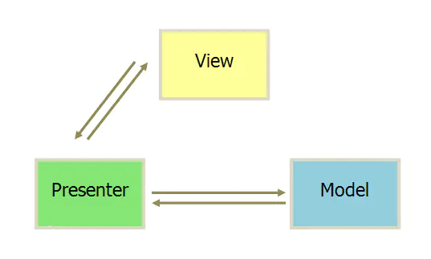

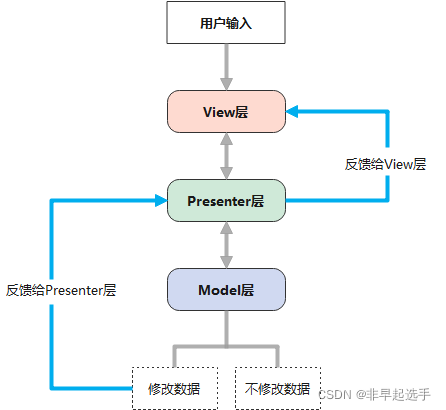

### 优点
- 模型与视图完全分离，我们可以修改视图而不影响模型；
- 可以更高效地使用模型，所有的交互都发生在`Presenter`内部；
- 我们可以`将一个Presenter用于多个视图，而不需要改变Presenter的逻辑`。这个特性非常的有用，因为视图的变化总是比模型的变化频繁；
- 如果我们把逻辑放在Presenter中，那么我们就可以脱离用户接口来测试这些逻辑（单元测试）


### 缺点

由于对视图的渲染放在了Presenter中，所以视图和Presenter的交互会过于频繁。还有一点需要明白，`如果Presenter过多地渲染了视图，往往会使得它与特定的视图的联系过于紧密`。一旦视图需要变更，那么Presenter也需要变更了。比如说，原本用来呈现Html的Presenter现在也需要用于呈现Pdf了，那么视图很有可能也需要变更。

> 由于View层和Model层都需要经过Presenter层，导致Presenter层比较复杂，维护起来也会有一定的问题；而且，因为`没有绑定数据，所有数据都需要Presenter层进行“手动同步”，代码量较大`，虽然比起MVC框架好很多，但还是有比较多冗余部分。


### MVC对比MVP
作为一种新的模式，MVP与MVC有着一个重大的区别：`在MVP中View并不直接使用Model`，它们之间的通信是通过Presenter (MVC中的Controller)来进行的，所有的交互都发生在Presenter内部，而在MVC中View会直接从Model中读取数据而不是通过 Controller。
`在MVC里，View是可以直接访问Model的！从而，View里会包含Model信息，不可避免的还要包括一些业务逻辑`。 在MVC模型里，更关注的Model的改变，而同时有多个对Model的不同显示，即View。所以，在MVC模型里，Model不依赖于View，但是View是依赖于Model的。不仅如此，因为有一些业务逻辑在View里实现了，导致要更改View也是比较困难的，至少那些业务逻辑是无法重用的。
虽然 MVC 中的 View 的确“可以”访问 Model，但是我们不建议在 View 中依赖 Model，而是要求尽可能把所有业务逻辑都放在 Controller 中处理，而 View 只和 Controller 交互。


## MVVM


MVVM（Model-View-ViewModel）本质上是MVC的改进版，由以下三个内容组成：
- View：界面
- Model：数据模型
- ViewModel：作为桥梁负责沟通 View 和 Model

> MVVM就是将其中的View的状态和行为抽象化，让我们将视图 UI 和业务逻辑分开

### MVVM优点

- 低耦合性：视图（View）可以独立于Model变化和修改，一个ViewModel可以绑定到不同的"View"上，当View变化的时候Model可以不变，当Model变化的时候View也可以不变
- 可重用性：你可以把一些视图逻辑放在一个ViewModel里面，让很多view重用这段视图逻辑
- 独立开发：开发人员可以专注于业务逻辑和数据的开发（ViewModel），设计人员可以专注于页面设计
- 可测试

在 JQuery 时期，如果需要刷新 UI 时，需要先取到对应的 DOM 再更新 UI，这样数据和业务的逻辑就和页面有强耦合。

在 MVVM 中，`UI是通过数据驱动的`，数据一旦改变就会相应的刷新对应的 UI，UI如果改变，也会改变对应的数据。这种方式就`可以在业务处理中只关心数据的流转，而无需直接和页面打交道`。

ViewModel 只关心数据和业务的处理，不关心 View 如何处理数据，在这种情况下，View 和 Model 都可以独立出来，任何一方改变了也不一定需要改变另一方，并且可以将一些可复用的逻辑放在一个 ViewModel 中，让多个 View 复用这个 ViewModel。

> 在 MVVM 中，最核心的也就是`数据双向绑定`，例如 Angluar 的脏数据检测，Vue 中的数据劫持。


### MVVM与MVP区别

mvvm模式将Presener改名为View Model，基本上与MVP模式完全一致，`唯一的区别是，它采用双向绑定(data-binding)`: View的变动，自动反映在View Model，反之亦然。这样开发者就不用处理接收事件和View更新的工作，框架已经帮你做好了


### 脏数据检查
众所周知，Angular的双向绑定是采用“脏检测”的方式来更新DOM——Angular对常用的dom事件、xhr事件进行了封装，触发时会调用`$digest cycle`。在$digest流程中，`Angular将遍历每个数据变量的watcher，比较它的新旧值。当新旧值不同时，触发listener函数`，执行相关的操作。

当触发了指定事件后会进入`脏数据检测`，这时会调用 $digest 循环遍历所有的数据观察者，判断当前值是否和先前的值有区别，如果检测到变化的话，会调用 $watch 函数，然后再次调用 $digest 循环直到发现没有变化。循环至少为二次 ，至多为十次。

脏数据检测虽然存在低效的问题，但是不关心数据是通过什么方式改变的，都可以完成任务，但是这在 Vue 中的双向绑定是存在问题的。并且脏数据检测可以实现批量检测出更新的值，再去统一更新 UI，大大减少了操作 DOM 的次数。所以低效也是相对的，这就仁者见仁智者见智了


### 数据劫持

`Vue`内部使用了`Object.defineProperty()`来实现`双向绑定`，通过这个函数可以监听到 `set` 和 `get` 的事件。

`vue2.x`是基于`Object.defineProperty`实现双向数据绑定的；该函数可以在获取属性值或者设置属性值的时候监听属性的`get`和`set`事件，并进行相关的操作；当然，这些具体的操作就需要通过`发布订阅者模式`作为补充；

`Vue 3.0`是基于`ES6 Proxy`重写了其核心逻辑，代替了原来的Object.defineProperty；优势是：

1. 劫持整个对象并返回一个新对象，而不是像Object.defineProperty需要循环遍历整个对象属性；
2. 支持监听数组变化；
3. 支持更加丰富的数据劫持操作；

如模板解析时每遇到一个属性，就为该属性添加一个发布订阅，从而能够进行双向数据绑定；

#### 乞丐版

```js
function observe(obj) {
    if (!obj || typeof obj !== 'object') { // 处理类型为null/undefined/非对象
        return;
    }

    Object.keys(obj).forEach(key => { // 遍历子属性并进行属性监听；
        defineReactive(obj, key, obj[key]);
    })
}

function defineReactive(obj, key, value) {
    observe(value); // 递归子属性

    Object.defineProperty(obj, key, {
        configurable: true,
        enumberable: true,
        get() {
            console.log('get value: ', value);
            return value;
        },
        set(newVal) {
            console.log('set value: ', newVal);
            value = newVal;
        }
    })
}


var data = {name: 'vue'}
observe(data);
data.name // get value: vue
data.name = 'fn' // set value: fn
data.name // get value: fn
```

#### 为属性添加发布订阅模式

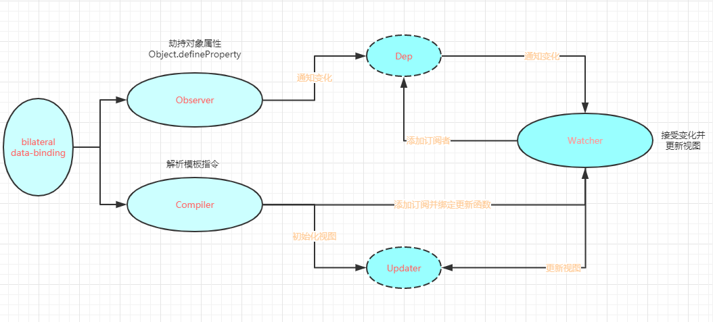

以上代码简单的实现了如何监听数据的 set 和 get 的事件，但是仅仅如此是不够的，还需要在适当的时候给属性添加发布订阅

在解析`<div>{{name}}</div>`之类的模板时，会给`name`添加发布订阅

```js
class Dep {
    constuctor() {
        this.subs = [];
    }

    // 添加订阅者
    addSub(sub) {
        // sub 是watcher的实例, 每次解析到模板中的属性时，就通过watcher为属性添加订阅并更新视图；
        this.subs.push(sub);
    }

    // 通知变化
    notify() {
        this.subs.forEach(sub => sub.update()) // 调用Watcher实例方法update更新视图
    }
}

// 通过静态属性设置Dep的目标对象
Dep.target = null;

Class Watcher {
    constructor(obj, key, cb) {
        // 将 Dep.target 指向自己
        // 然后`触发属性的 getter 添加监听`
        // 最后将 Dep.target 置空
        Dep.target = this; // 设置Dep通知变化的目标对象
        this.cb = cb;
        this.obj = obj; // 待监听对象
        this.key = key;
        this.value = obj[key];
        Dep.target = null;	// 每次为属性添加一个watcher之后解除Dep与Watcher的关联；
    }

    // 接受变化并更新视图
    update() {
        // get new value
        this.value = this.obj[this.key];
        // update view
        this.cb(this.value);
    }
}

```

测试：
```js
// Watcher的cb函数
function update(value) {
    document.querySelector('div').innerText = value
}

var data= {name: 'vue'};
observe(data);

new Watcher(data, 'name', update);		// 模拟解析属性name的操作

```

#### 升级版

上边一小节中，我们已经通过`watcher`模拟解析到属性时的操作；但是这个行为是我们手动操作的，并没有与`observe`建立关系让其自动订阅与通知；本节实现此功能；

```js
function observe(obj) {
    if (!obj || typeof obj !== 'object') {	// 处理类型为null/undefined/非对象
        return;
    }
    Object.keys(obj).forEach(key => {	// 遍历子属性并进行属性监听；
        defineReactive(obj, key, obj[key]);
    })
}

function defineReactive(obj, key, value) {
    observe(value); // 递归子属性

    let dep = new Dep();
    Object.defineProperty(obj, key, {
        configurable: true,
        enumerable: true,
        get() {
            console.log('get value: ', value);
            if (Dep.target) {
                dep.addSub(value); // Dep.target是watcher实例，即订阅者sub
            }
            return value;
        },
        set(newVal) {
            console.log('set value: ', value);
            value = newVal;
            // 调用watcher的update方法更新视图
            dep.notify();
        }
    })
}

class Dep {
    constructor() {
        this.subs = [];
    }
    // 添加订阅者
    addSub(sub) {
        // 订阅者sub 是watcher的实例, 每次解析到模板中的属性时，就通过watcher为属性添加订阅并更新视图；
        this.subs.push(sub);
    }
    // 通知变化
    notify() {
        this.subs.forEach(sub => {
            sub.update();
        })
    }
}
// 通过静态属性设置Dep的目标对象， 建立Dep与Watcher的关系
Dep.target = null;

class Watcher {
    constructor(obj, key, cb) {
        Dep.target = this;	// 设置Dep通知变化的目标对象
        this.cb = cb;
        this.obj = obj;		// 待监听对象
        this.key = key;
        this.value = obj[key];  // 手动触发属性的get事件
        Dep.target = null;	// 每次为属性添加一个watcher之后解除Dep与Watcher的关联；
    }
    // 接受变化并更新视图
    update() {
        // get new value
        this.value = this.obj[this.key];
        // update view
        this.cb(this.value);
    }
}

```


#### 完整demo
```html
<!DOCTYPE html>
<html lang="en">

<head>
	<meta charset="UTF-8">
	<meta name="viewport" content="width=device-width, initial-scale=1.0">
	<meta http-equiv="X-UA-Compatible" content="ie=edge">
	<title>Vue数据劫持</title>
	<style>
		.collapse {
			color: lightskyblue;
		}
		#show {
			font-size: 30px;
			color: greenyellow;
		}
	</style>
</head>
<body>
	<div class="collapse">
		<label for="input">Your name: &nbsp;</label>
		<input type="text" id="input">
		<div id="show"</div>
	</div>
	<script>
		function observe(obj) {
			if (!obj || typeof obj !== 'object') {	// 处理类型为null/undefined/非对象
				return;
			}
			Object.keys(obj).forEach(key => {	// 遍历子属性并进行属性监听；
				defineReactive(obj, key, obj[key]);
			})
		}

		function defineReactive(obj, key, value) {
			observe(value);	// 递归子属性
			let dep = new Dep();
			Object.defineProperty(obj, key, {
				configurable: true,
				enumerable: true,
				get() {
					console.log('get value: ', value);
					if (Dep.target) {
						dep.addSub(Dep.target);     // Dep.target是watcher实例
					}
					return value;
				},
				set(newVal) {
					console.log('set value: ', newVal);
					value = newVal;
					// 调用watcher的update方法更新视图
					dep.notify();
				}
			})
		}

		class Dep {
			constructor() {
				this.subs = [];
			}
			// 添加订阅者
			addSub(sub) {
				// sub 是watcher的实例, 每次解析到模板中的属性时，就通过watcher为属性添加订阅并更新视图；
				this.subs.push(sub);
			}
			// 通知变化
			notify() {
				this.subs.forEach(sub => {
					sub.update();
				})
			}
		}
		// 通过静态属性设置Dep的目标对象， 建立Dep与Watcher的关系
		Dep.target = null;

		class Watcher {
			constructor(obj, key, cb) {
				Dep.target = this;	// 设置Dep通知变化的目标对象
				this.cb = cb;
				this.obj = obj;		// 待监听对象
				this.key = key;
				this.value = obj[key];  // 手动触发属性的get事件
				Dep.target = null;	// 每次为属性添加一个watcher之后解除Dep与Watcher的关联；
			}
			// 接受变化并更新视图
			update() {
				// get new value
				this.value = this.obj[this.key];
				// update view
				this.cb(this.value);
			}
		}

		function update(value) {
			document.querySelector('#show').innerText = value
		}

		var data = { name: 'vue' };
		observe(data);

		new Watcher(data, 'name', update);

		function handleChange(e) {
			data.name = e.target.value;
		}
		window.onload = function () {
			let input = document.querySelector('#input');
			let show = document.querySelector('#show').innerText = data.name;
			input.addEventListener('change', e => {
				handleChange(e);
			})
		}
	</script>
</body>
</html>

```


### Proxy与Object.defineProperty

Object.defineProperty 虽然已经能够实现双向绑定了，但是他还是有缺陷的。

- 只能对属性进行数据劫持，所以需要深度遍历整个对象
- 对于数组不能监听到数据的变化

虽然 Vue 中确实能检测到数组数据的变化，但是其实是使用了 hack 的办法，并且也是有缺陷的。

> 反观 Proxy 就没以上的问题，原生支持监听数组变化，并且可以直接对整个对象进行拦截，所以 Vue 在`3.x`版本中使用 `Proxy 替换 Object.defineProperty`

> `Proxy` 对象用于创建一个对象的代理，从而`实现基本操作的拦截和自定义`（如属性查找、赋值、枚举、函数调用等）。

```js
let onWatch = (obj, setBind, getLogger) => {
    let handler = {
        get(target, property, receiver) {
            getLogger(target, property);
            return Reflect.get(target, property, receiver);
        },
        set(target, property, value, receiver) {
            setBind(value);
            return Reflect.set(target, property, value);
        }
    }

    return new Proxy(obj, handler);
}

let obj = { a: 1 }
let value
let p = onWatch(
    obj,
    v => {
        value = v
    },
    (target, property) => {
    console.log(`Get '${property}' = ${target[property]}`)
    }
)
p.a = 2 // bind `value` to `2`
p.a // -> Get 'a' = 2

```


## 路由原理

> 前端路由实现起来其实很简单，本质就是监听 URL 的变化，然后匹配路由规则，显示相应的页面，并且无须刷新。

目前单页面使用的路由就只有两种实现方式：
- hash模式
- history模式

### hash模式

`www.test.com/##/` 就是 Hash URL，当 `## 后面的哈希值发生变化时，不会向服务器请求数据，可以通过 hashchange 事件来监听到 URL 的变化`，从而进行跳转页面。

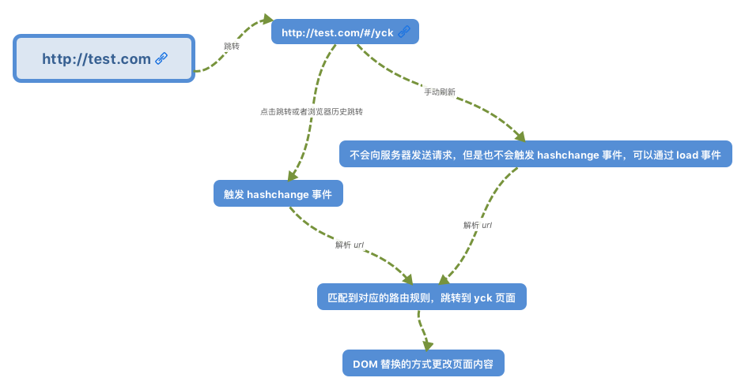

### history模式

`History` 模式是 `HTML5` 新推出的功能，比之 Hash URL 更加美观

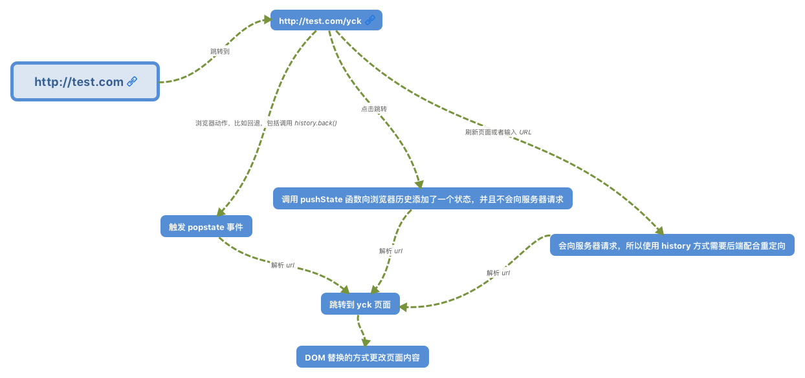

#### history.pushState()

> history.pushState() 方法向当前浏览器会话的历史堆栈中添加一个状态（state）

```js
history.pushState(state, title[, url]);
```

-title: 当前大多数浏览器都忽略此参数，尽管将来可能会使用它。 在此处传递空字符串应该可以防止将来对方法的更改。 或者，您可以为要移动的状态传递简短的标题

-url: 如果是相对的，则相对于当前 URL 进行解析。 新网址必须与当前网址相同 origin； 否则，pushState()将引发异常。 如果未指定此参数，则将其设置为文档的当前 URL。


从某种程度上来说，`pushState`与`location = '#foo'`基本一样，会在当前document中创建和激活一个新的历史记录。但`pushState`有以下优势：
- 新的 URL 可以是任何和当前 URL 同源的 URL。但是设置 window.location 只会在你只设置锚的时候才会使当前的 URL。
- 非强制修改 URL。相反，设置 window.location = "#foo"; 仅仅会在锚的值不是 #foo 情况下创建一条新的历史记录。
- `可以在新的历史记录中关联任何数据`。window.location = "#foo"形式的操作，你只可以将所需数据写入锚的字符串中。

> `pushState() 不会造成 hashchange (en-US) 事件调用`，即使新的 URL 和之前的 URL 只是锚的数据不同。

假设 `http://mozilla.org/foo.html` 执行下面的 JavaScript:

```js
let stateObj = {
    foo: "bar",
}

history.pushState(stateObj, "page 2", "bar.html")
```

上述demo会导致地址栏展示`http://mozilla.org/bar.html`，但是不会导致浏览器加载`bar.html`或者检测`bar.html`是否真实存在。

假设此时用户导航到`http:google.com`，然点击`back`导航按钮，此时地址栏会展示`http://mozilla.org/bar.html`，`history.state`会包含`stateObj`。因为页面重载了，所以`popState`事件不会被触发，页面会展示真实的`bar.html`。

如果用户再次点击了`back`导航按钮，地址栏会变为`http://mozilla.org/foo.html`，并且会触发`popState`，stateObj为`null`。页面此时不会重载，会触发`popState`。这里需要注意的是，页面内容展示和`back`前是一致的，除非在`popState`里进行了处理。

> 需要注意的是，通常情况下`history.back()`与点击`back`按钮的作用是一致的，除了以下情况：
> 使用了`history.pushState()`再调用`history.back()`不会触发`popstate`事件，但是点击浏览器`back`按钮会触发。


## Virtual DOM

Virtual Dom 算法的实现也就是以下三步

- 通过 JS 来模拟创建 DOM 对象
- 判断两个对象的差异
- 渲染差异

### 为什么需要Virtual DOM

直接操作DOM是一个很耗性能的问题，所以考虑通过JS对象来模拟DOM对象

以下是一个 `JS 对象`模拟 `DOM 对象`的简单实现

```js
export default class Element {
  /**
   * @param {String} tag 'div'
   * @param {Object} props { class: 'item' }
   * @param {Array} children [ Element1, 'text']
   * @param {String} key option
   */
  constructor(tag, props, children, key) {
    this.tag = tag;
    this.props = props;
    if (Array.isArray(children)) {
      this.children = children;
    } else if (isString(children)) {
      this.key = children;
      this.children = null;
    }

    if (key) {
      this.key = key;
    }
  }

  // 渲染
  render() {
    let root = this._createElement(
      this.tag,
      this.props,
      this.children,
      this.key,
    )
    document.body.appendChild(root);
    return root;
  }

  create() {
    return this._createElement(this.tag, this.props, this.children, this.key);
  }

  // 创建节点
  _createElement(tag, props, children, key) {
    // 通过tag创建节点
    let el = document.createElement(tag);

    // 设置节点属性
    for (const key in props) {
      if (props.hasOwnProperty(key)) {
        const value = props[key];
        el.setAttribute(key, value);
      }
    }

    if (key) {
      el.setAttribute('key', key);
    }

    // 递归添加子节点
    if (children) {
      children.forEach(el => {
        let child;
        if (el instanceof Element) {
          child = this._createElement(
            el.tag,
            el.props,
            el.children,
            el.key
          )
        } else {
          child = document.createTextNode(el);
        }
        el.appendChild(child);
      })
    }

    return el;
  }
}

```


### Virtual DOM算法简述

使用JS模拟实现了DOM后，接下来的难点就在于如何判断旧的对象和新的对象之间的差异。

`DOM 是多叉树的结构`，如果需要完整的对比两颗树的差异，那么需要的时间复杂度会是 `O(n ^ 3)`，这个复杂度肯定是不能接受的。于是 `React 团队优化了算法，实现了 O(n) 的复杂度来对比差异`。

`实现 O(n) 复杂度的关键就是只对比同层的节点，而不是跨层对比`，这也是考虑到在实际业务中很少会去跨层的移动 DOM 元素。

所以判断差异的算法就分为了两步

- 首先从上至下，从左往右遍历对象，也就是树的深度遍历，这一步中会给每个节点添加索引，便于最后渲染差异
- 一旦节点有子元素，就去判断子元素是否有不同


### Virtual DOM算法实现

#### 树的递归

首先我们来实现树的递归算法，在实现该算法前，先来考虑下两个节点对比会有几种情况
- 新的节点的 `tagName` 或者 `key` 和旧的不同，这种情况代表需要替换旧的节点，并且也不再需要遍历新旧节点的子元素了，因为整个旧节点都被删掉了
- 新的节点的 `tagName` 和 `key`（可能都没有）和旧的相同，开始遍历子树
- 没有新节点，什么都不做；


```js
import {StateEnums, isString, move} from './util';
import Element from './element';

export default function diff(oldDomTree, newDomTree) {
	// 记录差异
	let patches = {};

	// 一开始索引为0
	dfs(oldDomTree, newDomTree, 0, patches);

	return patches;
}

function dfs(oldNode, newNode, index, patches) {
	// 保存子树更改
	let curPatches = [];
	// 需要判断三种情况
	// 1. 没有新节点，什么都不做
	// 2. 新旧节点tagName或key不同，直接替换
	// 3. 新旧节点tagNane及key都相同，遍历子树

	if (!newNode) {

	} else if (newNode.tag === oldNode.tag && newNode.key === oldNode.tag) {
		// 判断属性是否变更
		let props = diffProps(oldNode.props, newNode.props);
		if (props.length) {
			curPatches.push({ type: StateEnums.ChangeProps, props })
		}
		// 遍历子树
		diffChildren(oldNode.children, newNode.children, index, patches);
	} else {
		// 节点不同，需要替换
		curPatches.push({ type: StateEnums.Replace, node: newNode })
	}

	if (curPatches.length) {
		if(patches[index]) {
			patches[index] = patches[index].concat(curPatches);
		} else {
			patches[index] = curPatches;
		}
	}
}

```


#### 判断属性的更改

判断属性的更改也分三个步骤：
- 遍历旧的属性列表，查看每个属性是否还存在于新的属性列表中
- 遍历新的属性列表，判断两个列表中都存在的属性的值是否有变化
- 在第二步中同时查看是否有属性不存在与旧的属性列列表中

```js
function diffProps(oldProps, newProps) {
    // 判断props分三步：
    // 1. 遍历oldProps查看是否存在删除的属性
    // 2. 遍历newProps是否有属性值的变更
    // 3. 基于2查看是否有新增属性

    let changes = []; // 属性变更记录

    for (const key in oldProps) {
        if (oldProps.hasOwnProperty(key) && !newProps[key]) { // 属性移除
            change.push({ prop: key });
        }
    }

    for (const key in newProps) {
        if (newProps.hasOwnProperty(key)) {
            const prop = newProps[key];
            if (oldProps[key] && oldProps[key] !== newProps[key]) { // 属性值变更
                change.push({ prop: key, value: newProps[key] });
            }
        } else if (!oldProps[key]) { // 新增属性
            change.push({ props: key, value: newProps[key] });
        }
    }
    return change;
}

```


#### 判断列表差异算法实现

这个算法是整个 Virtual Dom 中最核心的算法，且让我一一为你道来。 这里的主要步骤其实和判断属性差异是类似的，也是分为三步：
1. 遍历旧的节点列表，查看每个节点是否还存在于新的节点列表中
2. 遍历新的节点列表，判断是否有新的节点
3. 在第二步中同时判断节点是否有移动

PS：该算法只对有 key 的节点做处理

```js
function listDiff(oldList, newList, index, patches) {
  // 为了遍历方便，先取出两个 list 的所有 keys
  let oldKeys = getKeys(oldList)
  let newKeys = getKeys(newList)
  let changes = []

  // 用于保存变更后的节点数据
  // 使用该数组保存有以下好处
  // 1.可以正确获得被删除节点索引
  // 2.交换节点位置只需要操作一遍 DOM
  // 3.用于 `diffChildren` 函数中的判断，只需要遍历
  // 两个树中都存在的节点，而对于新增或者删除的节点来说，完全没必要
  // 再去判断一遍
  let list = []
  oldList &&
    oldList.forEach(item => {
      let key = item.key
      if (isString(item)) {
        key = item
      }
      // 寻找新的 children 中是否含有当前节点
      // 没有的话需要删除
      let index = newKeys.indexOf(key)
      if (index === -1) {
        list.push(null)
      } else list.push(key)
    })
  // 遍历变更后的数组
  let length = list.length
  // 因为删除数组元素是会更改索引的
  // 所有从后往前删可以保证索引不变
  for (let i = length - 1; i >= 0; i--) {
    // 判断当前元素是否为空，为空表示需要删除
    if (!list[i]) {
      list.splice(i, 1)
      changes.push({
        type: StateEnums.Remove,
        index: i
      })
    }
  }
  // 遍历新的 list，判断是否有节点新增或移动
  // 同时也对 `list` 做节点新增和移动节点的操作
  newList &&
    newList.forEach((item, i) => {
      let key = item.key
      if (isString(item)) {
        key = item
      }
      // 寻找旧的 children 中是否含有当前节点
      let index = list.indexOf(key)
      // 没找到代表新节点，需要插入
      if (index === -1 || key == null) {
        changes.push({
          type: StateEnums.Insert,
          node: item,
          index: i
        })
        list.splice(i, 0, key)
      } else {
        // 找到了，需要判断是否需要移动
        if (index !== i) {
          changes.push({
            type: StateEnums.Move,
            from: index,
            to: i
          })
          move(list, index, i)
        }
      }
    })
  return { changes, list }
}

function getKeys(list) {
  let keys = []
  let text
  list &&
    list.forEach(item => {
      let key
      if (isString(item)) {
        key = [item]
      } else if (item instanceof Element) {
        key = item.key
      }
      keys.push(key)
    })
  return keys
}

```

#### 遍历子元素打标识

对于这个函数来说，主要功能就两个
- 判断两个列表差异
- 给节点打上标记


```js
function diffChildren(oldChild, newChild, index, patches) {
    let { change, list } = listDiff(oldChild, newChild, index, patches);
    if (changes.length) {
        if (patches[index]) {
            patches[index] = patches[index].concat(changes)
        } else {
            patches[index] = changes
        }
    }

    // 记录上一个遍历过的节点
    let last = null;
    oldChild &&
        oldChild.forEach((item, i) => {
            let child = item && item.children;

            if (child) {
                index = last && last.children ? index + last.children.length + 1 : index + 1;
                let keyIndex = list.indexOf(item.key);
                let node = newChild[keyIndex];
                // 只遍历新旧中都存在的节点，其他增删的没必要遍历
                if (node) {
                    dfs(item, node, index, patches);
                }
            } else {
                index += 1;
            }

            last = item;
        })
}
```


#### 渲染差异
通过之前的算法，我们已经可以得出两个树的差异了。既然知道了差异，就需要局部去更新 DOM 了，下面就让我们来看看 Virtual Dom 算法的最后一步骤

这个函数主要两个功能
1. 深度遍历树，将需要做变更操作的取出来
2. 局部更新DOM

整体来说这部分代码还是很好理解的

```js
let index = 0;
export default function patch(node, patches) {
    let changes = patch[index];
    let childNodes = node && node.childNodes;
    // 这里的深度遍历和diff中是一样的
    if (!childNodes) {
        index += 1;
    }
    if (changes && changes.length && patches[index]) {
        changeDom(node, changes)
    }

    let last = null;
    if (childNodes && childNodes.length) {
        childNodes.forEach((item, i) => {
            index = last && last.children ? index + last.children.length + 1 : index + 1;
            patch(item, patches);
            last = item;
        })
    }
}

function changeDom(node, changes, noChild) {
    changes &&
        changes.forEach(change => {
            let { type } = change;
            switch (type) {
                case StateEnums.ChangeProps:
                    let { props } = change;
                    props.forEach(item => {
                        if (item.value) {
                            node.setAttribute(item.prop, item.value);
                        } else {
                            node.removeAttribute(item.prop);
                        }
                    })
                    break;
                case StateEnums.Remove:
                    node.childNodes[change.index].remove();
                    break;
                case StateEnums.Insert:
                    let dom;
                    if (isString(change.node)) {
                        dom = document.createTextNode(change.node);
                    } else if (change.node instanceof Element) {
                        dom = change.node.create();
                    }
                    node.insertBefore(dom, node.childNodes[change.index])
                case StateEnums.Replace:
                    node.parentNode.replaceChild(change.node.create(), node);
                    break;
                case StateEnums.Move:
                    let fromNode = node.childNodes[change.from];
                    let toNode = node.childNodes[change.to];
                    let cloneFromNode = fromNode.cloneNode(true);
                    let cloenToNode = toNode.cloneNode(true);
                    node.replaceChild(cloneFromNode, toNode)
                    node.replaceChild(cloenToNode, fromNode)
                    break;
                default:
                    break;
            }
        })
}

```

#### 最后

Virtual Dom 算法的实现也就是以下三步：
1. 通过 JS 来模拟创建 DOM 对象
2. 判断两个对象的差异
3. 渲染差异


```js
     test4 = new Element('div', { class: 'my-div' }, ['test4'])
let test5 = new Element('ul', { class: 'my-div' }, ['test5'])

let test1 = new Element('div', { class: 'my-div' }, [test4])

let test2 = new Element('div', { id: '11' }, [test5, test4])

let root = test1.render()

let pathchs = diff(test1, test2)
console.log(pathchs)

setTimeout(() => {
  console.log('开始更新')
  patch(root, pathchs)
  console.log('结束更新')
}, 1000)
```


> 完整代码可以参考[FE-demos/demo03-virtual-dom](https://github.com/luofeng457/FE-demos/blob/master/demo03-virtual-dom/src/index.js)


---

# Vue

## NextTick原理分析

> `nextTick` 可以让我们在下次 DOM 更新循环结束之后执行延迟回调，`用于获得更新后的 DOM`

---


# React

## React生命周期分析
在` V16 版本中引入了 Fiber 机制`。这个机制一定程度上的影响了部分生命周期的调用，并且也引入了新的 2 个 API 来解决问题。

在之前的版本中，如果你拥有一个很复杂的复合组件，然后改动了最上层组件的 state，那么调用栈可能会很长


调用栈过长，再加上中间进行了复杂的操作，就`可能导致长时间阻塞主线程`，带来不好的用户体验。`Fiber 就是为了解决该问题而生`。


> `Fiber 本质上是一个虚拟的堆栈帧`，新的调度器会`按照优先级`自由调度这些帧，从而将之前的`同步渲染改成了异步渲染`，在不影响体验的情况下去`分段计算更新`。


对于如何区别优先级，React 有自己的一套逻辑。对于动画这种实时性很高的东西，也就是 16 ms 必须渲染一次保证不卡顿的情况下，React 会每 16 ms（以内） 暂停一下更新，返回来继续渲染动画。


对于异步渲染，现在渲染有两个阶段：`reconciliation` 和 `commit` 。`前者过程是可以打断的，后者不能暂停`，会一直更新界面直到完成。


### Reconciliation 阶段（异步）
- [UNSAFE_]componentWillMount
- [UNSAFE_]componentWillReceiveProps
- getDeriveStateFromProps
- shouldComponentUpdate
- [UNSAFE_]componentWillUpdate
- render

### Commit 阶段（同步）
- getSnapshotBeforeUpdate
- componentDidMount
- componentDidUpdate
- componentWillUnmount

`commit phase`通常是`同步执行`（因为该步骤涉及到真实DOM的更新及UI展现）


因为`reconciliation`阶段时可以被打断的，所以`reconciliation`阶段会执行的生命周期函数就可能会出现调用多次的情况，从而引起bug。所以`reconciliation`阶段调用的几个函数，除了`shouldComponentUpdate`外，其他的都应该避免去使用，并且V16也引入了新的API来解决这个问题。


> `getDerivedStateFromProps`用于替换`componentWillReceiveProps`，该函数会在初始化和`update`时被调用；`getDerivedStateFromProps`在`render`函数之前调用，通常它会返回一个对象去更新`state`或者`null`不做更新；

```js
// static getDerivedStateFromProps(props, state)
class ExampleComponent extends React.Component {
  // Initialize state in constructor,
  // Or with a property initializer.
  state = {}

  static getDerivedStateFromProps(nextProps, prevState) {
    if (prevState.someMirroredValue !== nextProps.someValue) {
      return {
        derivedData: computeDerivedState(nextProps),
        someMirroredValue: nextProps.someValue
      }
    }

    // Return null to indicate no change to state.
    return null
  }
}

```

> `getSnapshotBeforeUpdate`用于替换`componentWillUpdate`，该函数会在`update后DOM更新前被调用`，用于读取最新的DOM数据。该函数的任意返回值都会作为`componentDidUpdate`的参数。

```js
class ScrollingList extends React.component {
    constructor(props) {
        super(props);
        this.listRef = React.createRef();
    }

    getSnapshotBeforeUpdate(prevProps, prevState) {
        // Are we adding new items to the list?
        // Capture the scroll position so we can adjust scroll later.
        if (prevProps.list.length < this.props.list.length) {
            const list = this.listRef.current;
            return list.scrollHeight - list.scrollTop;
        }
        return null;
    }

    componentDidUpdate(prevProps, prevState, snapshot) {
        // If we have a snapshot value, we've just added new items.
        // Adjust scroll so these new items don't push the old ones out of view.
        // (snapshot here is the value returned from getSnapshotBeforeUpdate)
        if (snapshot !== null) {
            const list = this.listRef.current;
            list.scrollTop = list.scrollHeight - snapshot;
        }
    }
 
    render() {
        return (
            <div ref={this.listRef}>{/* ...contents... */}</div>
        );
    }

}
```


### V16 生命周期函数用法建议

```js
class ReactLifeCycle extends React.Component {
  // 初始化state和事件绑定
  constructor() {}
  // getDerivedStateFromProps会在调用render之前调用，即在渲染DOM元素前会调用，并且在初始化挂载及后续更新时都会被调用。state的值在任何时候都取决于props
  // getDerivedStateFromProps的存在只有一个目的：让组件在props变化时更新state
  // 因为该函数是静态函数，所以取不到 `this`
  static getDerivedStateFromProps(props, state) {}
  // 判断是否需要更新组件，多用于组件性能优化，需要返回一个boolean值
  shouldComponentUpdate(nextProps, nextState) {}
  // 组件挂载后调用
  // 可以在该函数中进行请求或者订阅
  componentDidMount() {}
  // getSnapshotBeforeUpdate()方法在最近一次渲染输出（提交到 DOM 节点）之前调用；在 getSnapshotBeforeUpdate() 方法中，我们可以访问更新前的 props 和 state；
  getSnapshotBeforeUpdate(prevProps, prevState) {}
  // 组件即将销毁
  // 可以在此处移除订阅，定时器等等
  componentWillUnmount() {}
  // 组件销毁后调用
  componentDidUnMount() {}
  // 组件更新后调用
  componentDidUpdate(prevProps, prevState, snapshot) {}
  // 渲染组件函数
  render() {}
  // 以下函数不建议使用
  `UNSAFE_componentWillMount() {}
  UNSAFE_componentWillUpdate(nextProps, nextState) {}
  UNSAFE_componentWillReceiveProps(nextProps) {}`
}

```

### setState

`setState` 在 React 中是经常使用的一个 API，但是它存在一些问题，可能会导致犯错，`核心原因就是因为这个 API 是异步的`。

首先 `setState` 的调用并不会马上引起 `state` 的改变，并且如果你一次调用了多个 `setState` ，那么结果可能并不如你期待的一样。

```js
  // 初始化 `count` 为 0
  console.log(this.state.count) // -> 0
  this.setState({ count: this.state.count + 1 })
  this.setState({ count: this.state.count + 1 })
  this.setState({ count: this.state.count + 1 })
  console.log(this.state.count) // -> 0
```

第一，两次的打印都为 0，因为 setState 是个异步 API，只有同步代码运行完毕才会执行。setState 异步的原因我认为在于，setState 可能会导致 DOM 的重绘，如果调用一次就马上去进行重绘，那么调用多次就会造成不必要的性能损失。设计成异步的话，就可以将多次调用放入一个队列中，在恰当的时候统一进行更新过程。

第二，虽然调用了三次 setState ，但是 count 的值还是为 1。因为多次调用会合并为一次，只有当更新结束后 state 才会改变，三次调用等同于如下代码

```js
Object.assign(
  {},
  { count: this.state.count + 1 },
  { count: this.state.count + 1 },
  { count: this.state.count + 1 }
)

```

当然你也可以通过以下方式来实现调用三次 setState 使得 count 为 3

```js
handle() {
    this.setState((prevState) => ({ count: prevState.count + 1 }))
    this.setState((prevState) => ({ count: prevState.count + 1 }))
    this.setState((prevState) => ({ count: prevState.count + 1 }))
}

```

如果想要每次`setState`后获取正确的`state`，可以通过如下代码实现：

```js
handle() {
    this.setState(
        (prevState) => ({ count: prevState.count + 1}),
        () => console.log('updateCount: ', this.state.count)
    )
}
```


### Redux源码分析

#### 什么是Redux

Redux是JS应用的状态容器，提供可预测的状态管理

- 可预测：Redux 让你开发出 `行为稳定可预测`、可`运行在不同环境 `（客户端、服务端和原生程序）、且 `易于测试` 的应用。
- 可调试：Redux DevTools 让你轻松追踪到 `应用的状态在何时、何处以及如何改变`。Redux 的架构让你记下每一次改变，借助于 "`时间旅行调试`"，你甚至可以把完整的错误报告发送给服务器。
- 集中管理：集中管理应用的状态和逻辑可以让你开发出强大的功能，如 `撤销/重做、 状态持久化` 等等。
- 灵活：Redux `可与任何 UI 层框架搭配使用`，并且有 庞大的插件生态 来实现你的需求。

#### 什么时候用Redux
- 应用中很多state在多个组件中需要使用
- 更新state的逻辑很复杂
- 中、大型代码量的应用，多人协作开发
- 应用state会随时间的推移而频繁更新

#### Redux数据流

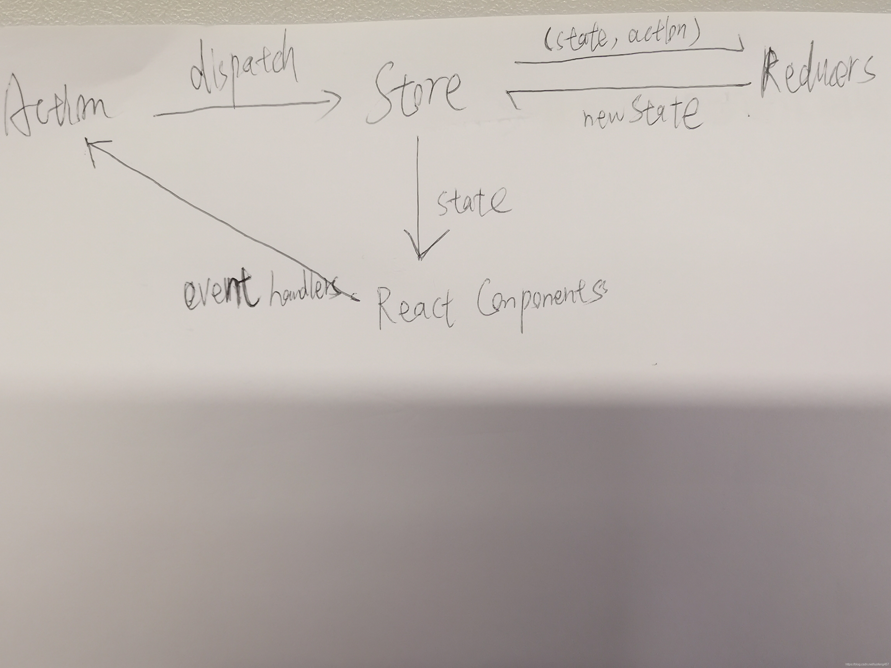

具体来说，对于 Redux，我们可以将这些步骤分解为更详细的内容：

- 初始启动时：
    - 使用最顶层的 root reducer 函数创建 Redux store
    - store 调用一次 root reducer，并将返回值保存为它的初始 state
    - 当视图 首次渲染时，视图组件访问 Redux store 的当前 state，并使用该数据来决定要呈现的内容。同时监听 store 的更新，以便他们可以知道 state 是否已更改。

- 更新环节：
    - 应用程序中发生了某些事情，例如用户单击按钮 
    - dispatch 一个 action 到 Redux store，例如 dispatch({type: 'counter/increment'})
    - store 用之前的 state 和当前的 action 再次运行 reducer 函数，并将返回值保存为新的 state 
    - store 通知所有订阅过的视图，通知它们 store 发生更新
    - 每个订阅过 store 数据的视图 组件都会检查它们需要的 state 部分是否被更新。
    - 发现数据被更新的每个组件都强制使用新数据重新渲染，紧接着更新网页

使用动画表示：


#### Redux规则
- 仅使用`state`和`action`计算新的状态值
- immutable data，禁止直接修改 state；
- 禁止任何异步逻辑、依赖随机值或导致其他“副作用”的代码；


#### 异步逻辑与数据请求


##### combineReducers
```js
// reducers:
// {
//	  a: reducerA,
//	  b: reducerB,
// }
const combineReducers = reducers => {
	const reducerKeys = Object.keys(reducers);

	let finalReducers = {}
	// 如果ruducer不是函数，将其过滤
	for (let i = 0; i < reducerKeys.length; i++) {
		const key = reducerKeys[i];
		if (typeof reducers[key] === 'function') {
			finalReducers[key] = reducers[key];
		}
	}

	const finalReducerKeys = Object.keys(finalReducers);

	// 返回值为组合后的reducer函数，返回总的state
	return function combination(state, action) {
		let hasChanged = false;

		const nextState = {};

		for (let i = 0; i < finalReducerKeys.length; i++) {
			let key = finalReducerKeys[i];
			let reducer = finalReducers[key];
			// state树与finalReducers的key是一一对应的，获取对应key的reducer state
			let prevStateForKey = state[key];
			let nextStateForkey = reducer(prevStateForKey, action);
 			// 执行reducer获取nextState
			nextState[key] = nextStateForkey;

			hasChanged = hasChanged || nextStateForkey !== prevStateForKey;
		}

		// 如果状态改变，返回nextState; 否则返回state;
		return hasChanged ? nextState : state;
	}
}
```


##### createStore

```js
function createStore(reducer, enhancer) {
    if (enhancer) {
		return enhancer(createStore)(reducer);
	}

	let currentState = {};
	let currentListeners = [];
	let isDispatching = false;

	function getState() {
		return currentState;
	}

	function subscribe(listener) {
		currentListeners.push(listener);
		let isSubscribed = true;

		return function unsubscribe() {
			if (!isSubscribed) { 
				return;
			}

			if (isDispatching) { // reducer是否正在执行
				throw new Error('xxxx');
			}

			isSubscribed = false; // 重置已订阅标志位

			const index = currentListeners.indexOf(listener);
			currentListeners.splice(index, 1);
		}
	}

	function dispatch(action) {
		try {
			isDispatching = true;
			currentState = reducer(currentState, action); // 更新currentState
		} finally {
			isDispatching = false;
		}
		currentListeners.forEach(listener => listener()); // 执行监听回调

		return action;
	}


	return { getState, subscribe, dispatch};
}

```


##### applyMiddleware

```js
// middleware: ({ getState, dispatch }) => next => action;
// middleware只是包装了store的dispatch方法
function logger (extraArgument) {
    return
        ({ getState, dispatch })
            (next) =>
                action => {
                    console.log('will dispatch: ', action);
                    // 判断 dispatch 中的参数是否为函数
                    if (typeof action === 'function') {
                        // 是函数的话再把这些参数传进去，直到 action 不为函数，执行 dispatch({tyep: 'XXX'})
                        return action(dispatch, getState, extraArgument);
                    }
                    let returnValue = next(action);
                    return returnValue;
                }
}

// 该函数返回一个柯里化的函数
// 所以调用这个函数应该这样写 applyMiddleware(...middlewares)(createStore)(...args)
function applyMiddleware (...middlewares) {
    return
        createStore =>
            (reducer, preloadedState) => {
                const store = createStore(reducer, preloadedState);
                let dispatch = store.dispatch;

                const middlewareAPI = {
                    getState: store.getState,
                    dispatch: (action, ...args) => dispatch(action, ...args)
                }

                const chain = middlewares.map(middleware => middleware(middlewareAPI));
                dispatch = compose(...chain)(store.dispatch);

                return {
                    ...store,
                    dispatch,
                }
            }
}

```


##### compose

- 高阶函数
- 通过使用 reduce 函数做到`从右至左调用函数`

```js
// 这个函数设计的很巧妙，通过传入函数引用的方式让我们完成多个函数的嵌套使用，术语叫做高阶函数
// 通过使用 reduce 函数做到从右至左调用函数
// 对于上面项目中的例子
compose(
    applyMiddleware(thunkMiddleware),
    window.devToolsExtension ? window.devToolsExtension() : f => f
)

// 经过 compose 函数变成了 applyMiddleware(thunkMiddleware)(window.devToolsExtension()())
// 所以在找不到 window.devToolsExtension 时你应该返回一个函数
function compose(...funcs) {
    if (funcs.length === 0) {
        return arg => arg;
    }

    if (funcs.length === 1) {
        return funcs[0];
    }

    return funcs.reduce((a, b) => (...args) => a(b(...args)));
}

function add (x) {
    return x + 1;
}

function pow (x) {
    return Math.pow(x, 2);
}

compose()(3); // 3

compose(add, pow)(3); // 10

compose(pow, add)(3); // 16


```


### redux中间件

- 用途：主要用于`处理异步数据流`；redux中间件的`实质是对store的dispatch进行重新包装`，修改store.dispatch的默认行为；redux中间件是对redux功能的一种扩展，也是扩展dispatch的唯一标准方式；

- 特点：链式调用

- 既然其本质是对store.dispatch的重新，那么如果不计代码整洁性及冗杂性，任意的middleware均可以手写实现；

#### 进一步分析中间件

1. 假如我们需要在store.dispatch前后需要查看对应的action以及state，我们需要这么实现：
    ```js
    let action = addTodo('learning redux middlewares');
    console.log('dispatched action: ', action);
    store.dispacth(action);
    console.log('nextState: ', store.getState());

    ```

2. 如果上述功能是为了我们方便查看日志，显然将其封装为一个函数更方便；
    ```js
    function dispatchAndLog(store, action) {
        console.log('dispatched action: ', action);
        store.dispacth(action);
        console.log('nextState: ', store.getState());
    }
    ```

3. 这样相对方便了，但是每次使用我们需要引入这个函数；如果我们还想偷懒，可以通过调用原生的store.dispatch就可以实现这些功能岂不是美滋滋~

    于是，我们开始重写`store.dispatch`

    ```js
    store.dispatch = function (action) {
        console.log('dispatched action: ', action);
        store.dispacth(action);
        console.log('nextState: ', store.getState());
    }

    ```

4. 参考redux的源码我们知道，`store.dispatch`函数接受一个`action`参数，返回同一个`dispatched action`；因此，我们需要对该段代码继续优化；

    ```js
    function dispatchAndLogWrapper (store) {
        const next = store.dispatch;
        
        return function dispatchAndLog(action) {
            console.log('dispatched action: ', action);
            let result = next(action);
            console.log('nextState: ', store.getState());
            return result;
        }
    }
    ```
    
    这样，我们中间件返回一个被`middleware`重写后的`store.dispatch`函数；这样`奠定了链式调用的基础`；

    但是对于链式调用，后一个中间件对`store.dispatch`的修改是基于前一个中间件修改的基础上进行的；而上述实现中我们的`next`总是为固定值，即原生的store.dispatch；next的期望值应当是上一个中间件重写后的store.dispatch；因此，`中间件的实现中next通常作为参数传入；next的初始值取原生的store.dispatch`；

5. 中间件函数的描述形式为：`({ getState, dispatch }) => next => action`；据此，改写我们的模拟中间件实现：

    ```js
    const dispatchAndLogWrapper = store => next => action => {
        console.log('dispatched action: ', action);
        let result = next(action);
        console.log('nextState: ', store.getState());
        return result;
    }
    ```

6. 模拟实现applyMiddleware
    
    applyMiddleware可以实现对中间件的链式调用
    ```js
    function applyMiddleware(store, middlewares) {
        middlewares = middlewares.slice();
        middlewares.reverse(); // applyMiddleware其实是store Enhancer扩展机制的一个范例，因此也遵循compose从右至左的组合方式；

        let dispatch = store.dispatch; //获取初试dispatch
        // 这里next的初始值为store.dispatch，每次调用一个middleware都是在上一个middleware返回的dispatch的基础进行修改；
        middlewares.map(middleware => {
            dispatch = middleware(store)(dispatch);
        });

        // 将dispatch的修改应用到store并返回修改后的store
        return {
            ...store,
            dispatch,
        }
    }
    ```


#### redux-thunk

```js
// source code
function createThunkMiddleware(extraArgument) {
  return ({ dispatch, getState }) => (next) => (action) => {
    if (typeof action === 'function') {
      return action(dispatch, getState, extraArgument);
    }

    return next(action);
  };
}

const thunk = createThunkMiddleware();
thunk.withExtraArgument = createThunkMiddleware;

export default thunk;
```

使用方法：
```js
import { createStore, applyMiddleware } from 'redux';
import thunk from 'redux-thunk';
import rootReducer from './reducers';

// Note: this API requires redux@>=3.1.0
const store = createStore(rootReducer, applyMiddleware(thunk));

```


### reac-redux

#### Provider
```js
class Provider extends React.Component {
    static childContextTypes = {
        store: PropTypes.object
    }
    constructor(props, context) {
        super(props, context);
        this.store = props.store;
    }
    getChildContext() {
        return {store: this.store};
    }
    render() {
        return this.props.children;
    }
}
```


#### connect
```js
const connect = (mapStateToProps, mapDispatchToProps) => {
	(WrapContainer) => {
		return class ConnectComponent extends React.Component {
			constructor(props, context) {
				super(props, context);
				this.state = {
					props: {}
				}
			}

			componentDidMount() {
				const { store } = this.context;
				store.subscribe(() => this.update());
				this.update();
			}

			update() {
				const { store } = this.context;
				const stateProps = mapStateToProps(store.getState());
				const dispatchProps = mapDispatchToProps(bindActionCreator(mapDispatchToProps, stroe.dispatch));

				this.setState({
					props: {
						...this.state.props,
						stateProps,
						dispatchProps,
					}
				})
			}

			render() {
				return <WrapContainer {...this.state.props} />
			}
		}
	}
}
```


----

# React源码解读

## render流程一：
```js
// render函数
function render(element, container, callback?: function) {
    if (!isValidContainer(container)) {
        throw Error('Target container is not a DOM element);
    }

    return legacyRenderSubtreeIntoContainer(null, element, container, false, callback);
}

// legacyRenderSubtreeIntoContainer
function legacyRenderSubtreeIntoContainer(parent, children, container, forceHydrate, callback?: function) {
    let root: Root = (container._reactRootContainer: any);

    if (!root) {
        root = container._reactRootContainer = legacyCreateRootFromDOMContainer(container, forceHydrate);
        fiberRoot = root._internalRoot;
    }
    // 后续代码暂时省略
}

```

一开始进来函数的时候肯定是没有 root 的，因此我们需要去创建一个 root，大家可以发现这个 `root` 对象同样也被挂载在了 `container._reactRootContainer` 上，也就是我们的 DOM 容器上

控制台console一下`document.querySelector('#root')._reactRootContainer`我们就可以看到`root`对象。

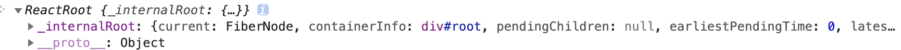

可以看到root是`ReactRoot`构造函数构造出来的，并且内部有一个`_internalRoot`对象，这个是接下来要重点介绍的`fiber`对象


```js
// legacyCreateRootFromDOMContainer
function legacyCreateRootFromDOMContainer(container, forceHydrate) {
    var shouldHydrate = forceHydrate || shouldHydrateDueToLegacyHeuristic(container); // First clear any existing content.和SSR相关，先忽略这部分

    if (!shouldHydrate) {
        let warned = false;
        let rootSibling;
        while ((rootSibling = container.lastChild)) {
            container.removeChild(rootSibling);
        }
    }

    const isConcurrent = false;
    return new ReactRoot(container, isConcurrent, shouldHydrate);
}

```

首先还是和上文中提到的 forceHydrate 属性相关的内容，不需要管这部分，反正 `shouldHydrate` 肯定为 `false`

接下来是将容器内部的节点全部移除，一般来说我们都是这样写一个容器的

```html
<div id='root'></div>
```

> 这样的形式肯定就不需要去移除子节点了，这也侧面说明了一点那就是`容器内部不要含有任何的子节点`。

一是肯定会被移除的，二是还要进行DOM操作，可能还会设计到重绘回流等；

最后就是创建了一个 `ReactRoot` 对象并返回。接下来的内容中我们会看到好几个 root，可能会有点绕。

```js
function ReactRoot(
    container: DOMContainer,
    isConcurrent: boolean,
    hydarate: boolean,
) {
    // 这个root指的是FiberRoot
    const root = createContainer(container, isConcurrent, hydrate);
    this._internalRoot = root;
}

function createContainer(
    containerInfo: Container,
    isConcurrent: boolean,
    hydrate: boolean,
): OpaqueRoot {
    return createFiberRoot(containerInfo, isConcurrent, hydrate);
}
```

在 ReactRoot 构造函数内部就进行了一步操作，那就是创建了一个 FiberRoot 对象，并挂载到了 _internalRoot 上。`和 DOM 树一样，fiber 也会构建出一个树结构（每个 DOM 节点一定对应着一个 fiber 对象），FiberRoot 就是整个 fiber 树的根节点`，接下来的内容里我们将学习到关于 fiber 相关的内容。这里提及一点，`fiber 和 Fiber 是两个不一样的东西，前者代表着数据结构，后者代表着新的架构`。

```js
function createFiberRoot(
    containerInfo: any,
    isConcurrent: boolean,
    hydrate: boolean,
): FiberRoot {
    // FiberRootNode内部创建了很多属性
    const root: FiberRoot = (new FiberRootNode(containerInfo, hydrate): any);
    const uninitialized = crateHostRootFiber(isConcurrent);
    root.current = uninitializedFiber;
    uninitializedFiber.stateNode = root;

    return root;
}

```

在 `createFiberRoot` 函数内部，分别`创建了两个 root`，一个 root 叫做 `FiberRoot`，另一个 root 叫做 `RootFiber`，并且它们两者还是相互引用的。

这两个对象内部拥有着数十个属性，现在我们没有必要一一去了解它们各自有什么用处，在当下只需要了解少部分属性即可，其他的属性我们会在以后的文章中了解到它们的用处。

对于 `FiberRoot` 对象来说，我们现在只需要了解两个属性，分别是 `containerInfo` 及 `current`。`前者代表着容器信息`，也就是我们的 document.querySelector('#root')；`后者指向 RootFiber`。


对于 RootFiber 对象来说，我们需要了解的属性稍微多点

```js
function FiberNode(
	tag: WorkTag,
	pendingProps: mixed,
	key: null | string,
	mode: TypeOfMode,
) {
	this.stateNode = null;
	this.return = null;
	this.child = null;
	this.sibling = null;
	this.effectTag = NoEffect;
	this.alternate = null;
}
```

`return`、`child`、`sibling` 这三个属性很重要，它们是构成 fiber 树的主体数据结构。`fiber 树其实是一个单链表树结构`，`return 及 child 分别对应着树的父子节点`，并且父节点`只有一个 child 指向它的第一个子节点`，即便是父节点有好多个子节点。那么多个子节点如何连接起来呢？答案是 sibling，每个子节点都有一个 sibling 属性指向着下一个子节点，都有一个 return 属性指向着父节点。这么说可能有点绕，我们通过图来了解一下这个 fiber 树的结构。

```js
const APP = () => (
    <div>
        <span></span>
        <span></span>
    </div>
)

ReactDom.render(<APP/>, document.querySelector('#root'))
```

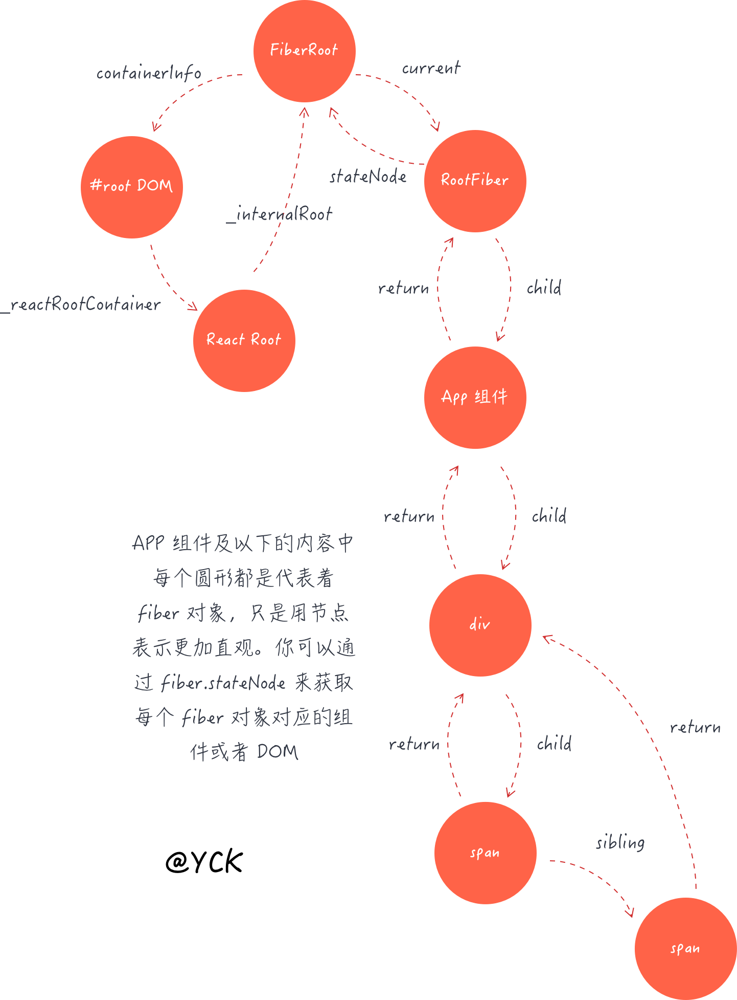

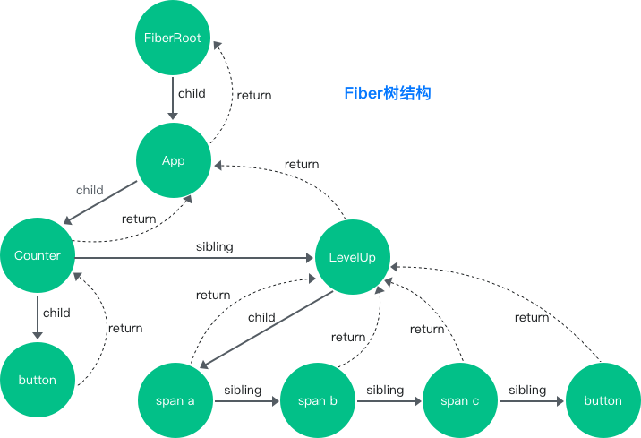
从图中我们可以看到，每个组件或者 DOM 节点都会对应着一个 fiber 对象。另外你手边有 React 项目的话，也可以在控制台输入如下代码，查看 fiber 树的整个结构。

```js
// 对应着 FiberRoot
const fiber = document.querySelector('#root')._reactRootContainer._internalRoot
```

另外两个属性在本文中虽然用不上，但是看源码的时候笔者觉得很有意思，就打算拿出来说一下。

在说 `effectTag` 之前，我们先来了解下啥是 `effect`，简单来说就是 DOM 的一些操作，比如增删改，那么 effectTag 就是来记录所有的 effect 的，但是这个记录是通过位运算来实现的；

> 如果我们想新增一个 effect 的话，可以这样写 `effectTag |= Update`；如果我们想删除一个 effect 的话，可以这样写 `effectTag &= ~Update`。

最后是 `alternate` 属性。其实在`一个 React 应用中，通常来说都有两个 fiebr 树`，一个叫做 old tree，另一个叫做 workInProgress tree。`前者对应着已经渲染好的 DOM 树，后者是正在执行更新中的 fiber tree，还能便于中断后恢复`。两棵树的节点互相引用，便于共享一些内部的属性，减少内存的开销。毕竟前文说过每个组件或 DOM 都会对应着一个 fiber 对象，应用很大的话组成的 fiber 树也会很大，如果两棵树都是各自把一些相同的属性创建一遍的话，会损失不少的内存空间及性能。

`当更新结束以后，workInProgress tree 会将 old tree 替换掉`，这种做法称之为 `double buffering`，这也是性能优化里的一种做法，有兴趣的同学可以自行查找资料。

### 总结：
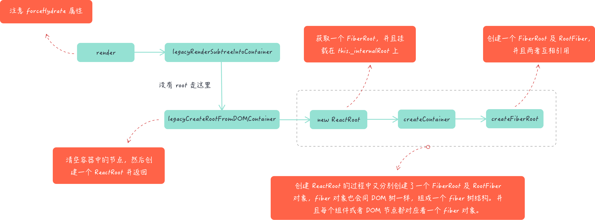


<br>

## render流程二：

### ReactRoot.prototype.render

在上一篇文章中，我们介绍了当 ReactDom.render 执行时，内部会首先判断是否已经存在 root，没有的话会去创建一个 root。在今天的文章中，我们将会了解到存在 root 以后会发生什么事情。

```js
unbatchedUpdates(() => {
    if (parentComponent !== null) {
        root.legacy_renderSubtreeIntoContainer(parentComponent, children, callback) 
    } else {
        root.render(children, callback);
    }
})

```

大家可以看到，在上述的代码中调用了 `unbatchedUpdates` 函数，这个函数涉及到的知识其实在 React 中相当重要。

大家都知道多个 setState 一起执行，并不会触发 React 的多次渲染。

```js
// 虽然 age 会变成 3，但不会触发 3 次渲染
this.setState({ age: 1 })
this.setState({ age: 2 })
this.setState({ age: 3 })
```

这是因为内部会将这个三次 setState 优化为一次更新，术语是批量更新（`batchedUpdate`），我们在后续的内容中也能看到内部是如何处理批量更新的。

> 对于 root 来说其实没必要去批量更新，所以这里调用了 `unbatchedUpdates` 函数来告知内部不需要批量更新。

然后在 `unbatchedUpdates` 回调内部判断是否存在 `parentComponent`。这一步我们可以假定不会存在 parentComponent，因为很少有人会在 root 外部加上 context 组件。不存在 parentComponent 的话就会执行 root.render(children, callback)，`这里的 render 指的是 ReactRoot.prototype.render`。

```js
ReactRoot.prototype.render = function(
    children: ReactNodeList,
    callback?: () => mixed,
): Work {
    const root = this._internalRoot;
    const work = new ReactWork();
    callback = callback === undefined ? null : callback;

    if (callback !== null) {
        work.then(callback);
    }

    updateContainer(children, root, null, work._onCommit);
    return work;
}

```

在 render 函数内部我们首先取出 root，`这里的 root 指的是 FiberRoot`。

然后创建了 `ReactWork` 的实例，这块内容我们没有必要深究，`功能就是为了在组件渲染或更新后把所有传入 ReactDom.render 中的回调函数全部执行一遍`。

接下来我们来看 `updateContainer` 内部是怎么样的。

```js
function updateContainer(
    element: ReactNodeList,
    container: OpaqueRoot,
    parentComponent?: React$Component<any, any>,
    callback?: function,
): ExpirationTime {
    const current = container.current;
    const currentTime = requestCurrentTime();
    const expirationTime = computeExpirationForFiber(currentTime, current);
    return updateContainerAtExpirationTime(
        element,
        container,
        parentComponent,
        callback,
    );
}
```

我们先从 `FiberRoot` 的 `current` 属性中取出它的 `fiber` 对象，然后计算了两个时间。这两个时间在 React 中相当重要，因此我们需要单独用一小节去学习它们。

### 时间

首先是 `currentTime`，在 `requestCurrentTime` 函数内部计算时间的最核心函数是 `recomputeCurrentRendererTime`。

```js
function recomputeCurrentRendererTime() {
    const currentTimeMs = now() - originalStartTimeMs;
    currentRendererTime = msToExpirationTime(currentTimeMs);
}
```

now() 就是 performance.now()，`originalStartTimeMs 是 React 应用初始化时就会生成的一个变量，值也是 performance.now()，并且这个值不会在后期再被改变`。那么这两个值相减以后，得到的结果也就是`现在离 React 应用初始化时经过了多少时间`。

然后我们需要把计算出来的值再通过一个公式算一遍，这里的 `| 0 `作用是取整数，也就是说 `11 / 10 | 0 = 1`

```js
const UNIT_SIZE = 10;

const MAGIC_NUMBER_OFFSET = 1073741823 - 1;

// 1 unit of expiration time represents 10ms.
export funtion msToExpirationTime(ms: number): ExpirationTime {
    // Always add an offset so that we don't clash with the magic number for NoWork.
    return MAGIC_NUMBER_OFFSET - ((ms / UNIT_SIZE) | 0);
}

```

接下来我们来假定一些变量值，代入公式来算的话会更方便大家理解。

假如 originalStartTimeMs 为 2500，当前时间为 5000，那么算出来的差值就是 2500，也就是说当前距离 React 应用初始化已经过去了 2500 毫秒，最后通过公式得出的结果为：

```js
currentTime = 1073741822 - ((2500 / 10) | 0) = 1073741572
```

接下来是计算 `expirationTime`，`这个时间和优先级有关，值越大，优先级越高`。并且同步是优先级最高的，它的值为 1073741823，也就是之前我们看到的常量 MAGIC_NUMBER_OFFSET 加一。

在 `computeExpirationForFiber` 函数中存在很多分支，但是计算的核心就只有三行代码，分别是：

```js
// 同步
expirationTime = Sync
// 交互事件，优先级较高
expirationTime = computeInteractiveExpiration(currentTime)
// 异步，优先级较低
expirationTime = computeAsyncExpiration(currentTime)
```


接下来我们就来分析 `computeInteractiveExpiration` 函数内部是如何计算时间的，当然 `computeAsyncExpiration` 计算时间的方式也是相同的，无非更换了两个变量。

```js
export const HIGH_PRIORITY_EXPIRATION = __DEV__ ? 500 : 150;
export const HIGH_PRIORITY_BATCH_SIZE = 100;

export function computeInteractiveExpiration(currENTTime： ExpirationTime) {
    return computeExpirationBucket(
        currentTime,
        HIGH_PRIORITY_EXPIRATION,
        HIGH_PRIORITY_BATCH_SIZE,
    );
}

function computeExpirationBucket(
    currentTime,
    expirationInMs,
    bucketSizeMs,
): ExpirationTime {
    return (
        MAGIC_NUMBER_OFFSET -
        ceiling(
            MAGIC_NUMBER_OFFSET - currentTime + expirationTnMs / UNIT_SIZE,
            bucketSizeMs / UNIT_SIZE,
        )
    )
}

function ceiling(num: number, precision: number): number {
    return (((num / precision) | 0) + 1) * precision;
}

```

以上这些代码其实就是公式，我们把具体的值带入就能算出结果了。
```js
time = 1073741822 - ((((1073741822 - 1073741572 + 15) / 10) | 0) + 1) * 10 = 1073741552
```

另外在 ceiling 函数中的 `1 * bucketSizeMs / UNIT_SIZE 是为了抹平一段时间内的时间差，在抹平的时间差内不管有多少个任务需要执行，他们的过期时间都是同一个`，这也算是一个性能优化，帮助渲染页面行为节流。

最后其实我们这个计算出来的 `expirationTime` 是可以反推出另外一个时间的：

```js
export function expirationTimeToMs(expirationTime: ExpirationTime): number {
	return (MAGIC_NUMBER_OFFSET - expirationTime) * UNIT_SIZE;
}

```

如果我们将之前计算出来的 `expirationTime` 代入以上代码，得出的结果如下：
```js
(1073741822 - 1073741552) * 10 = 2700
```

这个时间其实和我们之前在上文中计算出来的 2500 毫秒差值很接近。`因为 expirationTime 指的就是一个任务的过期时间，React 根据任务的优先级和当前时间来计算出一个任务的执行截止时间`。只要这个值比当前时间大就可以一直让 React 延后这个任务的执行，以便让更高优先级的任务执行，但是一旦过了任务的截止时间，就必须让这个任务马上执行。

这部分的内容一直在算来算去，看起来可能有点头疼。当然如果你嫌麻烦，只需要记住任务的过期时间是通过当前时间加上一个常量（任务优先级不同常量不同）计算出来的。

### scheduleRootUpdate

当我们计算出时间以后就会调用 `updateContainerAtExpirationTime`，这个函数其实没有什么好解析的，我们直接进入 `scheduleRootUpdate` 函数就好。

```js
function scheduleRootUpdate(
    current: Fiber,
    element: ReactNodeList,
    expirationTime: ExpirationTime,
    callback?: function,
) {
    const update = createUpdate(expirationTime);
    update.payload = { element };

    callback = callback === undefined ? null : callback;
    if (callback !== null) {
        update.callback = callback;
    }

    enqueueUpdate(current, update);
    scheduleWork(current, expirationTime);

    return expirationTime;
}

```

首先我们会创建一个 update，这个对象和 setState 息息相关
```js
// update 对象的内部属性
expirationTime: expirationTime,
tag: UpdateState,
// setState 的第一二个参数
payload: null,
callback: null,
// 用于在队列中找到下一个节点
next: null,
nextEffect: null,

```

对于 update 对象内部的属性来说，我们需要重点关注的是 `next` 属性。`因为 update 其实就是一个队列中的节点，这个属性可以用于帮助我们寻找下一个 update`。对于批量更新来说，我们可能会创建多个`update`，因此我们想要将这些`update`串联并存储起来，在必要的时候拿出来用于更新`state`。

在 render 的过程中其实也是一次更新的操作，但是我们并没有 setState，因此就把 payload 赋值为 {element} 了。

接下来我们将 callback 赋值给 update 的属性，`这里的 callback 还是 ReactDom.render 的第三个参数`。

然后我们将刚才创建出来的 update 对象插入队列中，`enqueueUpdate` 函数内部分支较多且代码简单，这里就不再贴出代码了，有兴趣的可以自行阅读。`函数核心作用就是创建或者获取一个队列，然后把 update 对象入队`。

最后调用 `scheduleWork` 函数，这里开始就是调度相关的内容，这部分内容我们将在下一篇文章中来详细解析。


### 总结
以上就是本文的全部内容了，这篇文章其实核心还是放在了计算时间上，因为这个时间和后面的调度息息相关，最后通过一张流程图总结一下 render 流程两篇文章的内容。

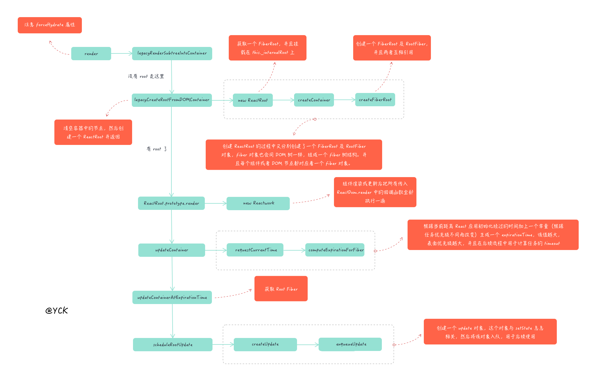


## 剖析 React 源码：调度原理

### 为什么需要调度？

`大家都知道 JS 和渲染引擎是一个互斥关系`。如果 JS 在执行代码，那么渲染引擎工作就会被停止。`假如我们有一个很复杂的复合组件需要重新渲染，那么调用栈可能会很长`

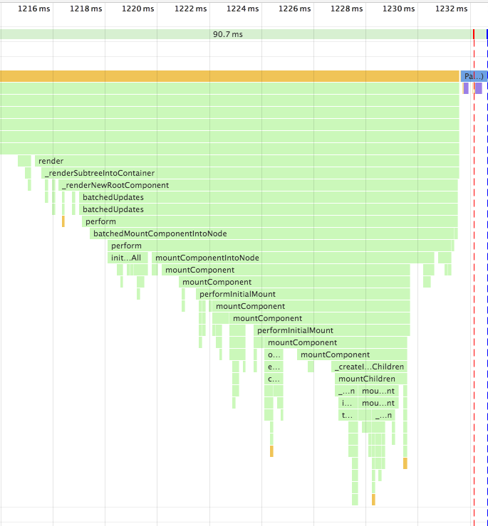

调用栈过长，再加上如果中间进行了复杂的操作，就可能导致长时间阻塞渲染引擎带来不好的用户体验，调度就是来解决这个问题的。

React 会`根据任务的优先级去分配各自的 expirationTime，在过期时间到来之前先去处理更高优先级的任务，并且高优先级的任务还可以打断低优先级的任务`（因此会造成某些生命周期函数多次被执行），从而实现在不影响用户体验的情况下去`分段计算更新`（也就是时间分片）。

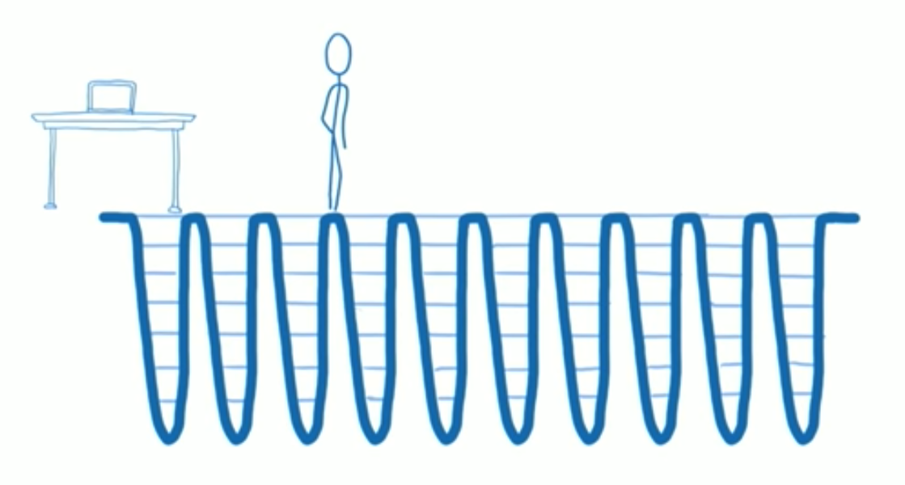


### React如何实现调度

React实现调度主要靠两块内容：
1. 计算任务的`expirationTime`
2. 实现`requestIdleCallback`的pollyfill版本

#### expirationTime

expriationTime 在前文简略的介绍过它的作用，这个时间可以帮助我们`对比不同任务之间的优先级以及计算任务的 timeout`。

那么这个时间是如何计算出来的呢？简单来说就是`当前时间+一个常量（根据任务优先级改变）

当前时间指的是`performance.now()`，这个API会返回一个精确到毫秒级别的时间戳，另外浏览器并不都兼容`performance`API，这里暂时当做`performance.now()`。

常量指的是根据不同优先级得出一个数值，React内部目前总共有五种优先级，分别为：
```js
var ImmediatePriority = 1;
var UserBlockingPriority = 2;
var NormalPriority = 3;
var LowPriority = 4;
var IdlePriority = 5;
```

它们各自对应的数值是不同的，具体如下：

```js
var maxSigned31BitInt = 1073741823;

// Times out immediately
var IMMEDIATE_PRIORITY_TIMEOUT = -1;
// Eventually times out
var USER_BLOCKING_PRIORITY = 250;
var NORMAL_PRIORITY_TIMEOUT = 5000;
var LOW_PRIORITY_TIMEOUT = 10000;
// Never times out
var IDLE_PRIORITY = maxSigned31BitInt;
```

也就是说，假设当前时间为 5000 并且分别有两个优先级不同的任务要执行。前者属于 `ImmediatePriority`，后者属于 `UserBlockingPriority`，那么两个任务计算出来的时间分别为 `4999` 和 `5250`。通过这个时间可以比对大小得出谁的优先级高，也可以通过减去当前时间获取任务的 timeout。

#### requestIdleCallback

说完了 `expirationTime`，接下来的主题就是实现 `requestIdleCallback` 了，我们首先来了解下该函数的作用

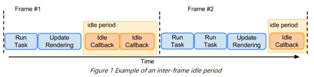

`该函数的回调方法会在浏览器的空闲时期依次调用`， 可以让我们在事件循环中执行一些任务，并且`不会对像动画和用户交互这样延迟敏感的事件产生影响`。

在上图中我们也可以发现，该回调方法是在渲染以后才执行的。那么介绍完了函数的作用，接下来就来说说它的兼容性吧。这个函数的兼容性并不是很好，并且它还有一个致命的缺陷:

> requestIdleCallback is called `only 20 times per second` - Chrome on my 6x2 core Linux machine, it's not really useful for UI work.

这个完全满足不了现有的情况，由此 React 团队才打算自己实现这个函数。

### 如何实现 requestIdleCallback

```js
window.requestIdleCallback = window.requestIdleCallback || function(handler) {
  let startTime = Date.now();

  return setTimeout(function() {
    handler({
      didTimeout: false,
      timeRemaining: function() {
        // 虽然我们的填充程序不会像真正的requestIdleCallback()将自己限制在当前事件循环传递中的空闲时间内，但它至少将每次传递的运行时间限制为不超过 50 毫秒
        return Math.max(0, 50.0 - (Date.now() - startTime));
      }
    });
  }, 1);
}


// 用 requestAnimationFrame + MessageChannel 实现
let deadlineTime // 当前帧结束时间
let callback // 需要回调的任务
 
let channel = new MessageChannel(); // postMessage 的一种，该对象实例有且只有两个端口，并且可以相互收发事件，当做是发布订阅即可。
let port1 = channel.port1;
let port2 = channel.port2;
 
port2.onmessage = () => {
    const timeRemaining = () => deadlineTime - performance.now();
    if (timeRemaining() > 1 && callback) {
        const deadline = { timeRemaining, didTimeout: false }; // 同样的这里也是构造个参数
        callback(deadline);
    }
}
 
window.requestIdleCallback = function(cb) {
    requestAnimationFrame(rafStartTime => {
        // 大概过期时间 = 默认这是一帧的开始时间 + 一帧大概耗时
        deadlineTime = rafStartTime + 16
        callback = cb
        port1.postMessage(null);
    });
 }

```

实现 `requestIdleCallback` 函数的核心只有一点，如何多次在`浏览器空闲时`且是`渲染后`才调用回调方法？

说到多次执行，那么肯定得使用定时器了。在多种定时器中，唯有 `requestAnimationFrame` 具备一定的精确度，`因此 requestAnimationFrame 就是当下实现 requestIdleCallback 的一个步骤`。

`requestAnimationFrame` 的回调方法会在每次`重绘前执行`，另外它还存在一个瑕疵：`页面处于后台时该回调函数不会执行`，因此我们需要对于这种情况做个补救措施

```js
rafId = requestAnimationFrame(function(timestamp) {
    localClearTimeout(rafTimeoutId);
    callback(timestamp);
})

refTimeoutId = setTimeout(function() {
    // 定时100毫秒算是一个最佳实践
    localCancelAnimationFrame(rafId);
    callback(getCurrentTime());
})

```

使用 `requestAnimationFrame` 只完成了多次执行这一步操作，接下来我们需要实现如何知道当前浏览器是否空闲呢？

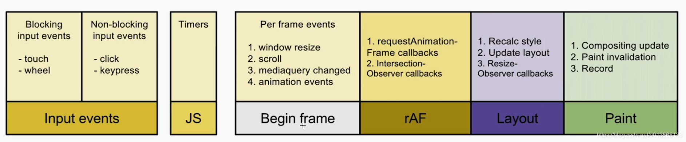

大家都知道在一帧当中，浏览器可能会`响应用户的交互事件`、`执行 JS`、`进行渲染`的一系列计算绘制。假设当前我们的浏览器支持 1 秒 60 帧，那么也就是说一帧的时间为 16.6 毫秒。`如果以上这些操作超过了 16.6 毫秒，那么就会导致渲染没有完成并出现掉帧`的情况，继而影响用户体验；如果以上这些操作没有耗时 16.6 毫秒的话，那么我们就认为当下存在空闲时间让我们可以去执行任务。

因此接下去我们`需要计算出当前帧是否还有剩余时间让我们使用`

```js
let frameDeadline = 0;
let previousFrameTime = 33;
let activeFrameTime = 33;
let nextFrameTime = performance.now() - frameDeadline + activeFrameTime

if (
    nextFrameTime < activeFrameTime &&
	previousFrameTime < activeFrameTime
) {
    if (nextFrameTime < 8) {
        nextFrameTime = 8;
    }
    activeFrameTime =
		nextFrameTime < previousFrameTime ? previousFrameTime : nextFrameTime;
} else {
    previousFrameTime = nextFrameTime;
}

```

以上这部分代码`核心就是得出每一帧所耗时间及下一帧的时间`。简单来说就是假设当前时间为 5000，浏览器支持 60 帧，那么 1 帧近似 16 毫秒，那么就会计算出下一帧时间为 5016。

得出下一帧时间以后，我们`只需对比当前时间是否小于下一帧时间即可`，这样就能清楚地知道是否还有空闲时间去执行任务。

那么最后一步操作就是如何在渲染以后才去执行任务。这里就需要用到事件循环的知识了

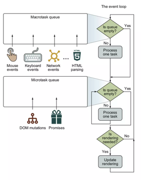

想必大家都知道微任务宏任务的区别，这里就不再赘述这部分的内容了。从上图中我们可以发现，`在渲染以后只有宏任务是最先会被执行的，因此宏任务就是我们实现这一步的操作了`。

但是生成一个宏任务有很多种方式并且各自也有优先级，那么为了最快地执行任务，我们肯定得选择优先级高的方式。在这里我们选择了 `MessageChannel` 来完成这个任务，`不选择 setImmediate 的原因是因为兼容性太差`。

到这里为止，`requestAnimationFrame` + `计算帧时间及下一帧时间` + `MessageChannel` 就是我们实现 `requestIdleCallback` 的三个关键点了。


### 调度的流程

上文说了这么多，这一小节我们将来梳理一遍调度的整个流程。

- 首先每个任务都会有各自的优先级，通过当前时间加上优先级所对应的常量我们可以计算出 expriationTime，`高优先级的任务会打断低优先级任务`；

- 在调度之前，判断当前任务是否过期，`过期的话无须调度`，直接调用 port.postMessage(undefined)，这样就能在`渲染后马上执行过期任务`了

- 如果`任务没有过期`，就通过 `requestAnimationFrame` 启动定时器，在`重绘前调用回调方法`

- 在回调方法中我们首先需要计算每一帧的时间以及下一帧的时间，然后执行 `port.postMessage(undefined)`

- `channel.port1.onmessage` 会在`渲染后被调用`，在这个过程中我们`首先需要去判断当前时间是否小于下一帧时间`。如果小于的话就代表我们尚有空余时间去执行任务；如果大于的话就代表当前帧已经没有空闲时间了，这时候我们需要去判断是否有任务过期，过期的话不管三七二十一还是得去执行这个任务。如果没有过期的话，那就只能把这个任务丢到下一帧看能不能执行了。

<br/>


## 组件更新流程一（调度任务）

### 组件更新流程中你能学到什么？

- `setState` 背后的批量更新如何实现
- `Fiber` 是什么？有什么用？
- 如何调度任务

### setState批量更新实现原理

想必大家都知道大部分情况下`多次 setState 不会触发多次渲染`，并且 state 的值也不是实时的，这样的做法能够`减少不必要的性能消耗`。

```js
handleClick () {
  // 初始化 `count` 为 0
  console.log(this.state.count) // -> 0
  this.setState({ count: this.state.count + 1 })
  this.setState({ count: this.state.count + 1 })
  console.log(this.state.count) // -> 0
  this.setState({ count: this.state.count + 1 })
  console.log(this.state.count) // -> 0
}

```

那么这个行为是如何实现的呢？答案是批量更新。接下来我们就来学习批量更新是如何实现的。

其实这个背后的原理相当之简单。假如 handleClick 是通过点击事件触发的，那么 handleClick 其实差不多会被包装成这样：

```js
isBatchingUpdates = true
try {
  handleClick()
} finally {
  isBatchingUpdates = false
  // 然后去更新
}

```

在执行 handleClick 之前，其实 React 就会默认这次触发事件的过程中如果有 setState 的话就应该批量更新。

当我们在 handleClick 内部执行 setState 时，`更新状态的这部分代码首先会被丢进一个队列中等待后续的使用`。然后继续处理更新的逻辑，毕竟触发 setState 肯定会触发一系列组件更新的流程。但是在这个流程中如果 React 发现需要批量更新 state 的话，就会立即中断更新流程。

也就是说，虽然我们在 handleClick 中调用了三次 setState，但是并不会走完三次的组件更新流程，只是把更新状态的逻辑丢到了一个队列中。当 handleClick 执行完毕之后会再执行一次组件更新的流程。

另外组件更新流程其实是有两个截然不同的分支的。一种就是触发更新以后一次完成全部的组件更新流程；另一种是触发更新以后分时间片段完成所有的组件更新，用户体验更好，这种方式被称之为`任务调度`。

然本文也会提及一部分调度相关的内容，毕竟这块也包含在组件更新流程中。但是在学习任务调度之前，我们需要先来学习下 `fiber` 相关的内容，因为这块内容是 React 实现各种这些新功能的基石。

### Fiber 是什么？有什么用？

在了解 Fiber 之前，我们先来了解下为什么 React 官方要费那么大劲去重构 React。

在 `React 15 `版本的时候，我们如果有组件需要更新的话，那么就会`递归向下遍历整个虚拟 DOM 树来判断需要更新的地方`。这种`递归的方式弊端在于无法中断，必须更新完所有组件才会停止`。这样的弊端会造成如果我们需要更新一些庞大的组件，那么在更新的过程中可能就会长时间阻塞主线程，从而`造成用户的交互、动画的更新等等都不能及时响应`。

React 的组件更新过程简而言之就是在持续调用函数的一个过程，这样的一个过程会形成一个虚拟的`调用栈`。假如我们控制这个调用栈的执行，把整个更新任务拆解开来，尽可能地将更新任务放到浏览器空闲的时候去执行，那么就能解决以上的问题。

那么现在是时候介绍 `Fiber` 了。`Fiber 重新实现了 React 的核心算法`，带来了杀手锏增量更新功能。它有能力`将整个更新任务拆分为一个个小的任务，并且能控制这些任务的执行`。

这些功能主要是通过两个核心的技术来实现的：
- `新的数据结构fiber`
- `调度器`

#### 新的数据结构 fiber

前文中我们说到了需要拆分更新任务，那么`如何把控这个拆分的颗粒度呢`？答案是 `fiber`，即fiber是React任务调度的最小结构

我们可以把每个 fiber 认为是一个工作单元，执行更新任务的整个流程（不包括渲染）就是在反复寻找工作单元并运行它们，这样的方式就实现了拆分任务的功能。

拆分成工作单元的目的就是为了让我们能控制 stack frame（调用栈中的内容），可以随时随地去执行它们。由此使得我们在每运行一个工作单元后都可以按情况继续执行或者中断工作（中断的决定权在于调度算法）。


那么 fiber 这个数据结构到底长什么样呢？现在就让我们来一窥究竟。

fiber 内部其实存储了很多上下文信息，我们可以把它认为是改进版的虚拟 DOM，它同样也对应了组件实例及 DOM 元素。同时 fiber 也会组成 `fiber tree`，但是它的`结构不再是一个树，而是一个链表的结构`。

以下是 fiber 中的一些重要属性：

```js
  // 浏览器环境下指 DOM 节点
  stateNode: any,

  // 形成列表结构
  return: Fiber | null,
  child: Fiber | null,
  sibling: Fiber | null,

  // 更新相关
  pendingProps: any,  // 新的 props
  memoizedProps: any,  // 旧的 props
  // 存储 setState 中的第一个参数
  updateQueue: UpdateQueue<any> | null,
  memoizedState: any, // 旧的 state

  // 调度相关
  expirationTime: ExpirationTime,  // 任务过期时间

  // 大部分情况下每个 fiber 都有一个替身 fiber
  // 在更新过程中，所有的操作都会在替身上完成，当渲染完成后，
  // 替身会代替本身
  alternate: Fiber | null,

  // 先简单认为是更新 DOM 相关的内容
  effectTag: SideEffectTag, // 指这个节点需要进行的 DOM 操作
  // 以下三个属性也会形成一个链表
  nextEffect: Fiber | null, // 下一个需要进行 DOM 操作的节点
  firstEffect: Fiber | null, // 第一个需要进行 DOM 操作的节点
  lastEffect: Fiber | null, // 最后一个需要进行 DOM 操作的节点，同时也可用于恢复任务

  // ...
```

总的来说，我们可以认为 fiber 就是一个工作单元的数据结构表现，当然它同样也是调用栈中的一个重要组成部分。

> Fiber 和 fiber 不是同一个概念。前者代表新的调和器，后者代表 fiber node，也可以认为是改进后的虚拟 DOM。

#### 调度器简介

每次有新的更新任务发生的时候，调度器都会按照策略给这些任务分配一个优先级。比如说动画的更新优先级会高点，离屏元素的更新优先级会低点。

`通过这个优先级我们可以获取一个该更新任务必须执行的截止时间`，优先级越高那么截止时间就越近，反之亦然。这个`截止时间是用来判断该任务是否已经过期，如果过期的话就会马上执行该任务`。

然后调度器通过实现 requestIdleCallback 函数来做到在浏览器空闲的时候去执行这些更新任务。

这其中的实现原理略微复杂。简单来说，就是通过定时器的方式，来获取每一帧的结束时间。得到每一帧的结束时间以后我们就能判断当下距离结束时间的一个差值。

如果还未到结束时间，那么也就意味着我可以继续执行更新任务；如果已经过了结束时间，那么就意味着当前帧已经没有时间给我执行任务了，必须把执行权交还给浏览器，也就是打断任务的执行。

另外当开始执行更新任务（也就是寻找工作单元并执行的过程）时，如果有新的更新任务进来，那么调度器就会按照两者的优先级大小来进行决策。如果新的任务优先级小，那么当然继续当下的任务；如果新的任务优先级大，那么会打断任务并开始新的任务。

### 小结

现在是时候把文章中提及到的内容整合起来了，另外我们假设更新任务必定会触发调度。

当交互事件调用 setState 后，会触发批量更新，在整个交互事件回调执行完之前 state 都不会发生变更。

回调执行完毕后，开始更新任务，并触发调度。调度器会给这些更新任务一一设置优先级，并且在浏览器空闲的时候去执行他们，当然任务过期除外（会立刻触发更新，不再等待）。

如果在执行更新任务的时候，有新的任务进来，会判断两个任务的优先级高低。假如新任务优先级高，那么打断旧的任务，重新开始，否则继续执行任务。


<br/>

## 组件更新流程二（diff策略）

### 调和的过程

组件更新归结到底还是 DOM 的更新。对于 React 来说，这部分的内容会分为两个阶段：
1. `调和阶段`，基本上也就是大家熟知的虚拟 DOM 的 diff 算法
2. `提交阶段`，也就是将上一个阶段中 diff 出来的内容体现到 DOM 上

这一小节的内容将会集中在调和阶段，提交阶段这部分的内容将会在下一篇文章中写到。另外大家所熟知的虚拟 DOM 的 diff 算法在新版本中其实已经完全被重写了。

有个例子能更好地帮助理解，我们就通过以下组件的更新来了解整个调和的过程。

```js
class Test extends React.Component {
  state = {
    data: [{ key: 1, value: 1 }, { key: 2, value: 2 }]
  };
  componentDidMount() {
    setTimeout(() => {
      const data = [{ key: 0, value: 0 }, { key: 2, value: 2 }]
      this.setState({
        data
      })
    }, 3000);
  }
  render() {
    const { data } = this.state;
    return (
      <>
        { data.map(item => <p key={item.key}>{item.value}</p>) }
      </>
    )
  }
}

```


在前一篇文章中我们了解到了整个更新过程（不包括渲染）就是在反复寻找工作单元并运行它们，那么具体体现到代码中是怎么样的呢？

```js
while (nextUnitOfWork !== null && !shouldYield()) {
    nextUnitOfWork = performUnitOfWork(nextUnitOfWork);
}
```

上述代码的 while 循环只有当找不到工作单元或者应该打断的时候才会终止。`找不到工作单元的情况只有当循环完所有工作单元`才会触发，`打断的情况是调度器触发的`。

> 当更新任务开始时，`root 永远是第一个工作单元`，无论之前有没有被打断过工作。

循环寻找工作单元的这个流程其实很简单，就是自顶向下再向上的一个循环。这个循环的规则如下：

1. `root` 永远是第一个工作单元，不管之前有没有被打断过任务
2. 首先判断当前节点是否存在第一个子节点，存在的话它就是下一个工作单元，并让下一个工作节点继续执行该条规则，不存在的话就跳到规则 3
3. 判断当前节点是否存在兄弟节点。如果存在兄弟节点，就回到规则 2，否则跳到规则 4
4. 回到父节点并判断父节点是否存在。如果存在则执行规则 3，否则跳到规则 5
5. 当前工作单元为`null`，即为完成整个循环


了解了工作循环流程以后，我们就来深入学习一下工作单元是如何工作的。为了精简流程，我们就直接认为当前的工作单元为 Test 组件实例。

在工作单元工作的这一阶段中其实是分为很多分支的，因为`涉及到不同类型组件及 DOM 的处理`。Test 是 class 组件，另外这也是最常用的组件类型，因此接下来的内容会着重介绍 class 组件的调和过程。

class 组件的调和过程大致分为两个部分：
- 生命周期函数的处理
- 调和子组件，也就是 diff 算法的过程


#### 处理 class 组件生命周期函数

最先被处理的生命周期函数是 componentWillReceiveProps

但是触发这个函数的条件有两个：
- props 前后有差别
- 没有使用 `getDerivedStateFromProps` 或者 `getSnapshotBeforeUpdate` 这两个新的生命周期函数。使用其一则 `componentWillReceiveProps` 不会被触发

满足以上条件该函数就会被调用。因此该函数在 React 16 中已经不被建议使用。因为调和阶段是有可能会打断的，因此该函数会重复调用。

> 凡是在调和阶段被调用的函数基本是不被建议使用的。

接下来需要处理 `getDerivedStateFromProps` 函数来获取最新的 state。

然后就是判断是否需要更新组件了，这一块的判断逻辑分为两块：
1. 判断是否存在 `shouldComponentUpdate` 函数，存在就调用
2. 不存在上述函数的话，就判断当前组件是否继承自 `PureComponent`。如果是的话，就浅比较前后的 props 及 state 得出结果

如果得出结论需要更新组件的话，那么就会先调用 `componentWillUpdate` 函数，然后处理 `componentDidUpdate` 及 `getSnapshotBeforeUpdate` 函数。


这里需要注意的是：调`和阶段并不会调用以上两个函数，而是打上 tag 以便将来使用位运算知晓是否需要使用它们``。effectTag` 这个属性在整个更新的流程中都是至关重要的一员，凡是涉及到函数的延迟调用、devTool 的处理、DOM 的更新都可能会使用到它。

```js
if (typeof instance.componentDidUpdate === 'function') {
    workInProgress.effectTag |= Update;
}

if (typeof instance.getSnapshotBeforeUpdate === 'function') {
    workInProgress.effectTag |= Snapshot;
}
```


#### 调和子组件

`处理完生命周期后，就会调用 render 函数获取新的 child，用于在之后与老的 child 进行对比`。

在继续学习之前我们先来熟悉三个对象，因为它们在后续的内容中会反复出现：
- `returnFiber`：父组件。
- `currentFirstChild`：父组件的第一个 child。如果你还记得 fiber 的数据结构的话，应该知道每个 fiber 都有一个 sibling 属性指向它的兄弟节点。因此知道第一个子节点就能知道所有的同级节点。
- `newChild`：也就是我们刚刚 render 出来的内容。

`首先我们会判断 newChild 的类型，知道类型就可以进行相应的 diff 策略`了。它可能会是一个 Fragment 类型，也可能是 object、number 或者 string 类型。这几个类型都会有相应的处理，但这不是我们的重点，并且它们的处理也相当简单。

我们的`重点会放在可迭代类型上，也就是 Array 或者 Iterator 类型`。这两者的核心逻辑是一致的，因此我们就只讲对 Array 类型的处理了。

以下内容是对于 diff 算法的详解，虽然有`三次 for 循环，但是本质上只是遍历了一次整个 newChild`。

##### 第一轮遍历

第一轮遍历的`核心逻辑是复用和当前节点索引一致的老节点`，一旦出现不能复用的情况就跳出遍历。

那么如何复用之前的节点呢？规则如下：
- 新旧节点都为文本节点，可以直接复用，因为文本节点不需要 key
- 其他类型节点一律通过判断 key 是否相同来复用或创建节点（可能类型不同但 key 相同）

以下是简化后的第一轮遍历代码：

```js
for (; oldFiber !== null && newIdx < newChildren.length; newIdx++) {
  // 找到下一个老的子节点
  nextOldFiber = oldFiber.sibling;
  // 通过 oldFiber 和 newChildren[newIdx] 判断是否可以复用
  // 并给复用出来的节点的 return 属性赋值 returnFiber
  const newFiber = reuse(
    returnFiber,
    oldFiber,
    newChildren[newIdx]
  );
  // 不能复用，跳出
  if (newFiber === null) {
    break;
  }
}

```

那么回到上文中的例子中，我们老的第一个节点的 key 为 1，新的节点的 key 为 0。key 不相同不能复用，因此直接跳出循环，此时 newIdx 仍 为 0。


##### 第二轮遍历

当第一轮遍历结束后，会出现两种情况：
- newChild 已经遍历完
- 老的节点已经遍历完了

当出现 `newChild 已经遍历完`的情况时只需要把所有剩`余的老节点都删除`即可。删除的逻辑也就是设置 `effectTag` 为 `Deletion`，另外还有几个 fiber 节点属性需要提及下。

当出现需要在渲染阶段进行处理的节点时，会`把这些节点放入父节点的 effect 链表中`，比如需要被删除的节点就会把加入进链表。这个链表的作用是可以帮助我们在渲染阶段迅速找到需要更新的节点。

当出现老的节点已经遍历完了的情况时，就会开始第二轮遍历。这轮遍历的逻辑很简单，只需要`把剩余新的节点全部创建完毕即可`。

这轮遍历在我们的例子中是不会执行的，因为我们以上两种情况都不符合。


##### 第三轮遍历

第三轮遍历的核心逻辑是`找出可以复用的老节点并移动位置`，不能复用的话就只能创建一个新的了。

那么问题又再次回到了`如何复用节点并移动位置上`。首先我们会`把所有剩余的老节点都丢到一个 map 中`。

我们例子中的代码剩余的老节点为：

```js
<p key={1}>1</p>
<p key={2}>2</p>

```

那么这个 map 的结构就会是这样的：
```js
// 节点的 key 作为 map 的 key
// 如果节点不存在 key，那么 index 为 key
const map = {
    1: {},
    2: {}
}
```

在遍历的过程中会寻找新的节点的 key 是否存在于这个 map 中，存在即可复用，不存在就只能创建一个新的了。其实这部分的复用及创建的逻辑和第一轮中的是一模一样的，所以也就不再赘述了。

那么如果`复用成功，就应该把复用的 key 从 map 中删掉，并且给复用的节点移动位置`。这里的移动依旧不涉及 DOM 操作，而是给 `effectTag` 赋值为 `Placement`。

此轮遍历结束后，就把还存在于 map 中的所有老节点删除。


以上就是diff子节点的全部逻辑


--- 


---


## 参考文献
1. [前端进阶之道](https://yuchengkai.cn/docs/frontend/)
2. [https://yuchengkai.cn/home/](https://yuchengkai.cn/home/)
3. [Floating Point Math](https://0.30000000000000004.com/)
4. [漫话：如何给女朋友解释为什么计算机中 0.2 + 0.1 不等于 0.3 ？](https://zhuanlan.zhihu.com/p/265281184)
5. [非科班前端人的一道送命题：0.1+0.2 等于 0.3 吗？](https://zhuanlan.zhihu.com/p/363133848)
6. [浏览器的同源策略](https://developer.mozilla.org/zh-CN/docs/Web/Security/Same-origin_policy)
7. [10 种跨域解决方案（附终极方案）](https://zhuanlan.zhihu.com/p/132534931)
8. [CORS](https://developer.mozilla.org/zh-CN/docs/Glossary/CORS)
9. [跨源资源共享（CORS）](https://developer.mozilla.org/zh-CN/docs/Web/HTTP/CORS)
10. [跨域请求小结](https://blog.csdn.net/luofeng457/article/details/90478106)
11. [关于 async 函数的理解](https://juejin.cn/post/6844903735290757133)
12. [Service Worker简介](https://blog.csdn.net/luofeng457/article/details/102847261)
13. [HTTP各版本简介](https://blog.csdn.net/luofeng457/article/details/102858302)
14. [An overview of HTTP](https://developer.mozilla.org/en-US/docs/Web/HTTP/Overview)
15. [TCP 连接详解](https://zhuanlan.zhihu.com/p/406247432)
16. [十分钟搞懂HTTP和HTTPS协议？](https://zhuanlan.zhihu.com/p/72616216)
17. [HTTPS为什么安全 &分析 HTTPS 连接建立全过程](https://wetest.qq.com/labs/110)
18. [白帽子讲web安全](https://pan.baidu.com/disk/main?from=homeFlow#/index?category=all&path=%2F%E7%BD%91%E7%AB%99%E5%88%B6%E4%BD%9C%2Fbook)
19. [vue数据劫持](https://blog.csdn.net/luofeng457/article/details/103306672)
20. [Working with the History API](https://developer.mozilla.org/zh-CN/docs/Web/API/History_API/Working_with_the_History_API)
21. [剖析 React 源码：render 流程（一）](https://yuchengkai.cn/react/2019-05-05.html#render)


