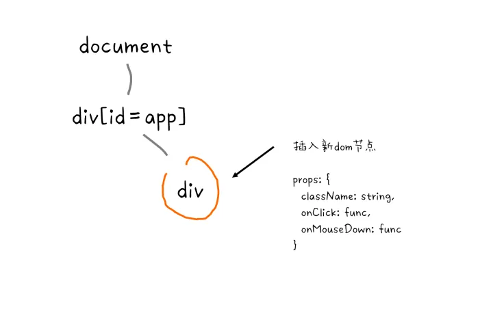

# 高频面试考点

## 类型判断与类型转换

## this

## new都做了哪些事情/手写new

## 浏览器中的事件机制与React事件机制

> `SyntheticEvent` 实例将被传递给你的事件处理函数，`它是浏览器的原生事件的跨浏览器包装器`。除兼容所有浏览器外，它还拥有和浏览器原生事件相同的接口，包括 stopPropagation() 和 preventDefault()。

> 合成事件与浏览器的原生事件不同，也不会直接映射到原生事件。

> `实际上合成事件的意思就是使用原生事件合成一个 React 事件`， 例如使用原生click事件合成了onClick事件，使用原生mouseout事件合成了onMouseLeave事件，原生事件和合成事件类型大部分都是一一对应，只有涉及到兼容性问题时我们才需要使用不对应的事件合成。

### React事件机制工作原理

#### 事件绑定


#### 事件触发


### 手写call/apply/bind

## 深拷贝与浅拷贝，手写深拷贝函数

## 原型与原型链

## 继承方式（原型链继承、借用构造函数继承、组合继承、寄生组合式继承等）

## 变量提升/暂时性死区

## 模块化（AMD、CMD、CommonJS、UMD、ES Module）

### AMD VS CMD
AMD：依赖前置，提前加载并初始化
CMD：依赖就近，引用时才初始化

### CommonJS vs ESM

CommonJS：主要用于服务端，同步加载，返回值的拷贝；
ESM：主要用于客户端，异步加载，返回值的引用；


## Generator函数

## 手写Promise

## 浏览器与Node中的Event Loop
### Node中的Event Loop
- `timer`: 执行setTimeout及setInterval回调，并且是受poll阶段控制的
- `pending callbacks`：执行上一轮循环中的poll 阶段被延迟执行的 `I/O 回调`
- `Idle/prepare`：这个阶段内部使用；
- `poll`：队列不为空时执行回调队列，直至队列为空；然后检查是否有setImmediate需要执行，存在则结束poll阶段并进入check阶段；
- `check`: 执行setImmediate
- `close callbacks`：执行关闭操作，如关闭socket等；


---
# React相关


## React事件系统

### 为什么自定义事件系统

- 抹平浏览器间的兼容性差异
- 自定义高级事件（React的onChange事件等）
- 性能优化：比如利用事件委托机制，大部分事件都绑定到了Document，而不是DOM结点本身，简化DOM事件处理逻辑，减少了内存开销；
- 干预事件的分发：React Fiber为优化用户体验，高优先级的事件会中断低优先级的事件

### React事件机制工作原理

包括`事件绑定`和`事件触发`

#### React 是如何绑定事件的 ?

> React在props初始化及更新时进行事件绑定；根据是否为`媒体类型`确定是`绑定在元素上`（媒体类型元素）还是`Document`上；根据`事件优先级`及`是否为捕获类型`设置事件处理器；

React 既然提供了合成事件，就`需要知道合成事件与原生事件是如何对应起来的，这个对应关系存放在 React 事件插件中EventPlugin`，事件插件可以认为是 React 将不同的合成事件处理函数封装成了一个模块，每个模块只处理自己对应的合成事件，这样不同类型的事件种类就可以在代码上解耦，例如针对`onChange`事件有一个单独的`LegacyChangeEventPlugin`插件来处理，针对`onMouseEnter`， `onMouseLeave` 使用 `LegacyEnterLeaveEventPlugin` 插件来处理。

`为了知道合成事件与原生事件的对应关系，React 在一开始就将事件插件全部加载进来`， 这部分逻辑在 `ReactDOMClientInjection` 代码如下：
```js
injectEventPluginsByName({
    SimpleEventPlugin: LegacySimpleEventPlugin,
    EnterLeaveEventPlugin: LegacyEnterLeaveEventPlugin,
    ChangeEventPlugin: LegacyChangeEventPlugin,
    SelectEventPlugin: LegacySelectEventPlugin,
    BeforeInputEventPlugin: LegacyBeforeInputEventPlugin
});
```

注册完上述插件后， `EventPluginRegistry` (老版本代码里这个模块唤作`EventPluginHub`)这个模块里就`初始化好了一些全局对象`，有几个对象比较重要，可以单独说一下。

第一个对象是 `registrationNameModule`， 它`包含了 React 事件到它对应的 plugin 的映射`， 大致长下面这样，它包含了 React 所支持的所有事件类型，`这个对象最大的作用是判断一个组件的 prop 是否是事件类型`，这在处理原生组件的 props 时候将会用到，如果一个 prop 在这个对象中才会被当做事件处理。
```js
{
    onBlur: SimpleEventPlugin,
    onClick: SimpleEventPlugin,
    onClickCapture: SimpleEventPlugin,
    onChange: ChangeEventPlugin,
    onChangeCapture: ChangeEventPlugin,
    onMouseEnter: EnterLeaveEventPlugin,
    onMouseLeave: EnterLeaveEventPlugin,
    ...
}
```

第二个对象是 `registrationNameDependencies`， 这个对象长下面几个样子。`这个对象即是一开始我们说到的合成事件到原生事件的映射`，对于onClick 和 onClickCapture事件， 只依赖原生click事件。但是对于 `onMouseLeave它却是依赖了两个mouseout， mouseover`， 这说明这个事件是 React 使用 mouseout 和 mouseover 模拟合成的。正是因为这种行为，使得 `React 能够合成一些哪怕浏览器不支持的事件供我们代码里使用`。
```js
{
    onBlur: ['blur'],
    onClick: ['click'],
    onClickCapture: ['click'],
    onChange: ['blur', 'change', 'click', 'focus', 'input', 'keydown', 'keyup', 'selectionchange'],
    onMouseEnter: ['mouseout', 'mouseover'],
    onMouseLeave: ['mouseout', 'mouseover'],
    ...
}
```

第三个对象是 `plugins`， 这个对象就是`上面注册的所有插件列表`
```js
plugins = [LegacySimpleEventPlugin, LegacyEnterLeaveEventPlugin, ...];
```

看完上面这些信息后我们再反过头来看下一个普通的`EventPlugin长什么样子`。一个 plugin 就是一个对象， 这个对象包含了下面两个属性
```js
// event plugin
{
  eventTypes, // 一个数组，包含了所有合成事件相关的信息，包括其对应的原生事件关系
  extractEvents: function() {},// 一个函数，当原生事件触发时执行这个函数
}

```

了解上面这这些信息对我们分析 React 事件工作原理将会很有帮助，下面开始进入事件绑定阶段。


1. React 执行 `diff` 操作，标记出哪些 DOM 类型 的节点需要添加或者更新。



2. 当检测到需要创建一个节点或者更新一个节点时， 使用 `registrationNameModule` 查看一个 `prop 是不是一个事件类型`，如果是则执行下一步。


3. 通过 `registrationNameDependencies` 检查这个 `React 事件依赖`了哪些`原生事件类型`。


4. 检查这些一个或多个原生事件类型`有没有注册过`，如果有则忽略。


5. 如果这个原生事件类型没有注册过，则注册这个原生事件到 document 上，回调为React提供的`dispatchEvent`函数。


上面的阶段说明：
1. 我们将所有事件类型都注册到 document 上
2. 所有原生事件的`listener`都是`dispatchEvent`函数
3. 同一个类型的事件 React 只会绑定一次原生事件，例如无论我们写了多少个onClick， 最终反应在 DOM 事件上只会有一个listener。
4. React 并没有将我们业务逻辑里的listener绑在原生事件上，也没有去维护一个类似eventlistenermap的东西存放我们的listener。

由 3，4 条规则可以得出，`我们业务逻辑的listener和实际 DOM 事件压根就没关系，React 只是会确保这个原生事件能够被它自己捕捉到，后续由 React 来派发我们的事件回调`，当我们页面发生较大的切换时候，React 可以什么都不做，从而免去了去操作removeEventListener或者同步eventlistenermap的操作，所以其执行效率将会大大提高，相当于全局给我们做了一次事件委托，即便是渲染大列表，也不用开发者关心事件绑定问题。


#### React 是如何触发事件的?

我们知道由于所有类型种类的事件都是绑定为React的 dispatchEvent 函数，所以就能在全局处理一些通用行为，下面就是整个行为过程。

```js
export function dispatchEventForLegacyPluginEventSystem(
  topLevelType: DOMTopLevelEventType,
  eventSystemFlags: EventSystemFlags,
  nativeEvent: AnyNativeEvent,
  targetInst: null | Fiber,
): void {
  const bookKeeping = getTopLevelCallbackBookKeeping(
    topLevelType,
    nativeEvent,
    targetInst,
    eventSystemFlags
  );

  try {
    // Event queue being processed in the same cycle allows
    // `preventDefault`.
    batchedEventUpdates(handleTopLevel, bookKeeping);
  } finally {
    releaseTopLevelCallbackBookKeeping(bookKeeping);
  }
}

```

`bookKeeping`为事件执行时组件的层级关系存储，也就是如果在事件执行过程中发生组件结构变更，并不会影响事件的触发流程。

整个触发事件流程如下:

1. 任意一个事件触发，执行 `dispatchEvent` 函数；
2. `dispatchEvent` 执行 `batchedEventUpdates(handleTopLevel)`， batchedEventUpdates 会`打开批量渲染开关并调用 handleTopLevel`；
3. handleTopLevel 会`依次执行 plugins 里所有的事件插件`；
4. 如果一个`插件检测到自己需要处理的事件类型`时，则处理该事件；

对于大部分事件而言处理逻辑如下，也就 `LegacySimpleEventPlugin` 插件做的工作:

1. 通过原生事件类型决定使用哪个合成事件类型（原生 event 的封装对象，例如 SyntheticMouseEvent) 

2. 如果对象池里有这个类型的实例，则取出这个实例，覆盖其属性，作为本次派发的事件对象（事件对象复用），若没有则新建一个实例。


3. 从点击的原生事件中找到对应 DOM 节点，从 DOM 节点中找到一个最近的React组件实例， 从而找到了一条由这个实例父节点不断向上组成的链， 这个链就是我们要触发合成事件的链，(只包含原生类型组件， div， a 这种原生组件)。


4. `反向触发这条链`，父-> 子，`模拟捕获阶段`，触发所有 props 中含有 `onClickCapture` 的实例。


5. 正向触发这条链，子-> 父，`模拟冒泡阶段`，触发所有 props 中含有 `onClick` 的实例


这几个阶段说明了下面的现象：

1. React 的合成事件只能在事件周期内使用，因为这个对象很可能被其他阶段复用， 如果想持久化需要手动调用event.persist() 告诉 React 这个对象需要持久化。( React17 中被废弃)
2. `React 的冒泡和捕获并不是真正 DOM 级别的冒泡和捕获`
3. React 会在一个原生事件里触发所有相关节点的 onClick 事件， 在执行这些onClick之前 React 会打开批量渲染开关，这个开关会将所有的setState变成异步函数。
4. 事件只针对原生组件生效，自定义组件不会触发 onClick。


### 从React 的事件系统中我们学到了什么

- React16 将原生事件都绑定在 document 上；

- 我们收到的 event 对象为 React 合成事件， event 对象在事件之外不可以使用；

- React 会在派发事件时打开批量更新， 此时所有的 setState 都会变成异步；

- React onClick/onClickCapture， 实际上都发生在原生事件的冒泡阶段

    这里我们虽然使用了onClickCapture， 但实际上对原生事件而言依然是冒泡，所以 React 16 中实际上就不支持绑定捕获事件。

    ```jsx
    document.addEventListener('click'， console.log.bind(null， 'native'));

    function onClickCapture() {
        console.log('capture');
    }

    <div onClickCapture={onClickCapture}/>
    ```

- 由于所有事件都注册到顶层事件上，所以多个` ReactDOM.render` 会存在冲突


### React 17中事件系统有哪些新特性

#### 调整将顶层事件绑在container上，ReactDOM.render(app， container)；


将顶层事件绑定在 container 上而不是 document 上能够`解决我们遇到的多版本共存问题，对微前端方案是个重大利好`。

#### 对齐原生浏览器事件

React 17 中的捕获事件都使用浏览器的捕获阶段
> Make all Capture events use the browser capture phase. (@trueadm in #19221)

同时 `onScroll` 事件不再进行事件冒泡

`onFocus` 和 `onBlur` 使用原生 `focusin`、 `focusout` 合成。

> Aligning with Browsers
We’ve made a couple of smaller changes related to the event system:
The onScroll event no longer bubbles to prevent common confusion.
React onFocus and onBlur events have switched to using the native focusin and focusout events under the hood， which more closely match React’s existing behavior and sometimes provide extra information.
Capture phase events (e.g. onClickCapture) now use real browser capture phase listeners.

#### 取消事件复用


> 官方的解释是事件对象的复用在现代浏览器上性能已经提高的不明显了，反而还很容易让人用错，所以干脆就放弃这个优化

所以异步使用`syntheticEvent`时不会再像之前版本一样报错。


## Preact与react差异

1. Preact裁剪了事件机制，直接在DOM元素上进行事件绑定的


---

# 手写代码


## instanceof

```js
function _instanceof(obj, constructor) {
    if (obj === null || typeof constructor !== 'function') return false;
    let proto = obj.__proto__;
    const prototype = constructor.prototype;

    while (proto) {
        if (proto === prototype) {
            return true;
        }

        proto = proto.__proto__;
    }

    return false;
}

```

## 深拷贝

```js
let map = new WeakMap();

function deepClone(obj) {
    if (obj instanceof Object) {
        if (map.has(obj)) {
            return map.get(obj);
        }

        let newObj;

        if (obj instanceof Array) {
            newObj = [];
        } else if (obj instanceof Function) {
            newObj = function() {
                return obj.apply(this, arguments);
            }
        } else if (obj instanceof RegExp) {
            newObj = new RegExp(obj.source, obj.flags);
        } else if (obj instanceof Date) {
            newObj = new Date(obj);
        } else {
            newObj = {}
        }

        let desc = Object.getOwnPropertyDescriptors(obj);
        let clone = Object.create(Object.getPrototypeOf(obj), desc);

        map.set(obj, clone);

        for (let key in obj) {
            if (obj.hasOwnProperty(key)) {
                newObj[key] = deepClone(obj[key]);
            }
        }

        return newObj;
    }

    // 原始类型直接返回
    return obj;
}
```

以上代码解决了常见类型的 copy 及`循环引用`的问题


## 手写new

在调用 new 的过程中会发生以上四件事情：
- 新生成了一个对象
- 链接到原型
- 绑定this
- 返回新对象

```js
function create() {
    let obj = {};
    let Con = [].shift.call(arguments);

    obj.__proto__ = Con.prototype; // obj = Object.create(Con.prototype);
    let result = Con.apply(obj, arguments);

    return result instanceof Object ? result : obj;
}
```


## 手写call/apply/bind

```js
// 
Function.prototype.myCall = function(context) {
    if (typeof context === undefined || typeof context === null) {
        context = window;
    }

    const symbol = Symbol();
    context[symbol] = this;
    const args = [...arguments].slice(1);
    const res = context[symbol](...args);

    delete context[symbol];

    return res;
}

Function.prototype.myApply = function (context) {
    if (typeof context === undefined || typeof context === null) {
        context = window;
    }

    const symbol = Symbol();
    context[symbol] = this;
    let res;

    if (arguments[1]) {
        res = context[symbol](...arguments[1]);
    } else {
        res = context[symbol]();
    }

    delete context[symbol];

    return res;
}

Function.prototype.myBind = function (context) {
    if (typeof context === undefined || typeof context === null) {
        context = window;
    }

    const self = this;
    const args = [...arguments].slice(1);

    return function F() {
        // 因为返回了一个函数，我们可以 new F()，所以需要判断
        if (this instanceof F) {
            return new _this(...args, ...arguments);
        }

        return self.apply(context, args.concat(...arguments));
    }
}
```


## Generator原理及实现

```js
// demo
function* test() {
    let a = 1 + 2;
    yield 2;
    yield 3;
}

var b = test(); // 获取生成器对象
console.log(b.next()) // { value: 2, done: false }
console.log(b.next()) // { value: 3, done: false }
console.log(b.next()) // { value: undefined, done: true }

// generator函数简单实现
// 这里cb也就是编译过的 test 函数
function generator(cb) {
    return (function() {
        var object = {
            next: 0,
            stop: function() {},
        }

        return {
            next: function() {
                let ret = cb(object);

                if (ret === undefined) {
                    return {
                        value: undefined,
                        done: true,
                    }
                }

                return {
                    value: ret,
                    done: false,
                }
            }
        }
    })();
}


// 如果你使用 babel 编译后可以发现 test 函数变成了这样
function test() {
    var a;
    return generator(_context) {
        while (1) {
            switch (_context.prev = _context.next) {
                case 0:
                    a = 1 + 2;
                    _context.next = 3;
                    return 2;
                case 3:
                    _context.next = 5;
                    return 3;
                case 5:
                case 'end':
                    return _context.stop();
            }
        }
    }
}

```


## 双向数据绑定


## 手写Promise

```js
const PENDING = 'pending'
const RESOLVED = 'resolved'
const REJECTED = 'rejected'

// promise接收一个函数，该函数会立即执行
function MyPromise (fn) {
    let _this = this;
    _this.currentState = PENDING;
    _this.value = undefined;
    // 用于保存then中的回调，只有当promise状态为pending时才会缓存，并且每个实例至多缓存一个
    _this.resolvedCallback = [];
    _this.rejectedCallback = [];
    
    _this.resolve = function (value) {
        if (value instanceof MyPromise) {
            // 如果value是个Promise，递归执行
            return value.then(_this.resolve, _this.reject);
        }

        setTimeout(() => { // 异步执行，保证执行顺序
            if (_this.currentState === PENDING) {
                _this.currentState = RESOLVED;
                _this.value = value;
                _this.resolvedCallback.forEach(cb => cb());
            }
        })
    }

    _this.reject = function (reason) {
        setTimeout(() => { // 异步执行，保证执行顺序
            if (_this.currentState === PENDING) {
                _this.currentState = REJECTED;
                _this.value = reason;
                _this.rejectedCallback.forEach(cb => cb());
            }
        })
    }

    // 用于解决以下问题
    // new Promise(() => throw Error('error))
    try {
        fn(_this.resolve, _this.reject);
    } catch (e) {
        _this.reject(e);
    }
}

MyPromise.prototype.then = function (onResolved, onRejected) {
    var self = this;
    // 规范 2.2.7，then 必须返回一个新的 promise
    var promise2;
    // 规范 2.2.onResolved 和 onRejected 都为可选参数
    // 如果类型不是函数需要忽略，同时也实现了透传
    // Promise.resolve(4).then().then((value) => console.log(value))
    onResolved = typeof onResolved === 'function' ? onResolved : v => v;
    onRejected = typeof onRejected === 'function' ? onRejected : r => throw r;

    if (self.currentState === RESOLVED) {
        return (promise2 = new MyPromise(function(resolve, reject) {
            // 规范 2.2.4，保证 onFulfilled，onRjected 异步执行
            // 所以用了 setTimeout 包裹下
            setTimeout(function() {
                try {
                    x = onResolved(self.value);
                    resolutionProcedure(promise2, x, resolve, reject);
                } catch (reason) {
                    reject(reason)
                }
            })
        }));
    }

    if (self.currentState === REJECTED) {
        return (promise2 = new MyPromise(function (resolve, reject) {
            setTimeout(function () {
            // 异步执行onRejected
                try {
                    var x = onRejected(self.value);
                    resolutionProcedure(promise2, x, resolve, reject);
                } catch (reason) {
                    reject(reason);
                }
            });
        }));
    }

    if (self.currentState === PENDING) {
        return (promise2 = new MyPromise(function (resolve, reject) {
            self.resolvedCallbacks.push(function () {
                // 考虑到可能会有报错，所以使用 try/catch 包裹
                try {
                    var x = onResolved(self.value);
                    resolutionProcedure(promise2, x, resolve, reject);
                } catch (r) {
                    reject(r);
                }
            });

            self.rejectedCallbacks.push(function () {
                try {
                    var x = onRejected(self.value);
                    resolutionProcedure(promise2, x, resolve, reject);
                } catch (r) {
                    reject(r);
                }
            });
        }));
    }

    function resolutionProcedure(promise2, x, resolve, reject) {
        // 规范 2.3.1，x 不能和 promise2 相同，避免循环引用
        if (promise2 === x) {
            return reject(new TypeError('error'));
        }

        // 如果 x 为 Promise，状态为 pending 需要继续等待否则执行
        if (x instanceof MyPromise) {
            if (x.currentState === PENDING) {
                x.then(function (value) {
                    // 再次调用该函数是为了确认 x resolve 的
                    // 参数是什么类型，如果是基本类型就再次 resolve
                    // 把值传给下个 then
                    resolutionProcedure(promise2, value, resolve, reject);
                }, reject);
            } else {
                x.then(resolve, reject);
            }
            return;
        }

        // reject 或者 resolve 其中一个执行过得话，忽略其他的
        let called = false;
        // 判断 x 是否为对象或者函数
        if (x !== null && (typeof x === 'object' || typeof x === 'function')) {
            try {
                let then = x.then;
                if (typeof then === 'function') {
                    then.call(
                        x,
                        y => {
                            if (called) return;
                            called = true;
                            resolutionProcedure(promise2, y, resolve, reject);
                        },
                        e => {
                            if (called) return;
                            called = true;
                            reject(e);
                        }
                    );
                } else {
                    resolve(x);
                }
            } catch (e) {
                if (called) return;
                called = true;
                reject(e);
            }
        } else {
            // 规范 2.3.4，x 为基本类型
            resolve(x);
        }
    }
}

```